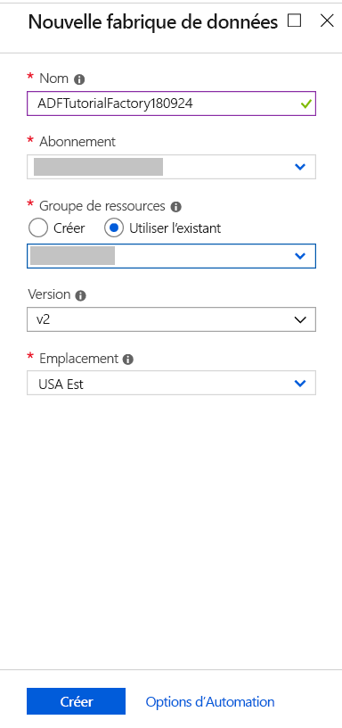
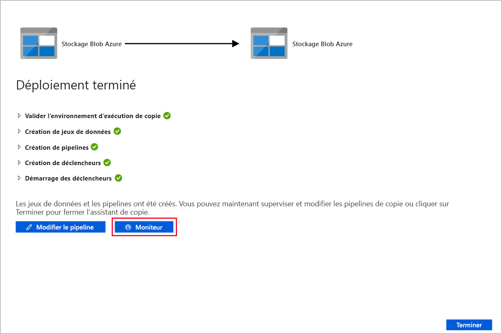

# Utiliser l’outil Copier les données pour copier des données 
> [!div class="op_single_selector" title1="Select the version of Data Factory service you are using:"]
> * [Version 1 - Disponibilité générale](v1/data-factory-copy-data-from-azure-blob-storage-to-sql-database.md)
> * [Version 2 - Préversion](quickstart-create-data-factory-copy-data-tool.md)

Dans ce guide de démarrage rapide, vous utilisez le portail Azure pour créer une fabrique de données. Vous utilisez ensuite l’outil Copier les données pour créer un pipeline qui copie des données depuis un dossier dans un stockage d’objets Blob Azure vers un autre dossier. 

> [!NOTE]
> Si vous débutez avec Azure Data Factory, consultez [Présentation d’Azure Data Factory](data-factory-introduction.md) avant de commencer ce guide de démarrage rapide. 
>
> Cet article s’applique à la version 2 de Data Factory, actuellement en préversion. Si vous utilisez la version 1 du service Data Factory, qui est généralement disponible, consultez [Prise en main de Data Factory version 1](v1/data-factory-copy-data-from-azure-blob-storage-to-sql-database.md).

[!INCLUDE [data-factory-quickstart-prerequisites](../../includes/data-factory-quickstart-prerequisites.md)] 

## Créer une fabrique de données

1. Cliquez sur **Nouveau** dans le menu de gauche, puis sur **Données + analyse** et sur **Data Factory**. 
   
   
2. Dans la page **Nouvelle fabrique de données**, entrez **ADFTutorialDataFactory** comme **nom**. 
      
     
 
   Le nom de la fabrique de données Azure doit être un nom **global unique**. Si l’erreur suivante s’affiche pour le champ du nom, changez le nom de la fabrique de données (par exemple, votrenomADFTutorialDataFactory).puis essayez à nouveau. Consultez l’article [Data Factory : Règles d’affectation des noms](naming-rules.md) pour savoir comment nommer les artefacts Data Factory.
  
     
3. Sélectionnez l’**abonnement** Azure dans lequel vous voulez créer la fabrique de données. 
4. Pour le **groupe de ressources**, effectuez l’une des opérations suivantes :
     
      - Sélectionnez **Utiliser l’existant**, puis sélectionnez un groupe de ressources existant dans la liste déroulante. 
      - Sélectionnez **Créer**, puis entrez le nom d’un groupe de ressources.   
         
      Pour plus d'informations sur les groupes de ressources, consultez [Utilisation des groupes de ressources pour gérer vos ressources Azure](../azure-resource-manager/resource-group-overview.md).  
4. Sélectionnez **V2 (préversion)** pour la **version**.
5. Sélectionnez **l’emplacement** de la fabrique de données. Seuls les emplacements pris en charge sont affichés dans la liste déroulante. Les magasins de données (Stockage Azure, Azure SQL Database, etc.) et les services de calcul (HDInsight, etc.) utilisés par la fabrique de données peuvent se trouver dans d’autres emplacements/régions.
6. Sélectionnez **Épingler au tableau de bord**.     
7. Cliquez sur **Créer**.
8. Sur le tableau de bord, vous voyez la mosaïque suivante avec l’état : **Déploiement de fabrique de données**. 

    
9. Une fois la création terminée, la page **Data Factory** s’affiche comme sur l’image.
   
   
10. Cliquez sur la vignette **Créer et surveiller** pour lancer l’interface utilisateur (IU) d’Azure Data Factory dans un onglet séparé. 

## Lancer l’outil Copier des données

1. Dans la page de prise en main, cliquez sur la vignette **Copier les données** pour lancer l’outil Copier les données. 

   
2. Dans la page **Propriétés** de l’outil Copier les données, cliquez sur **Suivant**. Vous pouvez spécifier un nom pour le pipeline et sa description dans cette page. 

    
3. Dans la page **Banque de données source**, sélectionnez **Stockage Blob Azure**, puis cliquez sur **Suivant**.

    
4. Dans la page **Spécifier le compte de stockage d’objets Blob Azure**, sélectionnez votre **nom de compte de stockage** depuis la liste déroulante et cliquez sur Suivant. 

    
5. Dans la page **Choisir le fichier ou le dossier de sortie**, procédez comme suit :

    1. Accédez au dossier **adftutorial/input**. 
    2. Sélectionnez le fichier **emp.txt**.
    3. Cliquez sur **Choisir**. Vous pouvez double-cliquer sur **emp.txt** pour ignorer cette étape. 
    4. Cliquez sur **Suivant**. 

    
6. Dans la page **Paramètres de format de fichier**, notez que l’outil détecte automatiquement les séparateurs de ligne et de colonne, puis cliquez sur **Suivant**. Vous pouvez également afficher un aperçu des données et un schéma des données d’entrée sur cette page. 

    
7. Dans la page **Banque de données de destination**, sélectionnez **Stockage Blob Azure**, puis cliquez sur **Suivant**. 

        
8. Dans la page **Spécifier le compte de stockage d’objets Blob Azure**, sélectionnez votre compte de stockage d’objets Blob Azure et cliquez sur **Suivant**. 

    
9. Dans la page **Choisir le fichier ou le dossier de sortie**, procédez comme suit : 

    1. Entrez **adftutorial/output** pour le **chemin d’accès du dossier**.
    2. Entrez **emp.txt** pour le **nom de fichier**. 
    3. Cliquez sur **Suivant**. 

     
10. Dans la page **Paramètres de format de fichier**, cliquez sur **Suivant**. 

    
11. Dans la page **Paramètres**, cliquez sur **Suivant**. 

    
12. Dans la page **Résumé**, passez en revue tous les paramètres, puis cliquez sur Suivant. 

    
13. Dans la page **Déploiement terminé**, cliquez sur **Surveiller** pour surveiller le pipeline que vous avez créé. 

    
14. L’application bascule vers l’onglet **Surveiller**. Vous voyez l’état du pipeline dans cette page. Cliquez sur **Actualiser** pour actualiser la liste. 
    
    
15. Cliquez sur le lien **Afficher les exécutions d’activités** dans la colonne Actions. Le pipeline n’a qu’une seule activité de type **Copier**. 

    
16. Pour afficher les détails de l’opération de copie, cliquez sur le lien **Détails** (image en forme de lunettes) dans la colonne **Actions**. Pour plus d’informations sur les propriétés, consultez [Vue d’ensemble des activités de copie](copy-activity-overview.md). 

    
17. Vérifiez que le fichier **emp.txt** est créé dans le dossier **de sortie** du conteneur **adftutorial**. Si le dossier de sortie n’existe pas, le service Data Factory le crée automatiquement. 
18. Basculez vers l’onglet **Modifier** pour pouvoir modifier les services liés, les jeux de données et les pipelines. Pour apprendre à les modifier dans l’interface utilisateur de Data Factory, consultez [Créer une fabrique de données à l’aide du portail Azure](quickstart-create-data-factory-portal.md).

    

## étapes suivantes
Dans cet exemple, le pipeline copie les données d’un emplacement vers un autre dans un stockage Blob Azure. Consultez les [didacticiels](tutorial-copy-data-portal.md) pour en savoir plus sur l’utilisation de Data Factory dans d’autres scénarios. 