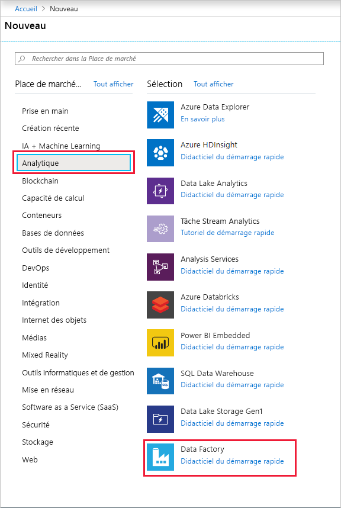
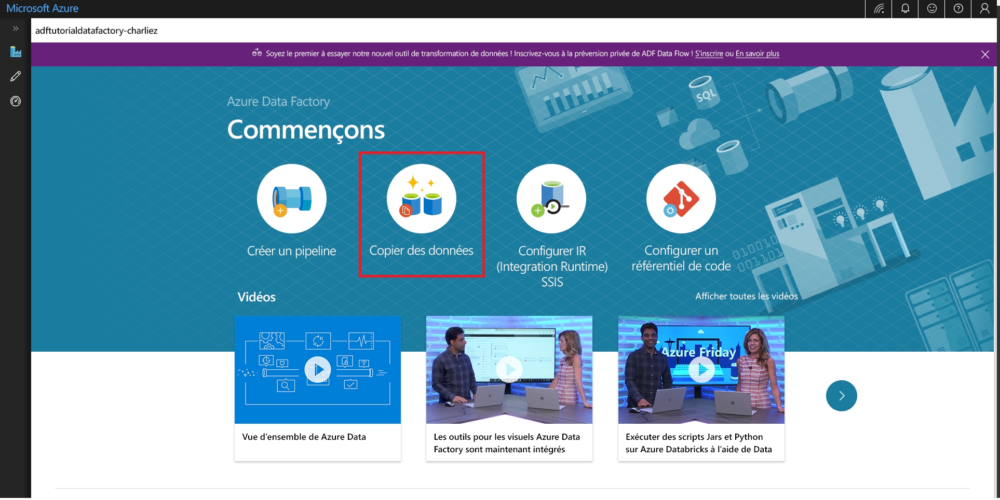
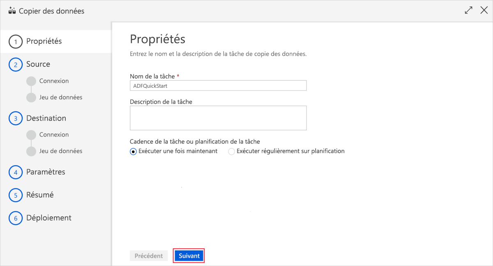

# Utiliser l’outil Copier des données pour copier des données 
> [!div class="op_single_selector" title1="Select the version of Data Factory service that you are using:"]
> * [Version 1 - Disponibilité générale](v1/data-factory-copy-data-from-azure-blob-storage-to-sql-database.md)
> * [Version 2 - Préversion](quickstart-create-data-factory-copy-data-tool.md)

Dans ce guide de démarrage rapide, vous utilisez le portail Azure pour créer une fabrique de données. Vous utilisez ensuite l’outil Copier des données pour créer un pipeline qui copie des données depuis un dossier dans un stockage d’objets Blob Azure vers un autre dossier. 

> [!NOTE]
> Si vous débutez avec Azure Data Factory, consultez [Présentation d’Azure Data Factory](data-factory-introduction.md) avant de commencer ce guide de démarrage rapide. 
>
> Cet article s’applique à la version 2 de Data Factory, actuellement en préversion. Si vous utilisez la version 1 du service, qui est en disponibilité générale (GA), consultez [Prise en main de Data Factory version 1](v1/data-factory-copy-data-from-azure-blob-storage-to-sql-database.md).

[!INCLUDE [data-factory-quickstart-prerequisites](../../includes/data-factory-quickstart-prerequisites.md)] 

## Créer une fabrique de données

1. Sélectionnez **Nouveau** dans le menu de gauche, sélectionnez **Données + Analytique**, puis **Data Factory**. 
   
   
2. Dans la page **Nouvelle fabrique de données**, entrez **ADFTutorialDataFactory** comme **nom**. 
      
   
 
   Le nom de la fabrique de données Azure doit être un nom *global unique*. Si l’erreur suivante s’affiche, changez le nom de la fabrique de données (par exemple, **&lt;votrenom&gt;ADFTutorialDataFactory**), puis tentez de la recréer. Consultez l’article [Data Factory - Règles d’affectation des noms](naming-rules.md) pour savoir comment nommer les artefacts Data Factory.
  
   
3. Pour **Abonnement**, sélectionnez l’abonnement Azure dans lequel vous voulez créer la fabrique de données. 
4. Pour **Groupe de ressources**, réalisez l’une des opérations suivantes :
     
   - Sélectionnez **Utiliser l’existant**, puis sélectionnez un groupe de ressources existant dans la liste. 
   - Sélectionnez **Créer**, puis entrez le nom d’un groupe de ressources.   
         
   Pour plus d'informations sur les groupes de ressources, consultez [Utilisation des groupes de ressources pour gérer vos ressources Azure](../azure-resource-manager/resource-group-overview.md).  
4. Pour **Version**, sélectionnez **V2 (préversion)**.
5. Pour **Emplacement**, sélectionnez l’emplacement de la fabrique de données. 

   Seuls les emplacements pris en charge sont affichés dans la liste. Les magasins de données (tels que le Stockage Azure et Azure SQL Database) et les services de calcul (comme Azure HDInsight) utilisés par Data Factory peuvent se trouver dans d’autres emplacements/régions.

6. Sélectionnez **Épingler au tableau de bord**.     
7. Sélectionnez **Créer**.
8. Sur le tableau de bord, vous voyez la vignette suivante avec l’état **Déploiement de Data Factory** : 

    
9. Une fois la création terminée, la page **Data Factory** s’affiche. Sélectionnez la vignette **Créer et surveiller** pour démarrer l’application d’interface utilisateur (IU) d’Azure Data Factory dans un onglet séparé.
   
   

## Démarrer l’outil Copier des données

1. Sur la page **Prise en main**, sélectionnez la vignette **Copier des données** pour démarrer l’outil Copier des données. 

   
2. Sur la page **Propriétés** de l’outil Copier des données, cliquez sur **Suivant**. Vous pouvez spécifier un nom pour le pipeline et sa description dans cette page. 

   
3. Sur la page **Magasin de données sources**, sélectionnez **Stockage Blob Azure**, puis cliquez sur **Suivant**.

   
4. Sur la page **Spécifier le compte de stockage d’objets Blob Azure**, sélectionnez votre compte de stockage dans la liste **Nom de compte de stockage**, puis cliquez sur **Suivant**. 

   
5. Sur la page **Choisir le fichier ou le dossier de sortie**, procédez comme suit :

   a. Accédez au dossier **adftutorial/input**.

   b. Sélectionnez le fichier **emp.txt**.

   c. Sélectionnez **Choisir**. Vous pouvez double-cliquer sur **emp.txt** pour ignorer cette étape.

   d. Sélectionnez **Suivant**. 

   
6. Sur la page **Paramètres de format de fichier**, notez que l’outil détecte automatiquement les séparateurs de ligne et de colonne, puis cliquez sur **Suivant**. Vous pouvez également afficher un aperçu des données et un schéma des données d’entrée sur cette page. 

   
7. Dans la page **Magasin de données de destination**, sélectionnez **Stockage Blob Azure**, puis cliquez sur **Suivant**. 

       
8. Sur la page **Spécifier le compte de stockage d’objets Blob Azure**, sélectionnez votre compte de stockage d’objets Blob Azure et cliquez sur **Suivant**. 

   
9. Sur la page **Choisir le fichier ou le dossier de sortie**, procédez comme suit : 

   a. Entrez **adftutorial/output** pour le chemin d’accès du dossier.

   b. Entrez **emp.txt** pour le nom de fichier.

   c. Sélectionnez **Suivant**. 

    
10. Sur la page **Paramètres de format de fichier**, cliquez sur **Suivant**. 

    
11. Sur la page **Paramètres**, cliquez sur **Suivant**. 

    
12. Dans la page **Résumé**, passez en revue tous les paramètres, puis cliquez sur **Suivant**. 

    
13. Sur la page **Déploiement terminé**, sélectionnez **Surveiller** pour surveiller le pipeline que vous avez créé. 

    
14. L’application bascule vers l’onglet **Surveiller**. Vous voyez l’état du pipeline dans cet onglet. Sélectionnez **Actualiser** pour actualiser la liste. 
    
    
15. Cliquez sur le lien **Afficher les exécutions d’activités** dans la colonne **Actions**. Le pipeline n’a qu’une seule activité de type **Copier**. 

    
16. Pour afficher les détails de l’opération de copie, cliquez sur le lien **Détails** (image en forme de lunettes) dans la colonne **Actions**. Pour plus d’informations sur les propriétés, consultez [Vue d’ensemble de l’activité de copie](copy-activity-overview.md). 

    
17. Vérifiez que le fichier **emp.txt** est créé dans le dossier **de sortie** du conteneur **adftutorial**. Si le dossier de sortie n’existe pas, le service Data Factory le crée automatiquement. 
18. Basculez vers l’onglet **Modifier** pour pouvoir modifier les services liés, les jeux de données et les pipelines. Pour apprendre à les modifier dans l’interface utilisateur de Data Factory, consultez [Créer une fabrique de données à l’aide du portail Azure](quickstart-create-data-factory-portal.md).

    

## Étapes suivantes
Dans cet exemple, le pipeline copie les données d’un emplacement vers un autre dans un stockage Blob Azure. Pour en savoir plus sur l’utilisation de Data Factory dans d’autres scénarios, consultez les [didacticiels](tutorial-copy-data-portal.md). 