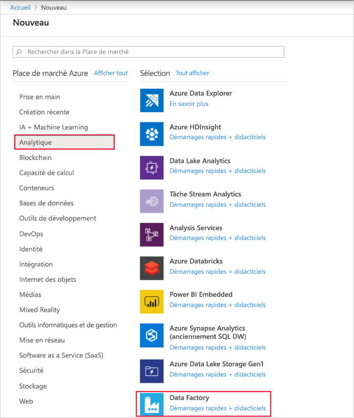
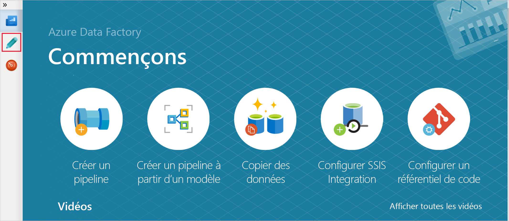
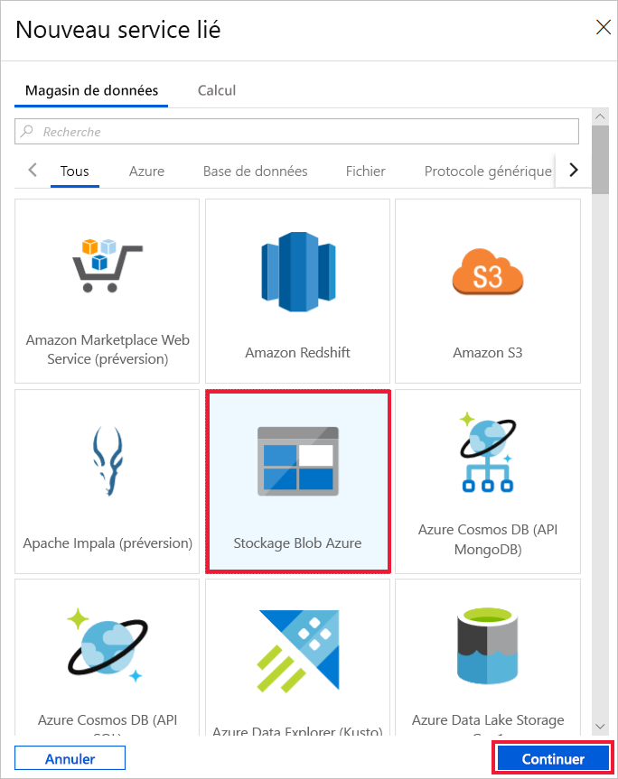
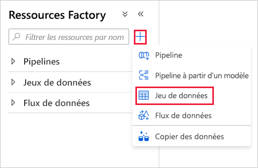
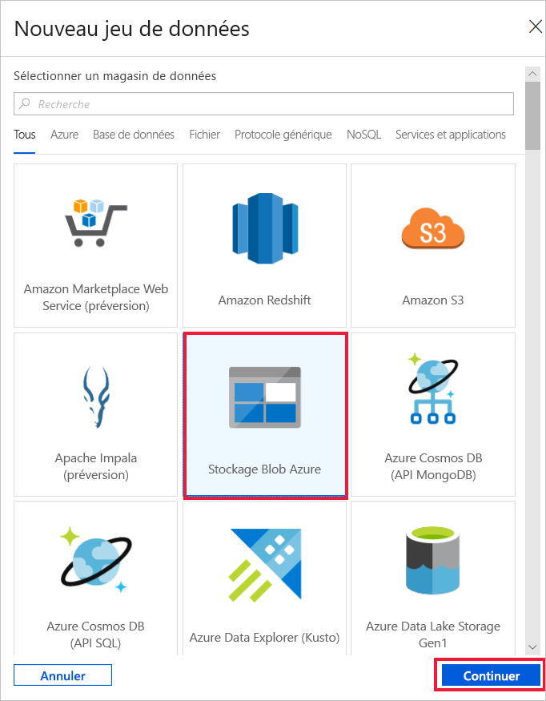
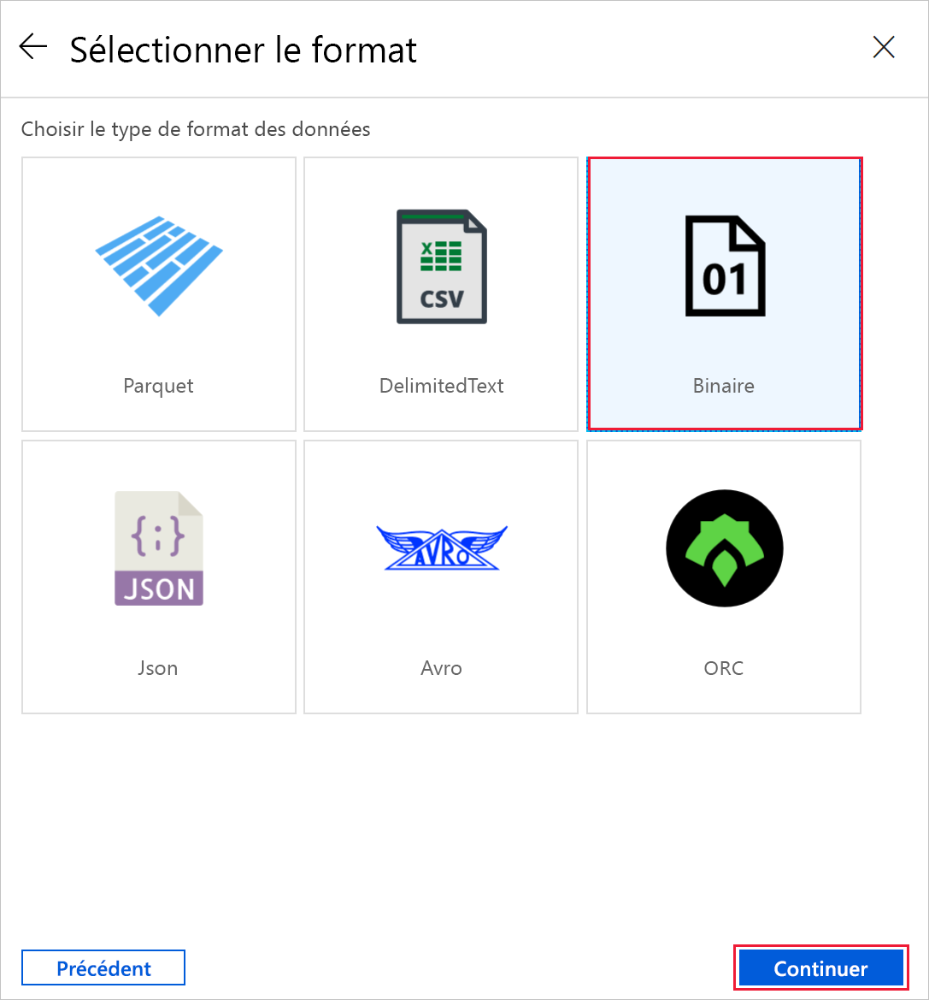
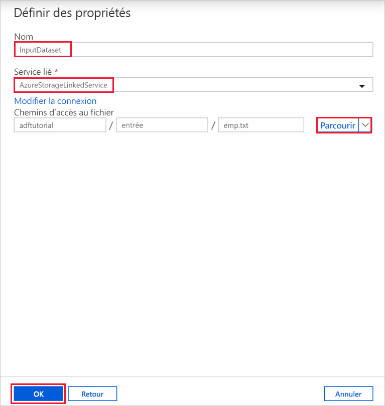
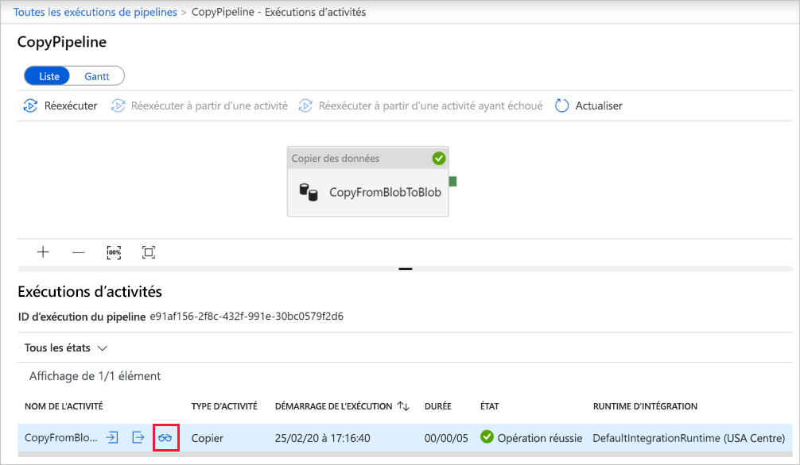
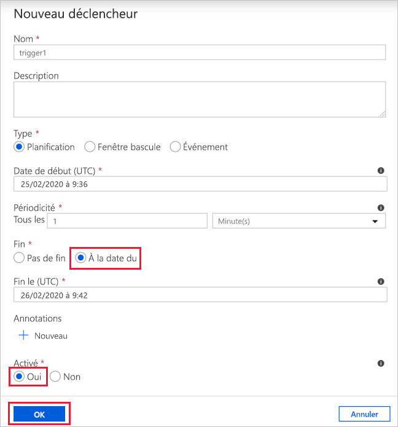

# Démarrage rapide : Créer une fabrique de données à l’aide de l’interface utilisateur d’Azure Data Factory

> [!div class="op_single_selector" title1="Sélectionnez la version du service Data Factory que vous utilisez :"]
> * [Version 1](v1/data-factory-copy-data-from-azure-blob-storage-to-sql-database.md)
> * [Version actuelle](quickstart-create-data-factory-portal.md)

Ce guide de démarrage rapide explique comment utiliser l’interface utilisateur d’Azure Data Factory pour créer et surveiller une fabrique de données. Le pipeline que vous créez dans cette fabrique de données *copie* les données d’un dossier vers un autre dossier dans un stockage Blob Azure. Pour suivre un tutoriel sur la *transformation* des données à l’aide d’Azure Data Factory, consultez le [Tutoriel : Transformer des données à l’aide de Spark](tutorial-transform-data-spark-portal.md).

> [!NOTE]
> Si vous débutez avec Azure Data Factory, consultez [Présentation d’Azure Data Factory](data-factory-introduction.md) avant de commencer ce guide de démarrage rapide. 

[!INCLUDE [data-factory-quickstart-prerequisites](../../includes/data-factory-quickstart-prerequisites.md)] 

### Vidéo 
Regardez cette vidéo pour comprendre l’interface de fabrique de Data Factory : 
>[!VIDEO https://channel9.msdn.com/Shows/Azure-Friday/Visually-build-pipelines-for-Azure-Data-Factory-v2/Player]

## Créer une fabrique de données

1. Lancez le navigateur web **Microsoft Edge** ou **Google Chrome**. L’interface utilisateur de Data Factory n’est actuellement prise en charge que par les navigateurs web Microsoft Edge et Google Chrome.
1. Accédez au [portail Azure](https://portal.azure.com). 
1. Sélectionnez **Créer une ressource** dans le menu de gauche, sélectionnez **Analytique**, puis **Data Factory**. 
   
   
1. Dans la page **Nouvelle fabrique de données**, entrez **ADFTutorialDataFactory** comme **nom**. 
 
   Le nom de la fabrique de données Azure doit être un nom *global unique*. Si l’erreur suivante s’affiche, changez le nom de la fabrique de données (par exemple, **&lt;votrenom&gt;ADFTutorialDataFactory**), puis tentez de la recréer. Consultez l’article [Data Factory - Règles d’affectation des noms](naming-rules.md) pour en savoir plus sur les règles d’affectation des noms d’artefacts Data Factory.
  
   
1. Pour **Abonnement**, sélectionnez l’abonnement Azure dans lequel vous voulez créer la fabrique de données. 
1. Pour **Groupe de ressources**, réalisez l’une des opérations suivantes :
     
   - Sélectionnez **Utiliser l’existant**, puis sélectionnez un groupe de ressources existant dans la liste. 
   - Sélectionnez **Créer**, puis entrez le nom d’un groupe de ressources.   
         
   Pour plus d’informations sur les groupes de ressources, consultez [Utilisation des groupes de ressources pour gérer vos ressources Azure](../azure-resource-manager/resource-group-overview.md).  
1. Pour **Version**, sélectionnez **V2**.
1. Pour **Emplacement**, sélectionnez l’emplacement de la fabrique de données.

   La liste n’affiche que les emplacements pris en charge par Data Factory et où vos métadonnées Azure Data Factory sont stockées. Les magasins de données associés (tels que Stockage Azure et Azure SQL Database) et les services de calcul (comme Azure HDInsight) utilisés par Data Factory peuvent s’exécuter dans d’autres régions.

1. Sélectionnez **Create** (Créer).

1. Une fois la création terminée, la page **Data Factory** s’affiche. Sélectionnez la vignette **Créer et surveiller** pour démarrer l’application d’interface utilisateur (IU) d’Azure Data Factory dans un onglet séparé.
   
   
1. Dans la page **Prise en main**, basculez vers l’onglet **Auteur** dans le volet gauche. 

    

## Créer un service lié
Dans cette procédure, vous créez un service lié qui relie votre compte de stockage Azure à la fabrique de données. Le service lié comporte les informations de connexion utilisées par le service Data Factory lors de l’exécution pour s’y connecter.

1. Sélectionnez **Connexions**, puis cliquez sur le bouton **Nouveau** dans la barre d’outils (le bouton **Connexions** se trouve au bas de la colonne de gauche sous **Ressources Factory**). 

1. Dans la page **Nouveau service lié**, sélectionnez **Stockage Blob Azure**, puis cliquez sur **Continuer**. 

   
1. Dans la page New Linked Service (Azure Blob Storage) (Nouveau service lié (Stockage Blob Azure)), procédez comme suit : 

   a. Pour le **Nom**, entrez **AzureStorageLinkedService**.

   b. Pour le **Nom du compte de stockage**, sélectionnez le nom de votre compte de stockage Azure.

   c. Cliquez sur **Tester la connexion** pour confirmer que le service Data Factory peut se connecter au compte de stockage. 

   d. Sélectionnez **Terminer** pour enregistrer le service lié. 

## Créez les jeux de données
Dans cette procédure, vous créez deux jeux de données : **InputDataset** et **OutputDataset**. Ces jeux de données sont de type **AzureBlob**. Ils font référence au service lié Stockage Azure que vous avez créé dans la section précédente. 

Le jeu de données d’entrée représente les données sources dans le dossier d’entrée. Dans la définition du jeu de données d’entrée, vous spécifiez le conteneur d’objets Blob (**adftutorial**), le dossier (**input**) et le fichier (**emp.txt**) qui contient la source de données. 

Le jeu de données de sortie représente les données qui sont copiées vers la destination. Dans la définition du jeu de données de sortie, vous spécifiez le conteneur d’objets Blob (**adftutorial**), le dossier (**output**) et le fichier dans lequel les données sont copiées. Chaque exécution d’un pipeline possède un ID unique associé. Vous pouvez accéder à cet ID à l’aide de la variable système **RunId**. Le nom du fichier de sortie est évalué dynamiquement en fonction de l’ID d’exécution du pipeline.   

Dans les paramètres du service lié, vous avez spécifié le compte de stockage Azure qui contient les données sources. Dans les paramètres de jeu de données source, vous spécifiez où se trouvent exactement les données sources (conteneur d’objets Blob, dossier et fichier). Dans les paramètres de jeu de données récepteur, vous spécifiez où les données sont copiées (conteneur d’objets Blob, dossier et fichier). 
 
1. Cliquez sur le bouton **+** (plus), puis sélectionnez **Jeu de données**.

   
1. Dans la page **Nouveau jeu de données**, sélectionnez **Stockage Blob Azure**, puis **Continuer**. 

   
1. Dans la page **Sélectionner le format**, choisissez le type de format de vos données, puis sélectionnez **Continuer**. Dans ce cas, sélectionnez **Binaire** lorsque la copie s’effectue en l’état sans analyser le contenu.

    

1. Dans la page **Définir les propriétés**, effectuez les étapes suivantes :

    a. Sous **Nom**, entrez **InputDataset**. 

    b. Pour le **Service lié**, sélectionnez **AzureStorageLinkedService**.

    c. Pour le **Chemin d’accès**, sélectionnez le bouton **Parcourir**.

    d. Dans la fenêtre **Choisir un fichier ou dossier**, accédez au dossier d’**entrée** dans le conteneur **adftutorial**, sélectionnez le fichier **emp.txt**, puis cliquez sur **Terminer**.
    
    e. Sélectionnez **Continuer**.   

    
1. Répétez les étapes pour créer le jeu de données de sortie :  

    a. Cliquez sur le bouton **+** (plus), puis sélectionnez **Jeu de données**.

    b. Dans la page **Nouveau jeu de données**, sélectionnez **Stockage Blob Azure**, puis **Continuer**.

    c. Dans la page **Sélectionner le format**, choisissez le type de format de vos données, puis sélectionnez **Continuer**.

    d. Dans la page **Définir des propriétés**, spécifiez **OutputDataset** comme nom. Sélectionnez **AzureStorageLinkedService** comme service lié.

    e. Sous **Chemin d’accès au fichier**, entrez **adftutorial/output**. Si le dossier **Sortie** n’existe pas, il est créé lors de l’exécution de l’activité de copie.

    f. Sélectionnez **Continuer**.   

## Créer un pipeline 
Dans cette procédure, vous créez et validez un pipeline avec une activité de copie qui utilise les jeux de données d’entrée et de sortie. L’activité de copie copie les données du fichier que vous avez spécifié dans les paramètres du jeu de données d’entrée dans le fichier que vous avez spécifié dans les paramètres du jeu de données de sortie. Si le jeu de données d’entrée ne spécifie qu’un dossier (et pas le nom de fichier), l’activité de copie copie tous les fichiers dans le dossier source vers la destination. 

1. Cliquez sur le bouton **+** (plus), puis sélectionnez **Pipeline**. 

1. Dans l’onglet **Général**, spécifiez **CopyPipeline** pour le **Nom**. 

1. Dans la boîte à outils **Activités**, développez **Move & Transform** (Déplacer et transformer). Faites glisser l’activité **Copier des données** depuis la boîte à outils **Activités** vers la surface du concepteur de pipeline. Vous pouvez également rechercher des activités dans la boîte à outils **Activités**. Spécifiez **CopyFromBlobToBlob** pour le **Nom**.

1. Basculez vers l’onglet **Source** dans les paramètres de l’activité de copie et sélectionnez **InputDataset** pour le **Jeu de données source**.

1. Basculez vers l’onglet **Récepteur** dans les paramètres de l’activité de copie et sélectionnez **OutputDataset** pour le **Jeu de données récepteur**.

1. Pour valider les paramètres du pipeline, cliquez sur **Valider** sur la barre d’outils pour le pipeline au-dessus du canevas. Vérifiez que le pipeline a été validé avec succès. Pour fermer la sortie de validation, sélectionnez le bouton **>>** (flèche droite). 

## Déboguer le pipeline
Dans cette étape, vous déboguez le pipeline avant de le déployer vers Data Factory. 

1. Sur la barre d’outils du pipeline au-dessus du canevas, cliquez sur **Déboguer** pour déclencher une série de tests. 
    
1. Vérifiez que vous voyez l’état de l’exécution du pipeline dans l’onglet **Sortie** des paramètres du pipeline. 

1. Vérifiez qu’un fichier de sortie apparaît bien dans le dossier de **sortie** du conteneur **adftutorial**. Si le dossier de sortie n’existe pas, le service Data Factory le crée automatiquement. 

## Déclencher le pipeline manuellement
Dans cette procédure, vous déployez des entités (services liés, jeux de données, pipelines) vers Azure Data Factory. Vous déclenchez ensuite manuellement une exécution du pipeline. 

1. Avant de déclencher un pipeline, vous devez publier des entités dans Data Factory. Pour publier, sélectionnez **Publier tout** dans la partie supérieure. 

   
1. Pour déclencher le pipeline manuellement, sélectionnez **Ajouter un déclencheur** dans la barre d’outils du pipeline, puis sélectionnez **Déclencher maintenant**. Dans la page **Exécution du pipeline**, sélectionnez **Terminer**.

## Surveiller le pipeline

1. Basculez vers l’onglet **Surveiller** sur la gauche. Utilisez le bouton **Actualiser** pour actualiser la liste.

   
1. Sélectionnez le lien **Afficher les exécutions d’activités** sous **Actions**. Vous voyez l’état de l’exécution de l’activité de copie dans cette page. 

1. Pour afficher les détails de l’opération de copie, cliquez sur le lien **Détails** (image en forme de lunettes) dans la colonne **Actions**. Pour plus d’informations sur les propriétés, consultez [Vue d’ensemble de l’activité de copie](copy-activity-overview.md). 

   
1. Vérifiez qu’un nouveau fichier apparaît bien dans le dossier de **sortie**. 
1. Vous pouvez revenir à la vue **Exécutions du pipeline** à partir de la vue **Exécutions d’activités** en sélectionnant le lien **Exécutions de pipelines**. 

## Déclencher le pipeline selon une planification
Cette procédure est facultative dans ce didacticiel. Vous pouvez créer un *déclencheur par planificateur* afin de planifier une exécution périodique du pipeline (toutes les heures, tous les jours, etc.). Dans cette procédure, vous créez un déclencheur qui doit s’exécuter toutes les minutes jusqu’à la date et l’heure de fin que vous spécifiez. 

1. Passez à l’onglet **Auteur**. 

1. Accédez à votre pipeline, sélectionnez **Ajouter un déclencheur** dans la barre d’outils du pipeline, puis **Nouveau/Modifier**. 

1. Sur la page **Ajouter des déclencheurs**, sélectionnez **Choisir un déclencheur**, puis **Nouveau**. 

1. Dans la page **Nouveau déclencheur**, sous **Fin**, sélectionnez **On Date** (À la date), spécifiez une heure de fin quelques minutes après l’heure actuelle, puis cliquez sur **Appliquer**. 

   Un coût est associé à chaque exécution du pipeline, vous devez donc spécifier l’heure de fin quelques minutes seulement après l’heure de début. Vérifiez qu’elle est le même jour. Toutefois, vérifiez que la durée est suffisante entre l’heure de publication et l’heure de fin pour permettre l’exécution du pipeline. Le déclencheur ne s’applique que lorsque vous avez publié la solution dans Data Factory, et non lorsque vous enregistrez le déclencheur dans l’interface utilisateur. 

1. Sur la page **Nouveau déclencheur**, cliquez sur la case à cocher **Activé**, puis sélectionnez **Enregistrer**. 

   
1. Examinez le message d’avertissement, puis cliquez sur **Terminer**.

1. Cliquez sur **Publier tout** pour publier les modifications dans Data Factory. 

1. Basculez vers l’onglet **Surveiller** sur la gauche. Sélectionnez **Actualiser** pour actualiser la liste. Vous voyez que le pipeline s’exécute toutes les minutes entre l’heure de publication et l’heure de fin. 

   Notez les valeurs dans la colonne **Déclenché par**. L’exécution manuelle du déclencheur était celle de l’étape précédente (**Déclencher maintenant**). 

1. Basculez vers l’affichage **Exécutions du déclencheur**. 

1. Vérifiez qu’un fichier de sortie est créé pour chaque exécution du pipeline jusqu’à la date/heure de fin spécifiée dans le dossier de **sortie**. 

## Étapes suivantes
Dans cet exemple, le pipeline copie les données d’un emplacement vers un autre dans un stockage Blob Azure. Pour en savoir plus sur l’utilisation de Data Factory dans d’autres scénarios, consultez les [didacticiels](tutorial-copy-data-portal.md). 
