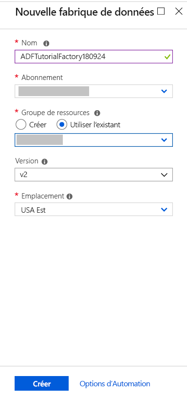
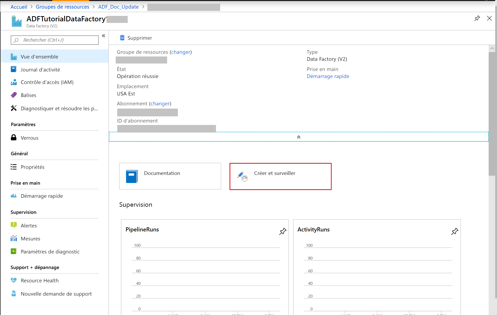

# Créer une fabrique de données à l’aide du portail Azure
Azure Data Factory est un service d’intégration de données basé sur le cloud qui vous permet de créer des flux de travail orientés données dans le cloud pour orchestrer et automatiser le déplacement et la transformation des données. Grâce à Azure Data Factory, vous pouvez créer et planifier des flux de travail orientés données (appelés pipelines) capables d’ingérer des données provenant de différents magasins de données, de traiter/transformer les données à l’aide de services de calcul comme Azure HDInsight Hadoop, Spark, Azure Data Lake Analytics et Azure Machine Learning, et de publier des données de sortie dans des magasins de données tels qu’Azure SQL Data Warehouse pour que des applications décisionnelles (BI) puissent les utiliser. 

Dans ce guide de démarrage rapide, vous utilisez le portail Azure pour créer une fabrique de données. Après l’avoir créée, vous devez utiliser PowerShell, le SDK .NET, le SDK Python ou l’API REST comme dans d’autres guides de démarrage rapide pour créer un pipeline de données qui copie les données d’un magasin de données source vers un magasin de données de destination. Actuellement, vous ne pouvez pas créer de pipelines dans une fabrique de données à l’aide du portail Azure.

Si vous n’avez pas d’abonnement Azure, créez un compte [gratuit](https://azure.microsoft.com/free/) avant de commencer.

## Connectez-vous au portail Azure.
Connectez-vous au [portail Azure](https://portal.azure.com/).

## Créer une fabrique de données
Voici les étapes à effectuer dans le cadre de ce guide de démarrage rapide :
1. Cliquez sur **Nouveau** dans le menu de gauche, puis sur **Données + analyse** et sur **Data Factory**. 
   
   
2. Dans le panneau **Nouvelle fabrique de données**, entrez **ADFTutorialDataFactory** comme **nom**. 
      
     
 
   Le nom de la fabrique de données Azure doit être un nom **global unique**. Si l’erreur suivante s’affiche, changez le nom de la fabrique de données (par exemple, votrenomADFTutorialDataFactory), puis tentez de la recréer. Consultez la rubrique [Data Factory - Règles d'affectation des noms](naming-rules.md) pour savoir comment nommer les artefacts Data Factory.
  
       `Data factory name “ADFTutorialDataFactory” is not available`
3. Sélectionnez l’**abonnement** Azure dans lequel vous voulez créer la fabrique de données. 
4. Pour le **groupe de ressources**, effectuez l’une des opérations suivantes :
     
      - Sélectionnez **Utiliser l’existant**, puis sélectionnez un groupe de ressources existant dans la liste déroulante. 
      - Sélectionnez **Créer**, puis entrez le nom d’un groupe de ressources.   
         
      Certaines étapes de ce guide de démarrage rapide supposent que vous utilisez le groupe de ressources nommé **ADFTutorialResourceGroup** . Pour plus d'informations sur les groupes de ressources, consultez [Utilisation des groupes de ressources pour gérer vos ressources Azure](../azure-resource-manager/resource-group-overview.md).  
4. Sélectionnez **V2 (préversion)** pour la **version**.
5. Sélectionnez **l’emplacement** de la fabrique de données. Actuellement, vous pouvez créer des fabriques de données V2 uniquement dans la région **Est des États-Unis**. Toutefois, les services de calcul et magasins de données utilisés dans les fabriques de données peuvent être proposés dans d’autres régions. 
6. Sélectionnez **Épingler au tableau de bord**.     
7. Cliquez sur **Create**.
      
      > [!IMPORTANT]
      > Pour créer des instances Data Factory, vous devez avoir un rôle de [collaborateur de fabrique de données](../active-directory/role-based-access-built-in-roles.md#data-factory-contributor) au niveau de l’abonnement/du groupe de ressources.
      > 
      > Le nom de la fabrique de données pourra être enregistré en tant que nom DNS et devenir ainsi visible publiquement.             
3. Sur le tableau de bord, vous voyez la mosaïque suivante avec l’état : **Déploiement de fabrique de données**. 

    
1. Une fois la création terminée, le panneau **Data Factory** s’affiche comme sur l’image.
   
   

## Étapes suivantes
Dans cet exemple, le pipeline copie les données d’un emplacement vers un autre dans un stockage Blob Azure. Consultez les [didacticiels](tutorial-copy-data-dot-net.md) pour en savoir plus sur l’utilisation de Data Factory dans d’autres scénarios. 