# Utiliser le Portail Azure pour gérer les partages de votre service Azure Data Box Gateway 

Cet article décrit comment gérer les partages de votre service Azure Data Box Gateway. Vous pouvez gérer le service Azure Data Box Gateway via le Portail Azure ou via l’interface utilisateur web locale. Utilisez le Portail Azure pour ajouter, supprimer, actualiser les partages ou synchroniser la clé de stockage du compte de stockage associé aux partages.

## À propos des partages

Pour transférer des données vers Azure, vous devez créer des partages sur votre service Azure Data Box Gateway. Les partages que vous ajoutez sur l’appareil Data Box Gateway sont des partages cloud. Les données issues de ces partages sont automatiquement chargées vers le cloud. Toutes les fonctions cloud telles que l’actualisation et la synchronisation des clés de stockage s’appliquent à ces partages. Utilisez les partages de cloud lorsque vous souhaitez que les données d’appareil soient automatiquement envoyées à votre compte de stockage dans le cloud.

Dans cet article, vous apprendrez comment :

> [!div class="checklist"]
> * Ajouter un partage
> * Supprimer un partage
> * Actualiser les partages
> * Synchroniser une clé de stockage

## Ajouter un partage

Pour créer un partage, procédez comme suit dans le Portail Azure.

1. Dans le Portail Azure, accédez à votre ressource Data Box Gateway, puis accédez à **Vue d’ensemble**. Cliquez sur **+ Ajouter un partage** dans la barre de commandes.
2. Dans **Ajouter un partage**, spécifiez les paramètres du partage. Indiquez un nom unique pour votre partage.

    

    Les noms de partage peuvent uniquement contenir des chiffres, des lettres minuscules et des traits d’union. Le nom de partage doit contenir entre 3 et 63 caractères et commencer par une lettre ou un chiffre. Chaque trait d’union doit être précédé et suivi d’un caractère autre qu’un tiret.

3. Sélectionnez un **type** de partage. Le type peut être **SMB** ou **NFS**, SMB étant la valeur par défaut. SMB est la norme pour les clients Windows, tandis que NFS est utilisé pour les clients Linux. Selon que vous choisissez un partage SMB ou NFS, les options proposées diffèrent légèrement.

4. Fournissez un **compte de stockage** dans lequel se trouve le partage. Si le conteneur n’existe pas déjà, un conteneur est créé dans le compte de stockage avec le nom du partage. Si le conteneur existe déjà, le conteneur existant est utilisé.

5. Choisissez le **service de stockage** d’objet blob de blocs, d’objet blob de pages ou de fichier. Le type de service choisi varie selon le format dans lequel vous souhaitez que les données résident dans Azure. Par exemple, dans cette instance, nous voulons que les données résident en tant qu’objets blob de blocs dans Azure. C’est pourquoi nous sélectionnons **Objet blob de blocs**. Si vous choisissez **Objet blob de pages**, vous devez vous assurer que vos données sont de 512 octets alignés. Par exemple, un VHDX est toujours de 512 octets alignés.

6. Cette étape varie selon que vous créez un partage SMB ou NFS.
    - **Si vous créez un partage SMB** : dans le champ **All privilege local user** (Utilisateur local avec tous les privilèges), choisissez **Créer** ou **Utiliser l’existant**. Si vous créez un utilisateur local, indiquez un **nom d’utilisateur**, un **mot de passe**, puis confirmez le mot de passe. Cela affecte les autorisations à l’utilisateur local. Après avoir attribué les autorisations à cet emplacement, vous pouvez utiliser l’Explorateur de fichiers par la suite pour modifier ces autorisations.

        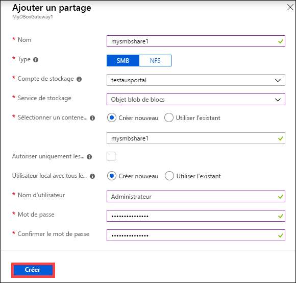

        Si vous cochez l’option permettant d’autoriser uniquement les opérations de lecture pour ces données de partage, vous avez la possibilité d’indiquer des utilisateurs en lecture seule.
    - **Si vous créez un partage NFS** : vous devez fournir les **adresses IP des clients autorisés** qui peuvent accéder au partage.

        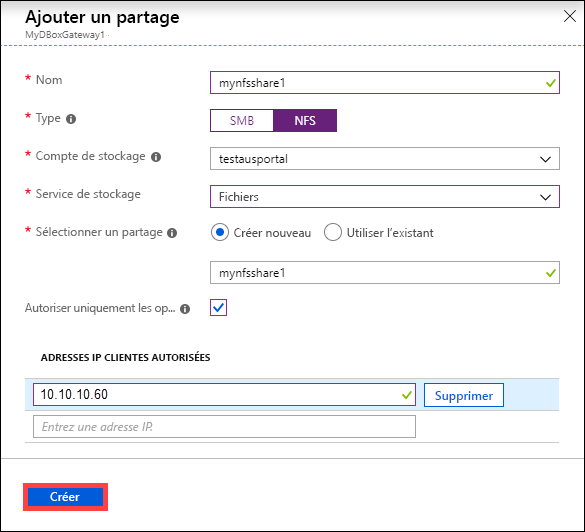

7. Cliquez sur **Créer** pour créer le partage. Vous êtes averti que le partage est en cours de création. Une fois le partage créé avec les paramètres spécifiés, le panneau **Partages** s’actualise pour refléter le nouveau partage.
 
## Supprimer un partage

Pour supprimer un partage, procédez comme suit dans le Portail Azure.

1. Dans la liste des partages, sélectionnez et cliquez sur le partage que vous souhaitez supprimer.

    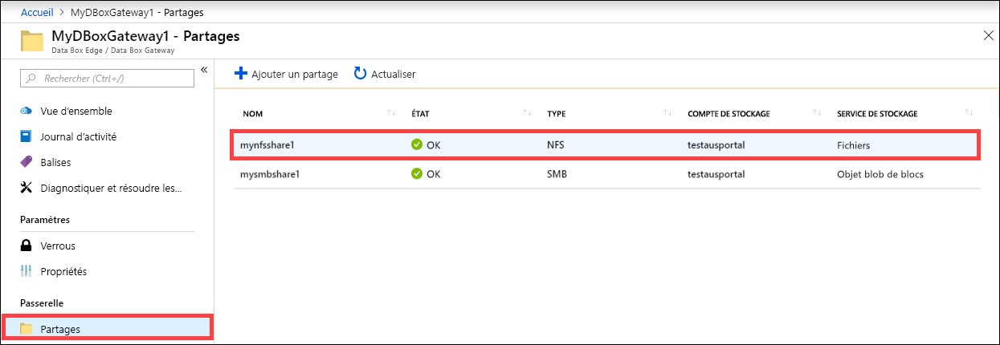

2. Cliquez sur **Supprimer**. 

    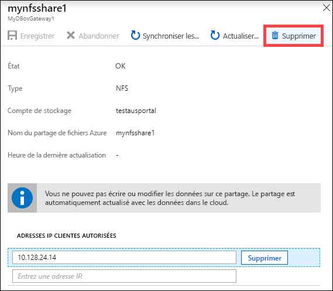

3. Cliquez sur **Oui**lorsque vous êtes invité à confirmer l’opération.

    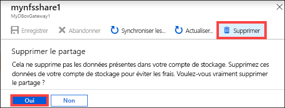

La liste des partages est actualisée afin de tenir compte de la suppression.

## Actualiser les partages

La fonctionnalité d’actualisation vous permet d’actualiser le contenu d’un partage local. Lorsque vous actualisez un partage, une recherche est lancée pour rechercher tous les objets Azure, y compris les objets blob et les fichiers qui ont été ajoutés dans le cloud depuis la dernière actualisation. Ces fichiers supplémentaires sont ensuite utilisés pour actualiser le contenu du partage local sur l’appareil. 

> [!NOTE]
> Les autorisations et les listes de contrôle d’accès (ACL) ne sont pas conservées lors d’une opération d’actualisation. 

Pour actualiser un partage, procédez comme suit dans le Portail Azure.

1.  Accédez à **Partages** dans le Portail Azure. Sélectionnez et cliquez sur le partage que vous souhaitez actualiser.

    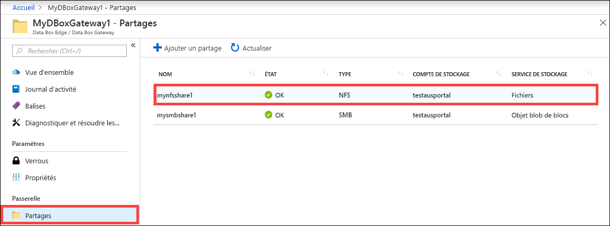

2.  Cliquez sur **Actualiser**. 

    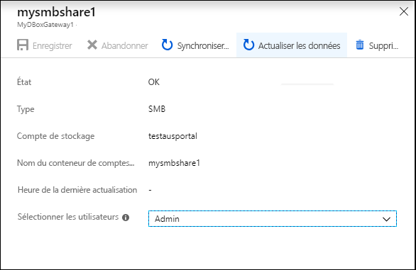
 
3.  Cliquez sur **Oui**lorsque vous êtes invité à confirmer l’opération. Un travail démarre pour actualiser le contenu du partage local. 

    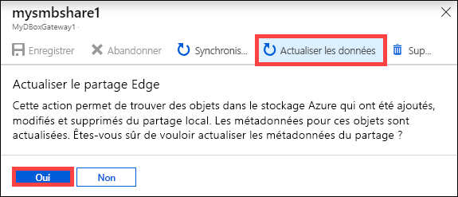
 
4.  Pendant l’actualisation, l’option d’actualisation du menu contextuel est grisée. Cliquez sur la notification de travail pour afficher l’état du travail d’actualisation.

5.  La durée nécessaire pour l’actualisation varie en fonction du nombre de fichiers dans le conteneur Azure, ainsi que des fichiers sur l’appareil. Une fois l’actualisation terminée, le timestamp du partage est mis à jour. Même si l’actualisation présente des échecs partiels, l’opération est considérée comme réussie et le timestamp est mis à jour. 

    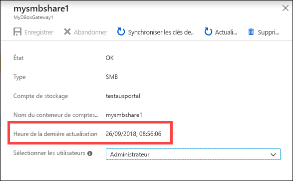
 
En cas d’échec, une alerte est déclenchée. L’alerte décrit en détail la cause du problème et la recommandation à suivre pour le résoudre. L’alerte contient également un lien vers un fichier présentant le résumé des échecs, notamment les fichiers qui n’ont pas pu être mis à jour ou supprimés.

>[!IMPORTANT]
> Dans cette version, n’actualisez pas plusieurs partages à la fois.

## Synchroniser des clés de stockage

Si la rotation des clés de votre compte de stockage n’a pas été effectuée, vous devez synchroniser les clés d’accès de stockage. La synchronisation permet à l’appareil d’obtenir les dernières clés pour votre compte de stockage.

Procédez comme suit dans le Portail Azure pour synchroniser votre clé d’accès de stockage.

1. Accédez à **Vue d’ensemble** dans votre ressource. 
2. Dans la liste des partages, choisissez un partage associé au compte de stockage que vous devez synchroniser et cliquez dessus. Cliquez sur **Sync storage key** (Synchroniser une clé de stockage). 

     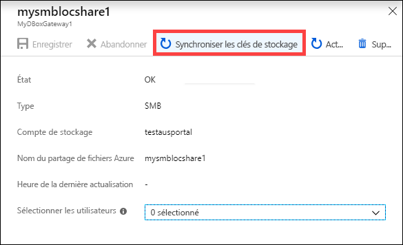

3. Cliquez sur **Oui** lorsque vous êtes invité à confirmer l’opération. Fermez la boîte de dialogue une fois la synchronisation terminée.

     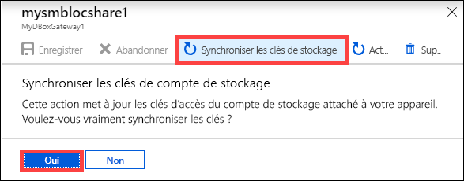

>[!NOTE]
> Cette opération est à faire une seule fois pour un compte de stockage donné. Vous n’avez pas besoin de répéter cette action pour tous les partages associés au même compte de stockage.

## Étapes suivantes

- Découvrez comment [gérer des utilisateurs via le Portail Azure](data-box-gateway-manage-users.md).
