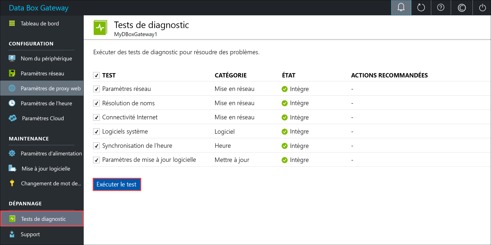
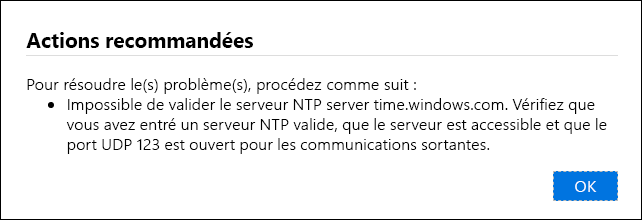
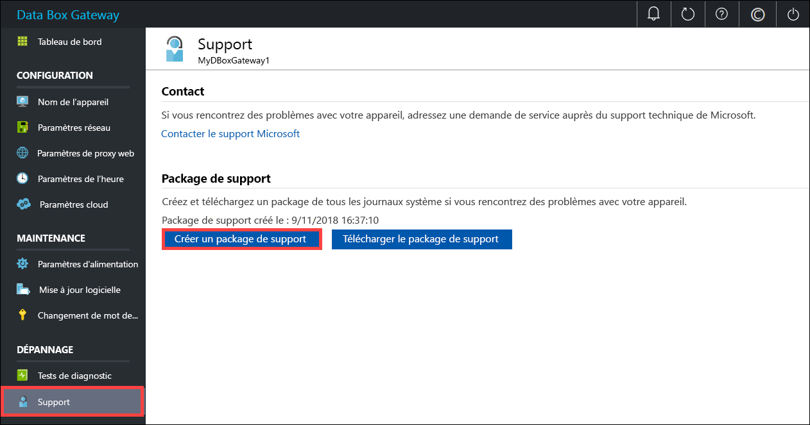
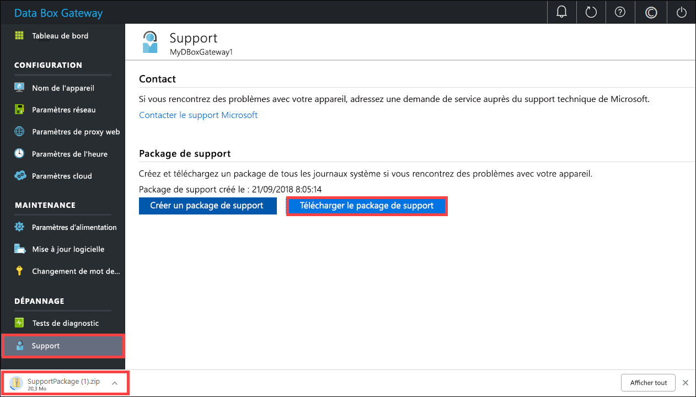
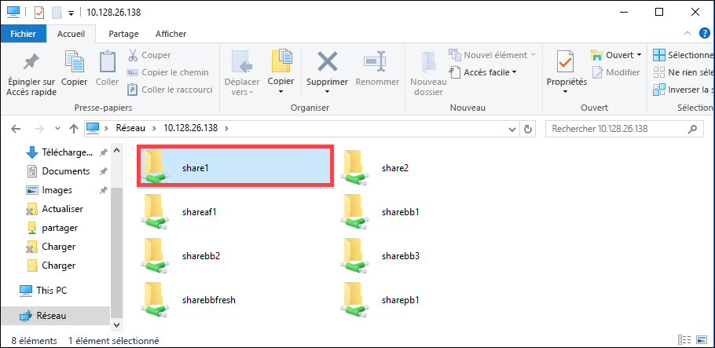

# <a name="troubleshoot-your-azure-data-box-gateway-issues"></a>Résoudre les problèmes d’Azure Data Box Gateway 

Cet article explique comment résoudre les problèmes de votre solution Azure Data Box Gateway. Dans cet article, vous apprendrez comment :

> [!div class="checklist"]
> * Exécuter les diagnostics
> * Collecter un package de support
> * Utiliser les journaux d’activité pour résoudre les problèmes


## <a name="run-diagnostics"></a>Exécuter les diagnostics

Pour diagnostiquer et corriger les erreurs d’appareil, vous pouvez exécuter les tests de diagnostics. Pour exécuter ces tests, procédez comme suit dans l’interface utilisateur web locale de votre appareil.

1. Dans l’interface utilisateur web locale, accédez à **Dépannage > Tests de diagnostic**. Sélectionnez le test que vous souhaitez exécuter, puis cliquez sur **Exécuter le test**. Cette opération exécute les tests pour diagnostiquer les éventuels problèmes sur votre réseau, appareil, proxy web, horodatage ou paramètres cloud. Vous êtes averti que des tests sont en cours d’exécution sur l’appareil.

    
 
2. Une fois les tests terminés, les résultats correspondants s’affichent. Si un test échoue, l’URL de l’action recommandée vous est présentée. Vous pouvez cliquer sur cette URL pour visualiser l’action recommandée. 
 
    


## <a name="collect-support-package"></a>Collecter un package de support

Un package de journaux d’activité contient tous les journaux d’activité pertinents qui peuvent aider l’équipe du Support Microsoft à résoudre les problèmes des appareils. Vous pouvez générer un package de journaux par le biais de l’interface utilisateur web locale. 

Pour collecter un package de support, procédez comme suit. 

1. Dans l’interface utilisateur web locale, accédez à **Dépannage > Support**. Cliquez sur **Créer un package de support**. Le système commence à collecter le package de support. La collection du package peut nécessiter plusieurs minutes.

    
 
2. Une fois le package de support créé, cliquez sur **Télécharger le package de support**. Un package compressé est téléchargé dans le chemin d’accès que vous avez choisi. Vous pouvez décompresser le package.

    

## <a name="use-logs-to-troubleshoot"></a>Utiliser les journaux d’activité pour résoudre les problèmes

Toutes les erreurs rencontrées lors des processus de chargement et d’actualisation figurent dans les fichiers d’erreurs correspondants.

1. Pour visualiser les fichiers d’erreurs, accédez à votre partage, puis cliquez sur ce dernier pour afficher le contenu. 

      

2. Cliquez sur le _dossier Microsoft Data Box Gateway_. Ce dossier comporte deux sous-dossiers :

   - dossier Upload contenant les fichiers journaux des erreurs de chargement ;
   - dossier Refresh stockant les fichiers journaux des erreurs d’actualisation.

     Voici un exemple de fichier journal d’actualisation.

     ```
     <root container="brownbag1" machine="VM15BS020663" timestamp="07/18/2018 00:11:10" />
     <file item="test.txt" local="False" remote="True" error="16001" />
     <summary runtime="00:00:00.0945320" errors="1" creates="2" deletes="0" insync="3" replaces="0" pending="9" />
     ``` 

3. Lorsque ce fichier signale une erreur (présentée dans cet exemple), notez le code de l’erreur, 16001 dans le cas présent. Recherchez ci-après la description de ce code d’erreur en fonction de la référence de l’erreur.

    |     Code d'erreur     |     Nom de l’exception                                         |     Description de l'erreur                                                                                                                                                                                                                     |
    |--------------------|------------------------------------------------------------|-------------------------------------------------------------------------------------------------------------------------------------------------------------------------------------------------------------------------------------------|
    |    100             |    ERROR_CONTAINER_OR_SHARE_NAME_LENGTH                    |    Le nom du conteneur ou du partage doit comporter entre 3 et 63 caractères.                                                                                                                                                                     |
    |    101             |    ERROR_CONTAINER_OR_SHARE_NAME_ALPHA_NUMERIC_DASH        |    Le nom du conteneur ou du partage doit uniquement comporter des lettres, des chiffres ou des traits d’union.                                                                                                                                                       |
    |    102             |    ERROR_CONTAINER_OR_SHARE_NAME_IMPROPER_DASH             |    Le nom du conteneur ou du partage doit uniquement comporter des lettres, des chiffres ou des traits d’union.                                                                                                                                                       |
    |    103             |    ERROR_BLOB_OR_FILE_NAME_CHARACTER_CONTROL               |    Le nom du blob ou du fichier contient des caractères de contrôle non pris en charge.                                                                                                                                                                       |
    |    104             |    ERROR_BLOB_OR_FILE_NAME_CHARACTER_ILLEGAL               |    Le nom du blob ou du fichier contient des caractères de contrôle non autorisés.                                                                                                                                                                                   |
    |    105             |    ERROR_BLOB_OR_FILE_NAME_SEGMENT_COUNT                   |    Le nom du blob ou du fichier contient trop de segments (chaque segment est séparé par une barre oblique -/).                                                                                                                                              |
    |    106             |    ERROR_BLOB_OR_FILE_NAME_AGGREGATE_LENGTH                |    Le nom du blob ou du fichier est trop long.                                                                                                                                                                                                     |
    |    107             |    ERROR_BLOB_OR_FILE_NAME_COMPONENT_LENGTH                |    L’un des segments du nom de blob ou de fichier est trop long.                                                                                                                                                                            |
    |    108             |    ERROR_BLOB_OR_FILE_SIZE_LIMIT                           |    La taille du fichier dépasse la taille de fichier maximale autorisée pour le chargement.                                                                                                                                                                              |
    |    109             |    ERROR_BLOB_OR_FILE_SIZE_ALIGNMENT                       |    L’alignement du blob ou du fichier est incorrect.                                                                                                                                                                                               |
    |    110             |    ERROR_NAME_NOT_VALID_UNICODE                            |    Le nom du blob ou du fichier encodé au format Unicode n’est pas valide.                                                                                                                                                                                  |
    |    111             |    ERROR_RESERVED_NAME_NOT_ALLOWED                         |    Le nom ou le préfixe du fichier ou du blob est un nom réservé qui n’est pas pris en charge (par exemple, COM1).                                                                                                                             |
    |    2000            |    ERROR_ETAG_MISMATCH                                     |    Une absence de concordance entre les ETags indique l’existence d’un conflit entre un objet blob de blocs dans le cloud et sur l’appareil. Pour résoudre ce conflit, supprimez soit le fichier figurant dans le cloud, soit celui stocké sur l’appareil.    |
    |    2001            |    ERROR_UNEXPECTED_FINALIZE_FAILURE                       |    Un problème inattendu s’est produit au cours du traitement d’un fichier après le chargement de ce dernier.    Si cette erreur est signalée et persiste pendant plus de 24 heures, contactez le Support.                                                      |
    |    2002            |    ERROR_ALREADY_OPEN                                      |    Le fichier est déjà ouvert dans un autre processus et ne peut être chargé tant que le descripteur est ouvert.                                                                                                                                       |
    |    2003            |    ERROR_UNABLE_TO_OPEN                                    |    Impossible d’ouvrir le fichier pour le chargement. Si cette erreur est signalée, contactez le Support Microsoft.                                                                                                                                                |
    |    2004            |    ERROR_UNABLE_TO_CONNECT                                 |    Impossible de se connecter au conteneur pour y charger les données.                                                                                                                                                                             |
    |    2005            |    ERROR_INVALID_CLOUD_CREDENTIALS                         |    Impossible de se connecter au conteneur, car les autorisations de compte sont erronées ou obsolètes. Vérifiez votre accès.                                                                                                               |
    |    2006            |    ERROR_CLOUD_ACCOUNT_DISABLED                            |    Impossible de charger les données dans le compte, car le compte ou le partage sont désactivés.                                                                                                                                                            |
    |    2007            |    ERROR_CLOUD_ACCOUNT_PERMISSIONS                         |    Impossible de se connecter au conteneur, car les autorisations de compte sont erronées ou obsolètes. Vérifiez votre accès.                                                                                                               |
    |    2008            |    ERROR_CLOUD_CONTAINER_SIZE_LIMIT_REACHED                |    Impossible d’ajouter de nouvelles données, car le conteneur est plein. Vérifiez les spécifications Azure relatives aux tailles de conteneur prises en charge en fonction du type. Par exemple, le service Azure Files prend uniquement en charge une taille de fichier maximale de 5 To.                                     |
    |    2009            |    ERROR_CLOUD_CONTAINER_MISSING                |     Impossible de charger les données, car le conteneur associé au partage n’existe pas.                                     |    
    |    2997            |    ERROR_ITEM_CANCELED                                     |    Une erreur inattendue s’est produite. Il s’agit d’une erreur temporaire qui se résoudra d’elle-même.                                                                           |
    |    2998            |    ERROR_UNMAPPED_FAILURE                                  |    Une erreur inattendue s’est produite. L’erreur peut se résoudre d’elle-même, mais si elle persiste pendant plus de 24 heures, contactez le Support Microsoft.                                                                                                     |
    |    16000           |    RefreshException                                        |    Impossible de récupérer ce fichier.                                                                                                                                                                                                        |
    |    16001           |    RefreshAlreadyExistsException                           |    Impossible de récupérer ce fichier, car il existe déjà sur votre système local.                                                                                                                                                         |
    |    16002           |    RefreshWorkNeededException                              |    Impossible d’actualiser ce fichier, car il n’est pas complètement chargé.                                                                                                                                                                          | 


## <a name="next-steps"></a>Étapes suivantes

- Apprenez-en davantage sur les [problèmes connus de cette version](data-box-gateway-release-notes.md).
