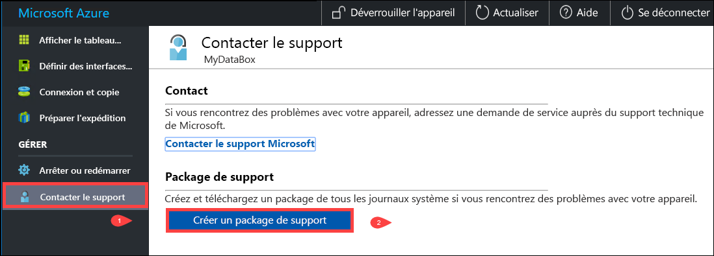
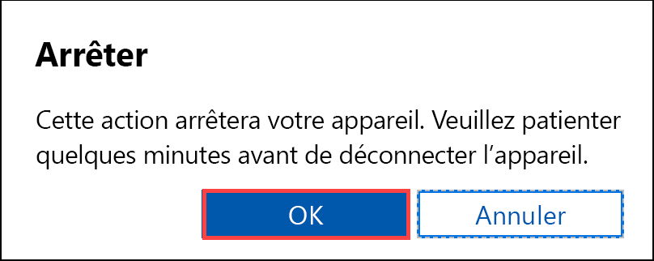
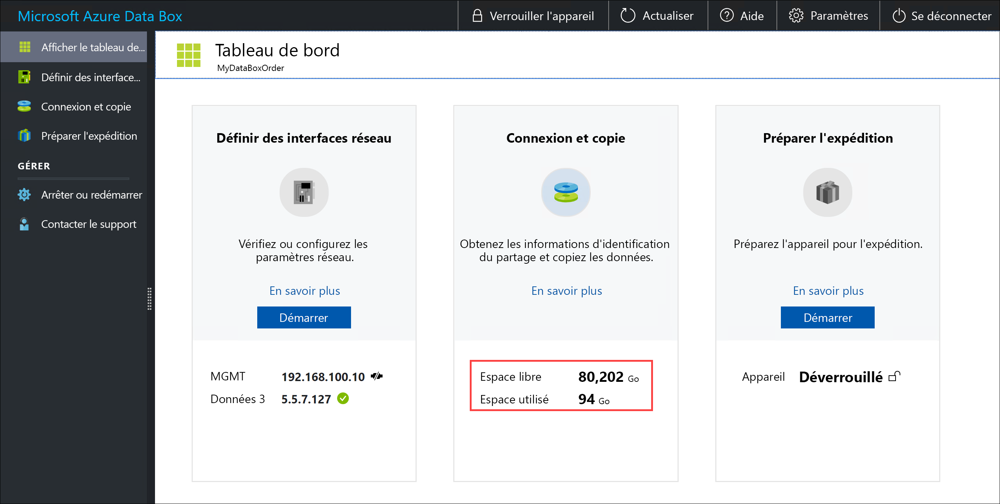

# Utiliser l’interface utilisateur web locale pour administrer votre Data Box

Cet article décrit certaines des tâches de gestion et de configuration qui peuvent être effectuées sur la Data Box. Vous pouvez gérer la Data Box via l’interface utilisateur du portail Azure et l’interface utilisateur web locale pour l’appareil. Cet article se concentre sur les tâches que vous pouvez effectuer à l'aide de l'interface utilisateur web locale.

L’interface utilisateur web locale pour la Data Box est utilisée pour la configuration initiale de l’appareil. Vous pouvez également utiliser l’interface utilisateur web locale pour arrêter ou redémarrer la Data Box, exécuter des tests de diagnostic, mettre à jour les logiciels, afficher les journaux de copie et générer un package de journaux destiné au support Microsoft.

Cet article inclut les didacticiels suivants :

- Générer un package de support
- Arrêter ou redémarrer votre appareil
- Effacer en toute sécurité des données de votre appareil
- Analyser la capacité disponible sur l’appareil
- Ignorer la validation de la somme de contrôle 

## Générer un package de support

Si vous rencontrez des problèmes avec l’appareil, vous pouvez créer un package de support dans les journaux système. Le support Microsoft utilise ce package pour résoudre le problème. Pour générer un package de support, procédez comme suit :

1. Dans l’interface utilisateur web locale, accédez à **Contacter le support technique**, puis cliquez sur **Générer un package de support**.

    

2. Un package de support est collecté. Cette opération prend quelques minutes.

    

3. Une fois le package de support créé, cliquez sur **Télécharger le package de support**. 

    

4. Recherchez puis choisissez le dossier de téléchargement. Ouvrez le dossier pour afficher le contenu.

    

## Arrêter ou redémarrer votre appareil

Vous pouvez arrêter ou redémarrer Data Box à l'aide de l'interface utilisateur web locale. Avant de redémarrer, nous vous recommandons de mettre les partages hors connexion sur l’ordinateur hôte. Vous réduisez ainsi toute possibilité d’altération des données. Vérifiez que la copie des données n’est pas en cours lorsque vous arrêtez l’appareil.

Pour arrêter votre Data Box, procédez comme suit.

1. Dans l’interface utilisateur web locale, accédez à **Arrêter ou redémarrer**.
2. Cliquez sur **Arrêter**.

    

3. Lorsque vous êtes invité à confirmer l’opération, cliquez sur **OK** pour continuer.

    

Une fois l’appareil arrêté, utilisez le bouton d’alimentation sur le panneau avant pour allumer l’appareil.

Pour redémarrer votre Data Box, suivez les étapes ci-dessous.

1. Dans l’interface utilisateur web locale, accédez à **Arrêter ou redémarrer**.
2. Cliquez sur **Restart (Redémarrer)**.

    

3. Lorsque vous êtes invité à confirmer l’opération, cliquez sur **OK** pour continuer.

   L’appareil s’arrête puis redémarre.

## Afficher la capacité disponible sur l’appareil

Vous pouvez utiliser le tableau de bord de l’appareil pour afficher la capacité disponible et la capacité utilisée de l’appareil. 

1. Dans l’interface utilisateur web locale, accédez à **Afficher le tableau de bord**.
2. La fenêtre **Connexion et copie** affiche l’espace libre et l’espace utilisé sur l’appareil.

    

## Ignorer la validation de la somme de contrôle

Par défaut, une somme de contrôle est générée pour vos données lorsque vous préparez l’expédition. Dans certains cas rares, selon le type de données (fichiers de petite taille), les performances peuvent être très lentes. Dans ces cas, vous pouvez ignorer la somme de contrôle. 

Nous vous recommandons vivement de ne pas désactiver la somme de contrôle, sauf si les performances sont fortement affectées.

1. Dans le coin supérieur droit de l’interface utilisateur web locale de votre appareil, accédez aux paramètres.

    

2. **Désactiver** la validation de la somme de contrôle
3. Cliquez sur **Appliquer**.

## Étapes suivantes

- Découvrez comment [gérer Data Box via le portail Azure](data-box-portal-admin.md).

