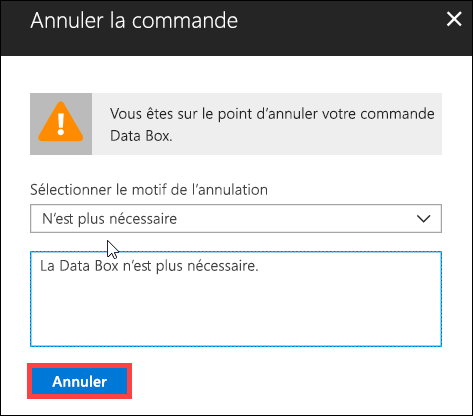
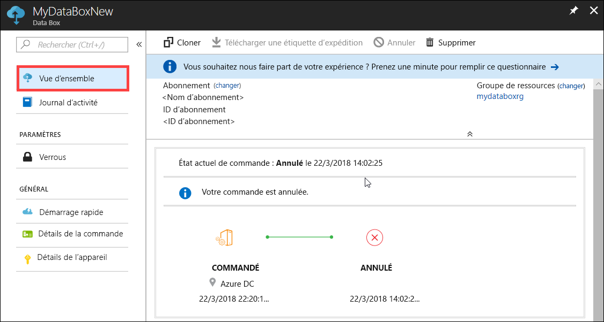
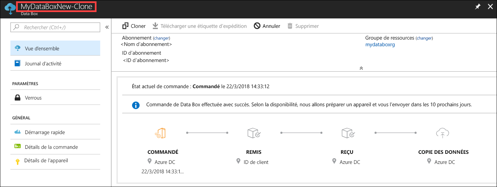
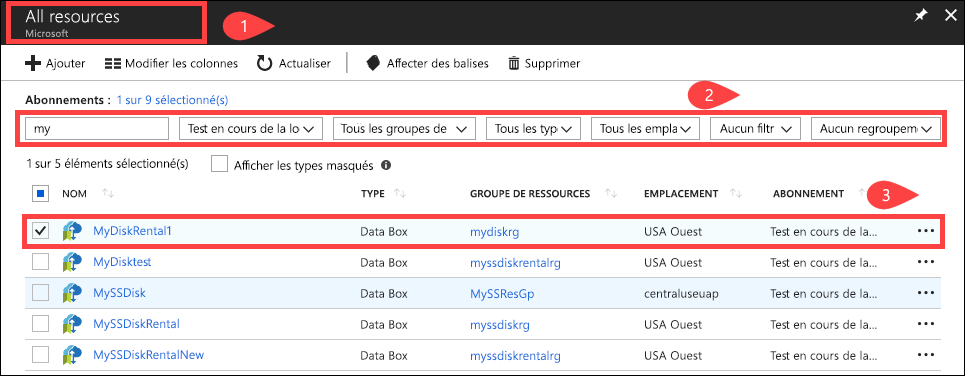
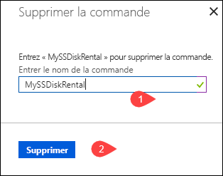
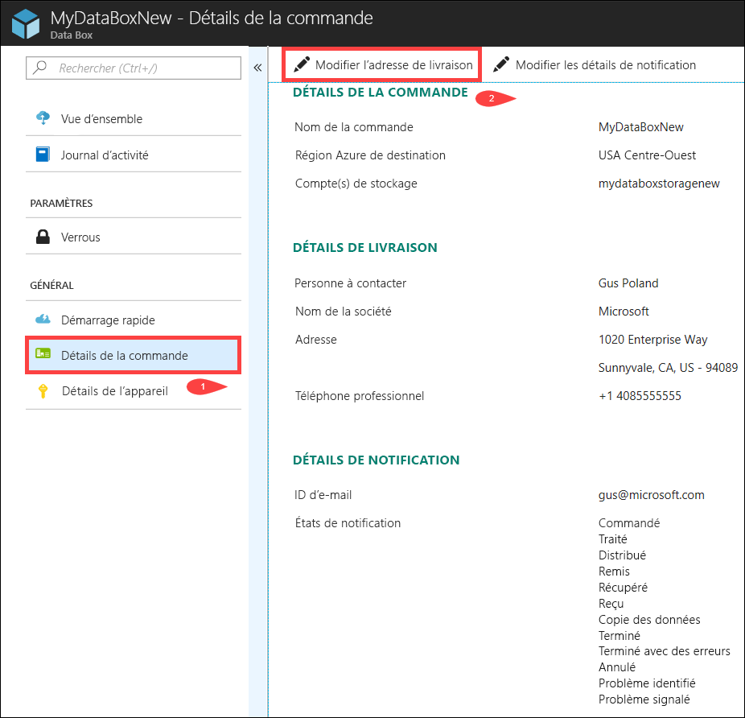
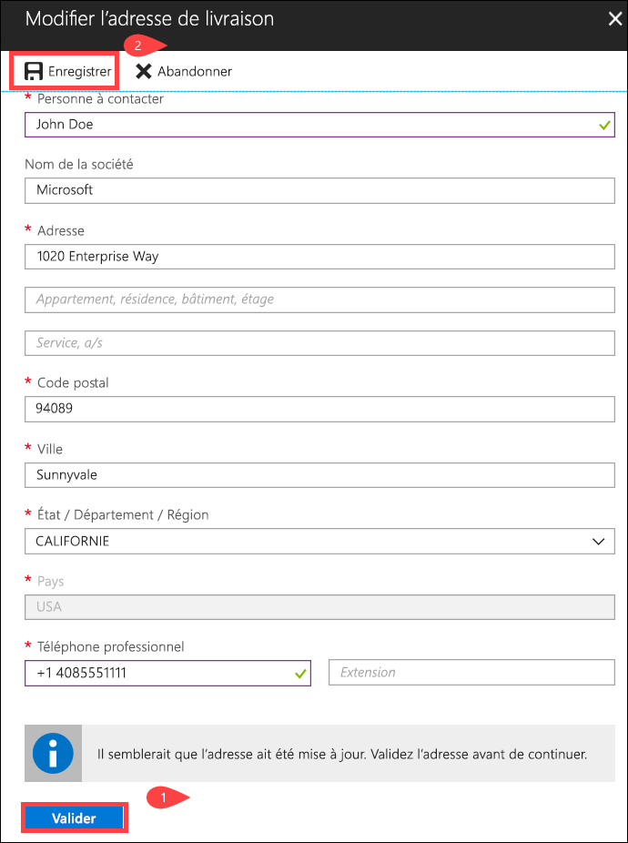
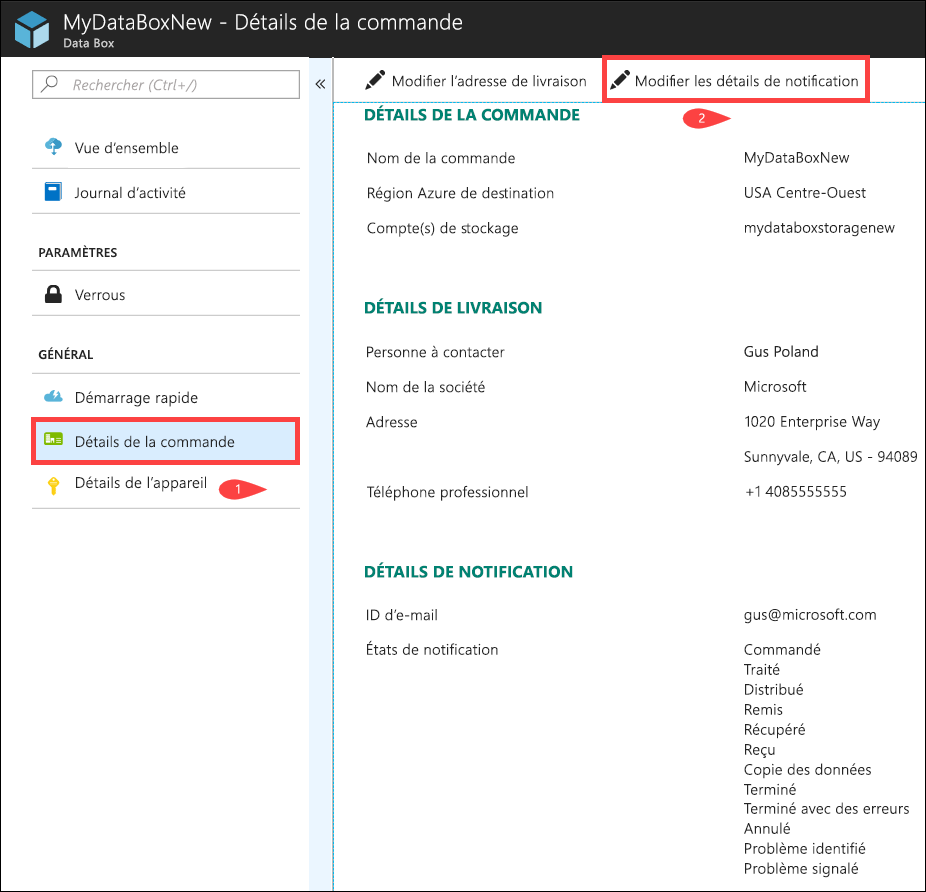
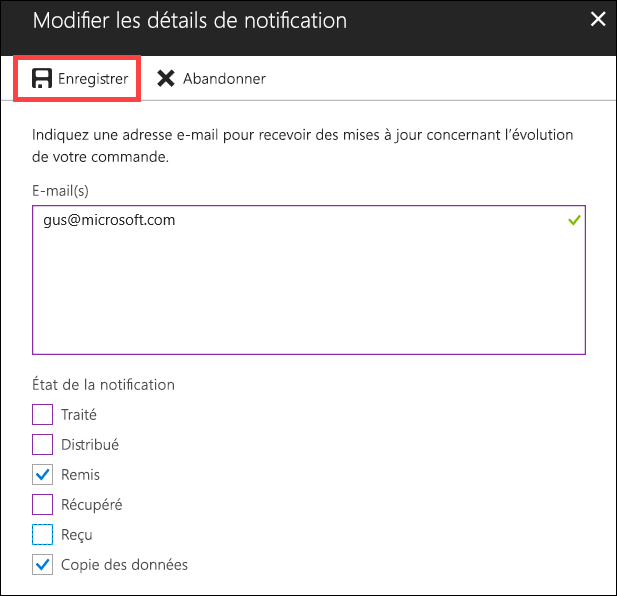

# Utiliser le portail Azure pour administrer votre Data Box Disk

Les didacticiels de cet article s’appliquent à la solution Microsoft Azure Data Box Disk au cours de la période de préversion. Cet article décrit certains des flux de travail et tâches de gestion complexes qui peuvent être effectués sur Data Box Disk. 

Vous pouvez gérer Data Box Disk via le portail Azure. Cet article se concentre sur les tâches que vous pouvez effectuer à l’aide du portail Azure. Utilisez le portail Azure pour gérer les commandes et les disques, et suivre l’état des commandes lorsqu’elles passent à l’étape terminale.

## Annuler une commande

Il peut vous arriver de devoir annuler, pour diverses raisons, une commande que vous avez passée. Vous pouvez annuler la commande tant que la préparation des disques n’a pas commencé. Une fois que les disques sont préparés et que la commande est traitée, il n’est plus possible d’annuler la commande. 

Pour annuler une commande, procédez comme suit.

1.  Accédez à **Vue d’ensemble > Annuler**. 

    

2.  Indiquez un motif d’annulation de la commande.  

    

3.  Une fois que la commande est annulée, le portail met à jour l’état de la commande et l’affiche en tant que **Annulée**.

    

Vous ne recevez pas de notification par e-mail lorsque la commande est annulée.

## Cloner une commande

Le clonage est utile dans certaines situations. Par exemple, un utilisateur a utilisé des disques Data Box pour transférer des données. À mesure qu’il génère de nouvelles données, il a besoin de davantage de disques pour transférer ces données dans Azure. Dans ce cas, la commande initiale peut simplement être clonée.

Effectuez les opérations suivantes pour cloner une commande.

1.  Accédez à **Vue d’ensemble > Cloner**. 

    

2.  Tous les détails de la commande restent inchangés. Le nom de la commande est le nom de la commande d’origine, suivi de *-Clone*. Cochez la case pour confirmer que vous avez lu les informations sur la confidentialité des données. Cliquez sur **Créer**.    

Le clone est créé en quelques minutes et le portail est actualisé pour afficher la nouvelle commande.

 

## Supprimer une commande

Il peut arriver que vous souhaitiez supprimer une commande lorsque celle-ci est terminée. La commande contient vos données personnelles telles que votre nom, votre adresse et vos informations de contact. Ces informations personnelles sont supprimées en même temps que la commande.

Vous pouvez uniquement supprimer des commandes qui sont terminées ou annulées. Pour supprimer une commande, procédez comme suit.

1. Sélectionnez **Toutes les ressources**. Recherchez votre commande.

    

2. Cliquez sur la commande que vous souhaitez supprimer et accédez à **Vue d’ensemble**. Dans la barre de commandes, cliquez sur **Supprimer**.

    

3. Entrez le nom de la commande lorsque vous êtes invité à confirmer la suppression de la commande. Cliquez sur **Supprimer**.

     

## Télécharger une étiquette d’expédition

Vous devrez peut-être télécharger l’étiquette d’expédition si l’étiquette de retour fournie avec vos disques a été mal positionnée ou perdue. 

Procédez comme suit pour télécharger une étiquette d’expédition.
1.  Accédez à **Vue d’ensemble > Télécharger une étiquette d’expédition**. Cette option est disponible uniquement une fois que le disque a été expédié. 

    

2.  L’étiquette de retour suivante est alors téléchargée. Enregistrez l’étiquette, imprimez-la et collez-la sur le colis de retour.

    

## Modifier l’adresse de livraison

Il peut arriver que vous deviez modifier l’adresse de livraison une fois la commande passée. Cela est possible uniquement avant l’envoi du disque. Une fois que le disque est expédié, vous ne pourrez plus modifier l’adresse de livraison.

Pour modifier la commande, procédez comme suit.

1. Accédez à **Détails de la commande > Modifier l’adresse de livraison**.

    

2. Vous pouvez maintenant modifier l’adresse de livraison et enregistrer les modifications.

    

## Modifier les détails de notification

Vous devrez peut-être modifier les utilisateurs qui recevront les e-mails indiquant l’état de la commande. Par exemple, un utilisateur doit être informé dès que le disque est livré ou récupéré. Un autre utilisateur doit quant à lui être informé lorsque la copie des données est terminée afin qu’il puisse vérifier que les données se trouvent bien dans le compte de stockage Azure avant de les supprimer de la source. Dans ce cas, vous pouvez modifier les détails de notification.

Pour modifier les détails de modification, procédez comme suit.

1. Accédez à **Détails de la commande > Modifier les détails de notification**.

    

2. Vous pouvez maintenant modifier les détails de notification et enregistrer les modifications.
 
    

## Afficher l’état de la commande

|État de la commande |Description |
|---------|---------|
|Ordered (Validée)     | La commande a été validée.   Si les disques ne sont pas disponibles, vous recevez une notification.  Si les disques sont disponibles, Microsoft identifie les disques à expédier et les prépare.        |
|Processed (Traitée)     | La commande a été traitée.   Les opérations suivantes sont effectuées au cours du traitement de la commande :<li>Les disques sont chiffrés à l’aide du chiffrement AES-128 BitLocker. </li> <li>Les disques Data Box sont verrouillés pour empêcher tout accès non autorisé.</li><li>La clé de sécurité permettant de déverrouiller les disques est générée au cours de ce processus.</li>        |
|Dispatched (Distribuée)     | La commande a été expédiée. Vous devriez la recevoir dans un délai de 1 à 2 jours.        |
|Delivered (Livrée)     | Les produits ont été livrés à l’adresse spécifiée dans la commande.        |
|Picked up (Récupérée)     |Le colis de retour a été récupéré.   Une fois que l’envoi arrive au centre de données Azure, les données sont automatiquement chargées dans Azure.         |
|Reçu     | Vos disques ont été livrés au centre de données Azure. La copie des données va bientôt démarrer.        |
|Data copied (Données copiées)     |La copie des données est en cours.  Attendez que la copie des données se termine.         |
|Completed       |La commande a été terminée avec succès.  Vérifiez que vos données se trouvent bien dans Azure avant de supprimer les données locales des serveurs.         |
|Completed with errors (Terminée avec des erreurs)| La copie de données est terminée, mais des erreurs se sont produites.   Consultez les journaux d’erreurs de téléchargement en utilisant le chemin d’accès spécifié sous **Vue d’ensemble**. Pour plus d’informations, voir [Télécharger les journaux d’erreurs de téléchargement](data-box-disk-troubleshoot-upload.md#download-logs).   |
|Opération annulée            |La commande a été annulée.   Soit vous avez annulé la commande, soit une erreur s’est produite et le service a annulé la commande.     |

## Étapes suivantes

- Découvrez comment [Résoudre les problèmes relatifs aux disques Data Box](data-box-disk-troubleshoot.md).
