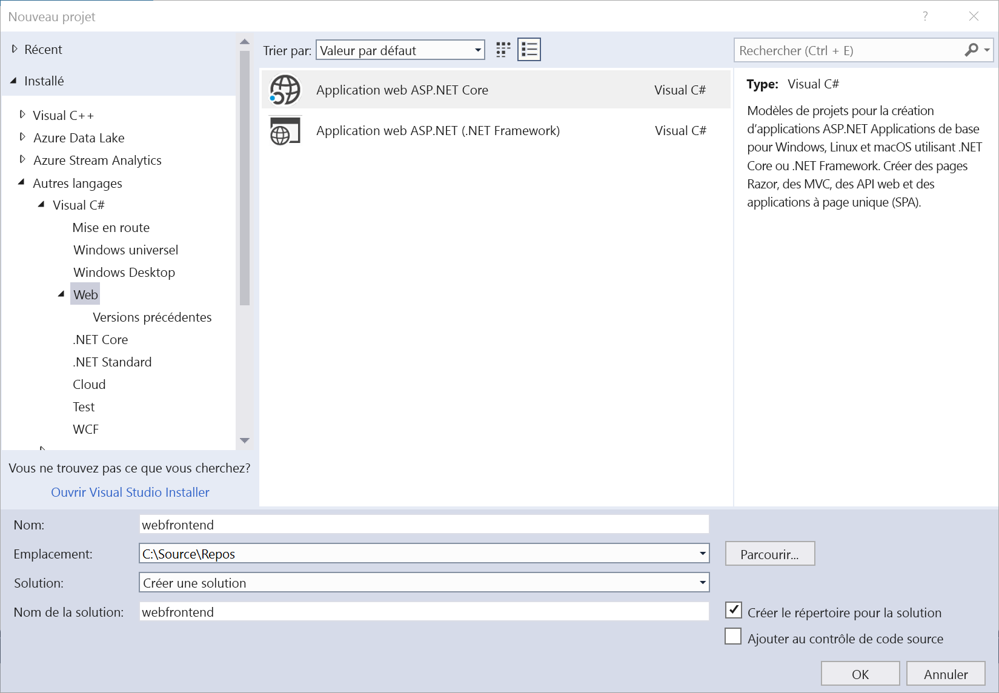
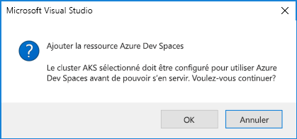
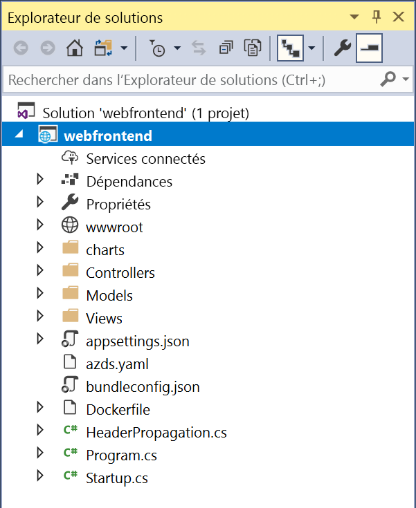

# Démarrage rapide : créer un environnement de développement Kubernetes avec Azure Dev Spaces (.NET Core et Visual Studio)

Dans ce guide, vous apprendrez comment :

- créer un environnement Kubernetes optimisé pour le développement dans Azure ;
- développer du code de façon itérative dans des conteneurs à l’aide de Visual Studio.

[!INCLUDE]

[!INCLUDE]

## Obtenir les outils Visual Studio 
1. Installez la dernière version de [Visual Studio 2017](https://www.visualstudio.com/vs/).
1. Dans le programme d’installation de Visual Studio, vérifiez que la charge de travail suivante est sélectionnée :
    * Développement web et ASP.NET
1. Installez [l’extension Visual Studio pour Azure Dev Spaces](https://aka.ms/get-azds-visualstudio).

Vous êtes maintenant prêt à créer une application web ASP.NET avec Visual Studio.

## Créez une application web ASP.NET

Dans Visual Studio 2017, créez un projet. Actuellement, le projet doit correspondre à **Application web ASP.NET Core**. Nommez le projet « **webfrontend** ».

Sélectionnez le modèle **Application web (Model-View-Controller)** et assurez-vous que vous ciblez **.NET Core** et **ASP.NET Core 2.0** dans les deux menus déroulants en haut de la boîte de dialogue. Cliquez sur **OK** pour créer le projet.

## Créer un environnement de développement dans Azure

Avec Azure Dev Spaces, vous pouvez créer des environnements de développement Kubernetes entièrement gérés par Azure et optimisés pour le développement. Ouvrez le projet que vous venez de créer, puis sélectionnez **Azure Dev Spaces** dans la liste déroulante des paramètres de lancement, comme illustré ci-dessous.

Dans la boîte de dialogue qui s’affiche ensuite, assurez-vous que vous êtes connecté avec le compte approprié, puis sélectionnez un cluster existant.

Pour l’instant, laissez la liste déroulante **Espace** définie par défaut sur `default`. Vous en apprendrez davantage sur cette option un peu plus tard. Cochez la case **Publicly Accessible** (Accessible publiquement) pour que l’application web soit accessible par le biais d’un point de terminaison public. Ce paramètre n’est pas obligatoire, mais il servira à illustrer certains concepts dans la suite de cette procédure pas à pas. Dans les deux cas, vous serez en mesure de déboguer votre site web avec Visual Studio.

Cliquez sur **OK** pour sélectionner ou créer le cluster.

Si vous choisissez un cluster qui n’a pas été configuré pour fonctionner avec Azure Dev Spaces, vous recevez un message vous demandant si vous souhaitez le configurer.

Choisissez **OK**. 

Une tâche en arrière-plan démarre alors pour effectuer cette opération. L’exécution de cette tâche nécessite quelques minutes. Pour voir si la création est toujours en cours, placez votre pointeur sur l’icône **Tâches en arrière-plan** dans le coin inférieur gauche de la barre d’état, comme illustré ci-après.

> [!Note]
Vous ne pouvez pas déboguer votre application avant la fin de la création de l’environnement de développement.

## Examiner les fichiers ajoutés au projet
En attendant la création de l’environnement de développement, examinez les fichiers qui ont été ajoutés à votre projet lorsque vous avez choisi d’utiliser un environnement de développement.

Tout d’abord, vous pouvez voir qu’un dossier nommé `charts` a été ajouté et que dans ce dossier, un [graphique Helm](https://docs.helm.sh) a été structuré pour votre application. Ces fichiers sont utilisés pour déployer votre application dans l’environnement de développement.

Vous verrez qu’un fichier nommé `Dockerfile` a été ajouté. Ce fichier contient les informations nécessaires pour empaqueter votre application au format Docker standard. Un fichier `HeaderPropagation.cs` est également créé, mais nous en reparlerons plus loin dans cette procédure pas à pas. 

Enfin, vous verrez un fichier nommé `azds.yaml`, qui contient les informations de configuration requises par l’environnement de développement, par exemple le fait qu’une application doit être ou non accessible par le biais d’un point de terminaison public.

## Déboguer un conteneur dans Kubernetes
Une fois l’environnement de développement créé, vous pouvez déboguer votre application. Définissez un point d’arrêt dans le code, par exemple à la ligne 20 du fichier `HomeController.cs` où la variable `Message` est définie. Cliquez sur **F5** pour démarrer le débogage. 

Visual Studio communique avec l’environnement de développement pour générer et déployer l’application, puis ouvre un navigateur avec l’application web en cours d’exécution. Le conteneur a l’air de s’exécuter en local, mais en réalité, il s’exécute dans l’environnement de développement dans Azure. La présence de l’adresse localhost est due à Azure Dev Spaces qui crée un tunnel SSH temporaire jusqu’au conteneur en cours d’exécution dans Azure.

Cliquez sur le lien **À propos de** en haut de la page pour déclencher le point d’arrêt. Vous disposez d’un accès complet aux informations de débogage, exactement comme si le code s’exécutait en local, notamment à la pile des appels, aux variables locales, aux informations sur les exceptions, etc.

## Étapes suivantes

> [!div class="nextstepaction"]
> [Utilisation de plusieurs conteneurs et développement en équipe](get-started-netcore-visualstudio.md#call-another-container)