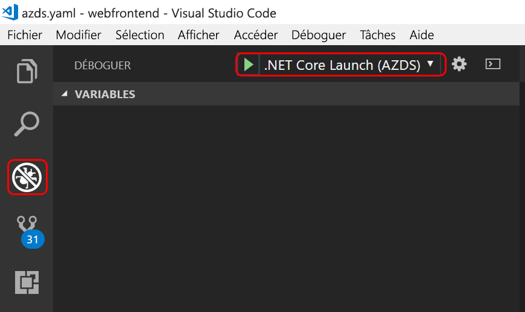

# <a name="quickstart-create-a-kubernetes-development-environment-with-azure-dev-spaces-net-core-and-vs-code"></a>Démarrage rapide : créer un environnement de développement Kubernetes avec Azure Dev Spaces (.NET Core et Visual Studio Code)


[!INCLUDE[](includes/learning-objectives.md)]

[!INCLUDE[](includes/see-troubleshooting.md)]

Vous voici prêt à créer un environnement de développement Kubernetes dans Azure.

[!INCLUDE[](includes/portal-aks-cluster.md)]

## <a name="install-the-azure-cli"></a>Installer l’interface de ligne de commande Microsoft Azure
Azure Dev Spaces requiert une configuration d’ordinateur local minimale. La majeure partie de la configuration de votre environnement de développement est stockée dans le cloud et peut être partagée avec d’autres utilisateurs. Commencez par télécharger et exécuter [l’interface de ligne de commande Azure (Azure CLI)](/cli/azure/install-azure-cli?view=azure-cli-latest). 

> [!IMPORTANT]
> Si vous avez déjà installé Azure CLI, vérifiez que vous utilisez la version 2.0.32 ou une version ultérieure.

[!INCLUDE[](includes/sign-into-azure.md)]

[!INCLUDE[](includes/use-dev-spaces.md)]

[!INCLUDE[](includes/install-vscode-extension.md)]

Pendant que vous attendez que le cluster soit créé, vous pouvez commencer à développer du code.

## <a name="create-an-aspnet-core-web-app"></a>Créez une application web ASP.NET Core
Si vous avez installé [.NET Core](https://www.microsoft.com/net), vous pouvez rapidement créer une application web ASP.NET Core dans un dossier nommé `webfrontend`.

```cmd
   dotnet new mvc --name webfrontend
```

Une autre possibilité consiste à **télécharger un exemple de code à partir de GitHub** en accédant à https://github.com/Azure/dev-spaces, puis à sélectionner **Clone or Download** pour télécharger le référentiel GitHub dans votre environnement local. Le code de ce guide est disponible dans `samples/dotnetcore/getting-started/webfrontend`.

[!INCLUDE[](includes/azds-prep.md)]

[!INCLUDE[](includes/build-run-k8s-cli.md)]

## <a name="update-a-content-file"></a>Mettre à jour un fichier de contenu
Azure Dev Spaces vous permet non seulement d’obtenir un code s’exécutant dans Kubernetes, mais également de visualiser rapidement et de façon itérative la prise en compte des modifications de votre code dans un environnement Kubernetes dans le cloud.

1. Recherchez le fichier `./Views/Home/Index.cshtml` et procédez à une modification du code HTML. Par exemple, remplacez la ligne 70 indiquant `<h2>Application uses</h2>` par une chaîne telle que : `<h2>Hello k8s in Azure!</h2>`
1. Enregistrez le fichier . Quelques instants plus tard, la fenêtre de terminal affiche un message indiquant qu’un fichier du conteneur en cours d’exécution a été mis à jour.
1. Accédez à votre navigateur et actualisez la page. La page web doit afficher le code HTML mis à jour.

Que s’est-il passé ? Les modifications des fichiers de contenu, comme HTML et CSS, ne nécessitent aucune recompilation dans une application web .NET Core. Par conséquent, une commande `azds up` active synchronise automatiquement tous les fichiers de contenu modifiés dans le conteneur en cours d’exécution dans Azure, ce qui vous permet de visualiser immédiatement les modifications du contenu.

## <a name="update-a-code-file"></a>Mettre à jour un fichier de code
La mise à jour des fichiers de code nécessite un peu plus de travail, car une application .NET Core doit régénérer et produire les fichiers binaires d’application mis à jour.

1. Dans la fenêtre de terminal, appuyez sur `Ctrl+C` (pour arrêter `azds up`).
1. Ouvrez le fichier de code nommé `Controllers/HomeController.cs`, puis modifiez le message qui doit s’afficher sur la page À propos de : `ViewData["Message"] = "Your application description page.";`
1. Enregistrez le fichier .
1. Exécutez `azds up` dans la fenêtre de terminal. 

Cette commande régénère l’image conteneur et redéploie le graphique Helm. Pour visualiser la prise en compte de vos modifications de code dans l’application en cours d’exécution, accédez au menu À propos de figurant dans l’application web.


Toutefois, vous allez découvrir à la section suivante une *méthode encore plus rapide* pour développer du code. 

## <a name="debug-a-container-in-kubernetes"></a>Déboguer un conteneur dans Kubernetes

[!INCLUDE[](includes/debug-intro.md)]

[!INCLUDE[](includes/init-debug-assets-vscode.md)]


### <a name="select-the-azds-debug-configuration"></a>Sélectionner la configuration de débogage AZDS
1. Pour ouvrir l’affichage de débogage, cliquez sur l’icône Débogage dans la **barre d’activités** située sur le côté de VS Code.
1. Sélectionnez **Lancer .NET Core (AZDS)** comme configuration de débogage active.



> [!Note]
> Si la palette de commandes ne présente aucune commande Azure Dev Spaces, vérifiez que vous avez installé l’extension VS Code pour Azure Dev Spaces. Assurez-vous que l’espace de travail que vous avez ouvert dans VS Code correspond au dossier contenant azds.yaml.


### <a name="debug-the-container-in-kubernetes"></a>Déboguer le conteneur dans Kubernetes
Pour déboguer votre code dans Kubernetes, appuyez sur **F5**.

Comme avec la commande `up`, le code est synchronisé avec l’environnement de développement, et un conteneur est créé et déployé dans Kubernetes. Cette fois-ci, le débogueur est bien entendu joint au conteneur distant.

[!INCLUDE[](includes/tip-vscode-status-bar-url.md)]

Définissez un point d’arrêt dans un fichier de code côté serveur, par exemple dans la fonction `Index()` du fichier source `Controllers/HomeController.cs`. L’actualisation de la page du navigateur entraîne l’atteinte du point d’arrêt.

Vous disposez d’un accès complet aux informations de débogage, exactement comme si le code s’exécutait en local, notamment à la pile des appels, aux variables locales, aux informations sur les exceptions, etc.

### <a name="edit-code-and-refresh"></a>Modifier du code et actualiser la page
Lorsque le débogueur est actif, apportez une modification au code. Par exemple, modifiez le message de la page À propos de dans `Controllers/HomeController.cs`. 

```csharp
public IActionResult About()
{
    ViewData["Message"] = "My custom message in the About page.";
    return View();
}
```

Enregistrez le fichier, puis dans le **volet Actions de débogage**, cliquez sur le bouton **Actualiser**. 


Plutôt que de régénérer et redéployer une image conteneur chaque fois que des modifications de code sont effectuées, cette opération nécessitant généralement un temps considérable, Azure Dev Spaces recompile le code de manière incrémentielle au sein du conteneur existant afin d’accélérer la boucle de modification/débogage.

Actualisez l’application web dans le navigateur, puis accédez à la page À propos de. Votre message personnalisé doit apparaître dans l’interface utilisateur.

**Vous disposez désormais d’une méthode d’itération rapide sur le code et de débogage directement dans Kubernetes.**

## <a name="next-steps"></a>Étapes suivantes

> [!div class="nextstepaction"]
> [Utilisation de plusieurs conteneurs et développement en équipe](get-started-netcore.md#call-a-service-running-in-a-separate-container)