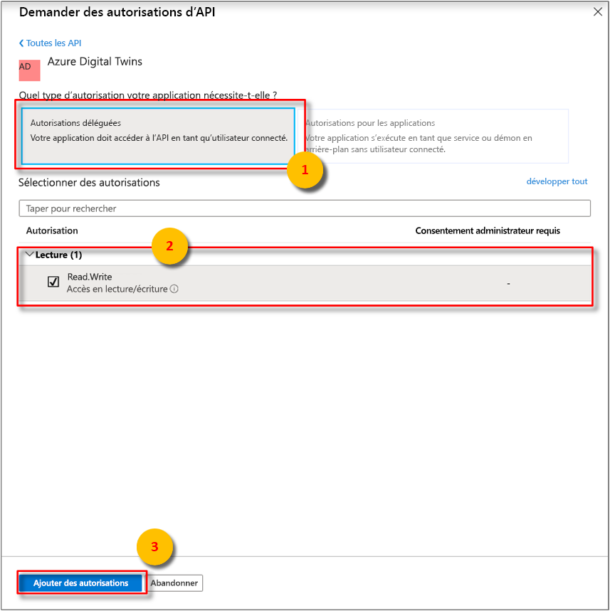

# <a name="how-to-configure-postman-for-azure-digital-twins"></a>Guide pratique pour configurer Postman pour Azure Digital Twins

Cet article explique comment configurer une application Azure Active Directory (Azure AD) pour qu’elle utilise le flux d’octroi implicite OAuth 2.0. Il explique ensuite comment configurer le client Postman REST pour effectuer des requêtes HTTP porteuses de jeton à vos API de gestion.

## <a name="postman-summary"></a>Postman en bref

Commencez avec Azure Digital Twins en utilisant un outil client REST comme [Postman](https://www.getpostman.com/) pour préparer votre environnement de test local. Le client Postman vous aide à créer rapidement des requêtes HTTP complexes. Téléchargez la version bureau du client Postman en accédant à l’adresse [www.getpostman.com/apps](https://www.getpostman.com/apps).

[Postman](https://www.getpostman.com/) est un outil de test REST qui trouve les principales fonctionnalités de requête HTTP dans une interface graphique utilisateur utile de type Bureau à base de plug-ins. Avec le client Postman, les développeurs de solutions peuvent spécifier le type de requête HTTP (POST, GET, UPDATE, PATCH et DELETE), le point de terminaison d’API à appeler et l’utilisation de SSL. Postman prend aussi en charge l’ajout d’en-têtes, de paramètres, de données de formulaire et de corps de requête HTTP.

## <a name="configure-azure-active-directory-to-use-the-oauth-20-implicit-grant-flow"></a>Configurer Azure Active Directory pour utiliser le flux d’octroi implicite OAuth 2.0

Configurez votre application Azure AD pour qu’elle utilise le flux d’octroi implicite OAuth 2.0.

1. Suivez les étapes décrites dans [ce démarrage rapide](https://docs.microsoft.com/azure/active-directory/develop/quickstart-v1-integrate-apps-with-azure-ad) pour créer une application Azure AD de type natif. Vous pouvez aussi réutiliser une inscription d’application native existante.

1. Sous **Autorisations requises**, entrez `Azure Digital Twins` et sélectionnez **Autorisations déléguées**. Sélectionnez ensuite **Accorder des autorisations**.

    

1. Cliquez sur **Manifeste** pour ouvrir le manifeste d’application pour votre application. Définissez *oauth2AllowImplicitFlow* sur `true`.

      ![Flux implicite Azure AD][1]

1. Configurez une **URL de réponse** sur [`https://www.getpostman.com/oauth2/callback`](https://www.getpostman.com/oauth2/callback).

      ![URL de réponse AD Azure][2]

1. Copiez et conserver l’**ID d’application** de votre application Azure AD. Elle est utilisée ci-dessous.

## <a name="configure-the-postman-client"></a>Configurer le client Postman

Ensuite, configurez Postman pour obtenir un jeton Azure AD. Après quoi, adressez une requête HTTP authentifiée à Azure Digital Twins en utilisant le jeton acquis :

1. Accédez à [www.getpostman.com]([https://www.getpostman.com/) pour télécharger l’application.
1. Vérifiez que votre **URL d’autorisation** est correcte. Elle doit prendre la forme suivante :

    ```plaintext
    https://login.microsoftonline.com/YOUR_AZURE_TENANT.onmicrosoft.com/oauth2/authorize?resource=0b07f429-9f4b-4714-9392-cc5e8e80c8b0
    ```

    | Nom  | Remplacer par | Exemples |
    |---------|---------|---------|
    | YOUR_AZURE_TENANT | Nom de votre locataire ou organisation | `microsoft` |

1. Sélectionnez l’onglet **Autorisation**, **OAuth 2.0**, puis **Get New Access Token** (Obtenir un nouveau jeton d’accès).

    | Champ  | Valeur |
    |---------|---------|
    | Type d’autorisation | `Implicit` |
    | URL de rappel | [`https://www.getpostman.com/oauth2/callback`](https://www.getpostman.com/oauth2/callback) |
    | URL d’authentification | Utilisez l’**URL d’autorisation** de l’étape 2 ci-dessus |
    | ID client | Utilisez l’**ID d’application** de l’application Azure AD qui a été créée ou réaffectée dans la section précédente |
    | Étendue | Laisser vide |
    | État | Laisser vide |
    | Authentification du client | `Send as Basic Auth header` |

1. Le client doit maintenant se présenter comme suit :

   ![Exemple de client Postman][3]

1. Sélectionnez **Jeton de demande**.

    >[!NOTE]
    >Si vous recevez le message d’erreur « OAuth 2 couldn’t be completed » (Impossible d’exécuter OAuth 2), essayez ce qui suit :
    > * Fermez Postman, rouvrez-le et réessayez.
  
1. Faites défiler la page et sélectionnez **Use Token** (Utiliser le jeton).

## <a name="next-steps"></a>Étapes suivantes

Pour savoir comment vous authentifier auprès des API de gestion, consultez [S’authentifier auprès des API](./security-authenticating-apis.md).

<!-- Images -->
[1]: media/how-to-configure-postman/implicit-flow.png
[2]: media/how-to-configure-postman/reply-url.png
[3]: media/how-to-configure-postman/postman-oauth-token.png
