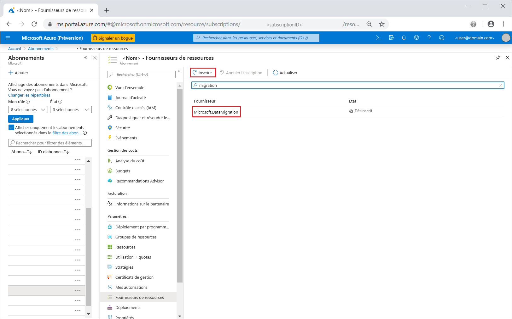
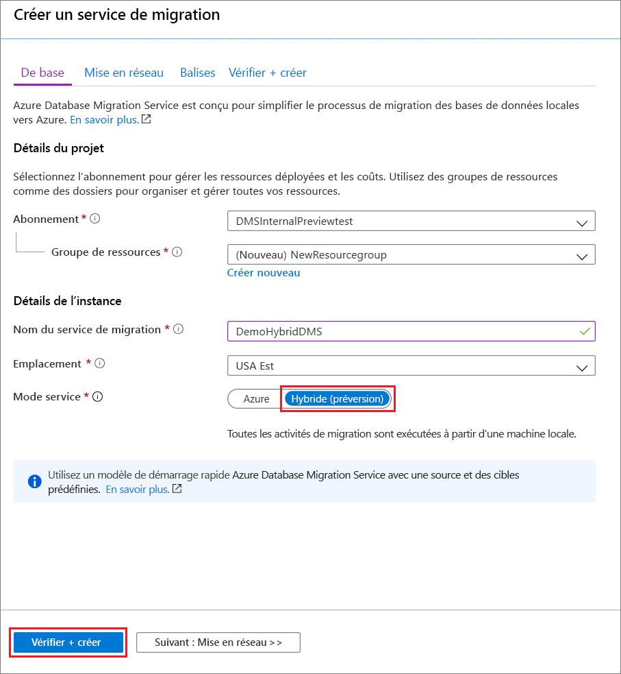
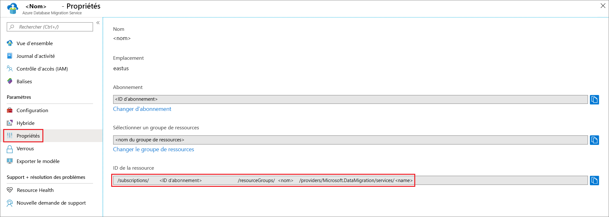
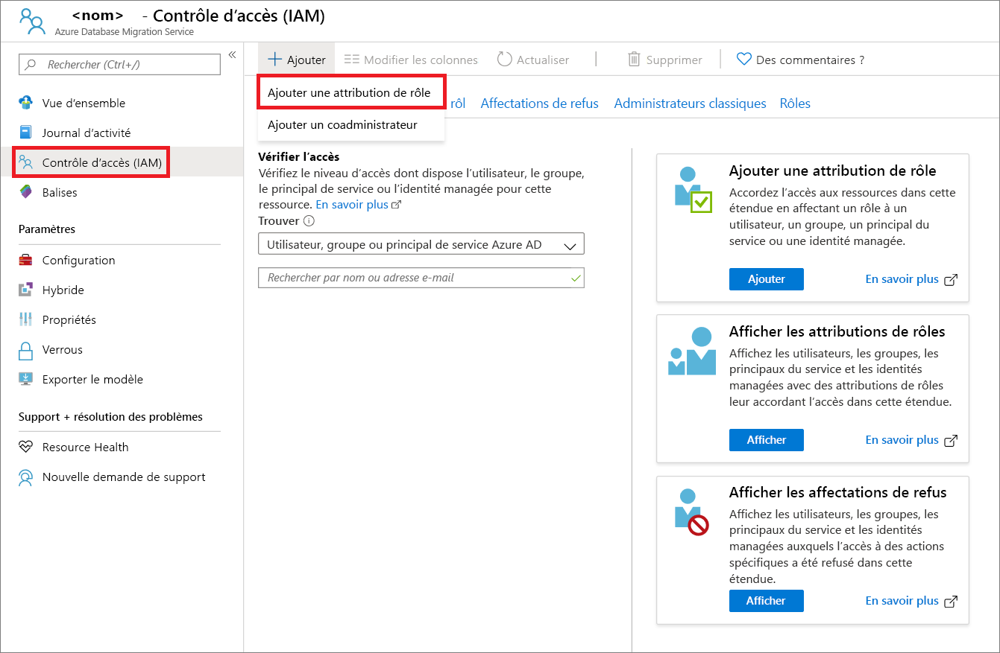
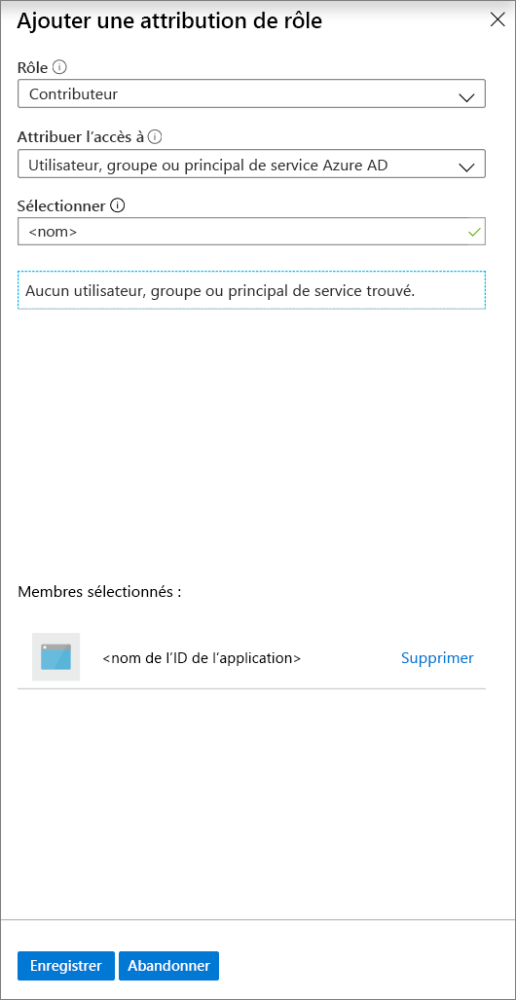
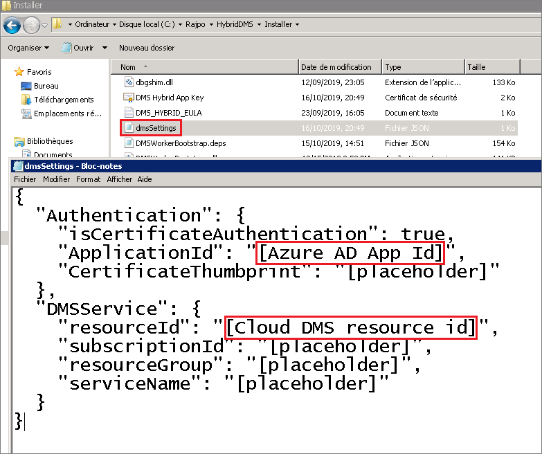
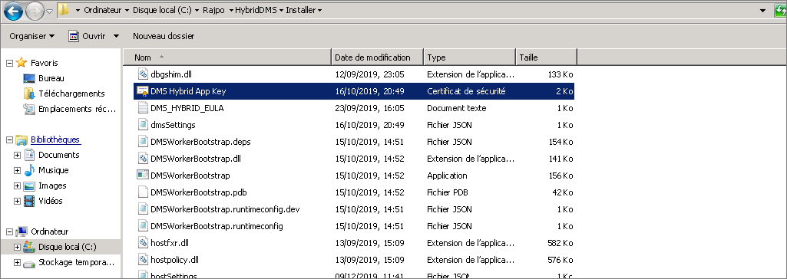
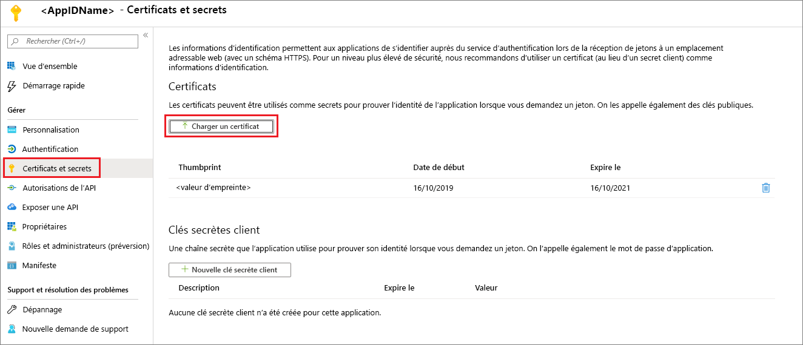

# <a name="quickstart-create-an-instance-of-azure-database-migration-service-in-hybrid-mode-using-the-azure-portal-preview"></a>Démarrage rapide : Créer une instance d’Azure Database Migration Service en mode hybride à l’aide du portail Azure (préversion)

Le mode hybride d’Azure Database Migration Service gère les migrations de base de données à l’aide d’un Worker de migration hébergé localement avec une instance d’Azure Database Migration Service exécutée dans le cloud. Le mode hybride est particulièrement utile pour les scénarios dans lesquels la connectivité de site à site entre le réseau local et Azure fait défaut ou si la bande passante de la connectivité de site à site est limitée.

Dans ce guide de démarrage rapide, vous allez utiliser le portail Azure pour créer une instance d’Azure Database Migration Service en mode hybride. Vous allez ensuite télécharger, installer et configurer le Worker hybride dans votre réseau local. Pendant la préversion, vous pouvez utiliser Azure Database Migration Service en mode hybride pour migrer les données d’une instance SQL Server locale vers Azure SQL Database.

> [!IMPORTANT]
> Le programme d’installation hybride Azure Database Migration Service nécessite .NET 4.7.2 ou ultérieur. Pour trouver les versions les plus récentes de .NET, consultez la page [Télécharger .NET Framework](https://dotnet.microsoft.com/download/dotnet-framework).

Si vous n’avez pas d’abonnement Azure, créez un compte [gratuit](https://azure.microsoft.com/free/) avant de commencer.

## <a name="sign-in-to-the-azure-portal"></a>Connectez-vous au portail Azure.

Ouvrez votre navigateur web, accédez au [portail Microsoft Azure](https://portal.azure.com/), puis saisissez vos informations de connexion au portail.

Il s’ouvre par défaut sur le tableau de bord des services.

## <a name="register-the-resource-provider"></a>Inscrire le fournisseur de ressources

Avant de créer votre première instance d’Azure Database Migration Service, vous devez inscrire le fournisseur de ressources Microsoft.DataMigration.

1. Dans le portail Azure, sélectionnez **Abonnements**, puis l’abonnement dans lequel vous souhaitez créer l’instance Azure Database Migration Service, puis sélectionnez **Fournisseurs de ressources**.

    

2. Recherchez migration, puis à droite de **Microsoft.DataMigration**, sélectionnez **Inscrire**.

    

## <a name="create-an-instance-of-the-service"></a>Créer une instance du service

1. Sélectionnez +**Créer une ressource** pour créer une instance d’Azure Database Migration Service.

2. Recherchez « migration » sur la marketplace, sélectionnez **Azure Database Migration Service**, puis, dans l’écran **Azure Database Migration Service**, sélectionnez **Créer**.

3. Sur l’écran **Créer un service de migration** :

    - Choisissez un **Nom de service** unique et facile à mémoriser pour identifier votre instance d’Azure Database Migration Service.
    - Sélectionnez l’**abonnement** Azure dans lequel vous souhaitez créer l’instance.
    - Sélectionnez un **Groupe de ressources** existant ou créez-en un.
    - Choisissez **l’emplacement** le plus proche de votre serveur source ou cible.

    > [!IMPORTANT]
    > Pendant la préversion, le mode hybride est pris en charge uniquement dans la région USA Est. Le Worker hybride étant installé dans votre réseau local, l’impact sur les performances est faible voire inexistant même si vous effectuez une migration vers une cible située dans une autre région.

    - Pour **Mode de service**, sélectionnez **Hybride (préversion)** .

      

4. Sélectionnez **Revoir + créer**.

5. Sous l’onglet **Vérifier + créer**, passez en revue les conditions, vérifiez les autres informations fournies, puis sélectionnez **Créer**.

    

    Votre instance d’Azure Database Migration Service en mode hybride est créée et prête pour la configuration au bout de quelques instants. L’instance d’Azure Database Migration Service s’affiche alors comme indiqué dans l’image suivante :

    

6. Une fois le service créé, sélectionnez **Propriétés**, puis copiez la valeur affichée dans la zone **ID de ressource**, que vous utiliserez pour installer le Worker hybride Azure Database Migration Service.

    

## <a name="create-azure-app-registration-id"></a>Créer un ID d’inscription Azure App

Vous devez créer un ID d’inscription Azure App qui permettra au Worker hybride local de communiquer avec Azure Database Migration Service dans le cloud.

1. Dans le portail Azure, sélectionnez **Azure Active Directory**, **Inscriptions d’applications**, puis **Nouvelle inscription**.
2. Nommez l’application, puis, sous **Types de comptes pris en charge**, sélectionnez le type de compte à prendre en charge pour indiquer qui peut utiliser l’application.

    

3. Utilisez les valeurs par défaut pour le champ **URI de redirection (facultatif)** , puis sélectionnez **Inscrire**.

4. Une fois l’inscription de l’ID d’application terminée, notez l’**ID d’application (client)** , que vous utiliserez lors de l’installation du Worker hybride.

5. Dans le portail Azure, accédez à Azure Database Migration Service, sélectionnez **Contrôle d’accès (IAM)** , puis **Ajouter une attribution de rôle** pour attribuer un accès de contributeur à l’ID d’application.

    

6. Sélectionnez le rôle de **Contributeur**, attribuez l’accès à **utilisateur Azure AD ou principal de service**, puis sélectionnez le nom de l’ID d’application.

    

7. Sélectionnez **Enregistrer** pour enregistrer l’attribution de rôle de l’ID d’application sur la ressource Azure Database Migration Service.

## <a name="download-and-install-the-hybrid-worker"></a>Télécharger et installer le Worker hybride

1. Dans le portail Azure, accédez à votre instance d’Azure Database Migration Service.

2. Sous **Paramètres**, sélectionnez **Hybride**, puis **Téléchargement du programme d’installation** pour télécharger le Worker hybride.

    

3. Extrayez le fichier zip sur le serveur qui hébergera le Worker hybride Azure Database Migration Service.

    > [!IMPORTANT]
    > Le programme d’installation hybride Azure Database Migration Service nécessite .NET 4.7.2 ou ultérieur. Pour trouver les versions les plus récentes de .NET, consultez la page [Télécharger .NET Framework](https://dotnet.microsoft.com/download/dotnet-framework).

4. Dans le dossier d’installation, recherchez et ouvrez le fichier **dmsSettings.json**, indiquez les valeurs **ApplicationId** et **resourceId**, puis enregistrez le fichier.

    
 
5. Générez un certificat qui permettra à Azure Database Migration Service d’authentifier la communication à partir du Worker hybride à l’aide de la commande suivante.

    ```
    <drive>:\<folder>\Install>DMSWorkerBootstrap.exe -a GenerateCert
    ```

    Un certificat est généré dans le dossier d’installation.

    

6. Dans le portail Azure, accédez à l’ID d’application. Sous **Gérer**, sélectionnez **Certificats et secrets**, puis **Charger un certificat** pour sélectionner le certificat public que vous avez généré.

    

7. Installez le Worker hybride Azure Database Migration Service sur votre serveur local en exécutant la commande suivante :

    ```
    <drive>:\<folder>\Install>DMSWorkerBootstrap.exe -a Install -IAcceptDMSLicenseTerms
    ```

8. Si le programme d’installation s’exécute sans erreur, le service présente l’état en ligne dans Azure Database Migration Service et vous pouvez commencer à migrer vos bases de données.

    

## <a name="uninstall-azure-database-migration-service-hybrid-mode"></a>Désinstaller Azure Database Migration Service en mode hybride

Actuellement, la désinstallation d’Azure Database Migration Service en mode hybride est prise en charge uniquement via le programme d’installation du Worker hybride Azure Database Migration Service sur votre serveur local, à l’aide de la commande suivante :

```
<drive>:\<folder>\Install>DMSWorkerBootstrap.exe -a uninstall
```

## <a name="next-steps"></a>Étapes suivantes

> [!div class="nextstepaction"]
> [Migrer SQL Server vers une instance gérée Azure SQL Database en ligne](tutorial-sql-server-managed-instance-online.md)
> [Migrer SQL Server vers une base de données unique ou mise en pool dans Azure SQL Database hors connexion](tutorial-sql-server-to-azure-sql.md)
