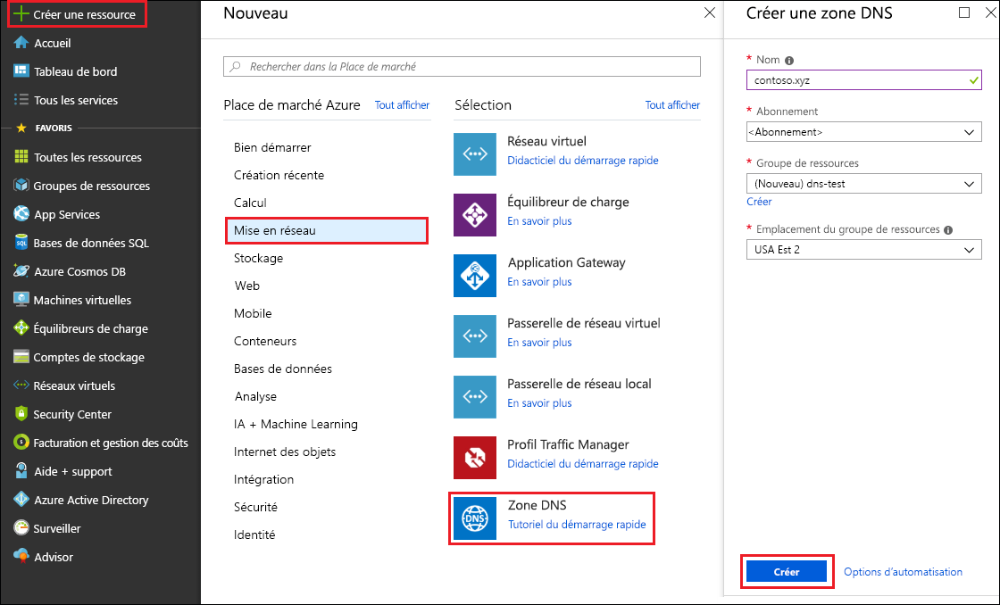
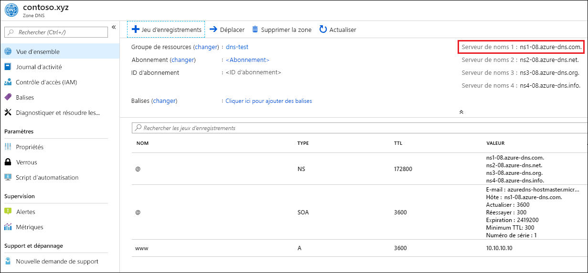

# Prise en main d’Azure DNS à l’aide du portail Azure

> [!div class="op_single_selector"]
> * [portail Azure](dns-getstarted-portal.md)
> * [PowerShell](dns-getstarted-powershell.md)
> * [Azure CLI 1.0](dns-getstarted-cli-nodejs.md)
> * [Azure CLI 2.0](dns-getstarted-cli.md)

Cet article vous indique la procédure à suivre pour créer votre première zone et votre premier enregistrement à l’aide du portail Azure. Vous pouvez également effectuer ces étapes à l’aide d’Azure PowerShell ou de l’interface de ligne de commande Azure multiplateforme.

Une zone DNS permet d’héberger les enregistrements DNS d’un domaine particulier. Pour commencer à héberger votre domaine dans le DNS Azure, vous devez créer une zone DNS pour ce nom de domaine. Chaque enregistrement DNS pour votre domaine est ensuite créé à l’intérieur de cette zone DNS. Enfin, pour publier votre zone DNS sur Internet, vous devez configurer les serveurs de noms du domaine. Chacune de ces étapes est décrite ci-dessous.

## Création d’une zone DNS

1. Connectez-vous au portail Azure.
2. Dans le menu Hub, cliquez sur **Nouveau > Mise en réseau >**, puis cliquez sur **Zone DNS** pour ouvrir le panneau Créer une zone DNS.

    

4. Dans le panneau **Créer une zone DNS** , nommez votre zone DNS. Par exemple, *contoso.com*.
 
    

5. Ensuite, spécifiez le groupe de ressources que vous souhaitez utiliser. Vous pouvez créer un groupe de ressources ou en sélectionner un qui existe déjà. Si vous choisissez de créer un nouveau groupe de ressources, utilisez la liste déroulante **Emplacement** pour spécifier l’emplacement du groupe de ressources. Notez que ce paramètre fait référence à l’emplacement du groupe de ressources et n’a pas d’impact sur la zone DNS. L’emplacement de la zone DNS est toujours « global » et n’est pas affiché.

6. Vous pouvez laisser la case **Épingler au tableau de bord** cochée si vous voulez localiser facilement votre nouvelle zone sur votre tableau de bord. Cliquez ensuite sur **Créer**.

    

7. Lorsque vous cliquez sur Créer, votre nouvelle zone configurée s’affiche sur le tableau de bord.

    

8. Lorsque votre nouvelle zone a été créée, le panneau de votre nouvelle zone s’ouvre dans le tableau de bord.

## Créer un enregistrement DNS

L’exemple suivant vous guide tout au long du processus de création d’un enregistrement « A ». Pour découvrir d’autres types d’enregistrements et pour modifier les enregistrements existants, consultez [Gestion d’enregistrements et de jeux d’enregistrements DNS à l’aide du portail Azure](dns-operations-recordsets-portal.md). 

1. En haut du panneau **Zone DNS**, sélectionnez **+ Jeu d’enregistrements** pour ouvrir le panneau **Ajouter un jeu d’enregistrements**.

    

4. Dans le panneau **Ajouter un jeu d’enregistrements** , donnez un nom à votre jeu d’enregistrements. Par exemple, vous pouvez nommer votre jeu d’enregistrements «**www**».

    

5. Sélectionnez le type d’enregistrement que vous souhaitez créer. Dans cet exemple, sélectionnez **A**.
6. Définissez la **durée de vie (TTL)**. La durée de vie par défaut est d’une heure.
7. Ajoutez l’adresse IP de l’enregistrement.
8. Sélectionnez **OK** en bas du panneau pour créer l’enregistrement DNS.

## Affichage des enregistrements

Les enregistrements de la zone DNS s’affichent dans la partie inférieure du panneau Zone DNS. Vous devez voir les enregistrements NS et SOA par défaut, qui sont créés dans chaque zone, ainsi que les nouveaux enregistrements que vous avez créés.

## Mettre à jour les serveurs de noms

Une fois que vous jugez que votre zone et vos enregistrements DNS ont été configurés correctement, vous devez configurer votre nom de domaine pour utiliser les serveurs de noms Azure DNS. Cela permet à d’autres utilisateurs sur Internet de rechercher vos enregistrements DNS.

Les serveurs de noms de votre zone sont indiqués dans le Portail Azure :

Ces serveurs de noms doivent être configurés avec le bureau d’enregistrement de noms de domaine (dans lequel vous avez acheté le nom de domaine). Votre bureau d’enregistrement offre la possibilité de configurer les serveurs de noms pour le domaine. Pour plus d’informations, consultez [Délégation de domaine à Azure DNS](dns-domain-delegation.md).

## Étapes suivantes

Pour en savoir plus sur Azure DNS, consultez [Vue d’ensemble d’Azure DNS](dns-overview.md).

Pour en savoir plus sur la gestion des enregistrements DNS dans Azure DNS, consultez [Gestion d’enregistrements et de jeux d’enregistrements DNS à l’aide du portail Azure](dns-operations-recordsets-portal.md).

