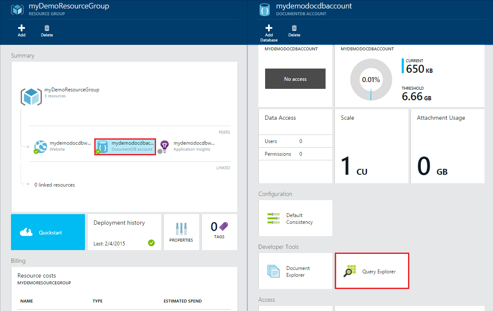
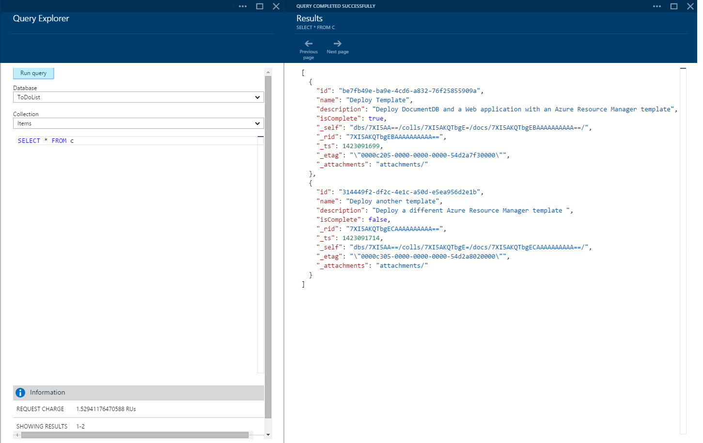
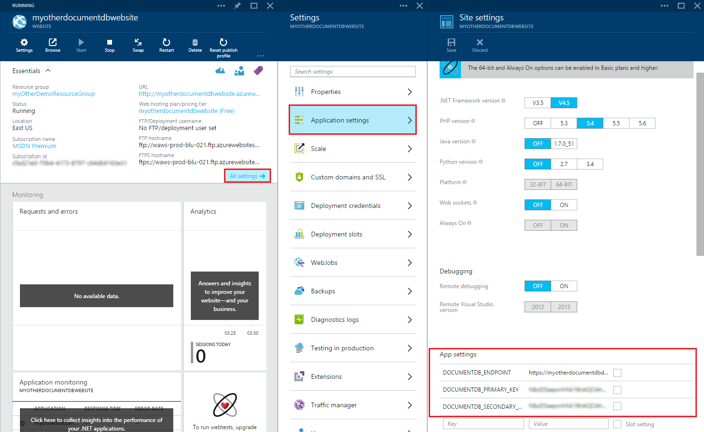

<properties 
	pageTitle="Déploiement de DocumentDB et d'un site web Azure à l'aide d'un modèle de gestionnaire des ressources Azure | Azure" 
	description="Découvrez comment déployer un compte DocumentDB, un site web Azure et un exemple d'application web à l'aide d'un modèle de gestionnaire des ressources Azure." 
	services="documentdb, websites" 
	authors="stephbaron" 
	manager="johnmac" 
	editor="monicar" 
	documentationCenter=""/>

<tags 
	ms.service="documentdb" 
	ms.workload="data-services" 
	ms.tgt_pltfrm="na" 
	ms.devlang="na" 
	ms.topic="article" 
	ms.date="02/09/2015" 
	ms.author="stbaro"/>

# Déploiement de DocumentDB et d'un site web Azure à l'aide d'un modèle de gestionnaire des ressources Azure #

Ce didacticiel vous montre comment utiliser un modèle de gestionnaire des ressources Azure pour déployer et intégrer [Microsoft Azure DocumentDB](http://azure.microsoft.com/services/documentdb/), un [site web Azure](http://azure.microsoft.com/services/websites/) et un exemple d'application web.

Après avoir terminé ce didacticiel, vous serez en mesure de répondre aux questions suivantes :  

-	Comment puis-je utiliser un modèle de gestionnaire des ressources Azure pour déployer et intégrer un compte DocumentDB et un site web Azure ?
-	Comment puis-je utiliser un modèle de gestionnaire des ressources Azure pour déployer et intégrer un compte DocumentDB, un site web Azure et une application WebDeploy ?

##Conditions préalables ##
> [AZURE.TIP] Alors que ce didacticiel ne suppose pas d'être familiarisé avec les modèles de gestionnaire des ressources Azure, avec JSON ou avec Azure PowerShell, si vous souhaitez modifier les modèles référencés ou les options de déploiement, alors la connaissance de chacun de ces domaines sera nécessaire.

Avant de suivre les instructions de ce didacticiel, assurez-vous de disposer des éléments suivants :

- Un abonnement Azure. Azure est une plateforme disponible par abonnement.  Pour plus d'informations sur la façon de se procurer un abonnement, consultez les [formules d'abonnement](http://azure.microsoft.com/pricing/purchase-options/), les [offres spéciales membres](http://azure.microsoft.com/pricing/member-offers/) ou la [version d'évaluation gratuite](http://azure.microsoft.com/pricing/free-trial/).
- Un compte de stockage Azure. Pour obtenir des instructions, consultez la rubrique [À propos des comptes de stockage Azure](../storage-whatis-account/).
- Un poste de travail sur lequel est installé Azure PowerShell. Pour obtenir des instructions, consultez la rubrique [Installation et configuration d'Azure PowerShell](http://azure.microsoft.com/documentation/articles/install-configure-powershell/).

##Étape 1 : téléchargement et extraction des fichiers d'exemple ##
Commençons par télécharger les fichiers d'exemple que nous utiliserons dans ce didacticiel.

1. Téléchargez [l'exemple de création d'un compte DocumentDB et d'un site web et de déploiement d'application de démonstration](https://portalcontent.blob.core.windows.net/samples/CreateDocDBWebsiteTodo.zip) dans un dossier local (par exemple, C:\DocumentDBTemplates) et extrayez les fichiers.  Cet exemple déploie un compte DocumentDB, un site web Azure et une application web.  Il configure également automatiquement l'application web pour se connecter au compte DocumentDB.

2. Téléchargez [l'exemple de création d'un compte DocumentDB et d'un site web](https://portalcontent.blob.core.windows.net/samples/CreateDocDBWebSite.zip) dans un dossier local (par exemple, C:\DocumentDBTemplates) et extrayez les fichiers.  Cet exemple déploie un compte DocumentDB, un site web Azure et modifie la configuration du site web pour faire facilement apparaître les informations de connexion DocumentDB, mais n'inclut pas d'application web.  

> [AZURE.TIP] Remarquez que selon les paramètres de sécurité de votre ordinateur, vous devrez débloquer les fichiers extraits par un clic droit, en cliquant sur **Propriétés**, puis sur **Débloquer**.

##Étape 2 : déploiement de l'exemple de compte DocumentDB, de sites web et d'application de démonstration ##

Maintenant, nous allons déployer notre premier modèle.

> [AZURE.TIP] Le modèle ne valide pas que le nom du site web et le nom du compte DocumentDB entrés ci-dessous sont a) valides et b) disponibles.  Il est vivement recommandé de vérifier la disponibilité des noms que vous souhaitez fournir avant d'exécuter le script de déploiement PowerShell.

1. Ouvrez Microsoft Azure PowerShell et accédez au dossier dans lequel vous avez téléchargé et extrait [l'exemple de création d'un compte DocumentDB et d'un site web et de déploiement d'une application de démonstration](https://portalcontent.blob.core.windows.net/samples/CreateDocDBWebsiteTodo.zip) (par exemple, C:\DocumentDBTemplates\CreateDocDBWebsiteTodo).

2. Nous allons exécuter le script PowerShell CreateDocDBWebsiteTodo.ps1.  Le script accepte les paramètres obligatoires suivants :
	- WebsiteName : spécifie le nom du site web et est utilisé pour construire l'URL que vous allez utiliser pour accéder au site web (par exemple, si vous spécifiez " mydemodocdbwebsite ", l'URL par laquelle vous accédez au site web est donc mydemodocdbwebsite.azurewebsites.net).

	- ResourceGroupName : spécifie le nom du groupe de ressources Azure à déployer. Si le groupe de ressources spécifié n'existe pas, il sera créé.

	- docDBAccountName : spécifie le nom du compte DocumentDB à créer.

	- location : spécifie l'emplacement Azure dans lequel créer les ressources DocumentDB et de site web.  Les valeurs valides sont Asie orientale, Asie du Sud-est, Est des États-Unis, Ouest des États-Unis, Europe du Nord, Europe de l'Ouest (notez que la valeur de l'emplacement fournie est sensible à la casse).

3. Voici un exemple de commande pour exécuter le script :

    	PS C:\DocumentDBTemplates\CreateDocDBWebsiteTodo> .\CreateDocDBWebsiteTodo.ps1 -WebSiteName "mydemodocdbwebsite" -ResourceGroupName "myDemoResourceGroup" -docDBAccountName "mydemodocdbaccount" -location "West US"

	> [AZURE.TIP] Notez que vous devrez entrer vos nom d'utilisateur et mot de passe de compte Azure dans le cadre de l'exécution du script.  L'exécution complète du déploiement prendra entre 10 et 15 minutes.  	

4. Voici un exemple de la sortie obtenue : 

		VERBOSE: 1:06:00 PM - Created resource group 'myDemoResourceGroup' in location westus'
		VERBOSE: 1:06:01 PM - Template is valid.
		VERBOSE: 1:06:01 PM - Create template deployment 'Microsoft.DocumentDBWebSiteTodo'.
		VERBOSE: 1:06:08 PM - Resource Microsoft.DocumentDb/databaseAccounts 'mydemodocdbaccount' provisioning status is running
		VERBOSE: 1:06:10 PM - Resource Microsoft.Web/serverFarms 'mydemodocdbwebsite' provisioning status is succeeded
		VERBOSE: 1:06:14 PM - Resource microsoft.insights/alertrules 'CPUHigh mydemodocdbwebsite' provisioning status is succeeded
		VERBOSE: 1:06:16 PM - Resource microsoft.insights/autoscalesettings 'mydemodocdbwebsite-myDemoResourceGroup' provisioning status is succeeded
		VERBOSE: 1:06:16 PM - Resource microsoft.insights/alertrules 'LongHttpQueue mydemodocdbwebsite' provisioning status is succeeded
		VERBOSE: 1:06:21 PM - Resource Microsoft.Web/Sites 'mydemodocdbwebsite' provisioning status is succeeded
		VERBOSE: 1:06:23 PM - Resource microsoft.insights/alertrules 'ForbiddenRequests mydemodocdbwebsite' provisioning status is succeeded
		VERBOSE: 1:06:25 PM - Resource microsoft.insights/alertrules 'ServerErrors mydemodocdbwebsite' provisioning status is succeeded
		VERBOSE: 1:06:25 PM - Resource microsoft.insights/components 'mydemodocdbwebsite' provisioning status is succeeded
		VERBOSE: 1:16:22 PM - Resource Microsoft.DocumentDb/databaseAccounts 'mydemodocdbaccount' provisioning status is succeeded
		VERBOSE: 1:16:22 PM - Resource Microsoft.DocumentDb/databaseAccounts 'mydemodocdbaccount' provisioning status is succeeded
		VERBOSE: 1:16:24 PM - Resource Microsoft.Web/Sites/config 'mydemodocdbwebsite/web' provisioning status is succeeded
		VERBOSE: 1:16:27 PM - Resource Microsoft.Web/Sites/Extensions 'mydemodocdbwebsite/MSDeploy' provisioning status is running
		VERBOSE: 1:16:35 PM - Resource Microsoft.Web/Sites/Extensions 'mydemodocdbwebsite/MSDeploy' provisioning status is succeeded

		ResourceGroupName : myDemoResourceGroup
		Location          : westus
		Resources         : {mydemodocdbaccount, CPUHigh mydemodocdbwebsite, ForbiddenRequests mydemodocdbwebsite, LongHttpQueue mydemodocdbwebsite...}
		ResourcesTable    :
                    Name                                    Type                                   Location
                    ======================================  =====================================  =========
                    mydemodocdbaccount                      Microsoft.DocumentDb/databaseAccounts  westus
                    CPUHigh mydemodocdbwebsite              microsoft.insights/alertrules          eastus
                    ForbiddenRequests mydemodocdbwebsite    microsoft.insights/alertrules          eastus
                    LongHttpQueue mydemodocdbwebsite        microsoft.insights/alertrules          eastus
                    ServerErrors mydemodocdbwebsite         microsoft.insights/alertrules          eastus
                    mydemodocdbwebsite-myDemoResourceGroup  microsoft.insights/autoscalesettings   eastus
                    mydemodocdbwebsite                      microsoft.insights/components          centralus
                    mydemodocdbwebsite                      Microsoft.Web/serverFarms              westus
                    mydemodocdbwebsite                      Microsoft.Web/sites                    westus

		ProvisioningState : Succeeded

5. Avant d'examiner notre exemple d'application, essayons de comprendre ce que le déploiement du modèle a effectué :

	- Un site web Azure a été créé.

	- Un compte Azure DocumentDB a été créé.

	- Un package de déploiement web a été déployé sur le site web Azure

	- La configuration du site web Azure a été modifiée de telle sorte que le point de terminaison Azure DocumentDB et la clé principale primaire ont été signalés en tant que paramètres de l'application.

	- Une série de règles de surveillance par défaut a été créée.

	
6. Pour utiliser l'application, accédez simplement à l'URL du site web (dans l'exemple ci-dessus, l'URL serait http://mydemodocdbwebsite.azurewebsites.net).  Vous verrez l'application web suivante :

	

7. Continuez et créez deux tâches, puis ouvrez le [portail Azure en version préliminaire](https://portal.azure.com).

8. Choisissez de parcourir les groupes de ressources et de sélectionner le groupe de ressources que nous avons créé au cours du déploiement (dans l'exemple ci-dessus, myDemoResourceGroup).

	
9.  Notez que la carte des ressources de l'objectif Résumé affiche toutes nos ressources connexes (compte DocumentDB, site web, surveillance).

	
10.  Cliquez sur votre compte DocumentDB et lancez l'Explorateur de requête (au bas du panneau du compte).

	

11. Exécutez la requête par défaut, " SELECT * FROM c ", et examinez les résultats.  Notez que la requête a récupéré la représentation JSON des éléments de tâche que vous avez créés à l'étape 7 ci-dessus.  N'hésitez pas à faire des essais avec des requêtes ; par exemple, essayez d'exécuter SELECT * FROM c WHERE c.isComplete = true pour retourner tous les éléments de tâche qui ont été marqués comme terminés.

	
12. N'hésitez pas à explorer l'utilisation du portail DocumentDB ou modifier l'exemple d'application Todo.  Lorsque vous êtes prêt, nous allons déployer un autre modèle.
	 
##Étape 3 : déploiement de l'exemple de sites web et de compte DocumentDB ##

Maintenant nous allons déployer notre deuxième modèle.

> [AZURE.TIP] Le modèle ne valide pas que le nom du site web et le nom du compte DocumentDB entrés ci-dessous sont a) valides et b) disponibles.  Il est vivement recommandé de vérifier la disponibilité des noms que vous souhaitez fournir avant d'exécuter le script de déploiement PowerShell.

1. Ouvrez Microsoft Azure PowerShell et accédez au dossier dans lequel vous avez téléchargé et extrait [l'exemple de création d'un compte DocumentDB et d'un site web](https://portalcontent.blob.core.windows.net/samples/CreateDocDBWebSite.zip) (par exemple, C:\DocumentDBTemplates\CreateDocDBWebsite).

2. Nous allons exécuter le script PowerShell CreateDocDBWebsite.ps1.  Le script accepte les mêmes paramètres que le premier modèle que nous avons déployé, à savoir :
	- WebsiteName : spécifie le nom du site web et est utilisé pour construire l'URL que vous allez utiliser pour accéder au site web (par exemple, si vous spécifiez " myotherdocumentdbwebsite ", l'URL par laquelle vous accédez au site web est donc myotherdocumentdbwebsite.azurewebsites.net).

	- ResourceGroupName : spécifie le nom du groupe de ressources Azure à déployer.  Si le groupe de ressources spécifié n'existe pas, il sera créé.

	- docDBAccountName : spécifie le nom du compte DocumentDB à créer.

	- 	location : spécifie l'emplacement Azure dans lequel créer les ressources DocumentDB et de site web.  Les valeurs valides sont Asie orientale, Asie du Sud-est, Est des États-Unis, Ouest des États-Unis, Europe du Nord, Europe de l'Ouest (notez que la valeur de l'emplacement fournie est sensible à la casse).

3. Voici un exemple de commande pour exécuter le script :

    	PS C:\DocumentDBTemplates\CreateDocDBWebSite> .\CreateDocDBWebSite.ps1 -WebSiteName "myotherdocumentdbwebsite" -ResourceGroupName "myOtherDemoResourceGroup" -docDBAccountName "myotherdocumentdbdemoaccount" -location "East US"

	> [AZURE.TIP] Notez que vous devrez entrer vos nom d'utilisateur et mot de passe de compte Azure dans le cadre de l'exécution du script.  L'exécution complète du déploiement prendra entre 10 et 15 minutes.  	

4. La sortie du déploiement sera très similaire au premier exemple de modèle. 
5. Avant d'ouvrir le portail Azure, essayons de comprendre ce que ce déploiement de modèle a effectué :

	- Un site web Azure a été créé.

	- Un compte Azure DocumentDB a été créé.

	- 	La configuration du site web Azure a été modifiée de telle sorte que le point de terminaison Azure DocumentDB, la clé principale primaire et la clé principale secondaire ont été signalés en tant que paramètres de l'application.

	- 	Une série de règles de surveillance par défaut a été créée.

6. Nous allons ouvrir le [portail Azure en version préliminaire](https://portal.azure.com), choisir de parcourir les groupes de ressources et de sélectionner le groupe de ressources que nous avons créé au cours du déploiement (dans l'exemple ci-dessus, myOtherDemoResourceGroup).
7. Dans l'objectif Résumé, cliquez sur le site web Azure qui vient juste d'être déployé.

	
8. Dans le panneau du site web, cliquez sur **Tous les paramètres**, puis sur **Paramètres de l'application** et remarquez l'existence de paramètres d'application pour le point de terminaison DocumentDB et chacune des clés principales DocumentDB.

	
9. N'hésitez pas à continuer à explorer le portail Azure ou à suivre l'un de nos [exemples](http://go.microsoft.com/fwlink/?LinkID=402386) DocumentDB pour créer votre propre application DocumentDB.

	
	

##Étapes suivantes

Félicitations ! Vous avez déployé DocumentDB, des sites web Azure et un exemple d'application web à l'aide de modèles du gestionnaire des ressources Azure.

- Pour en savoir plus sur DocumentDB, cliquez [ici](http://azure.com/docdb).
- Pour en savoir plus sur les sites web Azure, cliquez [ici](http://go.microsoft.com/fwlink/?LinkId=325362).
- Pour en savoir plus sur les modèles du gestionnaire des ressources Azure, cliquez [ici](https://msdn.microsoft.com/library/azure/dn790549.aspx).

<!--HONumber=47-->
