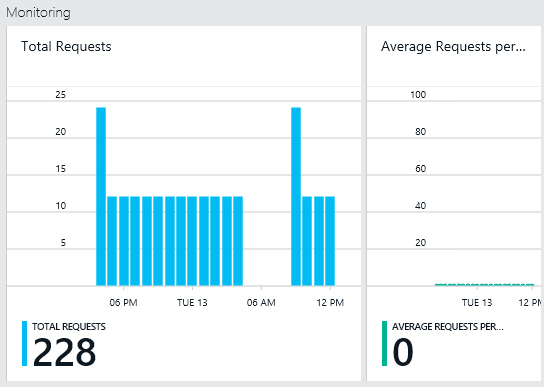
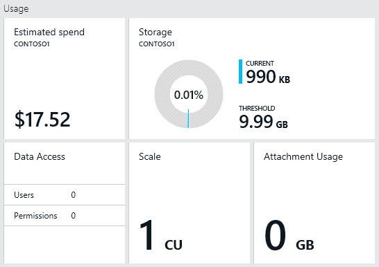
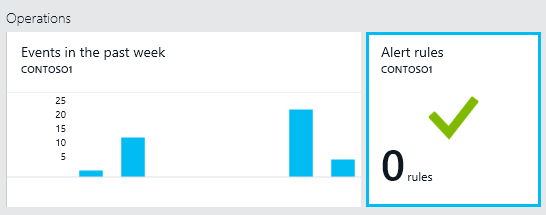

<properties 
	pageTitle="Surveillance d'un compte DocumentDB | Azure" 
	description="Découvrez comment surveiller, dans votre compte DocumentDB, les mesures de performances (notamment les demandes et les erreurs de serveur) et les mesures d'utilisation (par exemple, l'espace de stockage utilisé)." 
	services="documentdb" 
	documentationCenter="" 
	authors="mimig1" 
	manager="jhubbard" 
	editor="cgronlun"/>

<tags 
	ms.service="documentdb" 
	ms.workload="data-services" 
	ms.tgt_pltfrm="na" 
	ms.devlang="na" 
	ms.topic="article" 
	ms.date="01/13/2015" 
	ms.author="mimig"/>

#Surveillance d'un compte DocumentDB  

Vous pouvez surveiller vos comptes DocumentDB dans la [version préliminaire du portail Azure](https://portal.azure.com/). Pour chaque compte DocumentDB, des mesures de performances (notamment les demandes et les erreurs de serveur) et des mesures d'utilisation (par exemple l'espace de stockage utilisé) sont disponibles.

##  Affichage des mesures de performances pour un compte DocumentDB
1.	Dans la [version préliminaire du portail Azure](https://portal.azure.com/), cliquez sur **Parcourir**, puis sur **Comptes DocumentDB**. Cliquez ensuite sur le nom du compte DocumentDB dont vous souhaitez voir les mesures de performances.
2.	Dans le filtre **Surveillance**, vous pouvez, par défaut, voir :
	*	le nombre total de demandes pour le jour en cours ;
	*	la moyenne des demandes par seconde pour le jour en cours. 
	
	

3.	Cliquez dans la partie **Total des demandes** ou **Moyenne des demandes par seconde** pour ouvrir un volet **Métrique** détaillé.
4.	Le volet **Métrique** affiche les détails des mesures que vous avez sélectionnées.  En haut du volet se trouve un graphique et en dessous un tableau qui affiche les valeurs d'agrégation des mesures sélectionnées, comme la moyenne, le minimum et le maximum.  Le volet Métrique affiche également la liste des alertes définies, filtrées en fonction des mesures apparaissant dans le volet ouvert. Ainsi, si vous avez plusieurs alertes, seules celles qui sont pertinentes sont affichées ici.   

	

## Personnalisation des affichages des mesures de performances pour un compte DocumentDB

1.	Pour personnaliser les mesures qui s'affichent à un endroit particulier, cliquez avec le bouton droit sur le graphique de mesures, puis sélectionnez **Modifier le graphique**.  
	

2.	Dans le volet **Modifier le graphique**, des options permettent de modifier les mesures qui s'affichent dans la partie, ainsi que leur plage horaire.  
	

3.	Pour modifier les mesures affichées, sélectionnez ou désélectionnez simplement les mesures de performances disponibles, puis cliquez sur **Enregistrer** au bas du volet.  
4.	Pour modifier la plage horaire, choisissez une autre plage (ex. : **Heure précédente**), puis cliquez sur **Enregistrer** au bas du volet.  

	 

## Création de graphiques de performances côte à côte
La version préliminaire du portail Azure vous permet de créer des graphiques côte à côte.  

1.	Tout d'abord, cliquez avec le bouton droit sur le graphique que vous voulez cloner et modifier, puis sélectionnez **Personnaliser**. 

	

2.	Cliquez sur **Cloner** dans le menu pour copier la partie, puis cliquez sur **Personnalisation terminée**. 

	  

Vous pouvez maintenant considérer cette partie comme n'importe quelle mesure en personnalisant les mesures et la plage horaire affichées.  Ainsi, vous pouvez voir deux mesures différentes affichées en même temps côte à côte.  
	  

## Affichage des mesures d'utilisation pour un compte DocumentDB
1.	Dans la [version préliminaire du portail Azure](https://portal.azure.com/), cliquez sur **Parcourir**, puis sur **Comptes DocumentDB**. Cliquez ensuite sur le nom du compte DocumentDB dont vous souhaitez voir les mesures d'utilisation.
2.	Dans le filtre **Utilisation**, vous pouvez afficher les informations suivantes par défaut :
	*	le coût estimé ;
	*	la consommation du stockage sur le compte ;
	*	le stockage maximum disponible du compte ;
	*	les utilisateurs et l'utilisation des autorisations ;
	*	l'affectation des unités de capacité ;
	*	l'utilisation des pièces jointes.

	
 
## Configuration d'alertes de mesures de performances pour un compte DocumentDB
1.	Dans la [version préliminaire du portail Azure](https://portal.azure.com/), cliquez sur **Parcourir**, puis sur **Comptes DocumentDB**. Cliquez ensuite sur le nom du compte DocumentDB pour lequel vous souhaitez configurer les alertes de mesures de performances.
2.	Dans le filtre **Opérations**, cliquez dans la partie **Règles d'alerte**.  
	

3.	Dans le volet Règles d'alerte, cliquez sur **Ajouter une alerte**.  
	

4.	Dans le volet **Ajouter une règle d'alerte**, indiquez :
	*	le nom de la règle d'alerte que vous configurez ;
	*	une description de la nouvelle règle d'alerte ;
	*	la mesure de la règle d'alerte ;
	*	la condition, le seuil et la période déterminant l'activation de l'alerte. Par exemple, un nombre d'erreurs de serveur supérieur à 5 au cours des 15 dernières minutes.
	*	l'envoi ou non d'un courrier électronique à l'administrateur de service ou aux coadministrateurs lorsque l'alerte se déclenche ;
	*	des adresses électroniques supplémentaires pour les notifications d'alerte.  
	

 
## Étapes suivantes
Pour en savoir plus sur les performances et la capacité de DocumentDB, consultez la page [Gestion des capacités et performances de DocumentDB](../documentdb-manage/). 

<!--Anchors-->
[Affichage des mesures de performances pour un compte DocumentDB]: #How-to-view-performance-metrics-for-a-DocumentDB-account
[Personnalisation des affichages des mesures de performances pour un compte DocumentDB]: #Customize-performance-metric-views-for-a-DocumentDB-account
[Création de graphiques de mesures de performances côte à côte]: #How-to-create-side-by-side-performance-metric-charts
[Affichage des mesures d'utilisation pour un compte DocumentDB]: #How-to-view-usage-metrics-for-a-DocumentDB-account
[Configuration d'alertes de mesures de performances pour un compte DocumentDB]: #How-to-setup-performance-metric-alerts-for-a-DocumentDB-account
[Étapes suivantes]: #Next-steps

<!--HONumber=47-->
