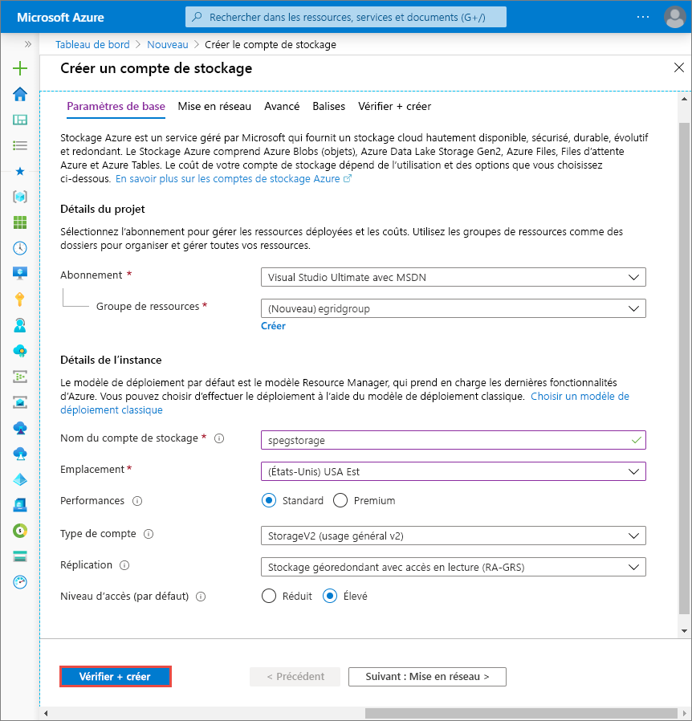
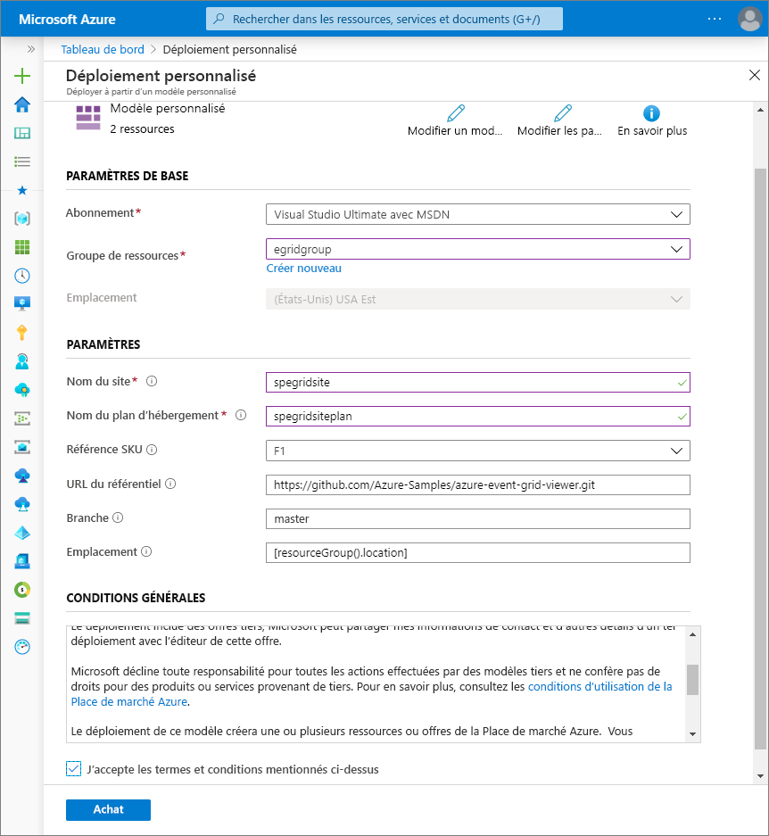
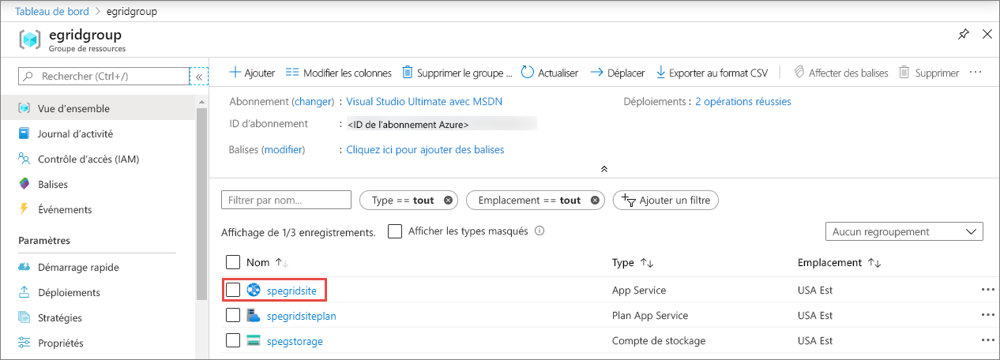
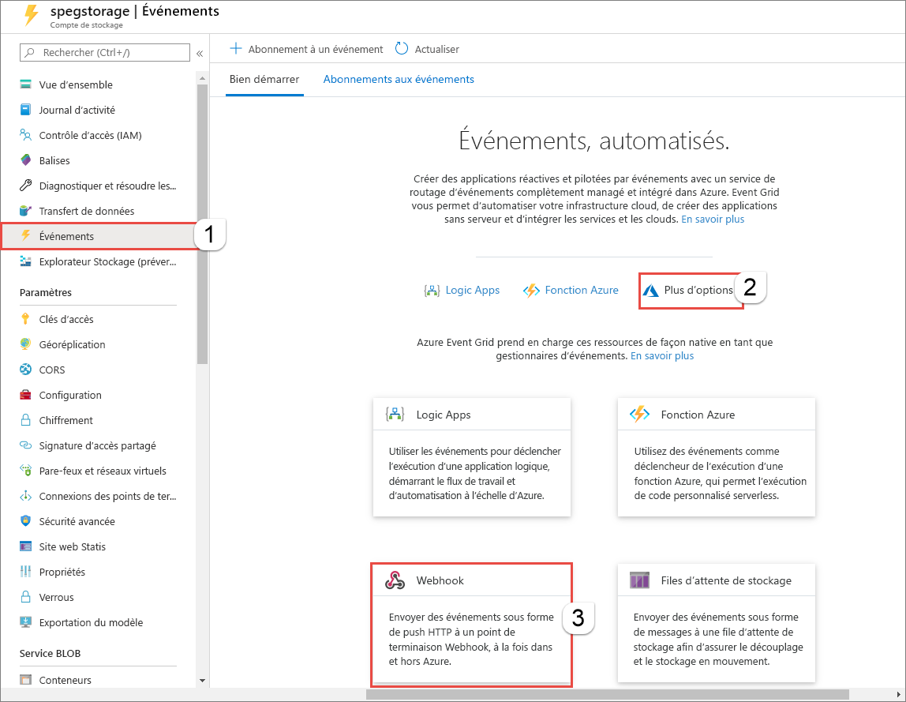
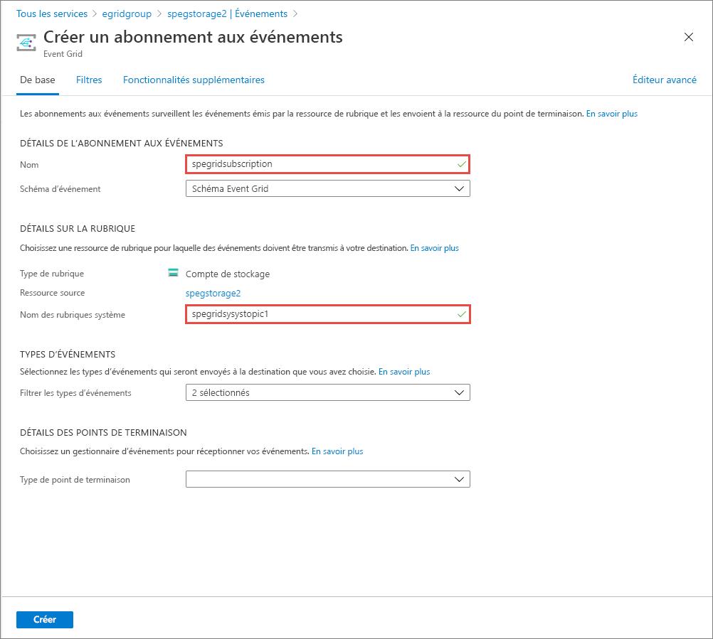
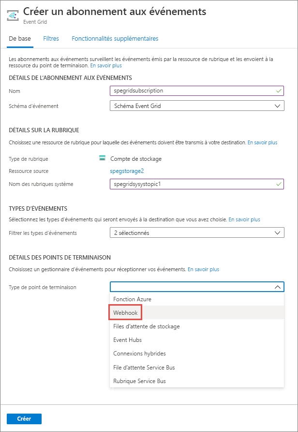
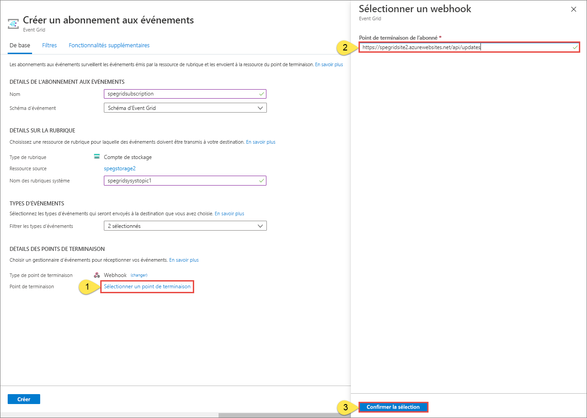
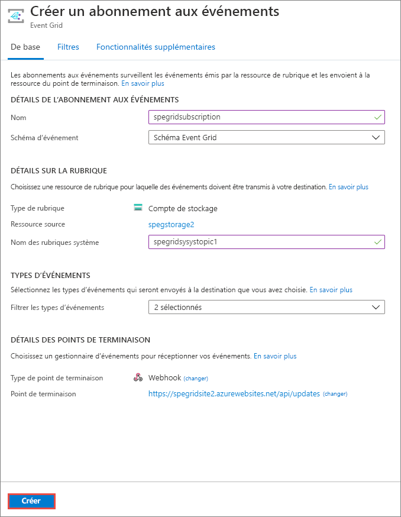
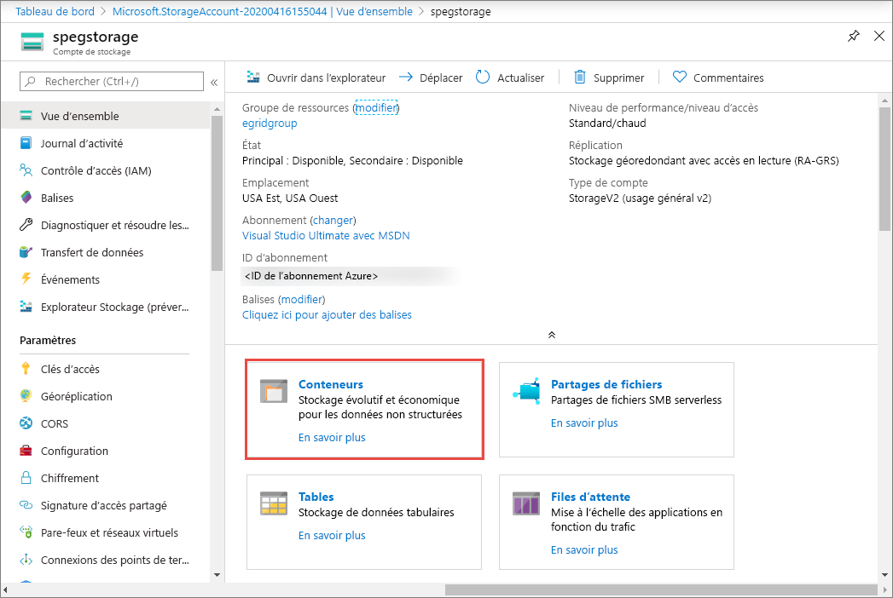
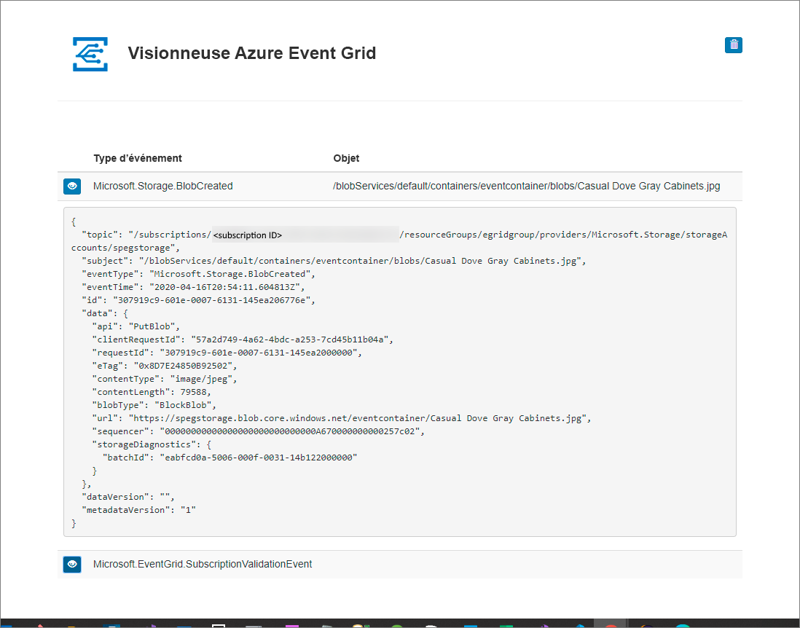

# Démarrage rapide : Acheminer des événements de stockage Blob vers un point de terminaison web avec le portail Azure

Azure Event Grid est un service de gestion d’événements pour le cloud. Dans cet article, vous utilisez le portail Azure pour créer un compte de stockage d’objets blob, vous abonner aux événements de ce stockage d’objets blob et déclencher un événement pour afficher le résultat. En règle générale, vous envoyez des événements à un point de terminaison qui traite les données d’événement et entreprend des actions. Toutefois, pour simplifier cet article, vous envoyez les événements à une application web qui collecte et affiche les messages.

[!INCLUDE [quickstarts-free-trial-note.md](../../includes/quickstarts-free-trial-note.md)]

Une fois que vous avez fini, vous voyez que les données d’événement ont été envoyées à l’application web.

## Créez un compte de stockage.

1. Connectez-vous au [portail Azure](https://portal.azure.com/).

1. Pour créer un stockage d’objets blob, sélectionnez **Créer une ressource**. 

1. Sélectionnez **Stockage** pour filtrer les options disponibles, puis **Compte de stockage - blob, fichier, table, file d’attente**.

   

   Pour s’abonner à des événements, créez un compte de stockage v2 à usage général ou un compte de stockage d’objets blob.
   
1. Dans la page **Créer un compte de stockage**, procédez comme suit :
    1. Sélectionnez votre abonnement Azure. 
    2. Dans le champ **Groupe de ressources**, créez un groupe de ressources Azure ou sélectionnez un groupe existant. 
    3. Entrez le nom de votre compte de stockage. 
    4. Sélectionnez **Revoir + créer**. 

           
    5. Dans la page **Vérifier + créer**, passez en revue les paramètres, puis sélectionnez **Créer**. 

        >[!NOTE]
        > Seuls les comptes de stockage de type **StorageV2 (v2 universel)** et **BlobStorage** prennent en charge l’intégration d’événements. Le type **Stockage (v1 universel)** ne prend *pas* en charge l’intégration à Event Grid.

## Créer un point de terminaison de message

Avant de nous abonner aux événements du stockage d’objets blob, nous allons créer le point de terminaison pour le message de l’événement. En règle générale, le point de terminaison entreprend des actions en fonction des données d’événement. Pour simplifier ce guide de démarrage rapide, déployez une [application web prédéfinie](https://github.com/Azure-Samples/azure-event-grid-viewer) qui affiche les messages d’événement. La solution déployée comprend un plan App Service, une offre App Service Web Apps et du code source en provenance de GitHub.

1. Sélectionnez **Déployer sur Azure** pour déployer la solution sur votre abonnement. 

   
2. Dans la page **Déploiement personnalisé**, procédez comme suit : 
    1. Pour **Groupe de ressources**, sélectionnez le groupe de ressources que vous avez créé lors de la création du compte de stockage. Il sera plus facile pour vous de nettoyer une fois que vous aurez terminé le tutoriel en supprimant le groupe de ressources.  
    2. Pour **Nom du site**, entrez un nom pour l’application web.
    3. Pour **Nom du plan d’hébergement**, entrez un nom pour le plan App Service à utiliser pour l’hébergement de l’application web.
    4. Cochez la case **J’accepte les termes et conditions mentionnés ci-dessus**. 
    5. Sélectionnez **Achat**. 

       
1. Le déploiement peut prendre quelques minutes. Sélectionnez Alertes (icône représentant une cloche) dans le portail, puis **Accéder au groupe de ressources**. 

    
4. Dans la page **Groupe de ressources**, dans la liste des ressources, sélectionnez l’application web que vous avez créée. Vous pouvez également voir le plan App Service et le compte de stockage dans cette liste. 

    
5. Dans la page **App Service** de votre application web, sélectionnez l’URL pour accéder au site web. L’URL doit être au format suivant : `https://<your-site-name>.azurewebsites.net`.
    
    

6. Confirmez que vous voyez le site, mais qu’aucun événement n’a encore été posté sur celui-ci.

   

[!INCLUDE [event-grid-register-provider-portal.md](../../includes/event-grid-register-provider-portal.md)]

## S’abonner à un stockage d’objets blob

Vous vous abonnez à une rubrique pour communiquer à Event Grid les événements qui vous intéressent, et où les envoyer.

1. Dans le portail, accédez au compte de stockage Azure que vous avez créé précédemment. Dans le menu de gauche, sélectionnez **Toutes les ressources** et votre compte de stockage. 
2. Dans la page **Compte de stockage**, sélectionnez **Événements** dans le menu de gauche. 
1. Sélectionnez **Autres options**, puis **Webhook**. Vous envoyez des événements à votre application de visionneuse, avec un webhook comme point de terminaison. 

   
3. Dans la page **Créer un abonnement aux événements**, effectuez les étapes suivantes : 
    1. Entrez un **nom** pour l’abonnement aux événements.
    2. Entrez un **nom** pour la **rubrique système**. Pour en savoir plus sur les rubriques système, consultez [Vue d’ensemble des rubriques système](system-topics.md).

       
    2. Sélectionnez **Webhook** pour **Type de point de terminaison**. 

       
4. Pour **Point de terminaison**, cliquez sur **Sélectionner un point de terminaison**, entrez l’URL de votre application web et ajoutez `api/updates` à l’URL de la page d’accueil (par exemple, `https://spegridsite.azurewebsites.net/api/updates`), puis sélectionnez **Confirmer la sélection**.

   
5. À présent, dans la page **Créer un abonnement aux événements**, sélectionnez **Créer** pour créer l’abonnement aux événements. 

   

1. Affichez à nouveau votre application web, et notez qu’un événement de validation d’abonnement lui a été envoyé. Sélectionnez l’icône en forme d’œil pour développer les données d’événements. Event Grid envoie l’événement de validation pour que le point de terminaison puisse vérifier qu’il souhaite recevoir des données d’événement. L’application web inclut du code pour valider l’abonnement.

   

Nous allons maintenant déclencher un événement pour voir comment Event Grid distribue le message à votre point de terminaison.

## Envoyer un événement à votre point de terminaison

Pour déclencher un événement pour le stockage d’objets blob, chargez un fichier. Celui-ci n’a pas besoin d’un contenu spécifique. L’article part du principe que vous disposez d’un fichier nommé testfile.txt, mais vous pouvez utiliser n’importe quel fichier.

1. Dans le portail Azure, accédez à votre compte de stockage d’objets blob, puis sélectionnez **Conteneurs** dans la page **Vue d’ensemble**.

   

1. Sélectionnez **+ Conteneur**. Donnez un nom à votre conteneur et utilisez n’importe quel niveau d’accès, puis sélectionnez **Créer**. 

   

1. Sélectionnez votre nouveau conteneur.

   

1. Pour charger un fichier, sélectionnez **Charger**. Dans la page **Charger l’objet blob**, recherchez et sélectionnez un fichier à charger à des fins de test, puis sélectionnez **Charger** dans cette page. 

   

1. Accédez à votre fichier de test et chargez-le.

1. Vous avez déclenché l’événement, et Event Grid a envoyé le message au point de terminaison configuré lors de l’abonnement. Le message au format JSON contient un tableau répertoriant un ou plusieurs événements. Dans l’exemple suivant, le message JSON contient un tableau avec un événement. Quand vous examinez votre application web, vous remarquerez qu’un événement **créé par un objet blob** a été reçu. 

   

## Nettoyer les ressources

Si vous envisagez de continuer à utiliser cet événement, ne supprimez pas les ressources créées dans cet article. Dans le cas contraire, supprimez les ressources créées avec cet article.

Sélectionnez le groupe de ressources, puis **Supprimer le groupe de ressources**.

## Étapes suivantes

Maintenant que vous savez créer des rubriques et des abonnements d’événements personnalisés, vous pouvez en apprendre davantage sur Event Grid et ce qu’il peut vous offrir :

- [À propos d’Event Grid](overview.md)
- [Acheminer des événements de stockage Blob Azure vers un point de terminaison Web personnalisé ](../storage/blobs/storage-blob-event-quickstart.md?toc=%2fazure%2fevent-grid%2ftoc.json)
- [Surveiller les modifications d’une machine virtuelle avec Azure Event Grid et Azure Logic Apps](monitor-virtual-machine-changes-event-grid-logic-app.md)
- [Diffuser en continu des Big Data dans un entrepôt de données](event-grid-event-hubs-integration.md)
