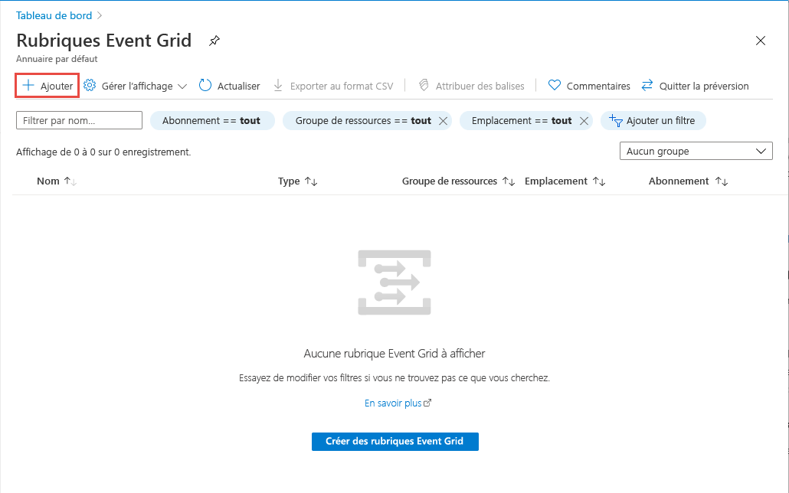
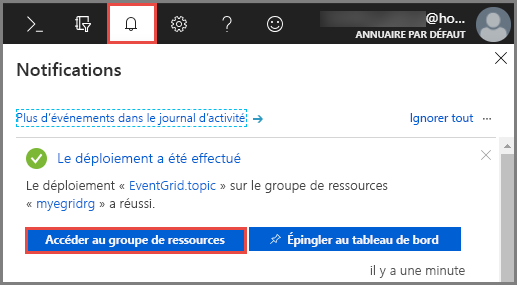
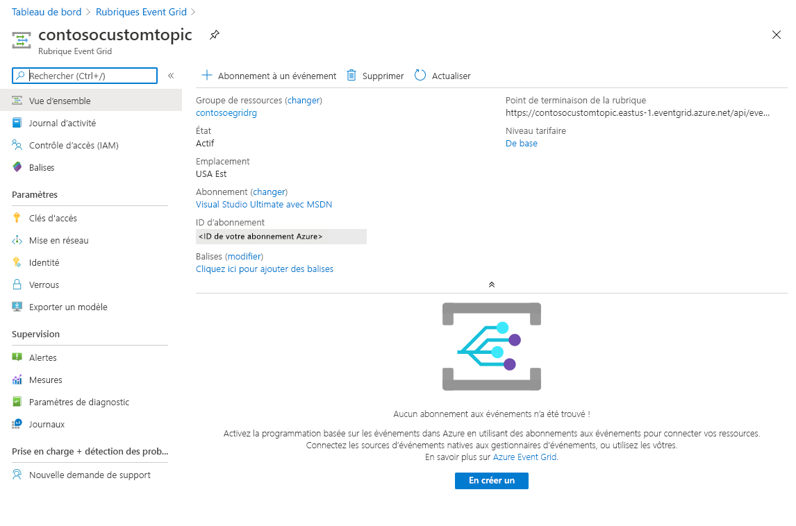
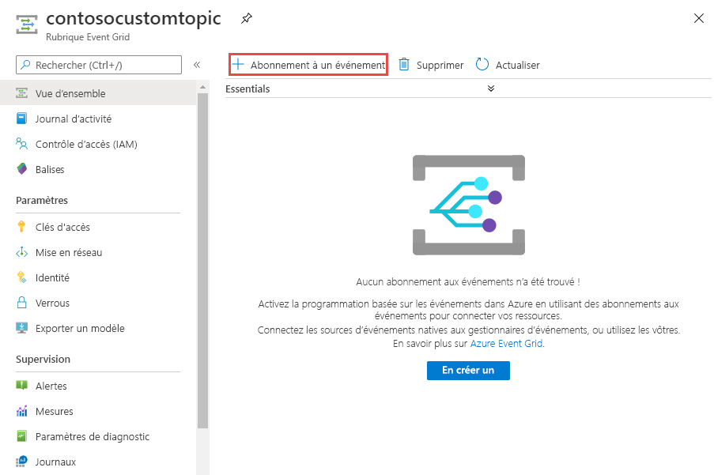
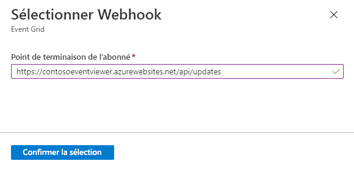

# <a name="quickstart-route-custom-events-to-web-endpoint-with-the-azure-portal-and-event-grid"></a>Démarrage rapide : Router des événements personnalisés vers un point de terminaison web avec le portail Azure et Event Grid

Azure Event Grid est un service de gestion d’événements pour le cloud. Dans cet article, vous utilisez le Portail Azure pour créer une rubrique personnalisée, vous abonner à cette rubrique et déclencher l’événement pour afficher le résultat. En règle générale, vous envoyez des événements à un point de terminaison qui traite les données d’événement et entreprend des actions. Toutefois, pour simplifier cet article, vous envoyez les événements à une application web qui collecte et affiche les messages.

Une fois que vous avez fini, vous voyez que les données d’événement ont été envoyées à l’application web.


[!INCLUDE [updated-for-az](../../includes/updated-for-az.md)]

[!INCLUDE [quickstarts-free-trial-note.md](../../includes/quickstarts-free-trial-note.md)]

[!INCLUDE [event-grid-register-provider-portal.md](../../includes/event-grid-register-provider-portal.md)]

## <a name="create-a-custom-topic"></a>Créer une rubrique personnalisée

Une rubrique de grille d’événement fournit un point de terminaison défini par l’utilisateur vers lequel vous envoyez vos événements. 

1. Connectez-vous au [portail Azure](https://portal.azure.com/).
2. Sélectionnez **Tous les services** dans le menu de navigation gauche, recherchez **Event Grid**, puis sélectionnez **Rubriques Event Grid**. 

    
3. Dans la page **Rubriques Event Grid**, sélectionnez **+ Ajouter** dans la barre d’outils. 

    
4. Dans la page **Créer une rubrique**, procédez comme suit :
    1. Donnez un **nom** unique à la rubrique personnalisée. Le nom de la rubrique doit être unique, car elle est représentée par une entrée DNS. N’utilisez pas le nom indiqué dans l’image. Au lieu de cela, créez votre propre nom : il doit comprendre entre 3 et 50 caractères, et contenir uniquement des valeurs a-z, A-Z, 0-9 et « - ».
    2. Sélectionnez votre **abonnement**Azure.
    3. Sélectionnez un groupe de ressources existant ou sélectionnez **Créer**, puis entrez un **nom** pour le **groupe de ressources**.
    4. Sélectionnez un **emplacement** pour la rubrique Event Grid.
    5. Conservez la valeur par défaut **Schéma Event Grid** pour le champ **Schéma d’événement**. 

       
    6. Sélectionnez **Créer**. 
5. Une fois la rubrique personnalisée créée, vous voyez la notification de réussite. Sélectionnez **Accéder au groupe de ressources**. 

   
6. Dans la page **Groupe de ressources**, sélectionnez la rubrique Event Grid. 

   
7. La page **Rubrique Event Grid** associée à votre grille d’événement apparaît. Ne fermez pas cette page. Vous l’utiliserez plus loin dans le guide de démarrage rapide. 

    

## <a name="create-a-message-endpoint"></a>Créer un point de terminaison de message
Avant de créer un abonnement pour la rubrique personnalisée, créez un point de terminaison pour le message d’événement. En règle générale, le point de terminaison entreprend des actions en fonction des données d’événement. Pour simplifier ce guide de démarrage rapide, déployez une [application web prédéfinie](https://github.com/Azure-Samples/azure-event-grid-viewer) qui affiche les messages d’événement. La solution déployée comprend un plan App Service, une offre App Service Web Apps et du code source en provenance de GitHub.

1. Dans la page de l’article, sélectionnez **Déployer sur Azure** pour déployer la solution sur votre abonnement. Dans le portail Azure, indiquez des valeurs pour les paramètres.

   <a href="https://portal.azure.com/#create/Microsoft.Template/uri/https%3A%2F%2Fraw.githubusercontent.com%2FAzure-Samples%2Fazure-event-grid-viewer%2Fmaster%2Fazuredeploy.json" target="_blank"></a>
1. Le déploiement peut prendre quelques minutes. Une fois le déploiement réussi, affichez votre application web pour vérifier qu’elle s’exécute. Dans un navigateur web, accédez à : `https://<your-site-name>.azurewebsites.net`
1. Vous voyez le site, mais aucun événement n’est encore posté sur celui-ci.

   

## <a name="subscribe-to-custom-topic"></a>S’abonner à une rubrique personnalisée

Vous vous abonnez à une rubrique Event Grid pour indiquer à Event Grid les événements qui vous intéressent, et où les envoyer.

1. Maintenant, dans la page **Rubrique Event Grid** de votre rubrique personnalisée, sélectionnez **+ Abonnement aux événements** sur la barre d’outils.

   
2. Dans la page **Créer un abonnement aux événements**, effectuez les étapes suivantes :
    1. Indiquez un **nom** pour l’abonnement aux événements.
    3. Sélectionnez **Webhook** pour **Type de point de terminaison**. 
    4. Choisissez **Sélectionner un point de terminaison**. 

       
    5. Pour le point de terminaison du webhook, indiquez l’URL de votre application web et ajoutez `api/updates` à l’URL de la page d’accueil. Sélectionnez **Confirmer la sélection**.

       
    6. Dans la page **Créer un abonnement aux événements**, sélectionnez **Créer**.

3. Affichez à nouveau votre application web, et notez qu’un événement de validation d’abonnement lui a été envoyé. Sélectionnez l’icône en forme d’œil pour développer les données d’événements. Event Grid envoie l’événement de validation pour que le point de terminaison puisse vérifier qu’il souhaite recevoir des données d’événement. L’application web inclut du code pour valider l’abonnement.

    

## <a name="send-an-event-to-your-topic"></a>Envoyer un événement à votre rubrique

Nous allons maintenant déclencher un événement pour voir comment Event Grid distribue le message à votre point de terminaison. Utilisez Azure CLI ou PowerShell pour envoyer un événement de test à votre rubrique personnalisée. En règle générale, une application ou un service Azure envoie les données d’événements.

Le premier exemple utilise Azure CLI. Il obtient l’URL et la clé de la rubrique personnalisée, ainsi que les exemples de données d’événements. Utilisez le nom de votre rubrique personnalisée pour `<topic name>`. Des exemples de données d’événement sont créés. L’élément `data` du fichier JSON est la charge utile de l’événement. N’importe quel fichier JSON bien construit peut être placé dans ce champ. Vous pouvez aussi utiliser le champ objet pour un routage et un filtrage avancés. CURL est un utilitaire qui envoie des requêtes HTTP.


### <a name="azure-cli"></a>Azure CLI
1. Dans le portail Azure, sélectionnez **Cloud Shell**. Sélectionnez **Bash** dans l’angle supérieur gauche de la fenêtre Cloud Shell. 

    
1. Exécutez la commande suivante afin d’obtenir le **point de terminaison** pour la rubrique : Après avoir copié et collé la commande, et avant de l’exécuter, mettez à jour le **nom de la rubrique** et le **nom du groupe de ressources**. 

    ```azurecli
    endpoint=$(az eventgrid topic show --name <topic name> -g <resource group name> --query "endpoint" --output tsv)
    ```
2. Exécutez la commande suivante afin d’obtenir la **clé** pour la rubrique personnalisée  : Après avoir copié et collé la commande, et avant de l’exécuter, mettez à jour le **nom de la rubrique** et le nom du **groupe de ressources**. 

    ```azurecli
    key=$(az eventgrid topic key list --name <topic name> -g <resource group name> --query "key1" --output tsv)
    ```
3. Copiez l’instruction suivante avec la définition de l’événement, puis appuyez sur **Entrée**. 

    ```json
    event='[ {"id": "'"$RANDOM"'", "eventType": "recordInserted", "subject": "myapp/vehicles/motorcycles", "eventTime": "'`date +%Y-%m-%dT%H:%M:%S%z`'", "data":{ "make": "Ducati", "model": "Monster"},"dataVersion": "1.0"} ]'
    ```
4. Exécutez la commande **Curl** suivante pour publier l’événement :

    ```
    curl -X POST -H "aeg-sas-key: $key" -d "$event" $endpoint
    ```

### <a name="azure-powershell"></a>Azure PowerShell
Le deuxième exemple utilise PowerShell pour effectuer des étapes similaires.

1. Dans le portail Azure, sélectionnez **Cloud Shell**. Sélectionnez **PowerShell** en haut à gauche de la fenêtre Cloud Shell. Consultez l’exemple d’image de fenêtre **Cloud Shell** dans la section Azure CLI. 
2. Exécutez la commande suivante afin d’obtenir le **point de terminaison** pour la rubrique : Après avoir copié et collé la commande, et avant de l’exécuter, mettez à jour le **nom de la rubrique** et le **nom du groupe de ressources**. 

    ```powershell
    $endpoint = (Get-AzEventGridTopic -ResourceGroupName <resource group name> -Name <topic name>).Endpoint
    ```
3. Exécutez la commande suivante afin d’obtenir la **clé** pour la rubrique personnalisée  : Après avoir copié et collé la commande, et avant de l’exécuter, mettez à jour le **nom de la rubrique** et le nom du **groupe de ressources**.

    ```powershell
    $keys = Get-AzEventGridTopicKey -ResourceGroupName gridResourceGroup -Name <topic name>
    ```
4. Préparez l’événement. Copiez et exécutez les instructions dans la fenêtre Cloud Shell. 

    ```azurepowershell
    $eventID = Get-Random 99999

    #Date format should be SortableDateTimePattern (ISO 8601)
    $eventDate = Get-Date -Format s

    #Construct body using Hashtable
    $htbody = @{
        id= $eventID
        eventType="recordInserted"
        subject="myapp/vehicles/motorcycles"
        eventTime= $eventDate   
        data= @{
            make="Ducati"
            model="Monster"
        }
        dataVersion="1.0"
    }
    
    #Use ConvertTo-Json to convert event body from Hashtable to JSON Object
    #Append square brackets to the converted JSON payload since they are expected in the event's JSON payload syntax
    $body = "["+(ConvertTo-Json $htbody)+"]"
    ```
5. Utilisez l’applet de commande **Invoke-WebRequest** pour envoyer l’événement. 

    ```powershell
    Invoke-WebRequest -Uri $endpoint -Method POST -Body $body -Headers @{"aeg-sas-key" = $keys.Key1}
    ```

### <a name="verify-in-the-event-grid-viewer"></a>Vérifier dans la visionneuse Event Grid
Vous avez déclenché l’événement, et Event Grid a envoyé le message au point de terminaison configuré lors de l’abonnement. Affichez votre application web pour voir l’événement que vous venez d’envoyer.

```json
{
  "id": "974",
  "eventType": "recordInserted",
  "subject": "myapp/vehicles/motorcycles",
  "eventTime": "2019-03-28T01:11:59+00:00",
  "data": {
    "make": "Ducati",
    "model": "Monster"
  },
  "dataVersion": "1.0",
  "metadataVersion": "1",
  "topic": "/subscriptions/11111111-1111-1111-1111-111111111111/resourceGroups/myegridrg/providers/Microsoft.EventGrid/topics/myegridtopic"
}
```

## <a name="clean-up-resources"></a>Supprimer des ressources
Si vous envisagez de continuer à utiliser cet événement, ne supprimez pas les ressources créées dans cet article. Dans le cas contraire, supprimez les ressources créées avec cet article.

1. Sélectionnez **Groupes de ressources** dans le menu de gauche. Si vous ne voyez pas cette option dans le menu de gauche, sélectionnez **Tous les services** dans ce menu, puis sélectionnez **Groupes de ressources**. 
2. Sélectionnez le groupe de ressources pour lancer la page **Groupe de ressources**. 
3. Sélectionnez **Supprimer le groupe de ressources** sur la barre d’outils. 
4. Confirmez la suppression en entrant le nom du groupe de ressources, puis sélectionnez **Supprimer**. 

    

    L’autre groupe de ressources que vous voyez dans l’image a été créé et utilisé par la fenêtre Cloud Shell. Supprimez-le si vous n’envisagez pas d’utiliser la fenêtre Cloud Shell. 

## <a name="next-steps"></a>Étapes suivantes

Maintenant que vous savez créer des rubriques et des abonnements d’événements personnalisés, vous pouvez en apprendre davantage sur Event Grid et ce qu’il peut vous offrir :

- [À propos d’Event Grid](overview.md)
- [Acheminer des événements de stockage Blob Azure vers un point de terminaison Web personnalisé ](../storage/blobs/storage-blob-event-quickstart.md?toc=%2fazure%2fevent-grid%2ftoc.json)
- [Surveiller les modifications d’une machine virtuelle avec Azure Event Grid et Azure Logic Apps](monitor-virtual-machine-changes-event-grid-logic-app.md)
- [Diffuser en continu des Big Data dans un entrepôt de données](event-grid-event-hubs-integration.md)
