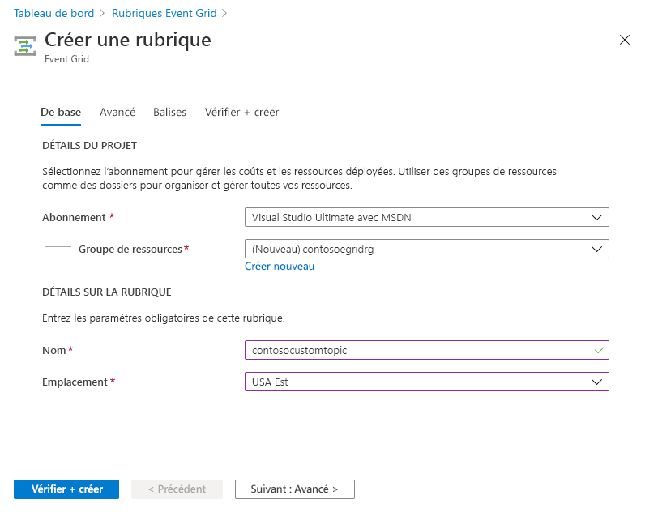
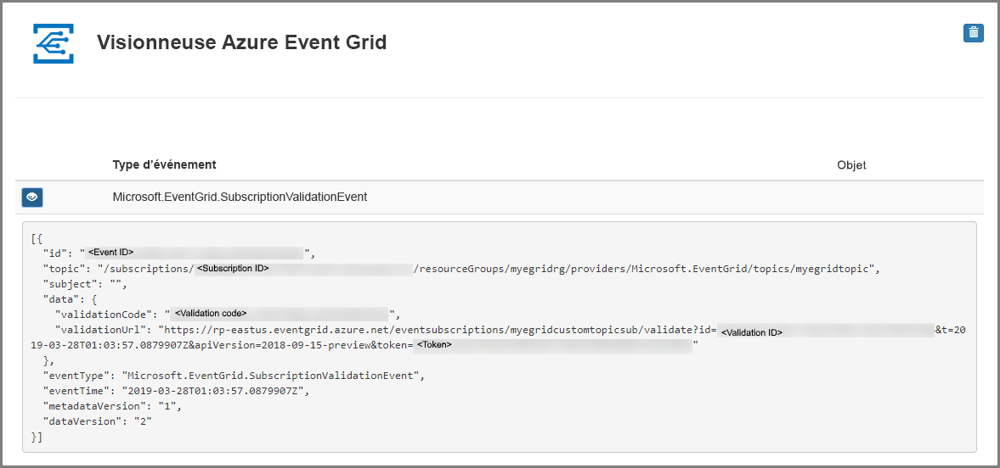

# <a name="quickstart-route-custom-events-to-web-endpoint-with-the-azure-portal-and-event-grid"></a>Démarrage rapide : Router des événements personnalisés vers un point de terminaison web avec le portail Azure et Event Grid

Azure Event Grid est un service de gestion d’événements pour le cloud. Dans cet article, vous utilisez le Portail Azure pour créer une rubrique personnalisée, vous abonner à cette rubrique et déclencher l’événement pour afficher le résultat. En règle générale, vous envoyez des événements à un point de terminaison qui traite les données d’événement et entreprend des actions. Toutefois, pour simplifier cet article, vous envoyez les événements à une application web qui collecte et affiche les messages.

Une fois que vous avez fini, vous voyez que les données d’événement ont été envoyées à l’application web.


[!INCLUDE [quickstarts-free-trial-note.md](../../includes/quickstarts-free-trial-note.md)]

[!INCLUDE [event-grid-register-provider-portal.md](../../includes/event-grid-register-provider-portal.md)]

## <a name="create-a-custom-topic"></a>Créer une rubrique personnalisée

Une rubrique de grille d’événement fournit un point de terminaison défini par l’utilisateur vers lequel vous envoyez vos événements. 

1. Connectez-vous au [portail Azure](https://portal.azure.com/).

1. Pour créer une rubrique personnalisée, sélectionnez **Créer une ressource**. 

   

1. Recherchez *Rubrique Event Grid* et sélectionnez l’option correspondante dans les options disponibles.

   

1. Sélectionnez **Créer**.

   

1. Donnez un nom unique à la rubrique personnalisée. Le nom de la rubrique doit être unique, car elle est représentée par une entrée DNS. N’utilisez pas le nom indiqué dans l’image. Au lieu de cela, créez votre propre nom : il doit comprendre entre 3 et 50 caractères, et contenir uniquement des valeurs a-z, A-Z, 0-9 et « - ». Fournissez un nom pour le groupe de ressources. Sélectionnez **Créer**.

   

1. Une fois la rubrique personnalisée créée, vous voyez la notification de réussite.

   

   Si le déploiement a échoué, trouvez ce qui a provoqué l’erreur. Sélectionnez **Échec du déploiement**.

   

   Sélectionnez le message d’erreur.

   

   L’illustration suivante montre un déploiement ayant échoué du fait que le nom de la rubrique personnalisée est déjà utilisé. Si vous voyez cette erreur, réessayez le déploiement avec un nom différent.

   

## <a name="create-a-message-endpoint"></a>Créer un point de terminaison de message

Avant de nous abonner à la rubrique personnalisée, nous allons créer le point de terminaison pour le message de l’événement. En règle générale, le point de terminaison entreprend des actions en fonction des données d’événement. Pour simplifier ce guide de démarrage rapide, déployez une [application web prédéfinie](https://github.com/Azure-Samples/azure-event-grid-viewer) qui affiche les messages d’événement. La solution déployée comprend un plan App Service, une offre App Service Web Apps et du code source en provenance de GitHub.

1. Sélectionnez **Déployer sur Azure** pour déployer la solution sur votre abonnement. Dans le portail Azure, indiquez des valeurs pour les paramètres.

   <a href="https://portal.azure.com/#create/Microsoft.Template/uri/https%3A%2F%2Fraw.githubusercontent.com%2FAzure-Samples%2Fazure-event-grid-viewer%2Fmaster%2Fazuredeploy.json" target="_blank"></a>

1. Le déploiement peut prendre quelques minutes. Une fois le déploiement réussi, affichez votre application web pour vérifier qu’elle s’exécute. Dans un navigateur web, accédez à : `https://<your-site-name>.azurewebsites.net`

1. Vous voyez le site, mais aucun événement n’est encore posté sur celui-ci.

   

## <a name="subscribe-to-custom-topic"></a>S’abonner à une rubrique personnalisée

Vous vous abonnez à une rubrique Event Grid pour indiquer à Event Grid les événements qui vous intéressent, et où les envoyer.

1. Dans le portail, sélectionnez votre rubrique personnalisée.

   

1. Sélectionnez **+ Abonnement aux événements**.

   

1. Sélectionnez **Webhook** pour le type de point de terminaison. Indiquez un nom pour l’abonnement à un événement.

   

1. Choisissez **Sélectionner un point de terminaison**. 

1. Pour le point de terminaison du webhook, indiquez l’URL de votre application web et ajoutez `api/updates` à l’URL de la page d’accueil. Sélectionnez **Confirmer la sélection**.

   

1. Lorsque vous avez fourni les valeurs d’abonnement à l’événement, sélectionnez **Créer**.

Affichez à nouveau votre application web, et notez qu’un événement de validation d’abonnement lui a été envoyé. Sélectionnez l’icône en forme d’œil pour développer les données d’événements. Event Grid envoie l’événement de validation pour que le point de terminaison puisse vérifier qu’il souhaite recevoir des données d’événement. L’application web inclut du code pour valider l’abonnement.



## <a name="send-an-event-to-your-topic"></a>Envoyer un événement à votre rubrique

Nous allons maintenant déclencher un événement pour voir comment Event Grid distribue le message à votre point de terminaison. Utilisez Azure CLI ou PowerShell pour envoyer un événement de test à votre rubrique personnalisée. En règle générale, une application ou un service Azure envoie les données d’événements.

Le premier exemple utilise Azure CLI. Il obtient l’URL et la clé de la rubrique personnalisée, ainsi que les exemples de données d’événements. Utilisez le nom de votre rubrique personnalisée pour `<topic_name>`. Des exemples de données d’événement sont créés. L’élément `data` du fichier JSON est la charge utile de l’événement. N’importe quel fichier JSON bien construit peut être placé dans ce champ. Vous pouvez aussi utiliser le champ objet pour un routage et un filtrage avancés. CURL est un utilitaire qui envoie des requêtes HTTP.

```azurecli-interactive
endpoint=$(az eventgrid topic show --name <topic_name> -g myResourceGroup --query "endpoint" --output tsv)
key=$(az eventgrid topic key list --name <topic_name> -g myResourceGroup --query "key1" --output tsv)

event='[ {"id": "'"$RANDOM"'", "eventType": "recordInserted", "subject": "myapp/vehicles/motorcycles", "eventTime": "'`date +%Y-%m-%dT%H:%M:%S%z`'", "data":{ "make": "Ducati", "model": "Monster"},"dataVersion": "1.0"} ]'

curl -X POST -H "aeg-sas-key: $key" -d "$event" $endpoint
```

Le deuxième exemple utilise PowerShell pour effectuer des étapes similaires.

```azurepowershell-interactive
$endpoint = (Get-AzureRmEventGridTopic -ResourceGroupName gridResourceGroup -Name <topic-name>).Endpoint
$keys = Get-AzureRmEventGridTopicKey -ResourceGroupName gridResourceGroup -Name <topic-name>

$eventID = Get-Random 99999

#Date format should be SortableDateTimePattern (ISO 8601)
$eventDate = Get-Date -Format s

#Construct body using Hashtable
$htbody = @{
    id= $eventID
    eventType="recordInserted"
    subject="myapp/vehicles/motorcycles"
    eventTime= $eventDate   
    data= @{
        make="Ducati"
        model="Monster"
    }
    dataVersion="1.0"
}

#Use ConvertTo-Json to convert event body from Hashtable to JSON Object
#Append square brackets to the converted JSON payload since they are expected in the event's JSON payload syntax
$body = "["+(ConvertTo-Json $htbody)+"]"

Invoke-WebRequest -Uri $endpoint -Method POST -Body $body -Headers @{"aeg-sas-key" = $keys.Key1}
```

Vous avez déclenché l’événement, et Event Grid a envoyé le message au point de terminaison configuré lors de l’abonnement. Affichez votre application web pour voir l’événement que vous venez d’envoyer.

```json
[{
  "id": "1807",
  "eventType": "recordInserted",
  "subject": "myapp/vehicles/motorcycles",
  "eventTime": "2017-08-10T21:03:07+00:00",
  "data": {
    "make": "Ducati",
    "model": "Monster"
  },
  "dataVersion": "1.0",
  "metadataVersion": "1",
  "topic": "/subscriptions/{subscription-id}/resourceGroups/{resource-group}/providers/Microsoft.EventGrid/topics/{topic}"
}]
```


## <a name="clean-up-resources"></a>Supprimer des ressources

Si vous envisagez de continuer à utiliser cet événement, ne supprimez pas les ressources créées dans cet article. Dans le cas contraire, supprimez les ressources créées avec cet article.

Sélectionnez le groupe de ressources, puis **Supprimer le groupe de ressources**.

## <a name="next-steps"></a>Étapes suivantes

Maintenant que vous savez créer des rubriques et des abonnements d’événements personnalisés, vous pouvez en apprendre davantage sur Event Grid et ce qu’il peut vous offrir :

- [À propos d’Event Grid](overview.md)
- [Acheminer des événements de stockage Blob Azure vers un point de terminaison Web personnalisé ](../storage/blobs/storage-blob-event-quickstart.md?toc=%2fazure%2fevent-grid%2ftoc.json)
- [Surveiller les modifications d’une machine virtuelle avec Azure Event Grid et Azure Logic Apps](monitor-virtual-machine-changes-event-grid-logic-app.md)
- [Diffuser en continu des Big Data dans un entrepôt de données](event-grid-event-hubs-integration.md)
