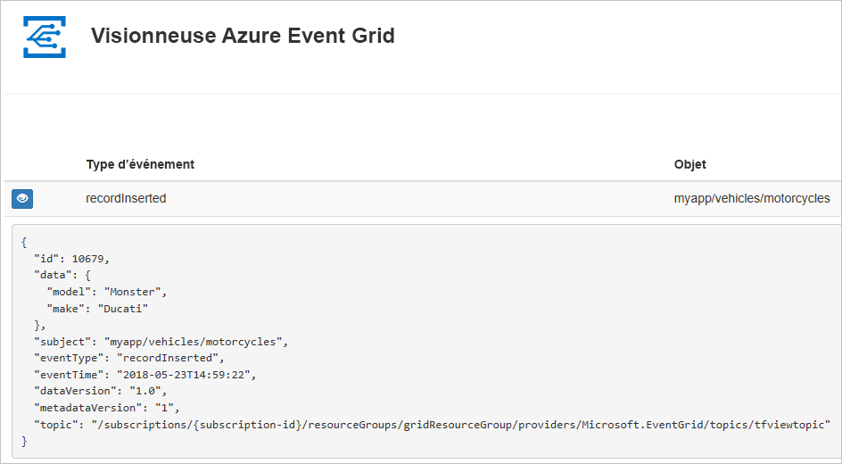
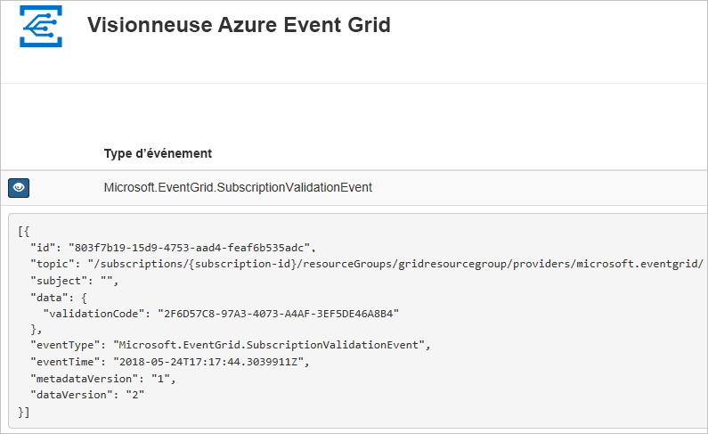

# <a name="quickstart-route-custom-events-to-web-endpoint-with-azure-cli-and-event-grid"></a>Démarrage rapide : Router des événements personnalisés vers un point de terminaison web avec Azure CLI et Event Grid

Azure Event Grid est un service de gestion d’événements pour le cloud. Dans cet article, vous utilisez l’interface de ligne de commande Azure pour créer une rubrique personnalisée, vous abonner à cette rubrique personnalisée et déclencher l’événement pour afficher le résultat.

En règle générale, vous envoyez des événements à un point de terminaison qui traite les données d’événement et entreprend des actions. Toutefois, pour simplifier cet article, vous envoyez les événements à une application web qui collecte et affiche les messages.

Une fois que vous avez fini, vous voyez que les données d’événement ont été envoyées à l’application web.



[!INCLUDE [quickstarts-free-trial-note.md](../../includes/quickstarts-free-trial-note.md)]

[!INCLUDE [cloud-shell-try-it.md](../../includes/cloud-shell-try-it.md)]

Si vous choisissez d’installer et d’utiliser l’interface de ligne de commande localement, cet article nécessite l’exécution de la version la plus récente d’Azure CLI (2.0.70 ou ultérieure). Pour connaître la version de l’interface, exécutez `az --version`. Si vous devez installer ou mettre à niveau, voir [Installer Azure CLI](/cli/azure/install-azure-cli).

Si vous n’utilisez pas Cloud Shell, vous devez d’abord vous connecter à l’aide de `az login`.

## <a name="create-a-resource-group"></a>Créer un groupe de ressources

Les rubriques Event Grid sont des ressources Azure et doivent être placées dans un groupe de ressources Azure. Un groupe de ressources est une collection logique dans laquelle des ressources Azure sont déployées et gérées.

Créez un groupe de ressources avec la commande [az group create](/cli/azure/group#az-group-create). 

L’exemple suivant crée un groupe de ressources nommé *gridResourceGroup* à l’emplacement *westus2*.

```azurecli-interactive
az group create --name gridResourceGroup --location westus2
```

[!INCLUDE [event-grid-register-provider-cli.md](../../includes/event-grid-register-provider-cli.md)]

## <a name="create-a-custom-topic"></a>Créer une rubrique personnalisée

Une rubrique de grille d’événement fournit un point de terminaison défini par l’utilisateur vers lequel vous envoyez vos événements. L’exemple suivant permet de créer la rubrique personnalisée dans votre groupe de ressources. Remplacez `<your-topic-name>` par un nom unique pour votre rubrique. Le nom de la rubrique personnalisée doit être unique, car il fait partie de l’entrée DNS. De plus, il doit comprendre entre 3 et 50 caractères, et contenir uniquement des valeurs a-z, A-Z, 0-9 et « - »

```azurecli-interactive
topicname=<your-topic-name>

az eventgrid topic create --name $topicname -l westus2 -g gridResourceGroup
```

## <a name="create-a-message-endpoint"></a>Créer un point de terminaison de message

Avant de nous abonner à la rubrique personnalisée, nous allons créer le point de terminaison pour le message de l’événement. En règle générale, le point de terminaison entreprend des actions en fonction des données d’événement. Pour simplifier ce guide de démarrage rapide, déployez une [application web prédéfinie](https://github.com/Azure-Samples/azure-event-grid-viewer) qui affiche les messages d’événement. La solution déployée comprend un plan App Service, une offre App Service Web Apps et du code source en provenance de GitHub.

Remplacez `<your-site-name>` par un nom unique pour votre application web. Le nom de l’application web doit être unique, car il fait partie de l’entrée DNS.

```azurecli-interactive
sitename=<your-site-name>

az group deployment create \
  --resource-group gridResourceGroup \
  --template-uri "https://raw.githubusercontent.com/Azure-Samples/azure-event-grid-viewer/master/azuredeploy.json" \
  --parameters siteName=$sitename hostingPlanName=viewerhost
```

Le déploiement peut prendre quelques minutes. Une fois le déploiement réussi, affichez votre application web pour vérifier qu’elle s’exécute. Dans un navigateur web, accédez à : `https://<your-site-name>.azurewebsites.net`

Vous devez voir le site sans messages affichés.

## <a name="subscribe-to-a-custom-topic"></a>S’abonner à une rubrique personnalisée

Vous vous abonnez à une rubrique Event Grid pour indiquer à Event Grid les événements qui vous intéressent, et où les envoyer. L’exemple suivant s’abonne à la rubrique personnalisée que vous avez créée et transmet l’URL à partir de votre application web en tant que point de terminaison de la notification d’événement.

Le point de terminaison de votre application web doit inclure le suffixe `/api/updates/`.

```azurecli-interactive
endpoint=https://$sitename.azurewebsites.net/api/updates

az eventgrid event-subscription create \
  --source-resource-id "/subscriptions/{subscription-id}/resourceGroups/{resource-group}/providers/Microsoft.EventGrid/topics/$topicname" 
  --name demoViewerSub 
  --endpoint $endpoint
  
```

Affichez à nouveau votre application web, et notez qu’un événement de validation d’abonnement lui a été envoyé. Sélectionnez l’icône en forme d’œil pour développer les données d’événements. Event Grid envoie l’événement de validation pour que le point de terminaison puisse vérifier qu’il souhaite recevoir des données d’événement. L’application web inclut du code pour valider l’abonnement.




## <a name="send-an-event-to-your-custom-topic"></a>Envoyer un événement à votre rubrique personnalisée

Nous allons maintenant déclencher un événement pour voir comment Event Grid distribue le message à votre point de terminaison. Tout d’abord, il nous faut l’URL et la clé de la rubrique personnalisée.

```azurecli-interactive
endpoint=$(az eventgrid topic show --name $topicname -g gridResourceGroup --query "endpoint" --output tsv)
key=$(az eventgrid topic key list --name $topicname -g gridResourceGroup --query "key1" --output tsv)
```

Pour simplifier cet article, vous allez utiliser des exemples de données d’événements à envoyer à la rubrique personnalisée. En règle générale, une application ou un service Azure envoie les données d’événements. L’exemple suivant crée des exemples de données d’événements :

```azurecli-interactive
event='[ {"id": "'"$RANDOM"'", "eventType": "recordInserted", "subject": "myapp/vehicles/motorcycles", "eventTime": "'`date +%Y-%m-%dT%H:%M:%S%z`'", "data":{ "make": "Ducati", "model": "Monster"},"dataVersion": "1.0"} ]'
```

L’élément `data` du fichier JSON est la charge utile de l’événement. N’importe quel fichier JSON bien construit peut être placé dans ce champ. Vous pouvez aussi utiliser le champ objet pour un routage et un filtrage avancés.

CURL est un utilitaire qui envoie des requêtes HTTP. Dans cet article, utilisez CURL pour envoyer l’événement à la rubrique. 

```azurecli-interactive
curl -X POST -H "aeg-sas-key: $key" -d "$event" $endpoint
```

Vous avez déclenché l’événement, et Event Grid a envoyé le message au point de terminaison configuré lors de l’abonnement. Affichez votre application web pour voir l’événement que vous venez d’envoyer.

```json
[{
  "id": "1807",
  "eventType": "recordInserted",
  "subject": "myapp/vehicles/motorcycles",
  "eventTime": "2017-08-10T21:03:07+00:00",
  "data": {
    "make": "Ducati",
    "model": "Monster"
  },
  "dataVersion": "1.0",
  "metadataVersion": "1",
  "topic": "/subscriptions/{subscription-id}/resourceGroups/{resource-group}/providers/Microsoft.EventGrid/topics/{topic}"
}]
```

## <a name="clean-up-resources"></a>Nettoyer les ressources
Si vous envisagez de continuer à utiliser cet événement ou l’application de visionnage d’évènement, ne supprimez pas les ressources créées dans cet article. Sinon, utilisez la commande suivante pour supprimer les ressources créées dans cet article.

```azurecli-interactive
az group delete --name gridResourceGroup
```

## <a name="next-steps"></a>Étapes suivantes

Maintenant que vous savez créer des rubriques et des abonnements d’événements, vous pouvez en apprendre davantage sur Event Grid et ce qu’il peut vous offrir :

- [À propos d’Event Grid](overview.md)
- [Acheminer des événements de stockage Blob Azure vers un point de terminaison Web personnalisé ](../storage/blobs/storage-blob-event-quickstart.md?toc=%2fazure%2fevent-grid%2ftoc.json)
- [Surveiller les modifications d’une machine virtuelle avec Azure Event Grid et Azure Logic Apps](monitor-virtual-machine-changes-event-grid-logic-app.md)
- [Diffuser en continu des Big Data dans un entrepôt de données](event-grid-event-hubs-integration.md)
