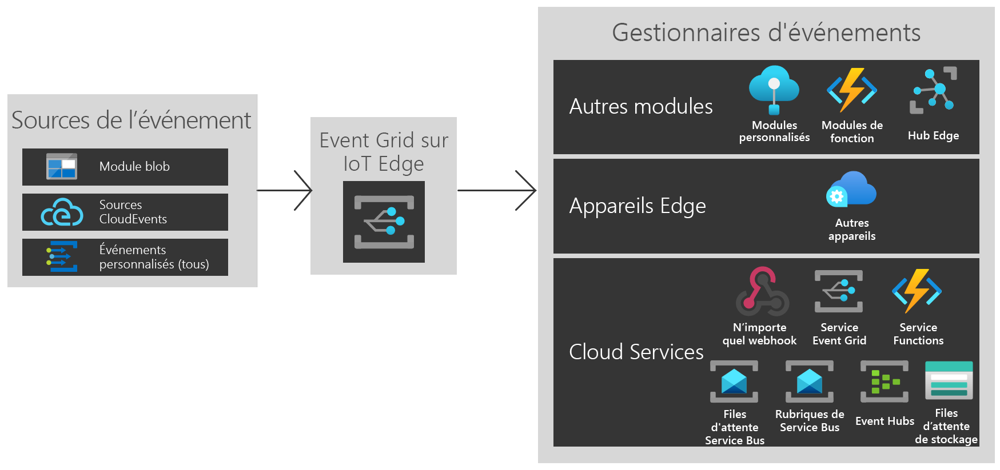

# Qu'est-ce qu'Azure Event Grid sur Azure IoT Edge ?
Event Grid sur IoT Edge apporte la puissance et la flexibilité d’Azure Event Grid à la périphérie. Créez des rubriques, publiez des événements et abonnez-vous à différentes destinations, qu'il s'agisse de modules situés sur le même appareil, d'autres appareils de périmètre ou de services cloud.

Comme dans le cloud, le module Event Grid sur IoT Edge gère le routage, le filtrage et la fiabilité de la livraison des événements à grande échelle. Utilisez des filtres de chaîne, des filtres numériques et des filtres booléens avancés pour veiller à ce que seuls les événements pertinents soient envoyés aux différents gestionnaires d'événements. Grâce à la logique de nouvelle tentative, vous êtes certain que l’événement atteindra la destination cible, même s’il n’est pas disponible au moment de la publication. Celle-ci vous permet de bénéficier du puissant mécanisme de stockage et de transfert que constitue Event Grid sur IoT Edge.

Event Grid sur IoT Edge prend à la fois en charge CloudEvents v1.0 et les schémas d'événements personnalisés. Il prend également en charge la même sémantique Pub/Sub qu’Event Grid dans le cloud pour faciliter l’interopérabilité.

Cet article fournit une vue d'ensemble d'Azure Event Grid sur IoT Edge. Pour obtenir des instructions pas à pas sur l'utilisation de ce module en périphérie, consultez [Publier, s'abonner à des événements localement](pub-sub-events-webhook-local.md). 

Cette image illustre quelques-unes des utilisations d'Event Grid sur IoT Edge. Il ne s'agit pas d'une liste exhaustive des fonctionnalités prises en charge.

## Quand utiliser Event Grid sur IoT Edge ?

Event Grid sur IoT Edge fournit un modèle de création d’événements fiable et facile à utiliser entre la périphérie et le cloud.

Event Grid sur IoT Edge repose sur une surface d'exposition symétrique par rapport au service cloud Azure. Vous pouvez donc utiliser les mêmes événements et les mêmes appels d'API partout où vous en avez besoin. Quel que soit votre scénario de publication/abonnement (dans le cloud, en périphérie ou entre les deux), Event Grid sur IoT Edge peut désormais constituer votre unique solution.

Utilisez Event Grid sur IoT Edge pour déclencher des workflows simples entre les modules. Par exemple, créez une rubrique et publiez les événements « créés dans Storage Blob » de votre module de stockage vers la rubrique. Vous pouvez alors abonner les fonctions ou modules personnalisés de votre choix à ces rubriques.

Étendez vos fonctionnalités entre les appareils de périmètre. Si vous publiez des événements de module blob et que vous souhaitez utiliser la puissance de calcul de plusieurs appareils de périmètre voisins, créez des abonnements inter-appareils.

Enfin, connectez-vous au cloud. Si vos événements de module blob nécessitent une synchronisation périodique avec le cloud, utilisez le plus grand calcul disponible sur le cloud, ou envoyez les données traitées, et créez des abonnements à des services cloud supplémentaires.

Event Grid sur IoT Edge offre une architecture d'événement découplée flexible et fiable.

## Sources d’événement

Comme dans le cloud, Event Grid sur IoT Edge permet une intégration directe entre les modules afin de créer des architectures orientées événements. Actuellement, les événements peuvent être envoyés à Event Grid sur IoT Edge à partir de :

* Stockage d’objets Blob Azure sur IoT Edge
* Sources CloudEvents
* Modules et conteneurs personnalisés via HTTP POST

## Gestionnaires d’événements

Event Grid sur IoT Edge est conçu pour vous permettre d'envoyer des événements où vous le souhaitez. Les destinations actuellement prises en charge sont les suivantes :

* Autres modules, comme IoT Hub, les fonctions et les modules personnalisés
* Autres appareils de périmètre
* WebHooks
* Service cloud Azure Event Grid
* Event Hubs
* Files d'attente Service Bus
* Rubriques de Service Bus
* Files d’attente de stockage

## Environnements pris en charge
Les environnements actuellement pris en charge sont les suivants : Windows 64 bits, Linux 64 bits et ARM 32 bits.

## Concepts

Azure Event Grid comporte cinq concepts qui vous permettent de démarrer :

* **Événements** : ce qu'il s'est passé.
* **Sources des événements** : où l'événement a eu lieu.
* **Rubriques** : point de terminaison où les serveurs de publication envoient les événements.
* **Abonnements aux événements** : point de terminaison ou mécanisme intégré permettant d'acheminer les événements, parfois vers plusieurs gestionnaires. Les abonnements sont également utilisés par des gestionnaires pour filtrer intelligemment les événements entrants.
* **Gestionnaires d'événements** : application ou service réagissant à l'événement.

## Coût

Event Grid sur IoT Edge est gratuit pendant la phase de préversion publique.

## Problèmes
Signalez les problèmes liés à l'utilisation d'Event Grid sur IoT Edge sur [https://github.com/Azure/event-grid-iot-edge/issues](https://github.com/Azure/event-grid-iot-edge/issues).

## Étapes suivantes

* [Publier, s'abonner à des événements localement](pub-sub-events-webhook-local.md)
* [Publier, s'abonner à des événements dans le cloud](pub-sub-events-webhook-cloud.md)
* [Transférer des événements vers le cloud Event Grid](forward-events-event-grid-cloud.md)
* [Transférer des événements vers IoT Hub](forward-events-iothub.md)
* [Réagir à des événements Storage Blob localement](react-blob-storage-events-locally.md)