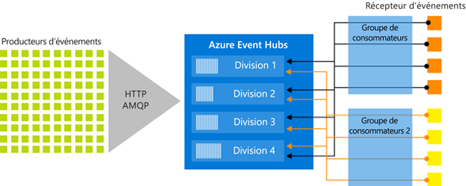

# Nouveautés des concentrateurs d'événements Azure ?

Azure Event Hubs est une plateforme de diffusion de données volumineuses et un service d’ingestion d’événements, capable de recevoir et de traiter des millions d’événements par seconde. Les concentrateurs d’événements peuvent traiter et stocker des événements, des données ou la télémétrie produits par des logiciels et appareils distribués. Les données envoyées à un concentrateur d’événements peuvent être transformées et stockées à l’aide d’adaptateurs de traitement par lot/stockage ou d’un fournisseur d’analyse en temps réel. 

Event Hubs est utilisé dans quelques-uns des scénarios courants suivants :

- Détection d’anomalies (fraude/valeurs hors norme)
- Journalisation des applications
- Pipelines d’analyse, comme les parcours de visite
- Tableaux de bord en temps réel
- Archivage des données
- Traitement des transactions
- Traitement des données de télémétrie utilisateur
- Diffusion en continu de télémétrie d’appareil 

## Pourquoi utiliser Azure Event Hubs ?

Les données ne sont importantes que lorsqu’il y a une manière facile de les traiter et d’obtenir des insights en temps voulu de sources de données. Event Hubs fournit une plateforme de traitement de flux de données distribuées avec une latence faible et une intégration fluide, avec des services d’analyses et des données dans et hors d’Azure pour créer un pipeline Big Data complet.

Event Hubs représente la « porte d’entrée » pour un pipeline d’événements, parfois qualifié de service de *réception d’événements* dans des architectures de solution. Un service de réception d'événements est un composant ou service qui se trouve entre les éditeurs d'événements et les consommateurs d'événements pour dissocier la production d'un flux d'événements de leur consommation. Event Hubs fournit une plateforme de diffusion en continu unifiée, avec mise en mémoire tampon avec durée de rétention, en séparant les producteurs d’événements des consommateurs d'événements. 

Les sections suivantes décrivent les fonctionnalités clés du service Azure Event Hubs : 

## PaaS intégralement gérée 

Event Hubs est un service géré avec peu de configuration ou de gestion. Vous pouvez ainsi vous concentrer sur vos solutions d’entreprise. [Event Hubs pour les écosystèmes d’Apache Kafka](event-hubs-for-kafka-ecosystem-overview.md) vous offre l’expérience de PaaS Kafka sans avoir à gérer, configurer ou exécuter vos clusters.

## Prise en charge d’un traitement par lots et en temps réel

Ingérez, mettez en mémoire tampon, stockez et traitez votre flux en temps réel pour obtenir des insights actionnables. Event Hubs utilise un [modèle de consommateur partitionné](event-hubs-features.md#partitions), qui permet à plusieurs applications de traiter le flux de données en même temps, ce qui vous laisse ainsi le contrôle sur la vélocité du traitement.

[Capturez](event-hubs-capture-overview.md) vos données presque en temps réel dans un [stockage d'objets blob Azure](https://azure.microsoft.com/services/storage/blobs/) ou dans [Azure Data Lake Store](https://azure.microsoft.com/services/data-lake-store/)  pour une durée de rétention à long terme ou un traitement par lots court. Vous pouvez faire cela sur le même flux que vous utilisez pour la dérivation d’analyses en temps réel. La configuration de l’outil Capture est rapide : il n’existe aucun coût d’administration pour son exécution et il s’adapte automatiquement à vos  [unités de débit](event-hubs-features.md#throughput-units) Event Hubs. Grâce à Event Hubs Capture, vous pouvez vous concentrer sur le traitement des données, plutôt que sur leur capture.

Azure Event Hubs s’intègre aussi avec [Azure Functions](/azure/azure-functions/) pour une architecture sans serveur.

## Évolutif 

Avec Event Hubs, vous pouvez commencer avec des flux de données en mégaoctets et passer à des gigaoctets ou téraoctets. La fonctionnalité de [majoration automatique](event-hubs-auto-inflate.md) est une des nombreuses options disponibles pour mettre à l'échelle le nombre d’unités de débit et ainsi répondre à vos besoins d’utilisation. 

## Écosystème riche

[Event Hubs pour les écosystèmes d’Apache Kafka](event-hubs-for-kafka-ecosystem-overview.md) permet aux clients et applications [Apache Kafka (1.0 et versions ultérieures)](https://kafka.apache.org/) de communiquer avec Event Hubs sans avoir à gérer tous les clusters.
 
Avec un vaste écosystème disponible dans différents [langages (.NET, Java, Python, Go, Node.js)](https://github.com/Azure/azure-event-hubs), vous pouvez facilement lancer le traitement de vos flux en provenance d’Event Hubs. Tous les langages client pris en charge fournissent une intégration de faible niveau.

## Composants clés de l’architecture

Cette solution fournit une fonctionnalité de gestion du flux de messages mais présente des caractéristiques différentes de la messagerie d’entreprise traditionnelle. Ses fonctionnalités reposent sur des scénarios de traitement des événements et un débit élevé. Les concentrateurs d’événements incluent les [éléments clés suivants](event-hubs-features.md) :

- **Producteurs d’événements** : entité qui envoie des données à un concentrateur d’événements. Les éditeurs d’événements peuvent publier des événements à l’aide du protocole HTTPS ou AMQP 1.0 ou Apache Kafka (1.0 et plus récent).
- **Partition** : chaque consommateur lit uniquement un sous-ensemble spécifique (partition) du flux de messages.
- **Groupes de consommateurs** : une vue (état, position ou décalage) d’un concentrateur d’événements dans sa totalité. Les groupes de consommateurs permettent à plusieurs applications consommatrices d'avoir chacune une vue distincte du flux d'événements et de lire le flux indépendamment à leur propre rythme et avec leurs propres décalages.
- **Unités de débit** : unités de capacité qui contrôlent la capacité de débit d’Event Hubs, achetées préalablement.
- **Récepteurs d’événements** : entité qui lit des données d’événement à partir d’un concentrateur d’événements. Tous les consommateurs Azure Event Hubs se connectent par le biais de la session AMQP 1.0 ; les événements sont remis par le biais de cette session dès qu’ils sont disponibles.

La figure suivante montre l’architecture de traitement de flux Event Hubs :

## Étapes suivantes

Pour prendre en main Event Hubs, consultez les articles suivants :

* [Ingestion dans Event Hubs](event-hubs-quickstart-powershell.md)
* [Vue d’ensemble des fonctionnalités des concentrateurs d’événements](event-hubs-features.md)

