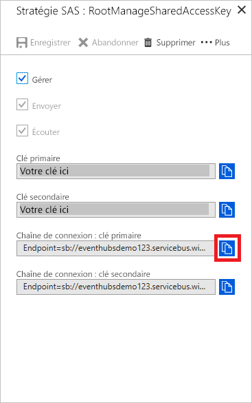

# Créer un espace de noms Azure Event Hubs prenant en charge Apache Kafka

Azure Event Hubs est une plateforme PaaS (Platform as a Service) de streaming de Big Data qui ingère des millions d’événements par seconde et fournit un haut débit ainsi qu’une faible latence pour une analytique et une visualisation en temps réel.

Azure Event Hubs offre un point de terminaison Kafka. Ce point de terminaison permet à votre espace de noms Event Hubs de comprendre de manière native le protocole de message et les API [Apache Kafka](https://kafka.apache.org/intro). Cette fonctionnalité vous permet de communiquer avec vos hubs d’événements comme avec les rubriques Kafka sans changer vos clients de protocole ni exécuter vos propres clusters. Event Hubs prend en charge [Apache Kafka versions 1.0](https://kafka.apache.org/10/documentation.html) et ultérieures.

Cet article explique comment créer un espace de noms Event Hubs et obtenir la chaîne de connexion requise pour connecter des applications Kafka à des hubs d’événements prenant en charge Kafka.

## Conditions préalables

Si vous n’avez pas d’abonnement Azure, créez un [compte gratuit](https://azure.microsoft.com/free/?ref=microsoft.com&utm_source=microsoft.com&utm_medium=docs&utm_campaign=visualstudio) avant de commencer.

## Créer un espace de noms Event Hubs prenant en charge Kafka

1. Connectez-vous au [portail Azure][Azure portal], puis cliquez sur **Créer une ressource** en haut à gauche de l’écran.

2. Recherchez Event Hubs et sélectionnez les options indiquées ici :
    
    
 
3. Spécifiez un nom unique et activez Kafka sur l’espace de noms. Cliquez sur **Créer**.
    
    
 
4. Une fois l’espace de noms créé, sous l’onglet **Paramètres**, cliquez sur **Stratégies d’accès partagé** pour obtenir la chaîne de connexion.

    

5. Vous pouvez choisir **RootManageSharedAccessKey** par défaut ou ajouter une nouvelle stratégie. Cliquez sur le nom de la stratégie et copiez la chaîne de connexion. 
    
    
 
6. Ajoutez cette chaîne de connexion à la configuration de votre application Kafka.

Vous pouvez désormais diffuser des événements à partir de vos applications qui utilisent le protocole Kafka dans Event Hubs.

## Étapes suivantes

Pour en savoir plus les hubs d’événements, consultez ces liens :

* [Diffuser dans Event Hubs à partir de vos applications Kafka](event-hubs-quickstart-kafka-enabled-event-hubs.md)
* [En savoir plus sur Event Hubs pour Kafka](event-hubs-for-kafka-ecosystem-overview.md)
* [En savoir plus sur Event Hubs](event-hubs-what-is-event-hubs.md)

[Azure portal]: https://portal.azure.com/
