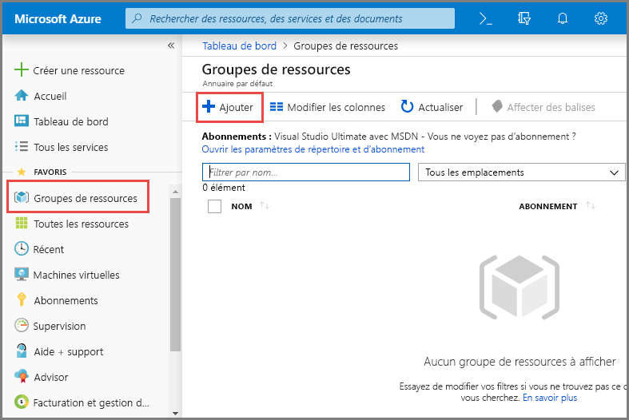
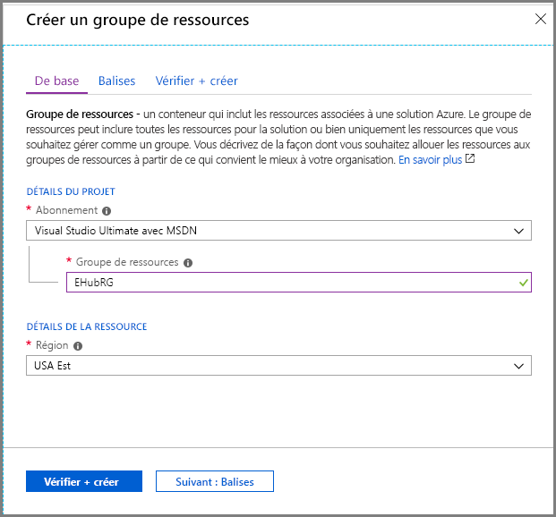
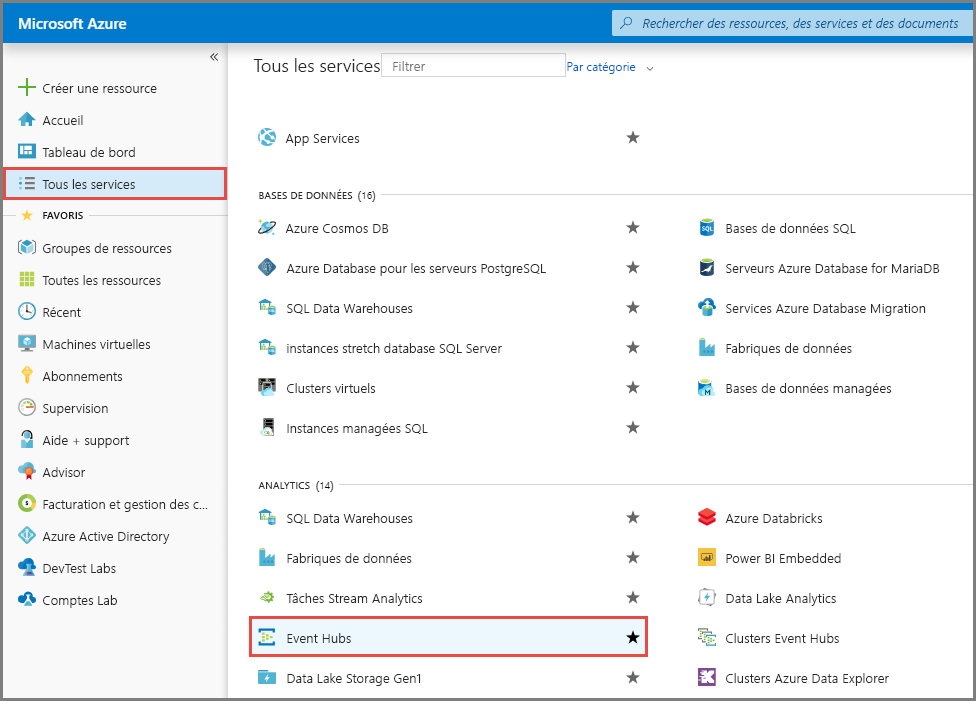
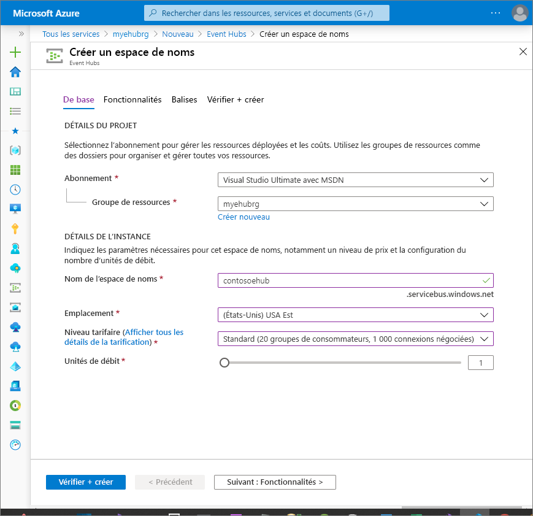
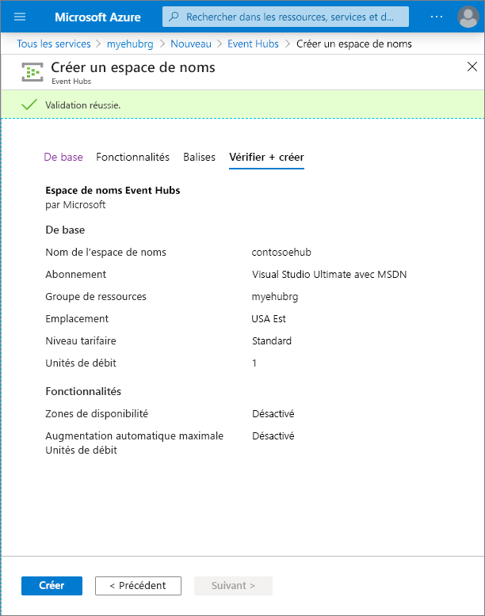
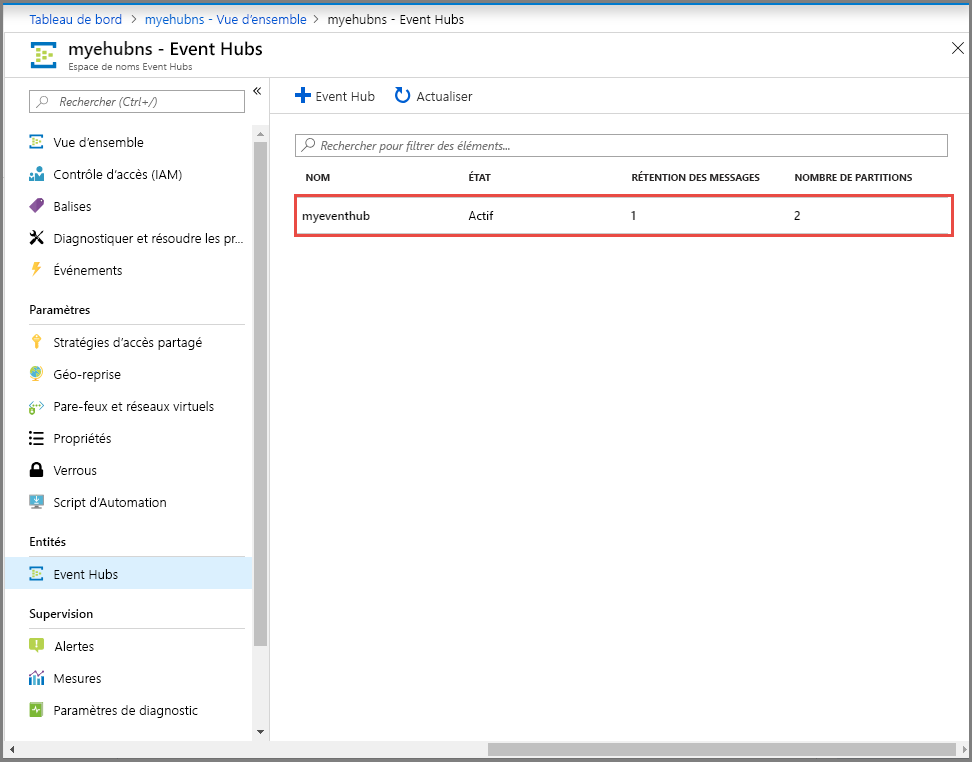

# Démarrage rapide : Créer un hub d’événements avec le portail Azure
Azure Event Hubs est une plateforme de diffusion de données volumineuses et un service d’ingestion d’événements, capable de recevoir et de traiter des millions d’événements par seconde. Les concentrateurs d’événements peuvent traiter et stocker des événements, des données ou la télémétrie produits par des logiciels et appareils distribués. Les données envoyées à un concentrateur d’événements peuvent être transformées et stockées à l’aide d’adaptateurs de traitement par lot/stockage ou d’un fournisseur d’analyse en temps réel. Pour une présentation détaillée d’Event Hubs, consultez [Vue d’ensemble d’Event Hubs](event-hubs-about.md) et [Fonctionnalités d’Event Hubs](event-hubs-features.md).

Dans ce démarrage rapide, vous créez un Event Hub avec le [portail Azure](https://portal.azure.com).

## Prérequis

Pour suivre ce guide de démarrage rapide, veillez à avoir :

- Abonnement Azure. Si vous n’en avez pas, [créez un compte gratuit](https://azure.microsoft.com/free/) avant de commencer.

## Créer un groupe de ressources

Un groupe de ressources est une collection logique de ressources Azure. Toutes les ressources sont déployées et gérées dans un groupe de ressources. Pour créer un groupe de ressources :

1. Connectez-vous au [portail Azure](https://portal.azure.com).
1. Dans le volet de navigation de gauche, cliquez sur **Groupes de ressources**. Cliquez ensuite sur **Ajouter**.

   

1. Sous **Abonnement**, sélectionnez le nom de l’abonnement Azure dans lequel vous souhaitez créer le groupe de ressources.
1. Tapez un **nom unique pour le groupe de ressources**. Le système vérifie immédiatement si le nom est disponible dans l’abonnement Azure actuellement sélectionné.
1. Sélectionnez une **région** pour le groupe de ressources.
1. Sélectionnez **Vérifier + créer**.

   
1. Dans la page **Vérifier + créer**, sélectionnez **Créer**. 

## Créer un espace de noms Event Hubs

Un espace de noms Event Hubs fournit un conteneur d’étendue unique, référencé par son nom de domaine complet, dans lequel vous créez un ou plusieurs hubs d’événements. Pour créer un espace de noms dans votre groupe de ressources à l’aide du portail, effectuez les actions suivantes :

1. Dans le portail Azure, cliquez sur **Créer une ressource** en haut à gauche de l’écran.
1. Sélectionnez **Tous les services** dans le menu de gauche, puis l’**étoile (`*`)** à côté d’**Event Hubs** dans la catégorie **Analytique**. Confirmez l’ajout d’**Event Hubs** dans **FAVORIS** dans le menu de navigation de gauche. 
    
   
1. Sélectionnez **Event Hubs** sous **FAVORIS** dans le menu de navigation de gauche, puis **Ajouter** dans la barre d’outils.

   
1. Dans la page **Créer un espace de noms**, effectuez les étapes suivantes :  
   1. Sélectionnez l’**abonnement** dans lequel vous souhaitez créer l’espace de noms.  
   1. Sélectionnez le **groupe de ressources** que vous avez créé à l’étape précédente.   
   1. Entrez un **nom** pour l’espace de noms. Le système vérifie immédiatement si le nom est disponible.  
   1. Sélectionnez un **emplacement** pour l’espace de noms.      
   1. Choisissez le **niveau tarifaire** (De base ou Standard).    
   1. Laissez le paramètre **Unités de débit** tel quel. Pour découvrir les unités de débit, consultez [Scalabilité avec Event Hubs](event-hubs-scalability.md#throughput-units).  
   1. Au bas de la page, sélectionnez **Vérifier + créer**.
      
      
   1. Dans la page **Vérifier + créer**, passez en revue les paramètres, puis sélectionnez **Créer**. Attendez la fin du déploiement. 
      
      
      
   1. Dans la page **Déploiement**, sélectionnez **Accéder à la ressource** pour accéder à la page de votre espace de noms. 
      
        
   1. Vérifiez que la page **Espace de noms Event Hubs** qui s’affiche est similaire à l’exemple suivant :   
      
             

      > [!NOTE]
      > Azure Event Hubs offre un point de terminaison Kafka. Ce point de terminaison permet à votre espace de noms Event Hubs de comprendre de manière native le protocole de message et les API [Apache Kafka](https://kafka.apache.org/intro). Cette fonctionnalité vous permet de communiquer avec vos hubs d’événements comme avec les rubriques Kafka sans changer vos clients de protocole ni exécuter vos propres clusters. Event Hubs prend en charge [Apache Kafka versions 1.0](https://kafka.apache.org/10/documentation.html) et ultérieures. Pour plus d’informations, consultez [Utiliser Event Hubs à partir d’applications Apache Kafka](event-hubs-for-kafka-ecosystem-overview.md).
    
## Créer un hub d’événements

Pour créer un Event Hub dans l’espace de noms, effectuez les actions suivantes :

1. Dans la page Espace de noms Event Hubs, sélectionnez **Event Hubs** dans le menu de gauche.
1. Cliquez sur **+ Event Hub** en haut de la fenêtre.
   
    
1. Tapez un nom pour votre hub d’événements, puis cliquez sur **Créer**.
   
    
1. Vous pouvez examiner l’état de la création du hub d’événements dans les alertes. Une fois créé, il apparaît dans la liste des hubs d’événements, comme indiqué dans l’image suivante :

    

## Étapes suivantes

Dans cet article, vous avez créé un groupe de ressources, un espace de noms Event Hubs et un Event Hub. Pour obtenir des instructions pas à pas sur l’envoi d’événements à un hub d’événements ou leur réception à partir d’un hub d’événements, consultez les tutoriels **Envoyer et recevoir des événements** : 

- [.NET Core](get-started-dotnet-standard-send-v2.md)
- [Java](get-started-java-send-v2.md)
- [Python](get-started-python-send-v2.md)
- [JavaScript](get-started-node-send-v2.md)
- [Go](event-hubs-go-get-started-send.md)
- [C (envoi uniquement)](event-hubs-c-getstarted-send.md)
- [Apache Storm (réception uniquement)](event-hubs-storm-getstarted-receive.md)

[Azure portal]: https://portal.azure.com/
[3]: ./media/event-hubs-quickstart-portal/sender1.png
[4]: ./media/event-hubs-quickstart-portal/receiver1.png
