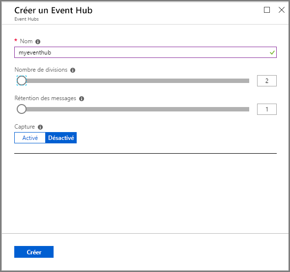

# Démarrage rapide : créer un Event Hub à l’aide du portail Azure
Azure Event Hubs est une plateforme de diffusion de données volumineuses et un service d’ingestion d’événements, capable de recevoir et de traiter des millions d’événements par seconde. Les concentrateurs d’événements peuvent traiter et stocker des événements, des données ou la télémétrie produits par des logiciels et appareils distribués. Les données envoyées à un concentrateur d’événements peuvent être transformées et stockées à l’aide d’adaptateurs de traitement par lot/stockage ou d’un fournisseur d’analyse en temps réel. Pour une présentation détaillée des Event Hubs, consultez [Vue d’ensemble des Event Hubs](event-hubs-about.md) et [Fonctionnalités des Event Hubs](event-hubs-features.md).

Dans ce démarrage rapide, vous créez un Event Hub avec le [portail Azure](https://portal.azure.com).

## Prérequis

Pour suivre ce guide de démarrage rapide, veillez à avoir :

- Abonnement Azure. Si vous n’en avez pas, [créez un compte gratuit](https://azure.microsoft.com/free/) avant de commencer.
- [Visual Studio 2017 Update 3 (version 15.3, 26730.01)](http://www.visualstudio.com/vs) ou ultérieur.
- [Kit SDK .NET Standard](https://www.microsoft.com/net/download/windows), version 2.0 ou ultérieure.

## Créer un groupe de ressources

Un groupe de ressources est une collection logique de ressources Azure. Toutes les ressources sont déployées et gérées dans un groupe de ressources. Procédez comme suit pour créer un groupe de ressources :

1. Connectez-vous au [Portail Azure](https://portal.azure.com).
2. Dans le volet de navigation de gauche, cliquez sur **Groupes de ressources**. Cliquez ensuite sur **Ajouter**.

   

2. Tapez un nom unique pour le groupe de ressources. Le système vérifie immédiatement si le nom est disponible dans l’abonnement Azure actuellement sélectionné.

3. Dans **Abonnement**, cliquez sur le nom de l’abonnement Azure dans lequel vous souhaitez créer le groupe de ressources.

4. Sélectionnez un emplacement géographique pour le groupe de ressources.

5. Cliquez sur **Créer**.

   

## Créer un espace de noms Event Hubs

Un espace de noms Event Hubs fournit un conteneur d’étendue unique, référencé par son nom de domaine complet, dans lequel vous créez un ou plusieurs hubs d’événements. Pour créer un espace de noms dans votre groupe de ressources à l’aide du portail, effectuez les actions suivantes :

1. Dans le portail Azure, cliquez sur **Créer une ressource** en haut à gauche de l’écran.

2. Cliquez sur **Internet des objets**, puis sur **Event Hubs**.

3. Dans **Créer un espace de noms**, entrez un nom d’espace de noms. Le système vérifie immédiatement si le nom est disponible.

   

4. Lorsque vous avez vérifié la disponibilité de l’espace de noms, sélectionnez le niveau tarifaire (Basique ou Standard). Choisissez également un abonnement Azure, un groupe de ressources et un emplacement où créer la ressource.
 
5. Cliquez sur **Créer** pour créer l’espace de noms. Vous devrez peut-être attendre quelques minutes pour que le système approvisionne entièrement les ressources.
6. Sélectionnez **Alertes**, puis sélectionnez le **déploiement** avec le même nom que le nom de l’espace de noms Event Hub. 

   
6. Sélectionnez votre espace de noms Event Hub à partir de la liste des ressources créées pendant le déploiement. 

   
7. Cliquez sur la page **Espace de noms Event Hubs**, cliquez sur **Stratégies d’accès partagé**, puis sur **RootManageSharedAccessKey**.
    
8. Cliquez sur le bouton Copier pour copier la chaîne de connexion **RootManageSharedAccessKey** dans le Presse-papiers. Enregistrez cette chaîne de connexion dans un emplacement temporaire, tel que le Bloc-notes, pour une utilisation ultérieure.
    
## Créer un hub d’événements

Pour créer un Event Hub dans l’espace de noms, effectuez les actions suivantes :

1. Sur la page Espaces de noms Event Hubs, cliquez sur **Event Hubs**.
   
    

1. Cliquez sur **+ Event Hub** en haut de la fenêtre.
   
    
1. Tapez un nom pour votre hub d’événements, puis cliquez sur **Créer**.
   
    

Félicitations ! Vous avez utilisé le portail pour créer un espace de noms Event Hubs, ainsi qu’un hub d’événements dans cet espace de noms. 

## Étapes suivantes

Dans cet article, vous avez créé un groupe de ressources, un espace de noms Event Hubs et un Event Hub. Pour obtenir des instructions pas à pas sur l’envoi à ou la réception d’événements à partir d’un Event Hub, consultez les didacticiels suivants :  

- **Envoyer des événements à un Event Hub** : [.NET Standard](event-hubs-dotnet-standard-getstarted-send.md), [.NET Framework](event-hubs-dotnet-framework-getstarted-send.md), [Java](event-hubs-java-get-started-send.md), [Python](event-hubs-python-get-started-send.md), [Node.js ](event-hubs-node-get-started-send.md), [Go](event-hubs-go-get-started-send.md), [C](event-hubs-c-getstarted-send.md)
- **Recevoir des événements d’un Event Hub** : [.NET Standard](event-hubs-dotnet-standard-getstarted-receive-eph.md), [.NET Framework](event-hubs-dotnet-framework-getstarted-receive-eph.md), [Java](event-hubs-java-get-started-receive-eph.md), [Python](event-hubs-python-get-started-receive.md), [Node.js ](event-hubs-node-get-started-receive.md), [Go](event-hubs-go-get-started-receive-eph.md), [Apache Storm](event-hubs-storm-getstarted-receive.md)

[Azure portal]: https://portal.azure.com/
[3]: ./media/event-hubs-quickstart-portal/sender1.png
[4]: ./media/event-hubs-quickstart-portal/receiver1.png
