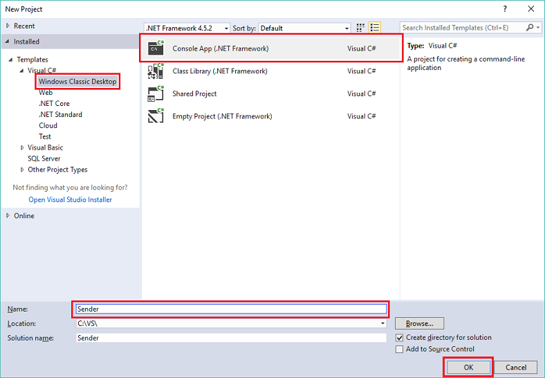

# <a name="send-events-to-azure-event-hubs-using-the-net-framework"></a>Envoyer des événements vers les hubs d’événements Azure avec .NET Framework

## <a name="introduction"></a>Introduction

Event Hubs constitue un service qui traite de grandes quantités de données d'événement (télémétrie) à partir de périphériques et d'applications connectés. Après avoir collecté des données dans les concentrateurs d’événements, vous pouvez les stocker à l’aide d’un cluster de stockage ou les transformer à l’aide d’un fournisseur d’analyses en temps réel. Cette fonctionnalité de collecte et de traitement d’événements à grande échelle représente un élément clé des architectures d’applications modernes, notamment l’Internet des objets (IoT).

Ce didacticiel montre comment utiliser le [portail Azure](https://portal.azure.com) pour créer un concentrateur d’événements. Il montre également comment envoyer des événements vers un concentrateur d’événements à l’aide d’une application de console écrite en C# avec .NET Framework. Pour recevoir des événements avec .NET Framework, consultez l’article [Recevoir des événements avec .NET Framework](event-hubs-dotnet-framework-getstarted-receive-eph.md) ou cliquez sur le langage de réception approprié dans le sommaire à gauche.

Pour effectuer ce didacticiel, vous avez besoin de ce qui suit :

* [Microsoft Visual Studio 2015 ou une version ultérieure](http://visualstudio.com). Les captures d’écran de ce didacticiel utilisent Visual Studio 2017.
* Un compte Azure actif. Si vous n’en avez pas, vous pouvez créer un compte gratuit en quelques minutes. Pour plus d'informations, consultez la page [Version d'évaluation gratuite d'Azure](https://azure.microsoft.com/free/).

## <a name="create-an-event-hubs-namespace-and-an-event-hub"></a>Création d’un espace de noms Event Hubs et d’un concentrateur d’événements

La première étape consiste à utiliser le [portail Azure](https://portal.azure.com) pour créer un espace de noms de type Event Hubs et obtenir les informations de gestion nécessaires à votre application pour communiquer avec le concentrateur d’événements. Pour créer un espace de noms et un concentrateur d’événements, suivez la procédure décrite dans [cet article](event-hubs-create.md), puis passez aux étapes suivantes de ce didactiel.

## <a name="create-a-sender-console-application"></a>Créer une application de console d’expéditeur

Dans cette section, vous écrivez une application console Windows pour envoyer des événements à votre concentrateur d’événements.

1. Dans Visual Studio, créez un projet d'application de bureau Visual C# à l'aide du modèle de projet d' **application de console** . Nommez le projet **Sender**.
   
    
2. Dans l’Explorateur de solutions, cliquez avec le bouton droit sur le projet **Expéditeur**, puis cliquez sur **Gérer les packages NuGet pour la solution...**. 
3. Cliquez sur l’onglet **Parcourir**, puis recherchez `WindowsAzure.ServiceBus`. Cliquez sur **Installer**et acceptez les conditions d’utilisation. 
   
    
   
    Visual Studio lance le téléchargement, l’installation et ajoute une référence au [Package NuGet Azure Service Bus](https://www.nuget.org/packages/WindowsAzure.ServiceBus).
4. Ajoutez les instructions `using` suivantes en haut du fichier **Program.cs** :
   
  ```csharp
  using System.Threading;
  using Microsoft.ServiceBus.Messaging;
  ```
5. Ajoutez les champs suivants à la classe **Program** , en remplaçant les valeurs par le nom du concentrateur d’événements que vous avez créé dans la section précédente et par la chaîne de connexion au niveau de l’espace de noms, enregistrée précédemment.
   
  ```csharp
  static string eventHubName = "{Event Hub name}";
  static string connectionString = "{send connection string}";
  ```
6. Ajoutez la méthode suivante à la classe **Program** :
   
  ```csharp
  static void SendingRandomMessages()
  {
      var eventHubClient = EventHubClient.CreateFromConnectionString(connectionString, eventHubName);
      while (true)
      {
          try
          {
              var message = Guid.NewGuid().ToString();
              Console.WriteLine("{0} > Sending message: {1}", DateTime.Now, message);
              eventHubClient.Send(new EventData(Encoding.UTF8.GetBytes(message)));
          }
          catch (Exception exception)
          {
              Console.ForegroundColor = ConsoleColor.Red;
              Console.WriteLine("{0} > Exception: {1}", DateTime.Now, exception.Message);
              Console.ResetColor();
          }
   
          Thread.Sleep(200);
      }
  }
  ```
   
  Cette méthode envoie en continu les événements à votre concentrateur d’événements avec un délai de 200 ms.
7. Enfin, ajoutez les lignes suivantes à la méthode **Main** :
   
  ```csharp
  Console.WriteLine("Press Ctrl-C to stop the sender process");
  Console.WriteLine("Press Enter to start now");
  Console.ReadLine();
  SendingRandomMessages();
  ```
8. Exécutez le programme et assurez-vous qu’il n’y a aucune erreur.
  
Félicitations ! Vous venez d’envoyer des messages à un concentrateur d’événements.

## <a name="next-steps"></a>Étapes suivantes
Vous avez conçu une application opérationnelle qui crée un concentrateur d’événements et envoie des données. Vous pouvez à présent passer aux scénarios suivants :

* [Recevoir des événements avec l’hôte du processeur d’événements](event-hubs-dotnet-framework-getstarted-receive-eph.md)
* [Informations de référence de l’hôte du processeur d’événements](/dotnet/api/microsoft.servicebus.messaging.eventprocessorhost)
* [Vue d'ensemble d’Event Hubs](event-hubs-what-is-event-hubs.md)

<!-- Images. -->
[19]: ./media/event-hubs-csharp-ephcs-getstarted/create-eh-proj1.png
[20]: ./media/event-hubs-csharp-ephcs-getstarted/create-eh-proj2.png
[21]: ./media/event-hubs-csharp-ephcs-getstarted/run-csharp-ephcs1.png
[22]: ./media/event-hubs-csharp-ephcs-getstarted/run-csharp-ephcs2.png

