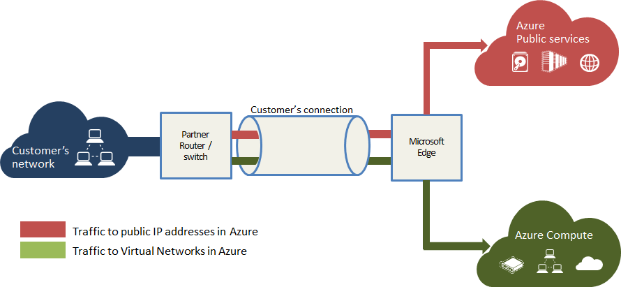
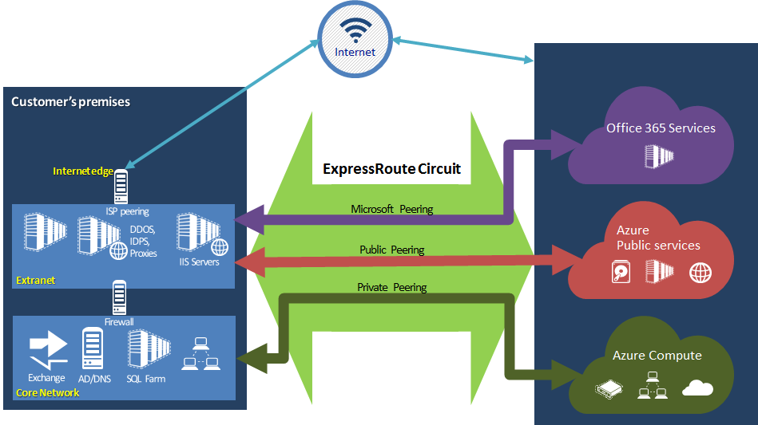

<properties 
   pageTitle="Présentation d’ExpressRoute"
   description="Cette page fournit une vue d’ensemble du service ExpressRoute."
   documentationCenter="na"
   services="expressroute"
   authors="cherylmc"
   manager="adinah"
   editor="tysonn"/>
<tags 
   ms.service="expressroute"
   ms.devlang="na"
   ms.topic="article" 
   ms.tgt_pltfrm="na"
   ms.workload="infrastructure-services" 
   ms.date="04/29/2015"
   ms.author="cherylmc"/>

# Présentation technique d’ExpressRoute

Microsoft ExpressRoute vous permet de créer des connexions privées entre les centres de données Microsoft et une infrastructure locale ou un environnement de colocalisation. Grâce à ExpressRoute, vous pouvez établir des connexions aux services cloud Microsoft tels que Microsoft Azure et Office 365 à un emplacement de colocalisation partenaire ExpressRoute ou vous connecter directement à Azure depuis votre réseau étendu existant (comme un VPN MPLS offert par un fournisseur de services réseau).
 
Les connexions ExpressRoute offrent une sécurité accrue, une plus grande fiabilité, des vitesses plus rapides et des latences moindres par rapport aux connexions classiques sur Internet. Dans certains cas, l’utilisation de connexions ExpressRoute pour le transfert de données entre des réseaux locaux et Azure peut également avoir des avantages significatifs en matière de coûts. Si vous avez déjà créé une connexion entre les locaux de votre réseau local vers Azure, vous pouvez migrer vers une connexion ExpressRoute tout en conservant votre réseau virtuel tel qu’il est.

Pour plus d’informations, consultez le [Forum Aux Questions sur ExpressRoute](expressroute-faqs.md).

## Fonctionnement d’une connexion ExpressRoute

Pour connecter votre réseau étendu aux services cloud Microsoft, vous devez commander un circuit dédié et l’activer via un fournisseur de connectivité. Il existe deux types de fournisseur de connectivité : couche directe 3 via un fournisseur Exchange ou couche 3 via un fournisseur de services réseau. Vous pouvez choisir d’activer un ou plusieurs types de connectivité entre votre réseau étendu et le cloud Microsoft.

## Fournisseurs de services réseau et fournisseurs Exchange
Les fournisseurs ExpressRoute sont classés en tant que fournisseurs de services réseau et fournisseurs Exchange.

| |**Fournisseur Exchange**|**Fournisseur de services réseau**|
|---|---|---|
|**Mode de connectivité classique**| Lien Ethernet de point à point ou connectivité à un échange de cloud | Connexion quelconque via un VPN Telco |
|**Bandes passantes prises en charge**|200 Mbits/s, 500 Mbits/s, 1 Gbit/s et 10 Gbit/s|10 Mbits/s, 50 Mbits/s, 100 Mbits/s, 500 Mbits/s, 1 Gbit/s|
|**Fournisseurs de connectivité**|[Page Fournisseurs Exchange](https://msdn.microsoft.com/library/azure/4da69a0f-8f52-49ea-a990-dacd4202150a#BKMK_EXP)|[Page Fournisseurs de services réseau](https://msdn.microsoft.com/library/azure/4da69a0f-8f52-49ea-a990-dacd4202150a#BKMK_NSP)|
|**Routage**|Sessions BGP directement avec les routeurs Edge clients| Sessions BGP avec Telco|
|**Tarification**|[Tarification des fournisseurs Exchange](http://azure.microsoft.com/pricing/details/expressroute/)|[Tarification des fournisseurs de services réseau](http://azure.microsoft.com/pricing/details/expressroute/)|

### Fournisseurs Exchange
Nous travaillons en partenariat avec des fournisseurs de services cloud Exchange tels que Equinix et TeleCity, et avec des fournisseurs de services de connectivité de point à point comme Cole et Level 3, afin de proposer une connectivité entre Azure et l’environnement local du client. Nous proposons des bandes passantes de circuit de 200 Mbits/s à 10 Gbits/s (200 Mbits/s, 500 Mbits/s, 1 Gbit/s et 10 Gbit/s).

Si vous souhaitez une connexion Couche directe 3 via un fournisseur Exchange, trois méthodes sont disponibles :

- Vous pouvez être colocalisé avec les échanges de cloud tels que Cloud Exchange (Equinix) ou Cloud IX (TeleCity) dans les emplacements dont nous disposons. Dans ce cas, vous devez commander une connectivité redondante à l’échange de cloud. 
- Vous pouvez travailler avec des fournisseurs Ethernet tels que Level 3 pour configurer des circuits Ethernet entre vos centres de données et Microsoft. 
- Vous pouvez travailler avec votre fournisseur de connectivité local pour acquérir une connectivité redondante au site de fournisseur Exchange le plus proche et vous connecter à l’échange de cloud.

Une connectivité redondante n’est pas obligatoire pour répondre aux exigences de notre contrat SLA. Nous ne prenons pas en charge la connexion directe à Microsoft Edge. Les circuits dédiés sont toujours activés via un fournisseur Ethernet ou un échange de cloud local. Bien que cela configure la connectivité de couche 2 entre Microsoft et votre réseau, nous ne prenons pas en charge l’extension du domaine de couche 2. Vous devez configurer des sessions de routage redondantes entre vos routeurs Edge et les routeurs Microsoft Edge pour disposer d’une connectivité de couche 3.

Pour plus d’informations sur la configuration et pour obtenir des exemples réels, vous pouvez suivre ces instructions étape par étape : [Configuration d’une connexion ExpressRoute via un fournisseur Exchange](expressroute-configuring-exps.md).

### Fournisseurs de services réseau

Nous travaillons en partenariat avec les opérateurs téléphoniques tels que AT&T et British Telecom pour proposer une connectivité entre Azure et votre réseau étendu. Nous proposons des bandes passantes de circuit de 10 Mbits/s à 1 Gbits/s (10 Mbits/s, 50 Mbits/s, 100 Gbit/s, 500 Gbit/s et 1 Gbits/s).

Si vous utilisez des services VPN à partir d’un fournisseur de services réseau avec lequel nous travaillons, ce dernier peut étendre les réseaux dans Azure sans avoir à déployer un nouveau matériel ni à effectuer de modifications de configuration importantes dans vos réseaux existants.

Pour plus d’informations sur la configuration et pour obtenir des exemples réels, vous pouvez suivre ces instructions étape par étape : [Configuration de circuits ExpressRoute via des fournisseurs de services réseau](expressroute-configuring-nsps.md).

## Homologations ExpressRoute
La figure ci-dessous fournit une représentation logique de la connectivité entre votre réseau étendu et Microsoft. Vous devez commander un circuit dédié pour connecter votre réseau étendu à Microsoft via un fournisseur de connectivité (services réseau ou Exchange). Un « circuit dédié » représente une connexion logique entre votre réseau étendu et Microsoft via le fournisseur de connectivité. Vous pouvez commander plusieurs circuits dédiés, chacun d’eux pouvant être dans des régions identiques ou différentes et être connecté à votre réseau étendu via différents fournisseurs de services.

Un circuit dédié est associé à plusieurs domaines de routage : publics, privés et Microsoft. Chaque domaine de routage est configuré de manière identique sur une paire de routeurs (en configuration actif-actif ou de répartition de la charge) pour la haute disponibilité.

### Homologation privée
Les services de calcul Azure, à savoir les machines virtuelles (IaaS) et les services cloud (PaaS) déployés au sein d’un réseau virtuel peuvent être connectés via le domaine d’homologation privée. Celui-ci est considéré comme une extension de confiance de votre réseau de base dans Microsoft Azure. Vous pouvez configurer une connectivité bidirectionnelle entre votre réseau de base et les réseaux virtuels Azure. Cela vous permet de vous connecter aux machines virtuelles et services cloud directement sur leurs adresses IP privées.

Vous pouvez connecter plusieurs réseaux virtuels au domaine d’homologation privée. Pour plus d’informations sur les limitations, consultez le [Forum Aux Questions](expressroute-faqs.md).
  

### Homologation publique
Les services tels qu’Azure Storage, Base de données SQL et Sites Web sont proposés sur des adresses IP publiques. En privé, vous pouvez vous connecter à des services hébergés sur des adresses IP publiques (y compris les adresses IP virtuelles de vos services cloud) via le domaine de routage d’homologation publique. Vous pouvez connecter le domaine d’homologation publique à votre extranet et vous connecter à tous les services Azure sur leurs adresses IP publiques à partir de votre réseau étendu, sans avoir à vous connecter via Internet. La connectivité est toujours initiée de votre réseau étendu vers les services Microsoft Azure. Ces derniers ne sont pas en mesure d’initier des connexions à votre réseau via ce domaine de routage. Une fois l’homologation publique activée, vous êtes en mesure de vous connecter à tous les services Azure (nous ne vous permettons pas de choisir de manière sélective les services pour lesquels nous annonçons des itinéraires). Vous pouvez consulter la liste des préfixes que nous publions via cette homologation à la page [Plages d’adresses IP des centres de données Microsoft Azure](http://www.microsoft.com/fr-fr/download/details.aspx?id=41653). Vous pouvez définir des filtres d’itinéraires personnalisés au sein de votre réseau pour utiliser uniquement les itinéraires dont vous avez besoin.

Pour plus d’informations sur les services pris en charge via le domaine de routage d’homologation publique, consultez le [Forum Aux Questions](expressroute-faqs.md).
 
### Homologation Microsoft
La connectivité à toutes les autres services en ligne Microsoft (tels qu’Office 365) a lieu via l’homologation Microsoft. Nous activons la connectivité bidirectionnelle entre votre réseau étendu et les services cloud Microsoft via le domaine de routage d’homologation Microsoft. Vous devez vous connecter aux services cloud Microsoft uniquement via des adresses IP publiques qui sont détenues par vous ou votre fournisseur de connectivité. Vous devez également respecter toutes les règles que nous définissons. Pour plus d’informations, consultez la page [Conditions préalables d’ExpressRoute](expressroute-prerequisites.md).

Pour plus d’informations sur les services pris en charge, les coûts et les détails de configuration, consultez le [Forum Aux Questions](expressroute-faqs.md). Pour plus d’informations sur la liste des fournisseurs de connectivité offrant une prise en charge de l’homologation Microsoft, consultez la page [Emplacements ExpressRoute](expressroute-locations.md)

Le tableau ci-dessous compare les trois domaines de routage.

||**Homologation privée**|**Homologation publique**|**Homologation Microsoft**| 
|---|---|---|---| 
|**Nombre maximal de préfixes pris en charge par homologation**|4 000 par défaut, 10 000 avec ExpressRoute Premium|4 000 par défaut, 10 000 avec ExpressRoute Premium|200| 
|**Plages d’adresses IP prises en charge**|N’importe quelle adresse IPv4 valide de votre réseau étendu|Adresses IPv4 publiques qui sont votre propriété ou celle de votre fournisseur de connectivité|Adresses IPv4 publiques qui sont votre propriété ou celle de votre fournisseur de connectivité| 
|**Numéros d’AS**|Numéros d’AS privés et publics. Le client doit posséder un numéro d’AS public. | Numéros d’AS privés et publics. Le client doit posséder un numéro d’AS public. | Numéros d’AS publics uniquement. Le numéro d’AS doit être validé par rapport aux registres de routage pour confirmer son appartenance.| 
|**Adresses IP d’interface de routage**|RFC1918 et adresses IP publiques|Adresses IP publiques inscrites auprès de clients / Fournisseur de service réseau dans les registres de routage.| Adresses IP publiques inscrites auprès de clients / Fournisseur de service réseau dans les registres de routage.| 
|**Prise en charge du hachage MD5**| Oui|Oui|Oui|

Vous pouvez choisir d’activer un ou plusieurs domaines de routage dans le cadre de leur circuit dédié. Vous pouvez choisir de placer tous les domaines de routage sur le même VPN (c’est le cas des fournisseurs de services réseau) s’ils souhaitent les recevoir dans un domaine de routage unique. Vous pouvez également les placer dans différents domaines de routage comme indiqué dans le schéma ci-dessus. Nous vous recommandons de connecter l’homologation privée directement à votre réseau de base, et les homologations publiques et Microsoft à votre extranet.
 
Si vous choisissez d’avoir les trois sessions d’homologation, vous devez disposer de trois paires de sessions BGP (une paire pour chaque type d’homologation). Les paires de session BGP fournissent un lien hautement disponible. Si vous vous connectez via des fournisseurs Exchange, vous êtes responsable de la configuration et de la gestion du routage (sauf si le fournisseur Exchange propose de gérer le routage pour vous). Si vous choisissez de vous connecter via un fournisseur de services réseau, celui-ci se charge du routage pour vous. Pour en savoir plus, passez en revue les flux de travail de configuration d’ExpressRoute

- [Configuration d’une connexion ExpressRoute via un fournisseur de services réseau](expressroute-configuring-nsps.md)
- [Configuration d’une connexion ExpressRoute via un fournisseur Exchange](expressroute-configuring-exps.md)

## Étapes suivantes

- [Emplacements et fournisseurs de services ExpressRoute](expressroute-locations.md) 
- [Configuration d’une connexion ExpressRoute via un fournisseur de services réseau](expressroute-configuring-nsps.md)
- [Configuration d’une connexion ExpressRoute via un fournisseur Exchange](expressroute-configuring-exps.md)

<!--HONumber=54-->