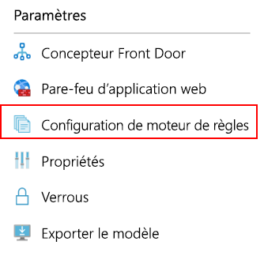
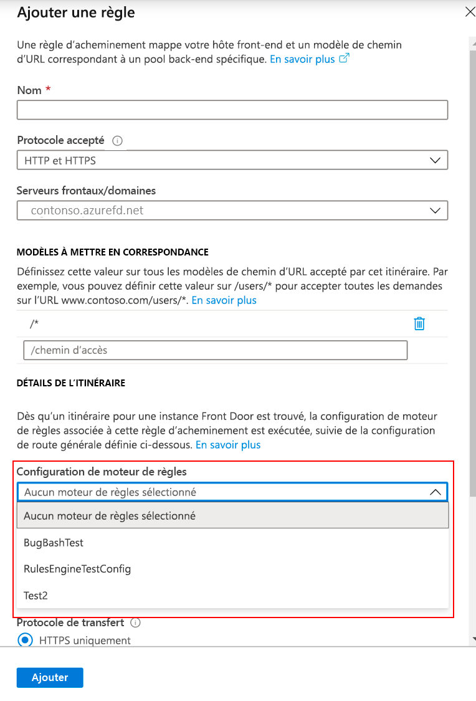

# <a name="configure-your-rules-engine"></a>Configurer votre moteur de règles

Cet article vous indique les étapes permettant de créer une configuration de moteur de règles et votre première règle dans le portail Azure et Azure CLI. 

## <a name="configure-rules-engine-in-azure-portal"></a>Configurer le moteur de règles dans le portail Azure
1. Avant de créer une configuration de moteur de règles, [créez une ressource Front Door](quickstart-create-front-door.md).

2. Dans votre ressource Front Door, accédez à **Paramètres** et sélectionnez **Configuration du moteur de règles**. Cliquez sur **Ajouter**, donnez un nom à votre configuration, puis commencez à créer votre première configuration de moteur de règles.

    

3. Cliquez sur **Ajouter une règle** pour créer votre première règle. Ensuite, en cliquant sur **Ajouter une condition** ou **Ajouter une action**, vous pouvez définir votre règle.
    
    > [!NOTE]
    >- Pour supprimer une condition ou une action de la règle, utilisez la corbeille sur le côté droit de la condition ou de l’action spécifique.
    > - Pour créer une règle qui s’applique à tout le trafic entrant, ne spécifiez aucune condition.
    > - Pour arrêter l’évaluation des règles une fois que la première condition de correspondance est remplie, cochez **Arrêter l’évaluation de la règle restante**. Si cette case est cochée alors que toutes les conditions de correspondance d’une règle particulière sont satisfaites, les règles restantes de la configuration ne sont pas exécutées.  

     

4. Déterminez la priorité des règles dans votre configuration en utilisant les boutons Monter, Descendre et Déplacer en haut. La priorité est dans l’ordre croissant, ce qui signifie que la règle listée en premier est la règle la plus importante.

5. Une fois que vous avez créé une ou plusieurs règles, appuyez sur **Enregistrer**. Cette action crée la configuration de votre moteur de règles.

6. Une fois que vous avez créé une ou plusieurs configurations, associez une configuration de moteur de règles à une règle de routage. Une configuration peut être appliquée à de nombreuses règles de routage, tandis qu’une règle de routage ne peut contenir qu’une seule configuration de moteur de règles. Pour établir l’association, accédez à votre **concepteur Front Door** > **Règles de routage**. Sélectionnez la règle de routage à laquelle vous souhaitez ajouter la configuration de moteur de règles, accédez à **Détails de la route** > **Configuration du moteur de règles**, puis sélectionnez la configuration que vous voulez associer.

    


## <a name="configure-rules-engine-in-azure-cli"></a>Configurer le moteur de règles dans Azure CLI

1. Si ce n’est déjà fait, installez [Azure CLI](https://docs.microsoft.com/cli/azure/install-azure-cli?view=azure-cli-latest). Ajoutez l’extension « Front-Door » :- az extension add --name front-door. Ensuite, connectez-vous et basculez vers votre abonnement az account set --subscription <name_or_Id>.

2. Commencez par créer un moteur de règles : cet exemple montre une règle avec une action basée sur l’en-tête et une condition de correspondance. 

```azurecli-interactive
az network front-door rules-engine rule create -f {front_door} -g {resource_group} --rules-engine-name {rules_engine} --name {rule1} --priority 1 --action-type RequestHeader --header-action Overwrite --header-name Rewrite --header-value True --match-variable RequestFilenameExtension --operator Contains --match-values jpg png --transforms Lowercase
```

3. Listez toutes les règles. 

```azurecli-interactive
az network front-door rules-engine rule list -f {front_door} -g {rg} --name {rules_engine}
```

4. Ajoutez une action de remplacement de la route de transfert. 

```azurecli-interactive
az network front-door rules-engine rule action add -f {front_door} -g {rg} --rules-engine-name {rules_engine} --name {rule1} --action-type ForwardRouteOverride --backend-pool {backend_pool_name} --caching Disabled
```

5. Listez toutes les actions d’une règle. 

```azurecli-interactive
az network front-door rules-engine rule action list -f {front_door} -g {rg} -r {rules_engine} --name {rule1}
```

6. Associez une configuration de moteur de règles à une règle de routage.  

```azurecli-interactive
az network front-door routing-rule update -g {rg} -f {front_door} -n {routing_rule_name} --rules-engine {rules_engine}
```

7. Dissociez le moteur de règles. 

```azurecli-interactive
az network front-door routing-rule update -g {rg} -f {front_door} -n {routing_rule_name} --remove rulesEngine # case sensitive word ‘rulesEngine’
```

Pour plus d’informations, vous trouverez la liste complète des commandes du moteur de règles AFD [ici](https://docs.microsoft.com/cli/azure/ext/front-door/network/front-door/rules-engine?view=azure-cli-latest).   

## <a name="next-steps"></a>Étapes suivantes

- Découvrez plus en détail le [Moteur de règles AFD](front-door-rules-engine.md). 
- Découvrez comment [créer une porte d’entrée](quickstart-create-front-door.md).
- Découvrez [comment fonctionne Front Door](front-door-routing-architecture.md).
- Allez plus loin avec les [Informations de référence CLI](https://docs.microsoft.com/cli/azure/ext/front-door/network/front-door/rules-engine?view=azure-cli-latest) sur le moteur de règles AFD. 
- Allez plus loin avec les [Informations de référence PowerShell](https://docs.microsoft.com/powershell/module/az.frontdoor/?view=azps-3.8.0) sur le moteur de règles AFD. 
