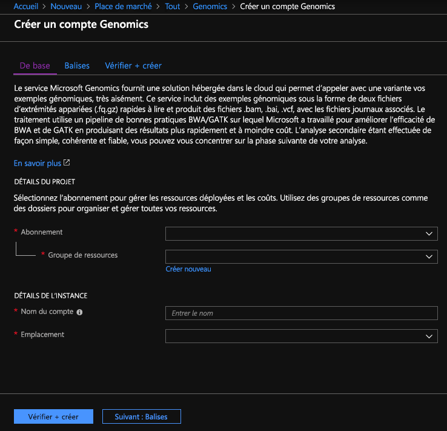
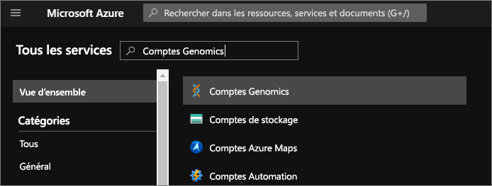
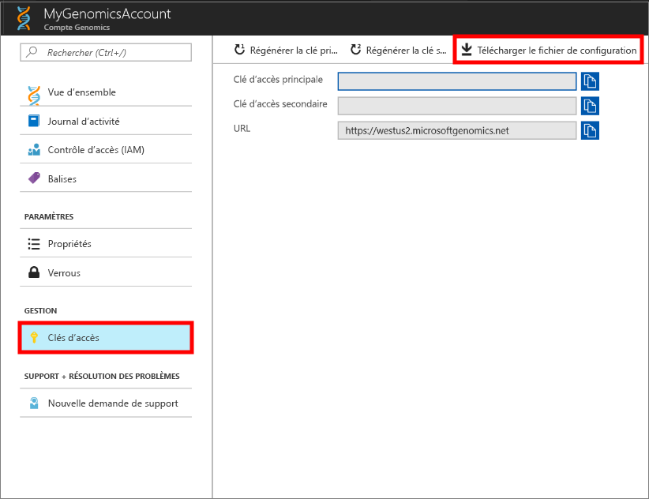

# <a name="quickstart-run-a-workflow-through-the-microsoft-genomics-service"></a>Démarrage rapide : Exécuter un workflow via le service Microsoft Genomics

Microsoft Genomics est un service sécurisé et évolutif dédié à l’analyse secondaire de génomes. Il procède rapidement, en commençant par des lectures brutes, puis produit des lectures alignées et des appels de variants. Démarrez en quelques étapes : 
1.  Configuration : Créez un compte Microsoft Genomics via le portail Azure, puis installez le client Microsoft Genomics Python dans votre environnement local. 
2.  Chargement des données d’entrée : Créez un compte de stockage Microsoft Azure via le portail Azure, puis chargez les fichiers d’entrée. Les fichiers d’entrée doivent constituer des séquences appariées (fichiers fastq ou bam).
3.  Exécution : Utilisez l’interface de ligne de commande Microsoft Genomics afin d’exécuter les workflows via le service Microsoft Genomics. 

Pour plus d’informations sur Microsoft Genomics, consultez la page [Qu’est-ce que Microsoft Genomics ?](overview-what-is-genomics.md)

## <a name="set-up-create-a-microsoft-genomics-account-in-the-azure-portal"></a>Configuration : Créer un compte Microsoft Genomics dans le portail Azure

Pour créer un compte Microsoft Genomics, accédez au [portail Azure](https://portal.azure.com/#create/Microsoft.Genomics). Si vous n’avez pas encore d’abonnement Azure, créez-en un avant de créer le compte Microsoft Genomics. 




Configurez votre compte Genomics avec les informations suivantes, tel que représenté dans l’image précédente. 

 |**Paramètre**          |  **Valeur suggérée**  | **Description du champ** |
 |:-------------       |:-------------         |:----------            |
 |Nom du compte         | MyGenomicsAccount     |Choisissez un identifiant de compte unique. Pour connaître les noms valides, consultez la page [Règles d’affectation des noms](https://docs.microsoft.com/en-us/azure/architecture/best-practices/naming-conventions). |
 |Abonnement         | Votre nom d’abonnement|Il s’agit de l’unité de facturation de vos services Azure. Pour plus de détails sur votre abonnement, consultez la section [Abonnements](https://account.azure.com/Subscriptions) |      
 |Groupe de ressources       | myResourceGroup       |  Les groupes de ressources vous permettent de rassembler plusieurs ressources Azure (compte de stockage, compte Genomics, etc.) dans un groupe unique, pour une gestion simplifiée. Pour plus d’informations, consultez [Groupes de ressources] (https://docs.microsoft.com/fr-fr/azure/azure-resource-manager/resource-group-overview#resource-groups). Pour connaître les noms valides de groupes de ressources, consultez la page [Règles d’affectation des noms](https://docs.microsoft.com/en-us/azure/architecture/best-practices/naming-conventions). |
 |Lieu                   | Ouest des États-Unis 2                    |    Le service est disponible dans l’Ouest des États-Unis 2, dans l’Europe de l’Ouest et dans l’Asie du Sud-Est. |


Pour surveiller le processus de déploiement, vous pouvez cliquer sur les Notifications dans la barre de menus supérieure.


## <a name="set-up-install-the-microsoft-genomics-python-client"></a>Configuration : Installer le client Microsoft Genomics Python

Les utilisateurs doivent installer Python et le client Microsoft Genomics Python au sein de leur environnement local. 

### <a name="install-python"></a>Installation de Python

Le client Microsoft Genomics Python est compatible avec Python 2.7. Nous vous recommandons d’utiliser la version 2.7.12 ou une version ultérieure ; la version suggérée est l’instance 2.7.14. Accédez au téléchargement [ici](https://www.python.org/downloads/). 


### <a name="install-the-microsoft-genomics-client"></a>Installer le client Microsoft Genomics

Utilisez la version de Python et de pip pour installer le client Microsoft Genomics `msgen`. Les instructions suivantes supposent que Python est déjà intégré dans le chemin d’accès de votre système. Si l’installation de la version pip n’est pas reconnue, vous devez ajouter Python et le sous-dossier des scripts dans votre chemin d’accès système.


```
pip install --upgrade --no-deps msgen
pip install msgen
```


Si vous ne souhaitez pas installer `msgen` en tant qu’instance binaire au sein du système et modifier les packages Python à l’échelle du système, utilisez la balise `–-user` avec `pip`.
Si vous utilisez l’installation basée sur le package ou setup.py, l’ensemble des packages requis sont installés. Sinon, les packages de base requis pour msgen sont 

 * [Azure-storage](https://pypi.python.org/pypi/azure-storage). 
 * [Requests](https://pypi.python.org/pypi/requests). 


Vous pouvez installer ces packages à l’aide de `pip`, de `easy_install` ou par le biais de procédures `setup.py` standard. 


### <a name="test-the-microsoft-genomics-client"></a>Test du client Microsoft Genomics
Pour tester le client Microsoft Genomics, téléchargez le fichier de configuration à partir du compte Genomics. Pour accéder à votre compte Genomics, cliquez sur **Plus de services** dans la zone inférieure gauche, activez le filtrage, puis sélectionnez les comptes Genomics.





Sélectionnez le compte Genomics nouvellement créé, accédez à **Clés d’accès**, puis téléchargez le fichier de configuration.




Vérifiez que le client Microsoft Genomics Python fonctionne avec la commande suivante :


```
msgen list -f “<full path where you saved the config file>”
```

## <a name="create-a-microsoft-azure-storage-account"></a>Créer un compte Microsoft Stockage Azure 
Le service Microsoft Genomics suppose que les entrées sont stockées en tant qu’objets blob de bloc dans un compte Stockage Azure. Il écrit également les fichiers de sortie en tant qu’objets blob de bloc sur un conteneur spécifié par l’utilisateur, dans un compte Stockage Azure. Les entrées et les sorties peuvent être hébergées dans différents comptes de stockage.
Si vous avez déjà déplacé vos données dans un compte Stockage Azure, il vous suffit simplement de vous assurer qu’elles sont hébergées au même emplacement que votre compte Genomics. Dans le cas contraire, des frais de sortie s’appliquent lors de l’exécution du service Genomics. Si vous ne possédez pas encore de compte Microsoft Stockage Azure, vous devez en créer un, dans lequel vous chargez vos données. Vous trouverez plus d’informations sur les comptes Stockage Azure [ici](https://docs.microsoft.com/en-us/azure/storage/common/storage-create-storage-account). Cette section vous donne accès à la définition d’un compte de stockage et à la description des services fournis. Pour créer un compte Microsoft Stockage Azure, accédez au [portail Azure](https://portal.azure.com/#create/Microsoft.StorageAccount-ARM ).  


Configurez votre compte Stockage avec les informations suivantes, tel que représenté dans l’image précédente. Utilisez la plupart des options standard dédiées aux comptes de stockage, en indiquant uniquement qu’il s’agit d’un compte de stockage d’objets blob, non à usage général. Le stockage d’objets blob peut s’avérer entre 2 à 5 fois plus rapide pour les téléchargements et les chargements. 


 |**Paramètre**          |  **Valeur suggérée**  | **Description du champ** |
 |:-------------------------       |:-------------         |:----------            |
 |Nom         | MyStorageAccount     |Choisissez un identifiant de compte unique. Pour connaître les noms valides, consultez la page [Règles d’affectation des noms](https://docs.microsoft.com/en-us/azure/architecture/best-practices/naming-conventions). |
 |Modèle de déploiement         | Gestionnaire de ressources| Resource Manager est le modèle de déploiement recommandé. Pour plus d’informations, consultez [Déploiement Azure Resource Manager et déploiement classique : comprendre les modèles de déploiement et l’état de vos ressources](https://docs.microsoft.com/azure/azure-resource-manager/resource-manager-deployment-model). |      
 |Type de compte       | Stockage d'objets blob       |  Le stockage d’objets blob peut s’avérer entre 2 à 5 fois plus rapide que le modèle à usage général pour les téléchargements et les chargements. |
 |Performances                  | Standard                   | Le niveau par défaut est Standard. Pour plus d’informations sur les comptes de stockage standard et premium, consultez [Présentation du stockage Azure](https://docs.microsoft.com/azure/storage/common/storage-introduction).    |
 |Réplication                  | Stockage localement redondant                  | Le stockage localement redondant réplique vos données dans la région du centre de données dans laquelle vous avez créé votre compte de stockage. Pour plus d’informations, consultez l’article [Réplication de Stockage Azure](https://docs.microsoft.com/azure/storage/common/storage-redundancy).    |
 |Transfert sécurisé requis                  | Désactivé                 | La valeur par défaut est désactivée. Pour plus d’informations sur la sécurité du transfert de données, consultez l’article [Exiger un transfert sécurisé dans le stockage Azure](https://docs.microsoft.com/azure/storage/common/storage-require-secure-transfer).    |
 |Niveau d’accès                  | À chaud                   | Un niveau d’accès chaud indique que le compte de stockage sera sollicité plus fréquemment.    |
 |Abonnement         | Votre abonnement Azure |Pour plus d’informations sur votre abonnement, consultez [Abonnements](https://account.azure.com/Subscriptions). |      
 |Groupe de ressources       | myResourceGroup       |  Vous pouvez sélectionner le même groupe de ressources en tant que compte Genomics. Pour connaître les noms valides de groupes de ressources, consultez la page [Règles d’affectation des noms](https://docs.microsoft.com/en-us/azure/architecture/best-practices/naming-conventions). |
 |Lieu                  | Ouest des États-Unis 2                  | Utilisez l’emplacement de votre compte Genomics, afin de réduire les frais de sortie ainsi que la latence. Le service Genomics est disponible dans l’Ouest des États-Unis 2, dans l’Europe de l’Ouest et dans l’Asie du Sud-Est.    |
 |Réseaux virtuels                | Désactivé                   | La valeur par défaut est désactivée. Pour plus d’informations, consultez la section [Réseau virtuel Azure](https://docs.microsoft.com/azure/storage/common/storage-network-security).    |


Cliquez ensuite sur Créer pour créer votre compte de stockage. Comme vous l’avez fait pour la création de votre compte Genomics, vous pouvez cliquer sur les Notifications dans la barre de menus supérieure pour surveiller le processus de déploiement. 


## <a name="upload-input-data-to-your-storage-account"></a>Charger les données d’entrée dans votre compte de stockage

Le service Microsoft Genomics prend en charge des séquences appariées en tant que fichiers d’entrée. Vous pouvez décider de charger vos propres données ou d’accéder aux exemples de données publiques mis à votre disposition. Si vous optez pour la seconde solution, les exemples sont hébergés ici :


[https://msgensampledata.blob.core.windows.net/small/chr21_1.fq.gz](https://msgensampledata.blob.core.windows.net/small/chr21_1.fq.gz)
[https://msgensampledata.blob.core.windows.net/small/chr21_2.fq.gz](https://msgensampledata.blob.core.windows.net/small/chr21_2.fq.gz)


Au sein de votre compte de stockage, vous devez créer un conteneur d’objets blob pour vos données d’entrée et un second conteneur d’objets blob pour vos données de sortie.  Chargez les données d’entrée dans votre conteneur d’objets blob dédié. Pour ce faire, divers outils sont à votre disposition, notamment [Explorateur Stockage Microsoft Azure](https://azure.microsoft.com/features/storage-explorer/), [blobporter](https://github.com/Azure/blobporter) ou [AzCopy](https://docs.microsoft.com/azure/storage/common/storage-use-azcopy?toc=%2fazure%2fstorage%2fblobs%2ftoc.json). 


## <a name="run-a-workflow-through-the-microsoft-genomics-service-using-the-python-client"></a>Exécuter un workflow via le service Microsoft Genomics à l’aide du client Python 

Pour exécuter un workflow via le service Microsoft Genomics, modifiez le fichier config.txt afin de spécifier les conteneurs de stockage d’entrée et de sortie dédiés à vos données.
Ouvrez le fichier config.txt téléchargé à partir de votre compte Genomics. Les sections à spécifier sont votre clé d’abonnement et les six éléments inférieurs, le nom du compte de stockage, la clé et les noms des conteneurs d’entrée et de sortie. Vous pouvez trouver ces informations en accédant au portail des **Clés d’accès** à votre compte de stockage, ou directement à partir de l’Explorateur Stockage Microsoft Azure.  


### <a name="submit-your-workflow-to-the-microsoft-genomics-service-the-microsoft-genomics-client"></a>Soumettre votre workflow dans le service Microsoft Genomics via le client Microsoft Genomics Python

Utilisez le client Microsoft Genomics Python pour soumettre votre workflow à l’aide de la commande suivante :


```python
msgen submit -f [full path to your config file] -b1 [name of your first paired end read] -b2 [name of your second paired end read]
```


Vous pouvez afficher l’état de votre workflow à l’aide de la commande suivante : 
```python
msgen list -f c:\temp\config.txt 
```


Une fois le workflow terminé, vous avez accès aux fichiers de sortie dans votre compte Stockage Azure, dans le conteneur de sortie configuré. 


## <a name="next-steps"></a>Étapes suivantes
Dans cet article, vous avez chargé un exemple de données d’entrée dans Stockage Azure et soumis un workflow dans le service Microsoft Genomics, via le client Python `msgen`. Pour en savoir plus sur les autres types de fichiers d’entrée pouvant être utilisés avec le service Microsoft Genomics, consultez les pages suivantes : [paired FASTQ (Paires de fichiers FASTQ)](quickstart-input-pair-FASTQ.md) | [BAM (Business Activity Monitoring)](quickstart-input-BAM.md) | [Multiple FASTQ or BAM (Fichiers BAM ou FASTQ multiples)](quickstart-input-multiple.md) 