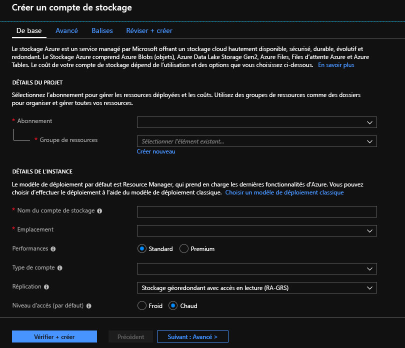
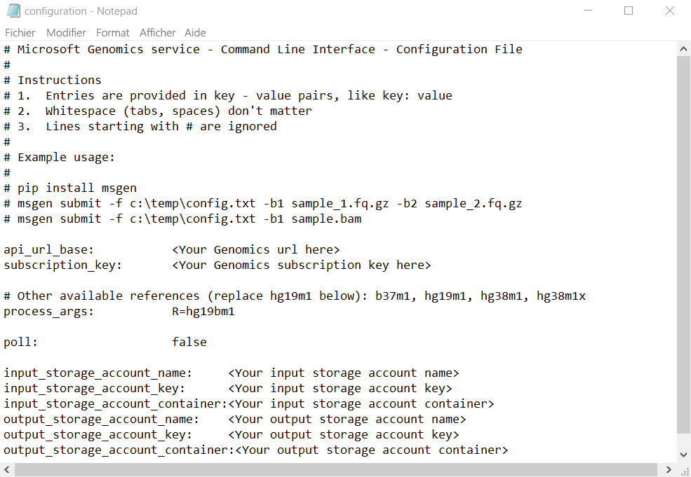

# <a name="quickstart-run-a-workflow-through-the-microsoft-genomics-service"></a>Démarrage rapide : Exécuter un workflow par le biais du service Microsoft Genomics

Dans ce guide de démarrage rapide, vous chargez des données d’entrée sur un compte de stockage Blob Azure et exécutez un workflow par le biais du service Microsoft Genomics à l’aide du client Genomics Python. Microsoft Genomics est un service sécurisé et évolutif dédié à l’analyse secondaire de génomes. Il procède rapidement, en commençant par des lectures brutes, puis produit des lectures alignées et des appels de variants. 

## <a name="prerequisites"></a>Prérequis

- Compte Azure avec un abonnement actif. [Créez un compte gratuitement](https://azure.microsoft.com/free/?ref=microsoft.com&utm_source=microsoft.com&utm_medium=docs&utm_campaign=visualstudio). 
- [Python 2.7.12+](https://www.python.org/downloads/release/python-2714/), avec `pip` installé, et `python` dans le chemin de votre système. Le client Microsoft Genomics n’est pas compatible avec Python 3. 

## <a name="set-up-create-a-microsoft-genomics-account-in-the-azure-portal"></a>Configuration : Créer un compte Microsoft Genomics dans le portail Azure

Pour créer un compte Microsoft Genomics, accédez à [Créer un compte Genomics](https://portal.azure.com/#create/Microsoft.Genomics) dans le portail Azure. Si vous n’avez pas encore d’abonnement Azure, créez-en un avant de créer le compte Microsoft Genomics. 


Configurez votre compte Genomics avec les informations suivantes, tel que représenté dans l’image précédente. 

 |**Paramètre**          |  **Valeur suggérée**  | **Description du champ** |
 |:-------------       |:-------------         |:----------            |
 |Abonnement         | Votre nom d’abonnement|Il s’agit de l’unité de facturation de vos services Azure. Pour plus de détails sur votre abonnement, consultez la section [Abonnements](https://account.azure.com/Subscriptions) |      
 |Resource group       | myResourceGroup       |  Les groupes de ressources vous permettent de rassembler plusieurs ressources Azure (compte de stockage, compte Genomics, etc.) dans un groupe unique, pour une gestion simplifiée. Pour plus d’informations, consultez [Groupes de ressources](https://docs.microsoft.com/azure/azure-resource-manager/resource-group-overview#resource-groups). Pour connaître les noms valides de groupes de ressources, consultez la page [Règles d’affectation des noms](/azure/architecture/best-practices/resource-naming). |
 |Nom du compte         | MyGenomicsAccount     |Choisissez un identifiant de compte unique. Pour connaître les noms valides, consultez la page [Règles d’affectation des noms](/azure/architecture/best-practices/resource-naming). |
 |Emplacement                   | USA Ouest 2                    |    Le service est disponible dans les régions USA Ouest 2, Europe Ouest et Asie Sud-Est. |

Pour superviser le processus de déploiement, vous pouvez sélectionner les **Notifications** dans la barre de menus supérieure.


Pour plus d’informations sur Microsoft Genomics, consultez la page [Qu’est-ce que Microsoft Genomics ?](overview-what-is-genomics.md)

## <a name="set-up-install-the-microsoft-genomics-python-client"></a>Configuration : Installer le client Microsoft Genomics Python

Vous devez installer Python et le client Microsoft Genomics Python `msgen` dans votre environnement local. 

### <a name="install-python"></a>Installation de Python

Le client Microsoft Genomics Python est compatible avec Python 2.7.12 ou une version 2.7.xx ultérieure. 2.7.14 est la version suggérée. Accédez au téléchargement [ici](https://www.python.org/downloads/release/python-2714/). 

> [!IMPORTANT]
> Python 3.x n’est pas compatible avec Python 2.7.xx.  `msgen` est une application Python 2.7. Quand vous exécutez `msgen`, vérifiez que votre environnement Python actif utilise une version 2.7.xx de Python. Vous pouvez obtenir des erreurs si vous tentez d’utiliser `msgen` avec une version 3.x de Python.

### <a name="install-the-microsoft-genomics-python-client-msgen"></a>Installer le client Microsoft Genomics Python`msgen`

Utilisez Python `pip` pour installer le client Microsoft Genomics `msgen`. Les instructions suivantes supposent que Python 2.x est déjà dans votre chemin système. Si l’installation de `pip` n’est pas reconnue, vous devez ajouter Python et le sous-dossier des scripts à votre chemin système.

```
pip install --upgrade --no-deps msgen
pip install msgen
```

Si vous ne souhaitez pas installer `msgen` en tant qu’instance binaire au sein du système et modifier les packages Python à l’échelle du système, utilisez la balise `–-user` avec `pip`.
Quand vous utilisez l’installation basée sur le package ou setup.py, tous les packages nécessaires sont installés.

### <a name="test-msgen-python-client"></a>Tester le client Python `msgen`
Pour tester le client Microsoft Genomics, téléchargez le fichier de configuration à partir du compte Genomics. Dans le portail Azure, accédez à votre compte Genomics en sélectionnant **Tous les services** dans la zone supérieure gauche, puis en recherchant et en sélectionnant les comptes Genomics.


Sélectionnez le compte Genomics créé, accédez à **Clés d’accès**, puis téléchargez le fichier de configuration.


Vérifiez que le client Microsoft Genomics Python fonctionne avec la commande suivante :

```Python
msgen list -f "<full path where you saved the config file>"
```

## <a name="create-a-microsoft-azure-storage-account"></a>Créer un compte Microsoft Stockage Azure 
Le service Microsoft Genomics suppose que les entrées sont stockées en tant qu’objets blob de bloc dans un compte Stockage Azure. Il écrit également les fichiers de sortie en tant qu’objets blob de bloc sur un conteneur spécifié par l’utilisateur, dans un compte Stockage Azure. Les entrées et les sorties peuvent être hébergées dans différents comptes de stockage.
Si vous avez déjà déplacé vos données dans un compte Stockage Azure, il vous suffit simplement de vous assurer qu’elles sont hébergées au même emplacement que votre compte Genomics. Dans le cas contraire, des frais de sortie s’appliquent lors de l’exécution du service Microsoft Genomics. Si vous ne possédez pas encore de compte de stockage Azure, vous devez en créer un, dans lequel vous chargez vos données. Vous trouverez plus d’informations sur les comptes de stockage Azure [ici](https://docs.microsoft.com/azure/storage/common/storage-create-storage-account). Cette section vous donne accès à la définition d’un compte de stockage et à la description des services fournis. Pour créer un compte de stockage Azure, accédez à [Créer un compte de stockage](https://portal.azure.com/#create/Microsoft.StorageAccount-ARM) dans le portail Azure.  



Configurez votre compte de stockage avec les informations suivantes, tel que représenté dans l’image précédente. Utilisez la plupart des options standard dédiées aux comptes de stockage, en indiquant uniquement qu’il s’agit d’un compte de stockage BlobStorage, non universel. Le stockage d’objets blob peut s’avérer entre 2 à 5 fois plus rapide pour les téléchargements et les chargements.  Le modèle de déploiement par défaut, Azure Resource Manager, est recommandé.  

 |**Paramètre**          |  **Valeur suggérée**  | **Description du champ** |
 |:-------------------------       |:-------------         |:----------            |
 |Abonnement         | Votre abonnement Azure |Pour plus d’informations sur votre abonnement, consultez [Abonnements](https://account.azure.com/Subscriptions). |      
 |Resource group       | myResourceGroup       |  Vous pouvez sélectionner le même groupe de ressources en tant que compte Genomics. Pour connaître les noms valides de groupes de ressources, consultez la page [Règles d’affectation des noms](/azure/architecture/best-practices/resource-naming). |
 |Nom du compte de stockage         | MyStorageAccount     |Choisissez un identifiant de compte unique. Pour connaître les noms valides, consultez la page [Règles d’affectation des noms](/azure/architecture/best-practices/resource-naming). |
 |Emplacement                  | USA Ouest 2                  | Utilisez l’emplacement de votre compte Genomics, afin de réduire les frais de sortie ainsi que la latence.  | 
 |Performances                  | Standard                   | Le niveau par défaut est Standard. Pour plus d’informations sur les comptes de stockage standard et premium, consultez [Présentation du Stockage Microsoft Azure](https://docs.microsoft.com/azure/storage/common/storage-introduction).    |
 |Type de compte       | BlobStorage       |  Le stockage d’objets blob peut s’avérer entre 2 à 5 fois plus rapide que le modèle à usage général pour les téléchargements et les chargements. |
 |Réplication                  | Stockage localement redondant                  | Le stockage localement redondant réplique vos données dans la région du centre de données dans laquelle vous avez créé votre compte de stockage. Pour plus d’informations, consultez l’article [Réplication de Stockage Azure](https://docs.microsoft.com/azure/storage/common/storage-redundancy).    |
 |Niveau d’accès                  | À chaud                   | Un niveau d’accès chaud indique que le compte de stockage sera sollicité plus fréquemment.    |

Ensuite, sélectionnez **Vérifier + créer** pour créer votre compte de stockage. Comme vous l’avez fait pour la création de votre compte Genomics, vous pouvez sélectionner les **Notifications** dans la barre de menus supérieure pour superviser le processus de déploiement. 

## <a name="upload-input-data-to-your-storage-account"></a>Charger les données d’entrée dans votre compte de stockage

Le service Microsoft Genomics prend en charge des séquences appariées (fichiers fastq ou bam) en tant que fichiers d’entrée. Vous pouvez décider de charger vos propres données ou d’accéder aux exemples de données publiques mis à votre disposition. Si vous optez pour la seconde solution, les exemples sont hébergés ici :

[https://msgensampledata.blob.core.windows.net/small/chr21_1.fq.gz](https://msgensampledata.blob.core.windows.net/small/chr21_1.fq.gz)
[https://msgensampledata.blob.core.windows.net/small/chr21_2.fq.gz](https://msgensampledata.blob.core.windows.net/small/chr21_2.fq.gz)

Au sein de votre compte de stockage, vous devez créer un conteneur d’objets blob pour vos données d’entrée et un second conteneur d’objets blob pour vos données de sortie.  Chargez les données d’entrée dans votre conteneur d’objets blob dédié. Pour ce faire, divers outils sont à votre disposition, notamment [Explorateur Stockage Microsoft Azure](https://azure.microsoft.com/features/storage-explorer/), [BlobPorter](https://github.com/Azure/blobporter) ou [AzCopy](https://docs.microsoft.com/azure/storage/common/storage-use-azcopy?toc=%2fazure%2fstorage%2fblobs%2ftoc.json). 

## <a name="run-a-workflow-through-the-microsoft-genomics-service-using-the-msgen-python-client"></a>Exécuter un workflow via le service Microsoft Genomics en utilisant le client Python `msgen`

Pour exécuter un workflow via le service Microsoft Genomics, modifiez le fichier *config.txt* afin de spécifier les conteneurs de stockage d’entrée et de sortie dédiés à vos données.
Ouvrez le fichier *config.txt* téléchargé à partir de votre compte Genomics. Les sections à spécifier sont votre clé d’abonnement et les six éléments inférieurs, le nom du compte de stockage, la clé et les noms des conteneurs d’entrée et de sortie. Vous pouvez trouver ces informations en accédant au portail Azure des **Clés d’accès** à votre compte de stockage, ou directement à partir de l’Explorateur Stockage Microsoft Azure.  



Si vous souhaitez exécuter GATK4, définissez le paramètre `process_name` sur `gatk4`.

Par défaut, le service Genomics génère des fichiers VCF. Si vous voulez une sortie gVCF plutôt qu’une sortie VCF (équivalent à `-emitRefConfidence` dans GATK 3.x et à `emit-ref-confidence` dans GATK 4.x), ajoutez le paramètre `emit_ref_confidence` à votre fichier *config.txt*, puis définissez-le sur `gvcf`, comme illustré dans la figure précédente.  Pour revenir à la sortie VCF, supprimez-le du fichier *config.txt* ou définissez le paramètre `emit_ref_confidence` sur `none`. 

`bgzip` est un outil qui compresse le fichier vcf ou gvcf et qui `tabix` crée un index pour le fichier compressé. Par défaut, le service Genomics exécute `bgzip` suivi de `tabix` sur la sortie « .g.vcf », mais il n’exécute pas ces outils par défaut pour la sortie « .vcf ». Lors de son exécution, le service génère des fichiers « .gz » (sortie bgzip) et « .tbi » (sortie tabix). L’argument est un booléen, qui est défini sur false par défaut pour la sortie « .vcf » et sur true par défaut pour la sortie « .g.vcf ». Pour l’utiliser sur la ligne de commande, spécifiez `-bz` ou `--bgzip-output` comme `true` (exécuter bgzip et tabix) ou `false`. Pour utiliser cet argument dans le fichier *config.txt*, ajoutez `bgzip_output: true` ou `bgzip_output: false` au fichier.

### <a name="submit-your-workflow-to-the-microsoft-genomics-service-using-the-msgen-python-client"></a>Soumettre votre workflow au service Microsoft Genomics en utilisant le client Python `msgen`

Utilisez le client Microsoft Genomics Python pour soumettre votre workflow à l’aide de la commande suivante :

```python
msgen submit -f [full path to your config file] -b1 [name of your first paired end read] -b2 [name of your second paired end read]
```

Vous pouvez afficher l’état de votre workflow à l’aide de la commande suivante : 
```python
msgen list -f c:\temp\config.txt 
```

Une fois le workflow terminé, vous avez accès aux fichiers de sortie dans votre compte de stockage Azure, dans le conteneur de sortie configuré. 

## <a name="next-steps"></a>Étapes suivantes

Dans cet article, vous avez chargé un exemple de données d’entrée dans le stockage Azure et soumis un workflow dans le service Microsoft Genomics, via le client Python `msgen`. Pour en savoir plus sur les autres types de fichiers d’entrée pouvant être utilisés avec le service Microsoft Genomics, consultez les pages suivantes : [Soumettre un workflow à l’aide d’entrées de fichiers FASTQ](quickstart-input-pair-FASTQ.md) | [Soumettre un workflow à l’aide d’une entrée de fichier BAM](quickstart-input-BAM.md) | [Soumettre un workflow à l’aide d’entrées multiples d’un seul exemple](quickstart-input-multiple.md). Vous pouvez également explorer ce tutoriel en utilisant notre [exemple de notebook Azure](https://aka.ms/genomicsnotebook), en téléchargeant le fichier « Genomics Tutorial.ipynb » et en utilisant un lecteur de notebook comme [Jupyter](https://docs.microsoft.com/azure/notebooks/tutorial-create-run-jupyter-notebook) pour ouvrir le fichier et l’exécuter.
