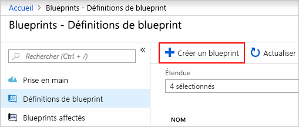
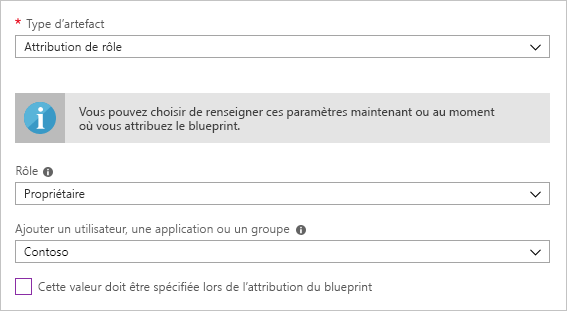
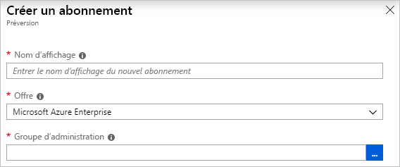

# <a name="define-and-assign-an-azure-blueprint-in-the-portal"></a>Définir et affecter un blueprint Azure dans le portail

Un utilisateur qui sait comment créer et affecter des blueprints peut définir des modèles courants et développer des configurations réutilisables et rapides à déployer en fonction de modèles Resource Manager, de stratégies, d’exigences en matière de sécurité, etc. Dans ce tutoriel, vous allez découvrir comment utiliser Azure Blueprint pour effectuer des tâches courantes liées à la création, à la publication et à l’affectation d’un blueprint dans votre organisation, notamment :

> [!div class="checklist"]
> - Créer un blueprint et ajouter divers artefacts pris en charge
> - Apporter des changements à un blueprint existant à l’état **Brouillon**
> - Marquer un blueprint comme prêt à être affecté en le faisant passer à l’état **Publié**
> - Affecter un blueprint à un abonnement existant
> - Vérifier l’état et la progression d’un blueprint affecté
> - Supprimer un blueprint affecté à un abonnement

Si vous n’avez pas d’abonnement Azure, créez un [compte gratuit](https://azure.microsoft.com/free) avant de commencer.

## <a name="create-a-blueprint"></a>Créer un blueprint

La première étape de la définition d’un modèle standard à des fins de conformité est de composer un blueprint à partir des ressources disponibles. Dans cet exemple, vous allez créer un blueprint nommé « MyBlueprint » pour configurer les attributions de rôle et de stratégie pour l’abonnement, ajouter un nouveau groupe de ressources, puis créer un modèle Resource Manager et une attribution de rôle sur le nouveau groupe de ressources.

1. Sélectionnez **Tous les services** dans le volet gauche. Recherchez et sélectionnez **Blueprints**.

1. Sélectionnez **Définitions de blueprint** dans la page de gauche, puis cliquez sur le bouton **+ Créer un blueprint** en haut de la page.

   - Vous pouvez également cliquer sur **Créer** dans la page **Démarrage** page pour accéder directement à la création d’un blueprint.

   

1. Dans **Nom du blueprint**, entrez par exemple « MyBlueprint » (chaîne composée de lettres et de chiffres ne dépassant pas 48 caractères et ne contenant pas d’espaces ou de caractères spéciaux). Laissez **Description du blueprint** vide pour l’instant.  Dans la zone **Emplacement de définition**, cliquez sur les points de suspension à droite, sélectionnez le [groupe d’administration](../management-groups/overview.md) ou l’abonnement dans lequel enregistrer le blueprint, puis cliquez sur **Sélectionner**.

1. Vérifiez que les informations contenues dans les champs **Nom du blueprint** et **Emplacement de définition** sont correctes, car vous ne pourrez pas les changer plus tard. Cliquez ensuite sur **Suivant : Artefacts** en bas de la page ou sur l’onglet **Artefacts** en haut de la page.

1. Ajoutez une attribution de rôle au niveau de l’abonnement : Cliquez sur la ligne **+ Ajouter un artefact...** sous **Abonnement**. La fenêtre « Ajouter un artefact » s’ouvre sur le côté droit du navigateur. Sélectionnez « Attribution de rôle » comme _Type d’artefact_. Sous _Rôle_, sélectionnez « Contributeur ». Laissez le champ _Ajouter un utilisateur, un groupe ou une application_ avec la case cochée pour indiquer un **paramètre dynamique**. Cliquez sur **Ajouter** pour ajouter cet artefact au blueprint.

   

   > [!NOTE]
   > La plupart des _artefacts_ prennent en charge les paramètres. Un paramètre auquel une valeur est affectée durant la création du blueprint est un **paramètre statique**. Si la valeur est affectée au paramètre durant l’affectation du blueprint, il s’agit d’un **paramètre dynamique**. Pour plus d’informations, consultez [Paramètres de blueprint](./concepts/parameters.md).

1. Ajoutez une affectation de stratégie au niveau de l’abonnement : Cliquez sur la ligne **+ Ajouter un artefact...** sous l’artefact d’attribution de rôle. Sélectionnez « Attribution de stratégie » comme _Type d’artefact_. Choisissez « Intégré » comme _Type_, puis entrez « tag » dans _Rechercher_. Cliquez en dehors de la fonction _Rechercher_ pour que le filtrage se produise. Sélectionnez « Appliquer l’étiquette et sa valeur par défaut aux groupes de ressources » en cliquant dessus. Cliquez sur **Ajouter** pour ajouter cet artefact au blueprint.

1. Cliquez sur la ligne d’affectation de stratégie « Appliquer l’étiquette et sa valeur par défaut aux groupes de ressources ». La fenêtre permettant de paramétrer l’artefact dans le cadre de la définition du blueprint s’ouvre. Vous définissez ainsi des **paramètres statiques** pour toutes les affectations basées sur ce blueprint (les **paramètres dynamiques** étant définis durant l’affectation). Cet exemple utilise des **paramètres dynamiques** durant l’affectation du blueprint. Veillez donc à conserver les valeurs par défaut et à cliquer sur **Annuler**.

1. Ajoutez un groupe de ressources à l’abonnement : Cliquez sur la ligne **+ Ajouter un artefact...** sous **Abonnement**. Sélectionnez « Groupe de ressources » comme _Type d’artefact_. Laissez les champs _Nom complet de l’artefact_, _Nom du groupe de ressources_ et _Emplacement_ vides, mais veillez à cocher la case de chaque propriété de paramètre pour en faire des **paramètres dynamiques**. Cliquez sur **Ajouter** pour ajouter cet artefact au blueprint.

1. Ajoutez le modèle sous le groupe de ressources : Cliquez sur **+ Ajouter un artefact...** sous l’entrée **ResourceGroup**. Sélectionnez « Modèle Azure Resource Manager » comme _type d’artefact_, définissez _Nom complet de l’artefact_ avec la valeur « StorageAccount », et laissez le champ _Description_ vide. Sous l’onglet **Modèle** dans la zone de l’éditeur, collez le modèle Resource Manager suivant. Après avoir collé le modèle, sélectionnez l’onglet **Paramètres** et notez que les paramètres du modèle **storageAccountType** et **location** ont été détectés. Chaque paramètre est automatiquement détecté et renseigné, mais configuré en tant que **paramètre dynamique**. Décochez la case **storageAccountType** et notez que la liste déroulante contient uniquement les valeurs incluses dans le modèle Resource Manager sous **allowedValues**. Cochez la case pour redéfinir le paramètre en **paramètre dynamique**. Cliquez sur **Ajouter** pour ajouter cet artefact au blueprint.

   > [!IMPORTANT]
   > Si vous importez le modèle, vérifiez que le fichier est uniquement au format JSON et qu’il ne contient pas de code HTML. Quand vous pointez vers une URL sur GitHub, veillez auparavant à cliquer sur **RAW** pour obtenir le fichier JSON pur et non celui inclus dans un wrapper HTML à des fins d’affichage sur GitHub. Si le modèle importé n’est pas entièrement au format JSON, une erreur se produit.

   ```json
   {
       "$schema": "https://schema.management.azure.com/schemas/2015-01-01/deploymentTemplate.json#",
       "contentVersion": "1.0.0.0",
       "parameters": {
           "storageAccountType": {
               "type": "string",
               "defaultValue": "Standard_LRS",
               "allowedValues": [
                   "Standard_LRS",
                   "Standard_GRS",
                   "Standard_ZRS",
                   "Premium_LRS"
               ],
               "metadata": {
                   "description": "Storage Account type"
               }
           },
           "location": {
               "type": "string",
               "defaultValue": "[resourceGroup().location]",
               "metadata": {
                   "description": "Location for all resources."
               }
           }
       },
       "variables": {
           "storageAccountName": "[concat('store', uniquestring(resourceGroup().id))]"
       },
       "resources": [{
           "type": "Microsoft.Storage/storageAccounts",
           "name": "[variables('storageAccountName')]",
           "location": "[parameters('location')]",
           "apiVersion": "2018-07-01",
           "sku": {
               "name": "[parameters('storageAccountType')]"
           },
           "kind": "StorageV2",
           "properties": {}
       }],
       "outputs": {
           "storageAccountName": {
               "type": "string",
               "value": "[variables('storageAccountName')]"
           }
       }
   }
   ```

   

1. Votre blueprint terminé doit ressembler à ce qui suit. Notez que chaque artefact a « _x_ paramètres renseignés sur _y_ » sous la colonne _Paramètres_. Les **paramètres dynamiques** sont définis à chaque affectation du blueprint.

   

1. Une fois tous les artefacts planifiés ajoutés, cliquez sur **Enregistrer le brouillon** en bas de la page.

## <a name="edit-a-blueprint"></a>Modifier un blueprint

Dans [Créer un blueprint](#create-a-blueprint), aucune description n’a été fournie et aucune attribution de rôle n’a été ajoutée au nouveau groupe de ressources. Ces deux éléments peuvent être renseignés en suivant les étapes ci-après :

1. Sélectionnez **Définitions de blueprint** dans la page de gauche.

1. Dans la liste des blueprints, cliquez avec le bouton droit sur celui précédemment créé et sélectionnez **Modifier le blueprint**.

1. Dans **Description du blueprint**, fournissez des informations sur le blueprint et les artefacts qui le composent.  Dans ce cas, entrez un texte semblable à celui-ci : « Ce blueprint définit la stratégie des étiquettes et l’attribution de rôle sur l’abonnement, crée un groupe de ressources, et déploie un modèle de ressource et une attribution de rôle sur ce groupe de ressources. »

1. Cliquez sur **Suivant : Artefacts** en bas de la page ou sur l’onglet **Artefacts** en haut de la page.

1. Ajoutez une attribution de rôle sous le groupe de ressources : Cliquez sur la ligne **+ Ajouter un artefact...** directement sous l’entrée **ResourceGroup**. Sélectionnez « Attribution de rôle » comme _Type d’artefact_. Sous _Rôle_, sélectionnez « Propriétaire » et décochez la case sous le champ _Ajouter un utilisateur, un groupe ou une application_. Ensuite, recherchez et sélectionnez un utilisateur, un groupe ou une application à ajouter. Cet artefact utilise un **paramètre statique** qui sera défini de la même manière dans toutes les affectations de ce blueprint. Cliquez sur **Ajouter** pour ajouter cet artefact au blueprint.

   

1. Votre blueprint terminé doit ressembler à ce qui suit. Notez que l’attribution de rôle nouvellement ajoutée montre **1 paramètres renseignés sur 1**, ce qui signifie qu’il s’agit d’un **paramètre statique**.

   

1. Le blueprint étant désormais à jour, cliquez sur **Enregistrer le brouillon**.

## <a name="publish-a-blueprint"></a>Publier un blueprint

Maintenant que tous les artefacts planifiés ont été ajoutés au blueprint, il est temps de le publier.
Une fois un blueprint publié, il peut être affecté à un abonnement.

1. Sélectionnez **Définitions de blueprint** dans la page de gauche.

1. Dans la liste des blueprints, cliquez avec le bouton droit sur celui précédemment créé et sélectionnez **Publier le blueprint**.

1. Dans la boîte de dialogue qui s’ouvre, indiquez une **Version**, par exemple « v1 » (au maximum 20 caractères : lettres, chiffres et traits d’union). Vous pouvez aussi indiquer des **Notes de changement**, par exemple « Première publication ».

1. Cliquez sur **Publier** en bas de la page.

## <a name="assign-a-blueprint"></a>Affecter un blueprint

Une fois un blueprint publié, vous pouvez l’affecter à un abonnement. Affectez le blueprint que vous avez créé à l’un des abonnements sous votre hiérarchie de groupes d’administration. Si le blueprint est enregistré dans un abonnement, il ne peut être attribué qu’à cet abonnement.

1. Sélectionnez **Définitions de blueprint** dans la page de gauche.

1. Dans la liste des blueprints, cliquez avec le bouton droit sur celui précédemment créé (ou sélectionnez les points de suspension), puis sélectionnez **Affecter le blueprint**.

1. Dans la page **Affecter le blueprint**, sélectionnez le ou les abonnements sur lesquels vous souhaitez déployer ce blueprint dans la liste déroulante **Abonnement**.

   - Si des offres Entreprise prises en charge sont disponibles à partir de [Facturation Azure](../../billing/index.md), un lien **Créer** est activé sous la zone **Abonnement**.

     1. Sélectionnez le lien **Créer** pour créer un abonnement au lieu d’en sélectionner des existants.

        

     1. Indiquez le **nom complet** du nouvel abonnement.

     1. Sélectionnez l’**offre** disponible dans la liste déroulante.

     1. Utilisez le bouton de sélection pour sélectionner le [groupe d’administration](../management-groups/index.md) dont l’abonnement sera enfant.

     1. Au bas de la page, sélectionnez **Créer**.

     > [!IMPORTANT]
     > Le nouvel abonnement est immédiatement créé quand vous sélectionnez **Créer**.

   > [!NOTE]
   > Une affectation est créée pour chaque abonnement sélectionné, ce qui permet d’apporter par la suite des changements à une seule affectation d’abonnement sans forcer les changements sur le reste des abonnements sélectionnés.

1. Dans **Nom affecté**, donnez un nom unique à cette affectation.

1. Dans **Emplacement**, sélectionnez une région dans laquelle créer l’identité managée. Azure Blueprint utilise cette identité managée pour déployer tous les artefacts dans le blueprint affecté. Pour en savoir plus, consultez [Identités managées pour les ressources Azure](../../active-directory/managed-identities-azure-resources/overview.md).

1. Dans la liste déroulante **Version de définition du blueprint** des versions **Publiée**, conservez l’entrée « v1 » (par défaut, la dernière version **Publiée**).

1. Pour **Verrouiller l’affectation**, conservez la valeur par défaut **Ne pas verrouiller**. Pour plus d’informations, consultez [Verrouillage des ressources des blueprints](./concepts/resource-locking.md).

1. Pour l’attribution de rôle au niveau de l’abonnement **[Groupe d’utilisateurs ou nom de l’application] : Contributeur**, recherchez et sélectionnez un utilisateur, une application ou un groupe.

1. Pour l’affectation de stratégie au niveau de l’abonnement, affectez « CostCenter » à **Nom d’étiquette** et « ContosoIT » à **Valeur de l’étiquette**.

1. Pour « ResourceGroup », entrez « StorageAccount » comme **Nom** et choisissez « USA Est 2 » comme **Emplacement** dans la liste déroulante.

   > [!NOTE]
   > Chaque artefact ajouté sous le groupe de ressources durant la définition du blueprint est mis en retrait pour qu’il soit aligné avec le groupe de ressources ou l’objet avec lequel il sera déployé. Les artefacts qui ne prennent pas de paramètres ou qui n’ont pas de paramètres à définir au moment de l’affectation sont uniquement répertoriés pour fournir des informations contextuelles.

1. Sur le modèle Azure Resource Manager « StorageAccount », sélectionnez « Standard_GRS » comme paramètre **storageAccountType**.

1. Lisez la zone d’informations en bas de la page, puis cliquez sur **Affecter**.

## <a name="track-deployment-of-a-blueprint"></a>Suivre le déploiement d’un modèle

Quand un blueprint est affecté à un ou plusieurs abonnements, deux événements se produisent :

- Le blueprint est ajouté à la page **Blueprints affectés** par abonnement.
- Le processus de déploiement de tous les artefacts définis par le blueprint démarre.

Une fois le blueprint affecté à un abonnement, vérifiez la progression du déploiement.

1. Sélectionnez **Blueprints affectés** dans la page de gauche.

1. Dans la liste des blueprints, cliquez avec le bouton droit sur celui précédemment affecté et sélectionnez **Voir les détails de l’affectation**.

   

1. Dans la page **Attribution de blueprint**, vérifiez que tous les artefacts ont été déployés et qu’aucune erreur ne s’est produite durant le déploiement. Si des erreurs ont eu lieu, consultez [Dépannage d’un blueprint](./troubleshoot/general.md) pour déterminer la cause du problème.

## <a name="unassign-a-blueprint"></a>Annuler l’affectation d’un blueprint

Si vous n’en n’avez plus besoin, supprimez une affectation de blueprint d’un abonnement. Cela peut s’avérer nécessaire si, par exemple, le blueprint a été remplacé par un autre plus récent contenant des modèles, des stratégies et des conceptions mis à jour. Quand un blueprint est supprimé, les artefacts affectés dans le cadre de ce blueprint sont abandonnés. Pour supprimer une affectation de blueprint, effectuez les étapes suivantes :

1. Sélectionnez **Blueprints affectés** dans la page de gauche.

1. Dans la liste des blueprints, sélectionnez celui dont vous souhaitez annuler l’affectation, puis cliquez sur le bouton **Annuler l’affectation du blueprint** en haut de la page.

1. Lisez le message de confirmation, puis cliquez sur **OK**.

## <a name="delete-a-blueprint"></a>Supprimer un blueprint

1. Sélectionnez **Définitions de blueprint** dans la page de gauche.

1. Cliquez avec le bouton droit sur le blueprint à supprimer, sélectionnez **Supprimer le blueprint**, puis cliquez sur **Oui** dans la boîte de dialogue de confirmation.

> [!NOTE]
> La suppression d’un blueprint dans cette méthode supprime également toutes les **versions publiées** du blueprint sélectionné. Pour supprimer une version unique, ouvrez le blueprint, cliquez sur l’onglet **Versions publiées**, sur la version à supprimer, puis sur **Supprimer cette version**. Sachez que la suppression d’un blueprint avec des affectations nécessite au préalable la suppression de toutes ces affectations.

## <a name="next-steps"></a>Étapes suivantes

- En savoir plus sur le [cycle de vie des blueprints](./concepts/lifecycle.md)
- Comprendre comment utiliser les [paramètres statiques et dynamiques](./concepts/parameters.md)
- Apprendre à personnaliser [l’ordre de séquencement des blueprints](./concepts/sequencing-order.md)
- Découvrir comment utiliser le [verrouillage des ressources de blueprint](./concepts/resource-locking.md)
- Découvrir comment [mettre à jour des affectations existantes](./how-to/update-existing-assignments.md)
- Résoudre les problèmes durant l’affectation d’un blueprint en suivant les étapes de [dépannage général](./troubleshoot/general.md)