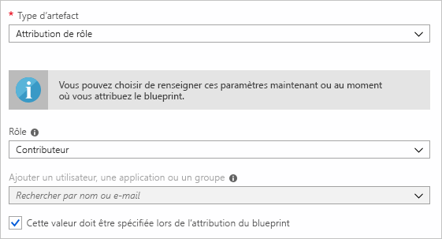
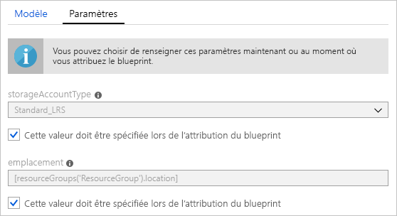
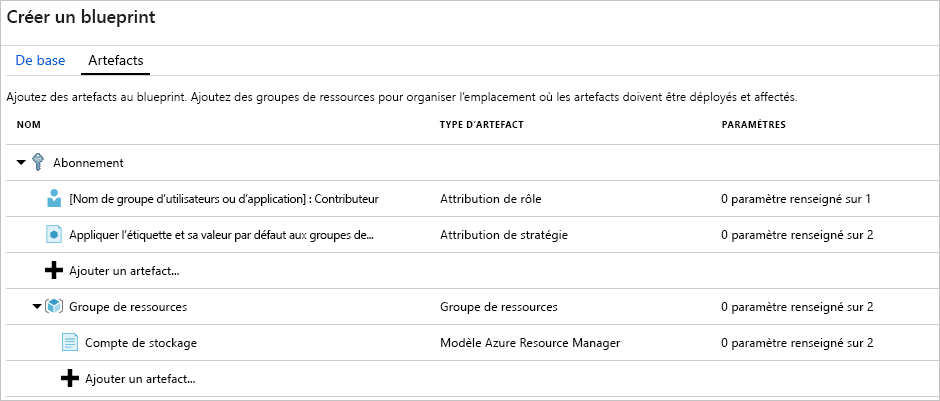
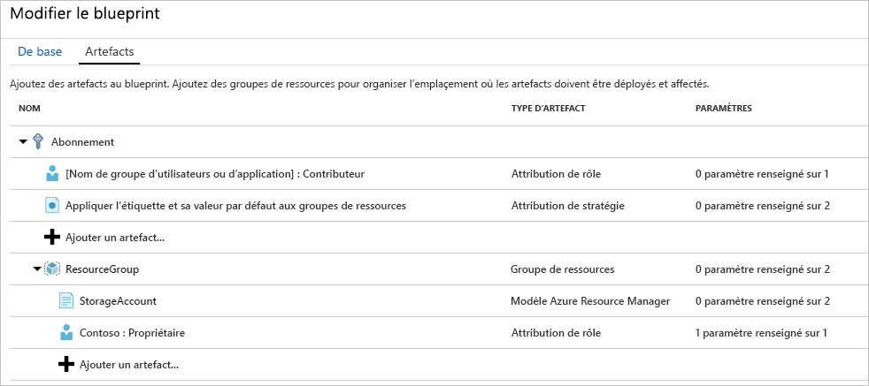
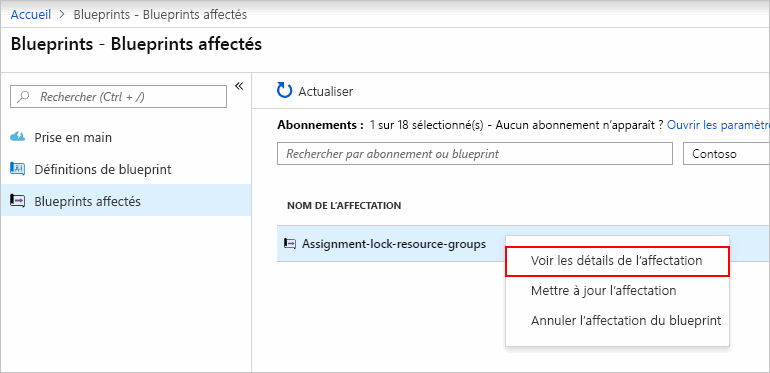

# <a name="quickstart-define-and-assign-a-blueprint-in-the-portal"></a>Démarrage rapide : Définir et affecter un blueprint dans le portail

Lorsque vous apprenez à créer et à affecter des blueprints, vous pouvez définir des modèles courants et développer des configurations réutilisables et rapides à déployer basées sur des modèles Azure Resource Manager, des stratégies, des exigences de sécurité, etc. Dans ce tutoriel, vous allez découvrir comment utiliser Azure Blueprints pour effectuer des tâches courantes liées à la création, à la publication et à l’affectation d’un blueprint dans votre organisation. Voici certaines de ces tâches :

> [!div class="checklist"]
> - Créer un blueprint et ajouter divers artefacts pris en charge
> - Apporter des changements à un blueprint existant à l’état **Brouillon**
> - Marquer un blueprint comme prêt à être affecté en le faisant passer à l’état **Publié**
> - Affecter un blueprint à un abonnement existant
> - Vérifier l’état et la progression d’un blueprint affecté
> - Supprimer un blueprint affecté à un abonnement

Si vous n’avez pas d’abonnement Azure, créez un [compte gratuit](https://azure.microsoft.com/free) avant de commencer.

## <a name="create-a-blueprint"></a>Créer un blueprint

La première étape de la définition d’un modèle standard à des fins de conformité est de composer un blueprint à partir des ressources disponibles. Dans cet exemple, nous allons créer un blueprint nommé **MyBlueprint** pour configurer les attributions de rôles et de stratégies pour l’abonnement. Ensuite, nous allons ajouter un groupe de ressources, un modèle Resource Manager et une attribution de rôle dans le groupe de ressources.

1. Sélectionnez **Tous les services** dans le volet gauche. Recherchez et sélectionnez **Blueprints**.

1. Sélectionnez **Définitions de blueprint** dans la page de gauche, puis sélectionnez le bouton **+ Créer un blueprint** en haut de la page.

   Vous pouvez également sélectionner **Créer** dans la page **Démarrage** pour accéder directement à la création d’un blueprint.

   

1. Dans **Nom du blueprint**, fournissez un nom tel que **MyBlueprint** (vous pouvez utiliser jusqu’à 48 lettres et chiffres, mais pas d’espaces ni de caractères spéciaux). Laissez le champ **Description du blueprint** vide pour l’instant.

1. Dans la zone **Emplacement de définition**, sélectionnez les points de suspension à droite, sélectionnez le [groupe d’administration](../management-groups/overview.md) ou l’abonnement dans lequel enregistrer le blueprint, puis choisissez **Sélectionner**.

1. Vérifiez que les informations sont correctes. Une fois définis, les champs **Nom du blueprint** et **Emplacement de définition** ne peuvent plus être modifiés. Ensuite, sélectionnez **Suivant : Artefacts** en bas de la page ou sur l’onglet **Artefacts** en haut de la page.

1. Ajoutez une attribution de rôle au niveau de l’abonnement :

   1. Sélectionnez la ligne **+ Ajouter un artefact** située sous **Abonnement**. La fenêtre **Ajouter un artefact** s’ouvre sur la droite.

   1. Sélectionnez **Attribution de rôle** comme **Type d’artefact**.

   1. Sous **Rôle**, sélectionnez **Contributeur**. N’entrez rien dans le champ **Ajouter un utilisateur, une application ou un groupe** sous lequel la case cochée indique qu’il s’agit d’un paramètre dynamique.

   1. Sélectionnez **Ajouter** pour ajouter cet artefact au blueprint.

   

   > [!NOTE]
   > La plupart des artefacts prennent en charge les paramètres. Un paramètre auquel une valeur est affectée durant la création du blueprint est un *paramètre statique*. Si la valeur est attribuée au paramètre durant l’affectation du blueprint, il s’agit d’un *paramètre dynamique*. Pour plus d’informations, consultez [Paramètres de blueprint](./concepts/parameters.md).

1. Ajoutez une attribution de stratégie au niveau de l’abonnement :

   1. Sélectionnez la ligne **+ Ajouter un artefact** sous l’artefact d’attribution de rôle.

   1. Sélectionnez **Attribution de stratégie** comme **Type d’artefact**.

   1. Définissez le **Type** sur **Intégré**. Dans la zone **Recherche**, entrez **étiquette**.

   1. Cliquez en dehors de la fonction **Rechercher** pour que le filtrage se produise. Sélectionnez **Ajouter l’étiquette et sa valeur par défaut aux groupes de ressources**.

   1. Sélectionnez **Ajouter** pour ajouter cet artefact au blueprint.

1. Sélectionnez la ligne d’attribution de stratégie **Ajouter l’étiquette et sa valeur par défaut aux groupes de ressources**.

1. La fenêtre permettant de paramétrer l’artefact dans le cadre de la définition du blueprint s’ouvre. Vous définissez ainsi des paramètres statiques pour toutes les affectations basées sur ce blueprint (les paramètres dynamiques étant définis durant l’affectation). Cet exemple utilise des paramètres dynamiques durant l’affectation du blueprint. Veillez donc à conserver les valeurs par défaut et à sélectionner **Annuler**.

1. Ajoutez un groupe de ressources au niveau de l’abonnement :

   1. Sélectionnez la ligne **+ Ajouter un artefact** située sous **Abonnement**.

   1. Sélectionnez **Groupe de ressources** comme **Type d’artefact**.

   1. Laissez les champs **Nom complet de l’artefact**, **Nom du groupe de ressources** et **Emplacement** vides, mais cochez la case de chaque propriété de paramètre pour en faire des paramètres dynamiques.

   1. Sélectionnez **Ajouter** pour ajouter cet artefact au blueprint.

1. Ajoutez un modèle sous le groupe de ressources :

   1. Sélectionnez la ligne **+ Ajouter un artefact** sous l’entrée **ResourceGroup**.

   1. Sélectionnez **Modèle Azure Resource Manager** comme **type d’artefact**, définissez **Nom complet de l’artefact** sur la valeur **StorageAccount**, et laissez le champ **Description** vide.

   1. Sous l’onglet **Modèle** dans la zone de l’éditeur, collez le modèle Resource Manager suivant.
      Après avoir collé le modèle, sélectionnez l’onglet **Paramètres** et notez que les paramètres du modèle **storageAccountType** et **location** ont été détectés. Chaque paramètre est automatiquement détecté et renseigné, mais configuré en tant que paramètre dynamique.

      > [!IMPORTANT]
      > Si vous importez le modèle, vérifiez que le fichier est uniquement au format JSON et qu’il ne contient pas de code HTML. Quand vous pointez vers une URL GitHub, vérifiez que vous avez bien sélectionné **RAW** pour obtenir le fichier JSON pur et non celui qui a été wrappé avec du code HTML à des fins d’affichage sur GitHub. Si le modèle importé n’est pas entièrement au format JSON, une erreur se produit.

      ```json
      {
          "$schema": "https://schema.management.azure.com/schemas/2015-01-01/deploymentTemplate.json#",
          "contentVersion": "1.0.0.0",
          "parameters": {
              "storageAccountType": {
                  "type": "string",
                  "defaultValue": "Standard_LRS",
                  "allowedValues": [
                      "Standard_LRS",
                      "Standard_GRS",
                      "Standard_ZRS",
                      "Premium_LRS"
                  ],
                  "metadata": {
                      "description": "Storage Account type"
                  }
              },
              "location": {
                  "type": "string",
                  "defaultValue": "[resourceGroup().location]",
                  "metadata": {
                      "description": "Location for all resources."
                  }
              }
          },
          "variables": {
              "storageAccountName": "[concat('store', uniquestring(resourceGroup().id))]"
          },
          "resources": [{
              "type": "Microsoft.Storage/storageAccounts",
              "name": "[variables('storageAccountName')]",
              "location": "[parameters('location')]",
              "apiVersion": "2018-07-01",
              "sku": {
                  "name": "[parameters('storageAccountType')]"
              },
              "kind": "StorageV2",
              "properties": {}
          }],
          "outputs": {
              "storageAccountName": {
                  "type": "string",
                  "value": "[variables('storageAccountName')]"
              }
          }
      }
      ```

   1. Décochez la case **storageAccountType** et notez que la liste déroulante contient uniquement les valeurs incluses dans le modèle Resource Manager sous **allowedValues**. Cochez la case pour redéfinir le paramètre en paramètre dynamique.

   1. Sélectionnez **Ajouter** pour ajouter cet artefact au blueprint.

   

1. Votre blueprint terminé doit ressembler à ce qui suit. Notez que chaque artefact a **_x_ paramètres renseignés sur _y_** dans la colonne **Paramètres**. Les paramètres dynamiques sont définis à chaque affectation du blueprint.

   

1. Une fois tous les artefacts planifiés ajoutés, sélectionnez **Enregistrer le brouillon** en bas de la page.

## <a name="edit-a-blueprint"></a>Modifier un blueprint

Dans [Créer un blueprint](#create-a-blueprint), vous n’avez pas fourni de description ni attribué de rôle au nouveau groupe de ressources. Pour le faire, effectuez les étapes suivantes :

1. Sélectionnez **Définitions de blueprint** dans la page de gauche.

1. Dans la liste des blueprints, cliquez avec le bouton droit sur celui précédemment créé, puis sélectionnez **Modifier le blueprint**.

1. Dans **Description du blueprint**, fournissez des informations sur le blueprint et les artefacts qui le composent. Dans ce cas, entrez un texte semblable à celui-ci : **Ce blueprint définit la stratégie des étiquettes et l’attribution de rôle sur l’abonnement, crée un groupe de ressources, et déploie un modèle de ressource et une attribution de rôle sur ce groupe de ressources**.

1. Sélectionnez **Suivant : Artefacts** en bas de la page ou sur l’onglet **Artefacts** en haut de la page.

1. Ajoutez une attribution de rôle sous le groupe de ressources :

   1. Sélectionnez la ligne **+ Ajouter un artefact** directement sous l’entrée **ResourceGroup**.

   1. Sélectionnez **Attribution de rôle** comme **Type d’artefact**.

   1. Sous **Rôle**, sélectionnez **Propriétaire**, puis décochez la case située sous le champ **Ajouter un utilisateur, une application ou un groupe**.

   1. Recherchez puis sélectionnez un utilisateur, une application ou un groupe à ajouter. Cet artefact utilise un paramètre statique qui sera défini de la même manière dans toutes les affectations de ce blueprint.

   e. Sélectionnez **Ajouter** pour ajouter cet artefact au blueprint.

   

1. Votre blueprint terminé doit ressembler à ce qui suit. Remarquez que l’attribution de rôle nouvellement ajoutée montre **1 paramètres renseignés sur 1**. Cela signifie qu’il s’agit d’un paramètre statique.

   

1. Le blueprint étant désormais à jour, sélectionnez **Enregistrer le brouillon**.

## <a name="publish-a-blueprint"></a>Publier un blueprint

Maintenant que tous les artefacts planifiés ont été ajoutés au blueprint, il est temps de le publier.
Une fois publié, un blueprint peut être affecté à un abonnement.

1. Sélectionnez **Définitions de blueprint** dans la page de gauche.

1. Dans la liste des blueprints, cliquez avec le bouton droit sur celui précédemment créé, puis sélectionnez **Publier le blueprint**.

1. Dans le volet qui s’ouvre, indiquez une **Version** (au maximum 20 caractères : lettres, chiffres et traits d’union), par exemple **v1**. Vous pouvez aussi entrer du texte dans **Notes de changement**, par exemple **Première publication**.

1. Sélectionnez **Publier** en bas de la page.

## <a name="assign-a-blueprint"></a>Affecter un blueprint

Une fois publié, vous pouvez affecter le blueprint à un abonnement. Affectez le blueprint que vous avez créé à l’un des abonnements de votre hiérarchie de groupes d’administration. Si le blueprint est enregistré dans un abonnement, il ne peut être attribué qu’à cet abonnement.

1. Sélectionnez **Définitions de blueprint** dans la page de gauche.

1. Dans la liste des blueprints, cliquez avec le bouton droit sur celui précédemment créé (ou sélectionnez les points de suspension), puis sélectionnez **Affecter le blueprint**.

1. Dans la liste déroulante **Abonnement** de la page **Affecter le blueprint**, sélectionnez les abonnements dans lesquels vous souhaitez déployer ce blueprint.

   Si des offres Entreprise prises en charge sont disponibles à partir de [Facturation Azure](../../billing/index.md), un lien **Créer** est activé sous la zone **Abonnement**. Procédez comme suit :

   1. Sélectionnez le lien **Créer** pour créer un abonnement au lieu d’en sélectionner des existants.

   1. Indiquez le **nom complet** du nouvel abonnement.

   1. Sélectionnez l’**offre** disponible dans la liste déroulante.

   1. Utilisez le bouton de sélection pour sélectionner le [groupe d’administration](../management-groups/overview.md) dont l’abonnement sera enfant.

   1. Au bas de la page, sélectionnez **Créer**.

   

   > [!IMPORTANT]
   > Quand vous sélectionnez **Créer**, le nouvel abonnement est immédiatement créé.

   > [!NOTE]
   > Une affectation est créée pour chaque abonnement que vous sélectionnez. Par la suite, vous pouvez apporter des modifications à une affectation d’abonnement sans modifier les autres abonnements sélectionnés.

1. Dans **Nom de l’affectation**, fournissez un nom unique pour cette affectation.

1. Dans **Emplacement**, sélectionnez une région dans laquelle créer l’identité managée et un objet de déploiement d’abonnement. Azure Blueprint utilise cette identité managée pour déployer tous les artefacts dans le blueprint affecté. Pour en savoir plus, consultez [Identités managées pour ressources Azure](../../active-directory/managed-identities-azure-resources/overview.md).

1. Dans la liste déroulante **Version de définition du blueprint** des versions **Publiée**, conservez l’entrée **v1** (par défaut, il s’agit de la dernière version publiée).

1. Pour **Verrouiller l’affectation**, conservez la valeur par défaut **Ne pas verrouiller**. Pour plus d’informations, consultez [Verrouillage des ressources des blueprints](./concepts/resource-locking.md).

   

1. Sous **Identité managée**, conservez la valeur par défaut **Affecté(e) par le système**.

1. Pour l’attribution de rôle au niveau de l’abonnement **[Groupe d’utilisateurs ou nom de l’application] : Contributeur**, recherchez et sélectionnez un utilisateur, une application ou un groupe.

1. Pour l’attribution de stratégie au niveau de l’abonnement, définissez **Nom d’étiquette** sur **CostCenter** et **Valeur de l’étiquette** sur **ContosoIT**.

1. Pour **ResourceGroup**, entrez **StorageAccount** comme **Nom**, puis choisissez **USA Est 2** comme **Emplacement** dans la liste déroulante.

   > [!NOTE]
   > Chaque artefact ajouté sous le groupe de ressources durant la définition du blueprint est mis en retrait de façon à être aligné sur le groupe de ressources ou l’objet avec lequel il sera déployé.
   > Les artefacts qui ne prennent pas de paramètres, ou qui n’ont pas de paramètres devant être définis au moment de l’affectation, sont uniquement listés dans le but de fournir des informations contextuelles.

1. Dans le modèle Azure Resource Manager **StorageAccount**, sélectionnez **Standard_GRS** comme paramètre **storageAccountType**.

1. Lisez les informations en bas de page, puis sélectionnez **Affecter**.

## <a name="track-deployment-of-a-blueprint"></a>Suivre le déploiement d’un modèle

Quand un blueprint est affecté à un ou plusieurs abonnements, deux événements se produisent :

- Le blueprint est ajouté à la page **Blueprints affectés** pour chaque abonnement.
- Le processus de déploiement de tous les artefacts définis par le blueprint démarre.

Maintenant que le blueprint est affecté à un abonnement, vérifiez la progression du déploiement :

1. Sélectionnez **Blueprints affectés** dans la page de gauche.

1. Dans la liste des blueprints, cliquez avec le bouton droit sur celui précédemment affecté, puis sélectionnez **Voir les détails de l’affectation**.

   

1. Dans la page **Affectation de blueprint**, vérifiez que tous les artefacts ont été déployés et qu’aucune erreur ne s’est produite durant le déploiement. Si des erreurs se sont produites, consultez [Dépannage d’un blueprint](./troubleshoot/general.md) pour déterminer la cause du problème.

## <a name="unassign-a-blueprint"></a>Annuler l’affectation d’un blueprint

Si vous n’avez plus besoin d’une affectation de blueprint, vous pouvez la supprimer de l’abonnement. Cela peut s’avérer nécessaire si, par exemple, le blueprint a été remplacé par un autre plus récent contenant des modèles, des stratégies et des conceptions mis à jour. Quand un blueprint est supprimé, les artefacts affectés dans le cadre de ce blueprint sont abandonnés. Pour supprimer une affectation de blueprint, effectuez les étapes suivantes :

1. Sélectionnez **Blueprints affectés** dans la page de gauche.

1. Dans la liste des blueprints, sélectionnez celui que vous ne souhaitez plus affecter. Ensuite, sélectionnez le bouton **Annuler l’affectation du blueprint** en haut de la page.

1. Lisez le message de confirmation, puis sélectionnez **OK**.

## <a name="delete-a-blueprint"></a>Supprimer un blueprint

1. Sélectionnez **Définitions de blueprint** dans la page de gauche.

1. Cliquez avec le bouton droit sur le blueprint à supprimer, puis sélectionnez **Supprimer le blueprint**. Ensuite, sélectionnez **Oui** dans la boîte de dialogue de confirmation.

> [!NOTE]
> Avec cette méthode, la suppression d’un blueprint entraîne également la suppression de toutes ses versions publiées.
> Pour supprimer une seule version, ouvrez le blueprint, sélectionnez l’onglet **Versions publiées**, sélectionnez la version à supprimer, puis sélectionnez **Supprimer cette version**. En outre, vous ne pouvez pas supprimer un blueprint tant que vous n’avez pas supprimé toutes les affectations de cette définition de blueprint.

## <a name="next-steps"></a>Étapes suivantes

- En savoir plus sur le [cycle de vie des blueprints](./concepts/lifecycle.md)
- Comprendre comment utiliser les [paramètres statiques et dynamiques](./concepts/parameters.md).
- Apprendre à personnaliser l’[ordre de séquencement des blueprints](./concepts/sequencing-order.md).
- Découvrir comment utiliser le [verrouillage de ressources de blueprint](./concepts/resource-locking.md).
- Découvrir comment [mettre à jour des affectations existantes](./how-to/update-existing-assignments.md).
- Résoudre les problèmes durant l’affectation d’un blueprint en suivant les étapes de [dépannage général](./troubleshoot/general.md).