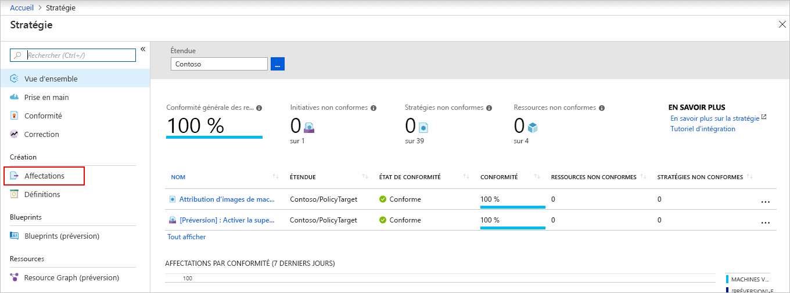
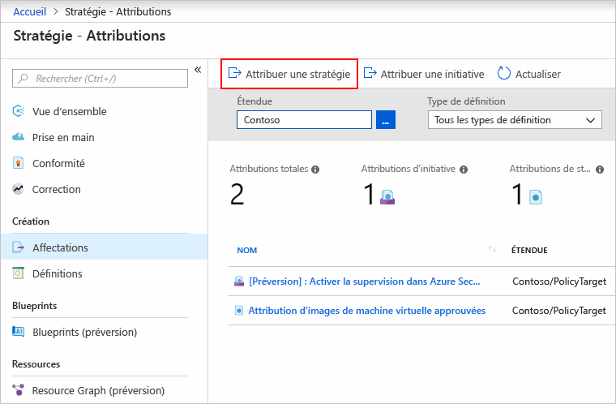
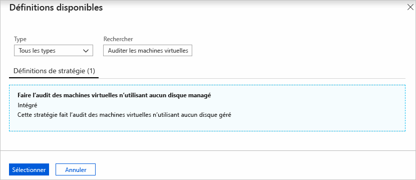
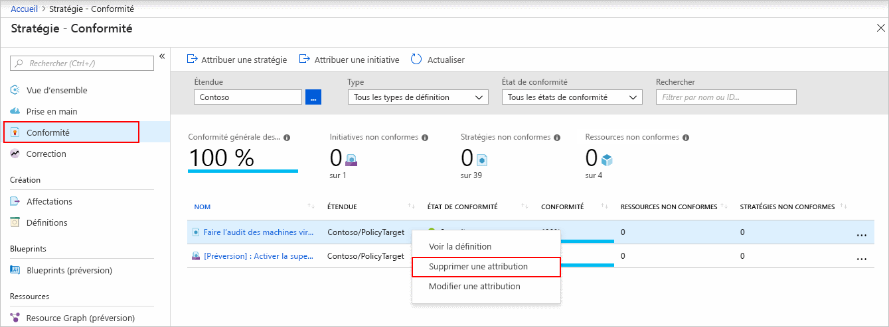

# Démarrage rapide : Créer une affectation de stratégie pour identifier les ressources non conformes

La première étape pour comprendre la conformité dans Azure consiste à identifier l’état de vos ressources.
Ce démarrage rapide vous guide pas à pas dans le processus de création d’une attribution de stratégie pour identifier les machines virtuelles qui n’utilisent pas de disques managés.

À la fin de ce processus, vous aurez identifié correctement les machines virtuelles qui n’utilisent pas de disques managés. Elles sont _non conformes_ à l’attribution de stratégie.

## Prérequis

Si vous n’avez pas d’abonnement Azure, créez un compte [gratuit](https://azure.microsoft.com/free/) avant de commencer.

## Créer une affectation de stratégie

Dans ce guide de démarrage rapide, vous créez une attribution de stratégie et affectez la définition de stratégie _Auditer les machines virtuelles qui n’utilisent pas de disques managés_.

1. Lancez le service Azure Policy dans le portail Azure en cliquant sur **Tous les services**, puis en recherchant et en cliquant sur **Stratégie**.

   

1. Sélectionnez **Affectations** du côté gauche de la page Azure Policy. Une affectation est une stratégie qui a été affectée pour être appliquée dans une étendue spécifique.

   

1. Sélectionnez **Assigner une stratégie** en haut de la page**Stratégie - Affectations**.

   

1. Dans la page **Assigner une stratégie**, sélectionnez **l’étendue** en cliquant sur les points de suspension et en sélectionnant un groupe d’administration ou un abonnement. Sélectionnez éventuellement un groupe de ressources. Une étendue détermine les ressources ou le regroupement de ressources sur lequel la stratégie est appliquée. Cliquez ensuite sur **Sélectionner** dans le bas de la page **Étendue**.

   Cet exemple utilise l’abonnement **Contoso**. Votre abonnement sera différent.

1. Vous pouvez exclure des ressources en fonction de **l’étendue**. Les **exclusions** commencent à un niveau inférieur à celui de **l’étendue**. Les **exclusions** étant facultatives, laissez ce champ vide pour l’instant.

1. Sélectionnez les points de suspension de **Définition de stratégie** pour ouvrir la liste des définitions disponibles. Azure Policy est fourni avec des définitions de stratégie intégrées que vous pouvez utiliser. De nombreuses définitions de stratégie sont disponibles, par exemple :

   - Enforce tag and its value
   - Apply tag and its value
   - Nécessitent SQL Server version 12.0

   Pour obtenir une liste partielle des stratégies intégrées disponibles, consultez [Exemples Azure Policy](./samples/index.md).

1. Recherchez la définition _Auditer les machines virtuelles qui n’utilisent pas de disques managés_ dans la liste des définitions de stratégie. Cliquez sur cette stratégie, puis sur **Sélectionner**.

   

1. Le **Nom de l’attribution** est automatiquement rempli avec le nom de stratégie que vous avez sélectionné, mais vous pouvez le modifier. Pour cet exemple, conservez _Auditer les machines virtuelles qui n’utilisent pas de disques managés_. Vous pouvez également ajouter une **Description** (facultatif). La description fournit des détails sur cette affectation de stratégie.
   Le champ **Affectée par** est automatiquement renseigné en fonction de l’utilisateur connecté. Ce champ étant facultatif, vous pouvez entrer des valeurs personnalisées.

1. Laissez la case **Créer une identité managée** non cochée. Vous _devez_ la cocher si la stratégie ou l’initiative inclut une stratégie avec l’effet [deployIfNotExists](./concepts/effects.md#deployifnotexists). La stratégie utilisée dans ce guide de démarrage rapide n'étant pas concernée, ne cochez pas la case. Pour plus d’informations, consultez [Identités managées](../../active-directory/managed-identities-azure-resources/overview.md) et [Fonctionnement de la sécurité par correction](./how-to/remediate-resources.md#how-remediation-security-works).

1. Cliquez sur **Affecter**.

Vous êtes maintenant prêt à identifier les ressources non conformes pour comprendre l’état de conformité de votre environnement.

## Identifier les ressources non conformes

Sélectionnez **Conformité** dans la partie gauche de la page. Recherchez ensuite l’affectation de stratégie **Auditer les machines virtuelles qui n’utilisent pas de disques managés** que vous avez créée.

Si des ressources existantes ne sont pas conformes à cette nouvelle affectation, elles apparaissent sous **Ressources non conformes**.

Si une condition est évaluée par rapport à vos ressources existantes et génère la valeur true, ces ressources sont marquées comme non conformes à la stratégie. Le tableau suivant montre comment les différents effets des stratégies fonctionnent avec l’évaluation des conditions pour l’état de conformité résultant. Même si vous ne voyez pas la logique d’évaluation dans le portail Azure, les résultats de l’état de conformité sont affichés. Le résultat d’état de conformité est soit conforme, soit non conforme.

| **État de la ressource** | **Effet** | **Évaluation de la stratégie** | **État de conformité** |
| --- | --- | --- | --- |
| Exists | Deny, Audit, Append\*, DeployIfNotExist\*, AuditIfNotExist\* | True | Non conforme |
| Exists | Deny, Audit, Append\*, DeployIfNotExist\*, AuditIfNotExist\* | False | Conforme |
| Nouveau | Audit, AuditIfNotExist\* | True | Non conforme |
| Nouveau | Audit, AuditIfNotExist\* | False | Conforme |

\* Les effets Append, DeployIfNotExist et AuditIfNotExist nécessitent que l’instruction IF ait la valeur TRUE.
Les effets nécessitent également que la condition d’existence ait la valeur FALSE pour être non conformes. Lorsque la valeur est TRUE, la condition IF déclenche l’évaluation de la condition d’existence pour les ressources associées.

## Supprimer des ressources

Pour supprimer l’affectation créée, procédez comme suit :

1. Sélectionnez **Conformité** (ou **Affectations**) dans la partie gauche de la page Azure Policy et recherchez l’affectation de stratégie **Auditer les machines virtuelles qui n’utilisent pas de disques managés** que vous avez créée.

1. Cliquez avec le bouton droit sur l’affectation de stratégie **Auditer les machines virtuelles qui n’utilisent pas de disques managés** et sélectionnez **Supprimer l’attribution**.

   

## Étapes suivantes

Dans ce guide de démarrage rapide, vous avez affecté une définition de stratégie à une étendue et vous avez évalué son rapport de conformité.
La définition de stratégie permet de vérifier que toutes les ressources dans l’étendue sont conformes, ainsi que d’identifier celles qui ne le sont pas.

Pour en savoir plus sur l’affectation de stratégies visant à vérifier que les nouvelles ressources sont conformes, suivez le tutoriel :

> [!div class="nextstepaction"]
> [Création et gestion des stratégies](./tutorials/create-and-manage.md)