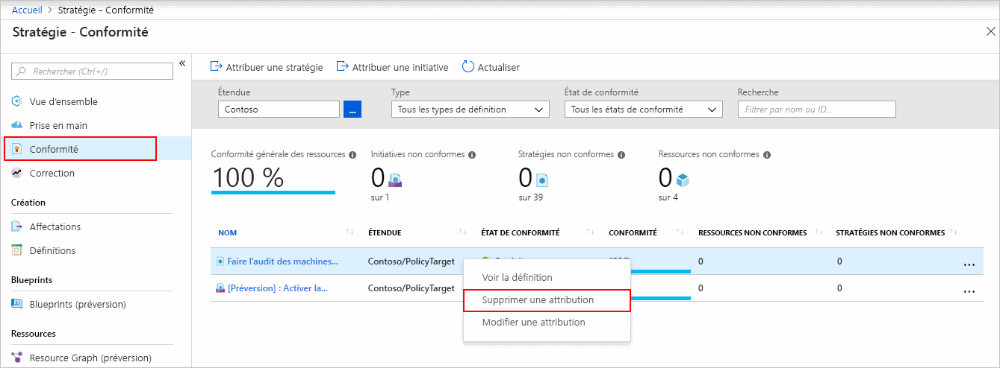

# Créer une affectation de stratégie pour identifier des ressources non conformes à l’aide d’un modèle Resource Manager

La première étape pour comprendre la conformité dans Azure consiste à identifier l’état de vos ressources.
Ce démarrage rapide vous guide pas à pas dans le processus de création d’une attribution de stratégie pour identifier les machines virtuelles qui n’utilisent pas de disques managés.

À la fin de ce processus, vous aurez identifié correctement les machines virtuelles qui n’utilisent pas de disques managés. Elles sont *non conformes* à l’attribution de stratégie.

Si vous n’avez pas d’abonnement Azure, créez un compte [gratuit](https://azure.microsoft.com/free/) avant de commencer.

## Créer une affectation de stratégie

Dans ce guide de démarrage rapide, vous allez créer une affectation de stratégie et affecter une définition de stratégie intégrée appelée *Auditer les machines virtuelles qui n’utilisent pas de disques managés*. Pour obtenir une liste partielle des stratégies intégrées disponibles, consultez [Exemples de stratégie](./samples/index.md).

Il existe plusieurs méthodes pour créer des affectations de stratégie. Dans ce guide de démarrage rapide, vous allez utiliser un [modèle de démarrage rapide](https://azure.microsoft.com/resources/templates/101-azurepolicy-assign-builtinpolicy-resourcegroup/).
Voici une copie du modèle :

[!code-json[policy-assignment](~/quickstart-templates/101-azurepolicy-assign-builtinpolicy-resourcegroup/azuredeploy.json)]

> [!NOTE]
> Le service Azure Policy est gratuit.  Pour plus d’informations, consultez [Vue d’ensemble d’Azure Policy](./overview.md).

1. Sélectionnez l’image suivante pour vous connecter au portail Azure et ouvrir le modèle :

   [

1. Sélectionnez ou entrez les valeurs suivantes :

   | Nom | Valeur |
   |------|-------|
   | Abonnement | Sélectionnez votre abonnement Azure. |
   | Groupe de ressources | Sélectionnez **Créer**, spécifiez un nom, puis sélectionnez **OK**. Dans la capture d’écran, le nom du groupe de ressources est *mypolicyquickstart<Date in MMDD>rg*. |
   | Lieu | Sélectionnez une région. Par exemple, **USA Centre**. |
   | Nom de l’affectation de stratégie | Spécifiez un nom d’affectation de stratégie. Vous pouvez utiliser l’écran de définition de stratégie si vous le souhaitez. Par exemple, **Auditer les machines virtuelles qui n’utilisent pas de disques managés**. |
   | Nom du groupe de ressources | Spécifiez le nom du groupe de ressources auquel vous voulez affecter la stratégie. Dans ce démarrage rapide, utilisez la valeur par défaut **[resourceGroup().name]**. **[resourceGroup()](../../azure-resource-manager/resource-group-template-functions-resource.md#resourcegroup)**  est une fonction de modèle qui récupère le groupe de ressources. |
   | ID de définition de stratégie | Spécifiez **/providers/Microsoft.Authorization/policyDefinitions/0a914e76-4921-4c19-b460-a2d36003525a**. |
   | J’accepte les termes et conditions mentionnés ci-dessus | (Sélectionner) |

1. Sélectionnez **Achat**.

Ressources supplémentaires :

- Pour trouver des exemples de modèles supplémentaires, consultez [Modèle de démarrage rapide Azure](https://azure.microsoft.com/resources/templates/?resourceType=Microsoft.Authorization&pageNumber=1&sort=Popular).
- Pour obtenir des informations de référence sur les modèles, accédez au [document de référence des modèles Azure](/azure/templates/microsoft.authorization/allversions).
- Pour savoir comment développer des modèles Resource Manager, consultez la [documentation Azure Resource Manager](/azure/azure-resource-manager/).
- Pour découvrir le déploiement au niveau de l’abonnement, consultez [Créer des groupes de ressources et des ressources au niveau de l’abonnement](../../azure-resource-manager/deploy-to-subscription.md).

## Identifier les ressources non conformes

Sélectionnez **Conformité** dans la partie gauche de la page. Recherchez ensuite l’affectation de stratégie **Auditer les machines virtuelles qui n’utilisent pas de disques managés** que vous avez créée.

Si des ressources existantes ne sont pas conformes à cette nouvelle affectation, elles apparaissent sous **Ressources non conformes**.

Pour plus d’informations, consultez [Fonctionnement de la conformité](./how-to/get-compliance-data.md#how-compliance-works).

## Supprimer des ressources

Pour supprimer l’affectation créée, procédez comme suit :

1. Sélectionnez **Conformité** (ou **Affectations**) dans la partie gauche de la page Azure Policy et recherchez l’affectation de stratégie **Auditer les machines virtuelles qui n’utilisent pas de disques managés** que vous avez créée.

1. Cliquez avec le bouton droit sur l’affectation de stratégie **Auditer les machines virtuelles qui n’utilisent pas de disques managés** et sélectionnez **Supprimer l’attribution**.

   

## Étapes suivantes

Dans ce démarrage rapide, vous avez affecté une définition de stratégie intégrée à une étendue et vous avez évalué son rapport de conformité. La définition de stratégie permet de vérifier que toutes les ressources dans l’étendue sont conformes, ainsi que d’identifier celles qui ne le sont pas.

Pour en savoir plus sur l’affectation de stratégies visant à vérifier que les nouvelles ressources sont conformes, suivez le tutoriel :

> [!div class="nextstepaction"]
> [Création et gestion des stratégies](./tutorials/create-and-manage.md)