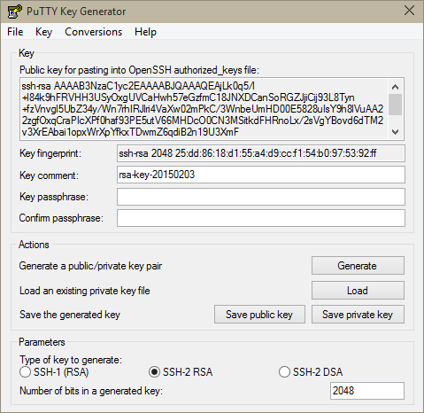
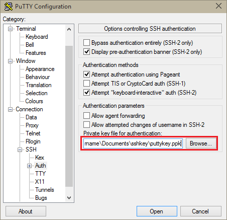

<properties
   pageTitle="Utilisation des clés SSH avec Hadoop dans HDInsight sous Linux à partir de Windows | Azure"
   description="Apprenez à créer et utiliser des clés SSH pour l'authentification dans les clusters HDInsight sous Linux."
   services="hdinsight"
   documentationCenter=""
   authors="Blackmist"
   manager="paulettm"
   editor="cgronlun"/>

<tags
   ms.service="hdinsight"
   ms.devlang=""
   ms.topic="article"
   ms.tgt_pltfrm="na"
   ms.workload="big-data"
   ms.date="02/18/2015"
   ms.author="larryfr"/>

##Utilisation de SSH avec Hadoop dans HDInsight sous Linux à partir de Windows (aperçu)

Les clusters HDInsight sous Linux offrent la possibilité de sécuriser l'accès SSH au moyen d'un mot de passe ou d'une clé SSH. Ce document fournit des informations relatives à la connexion à HDInsight depuis les clients Windows à l'aide du client SSH PuTTY.

> [AZURE.NOTE] Les étapes de cet article partent du principe que vous utilisez un client Windows. Si vous utilisez un client Linux, Unix ou OS X, consultez [Utiliser SSH avec Hadoop dans HDInsight sous Linux à partir de Linux, Unix ou OS X](hdinsight-hadoop-linux-use-ssh-unix.md).

##Conditions préalables

* **PuTTY** et **PuTTYGen** pour les clients Windows. Ces utilitaires sont disponibles à partir de <a href="http://www.chiark.greenend.org.uk/~sgtatham/putty/download.html" target="_blank">http://www.chiark.greenend.org.uk/~sgtatham/putty/download.html</a>

* Un navigateur Web moderne qui prend en charge HTML5

OU

* Azure PowerShell

OU

* Les outils en ligne de commande multiplateforme Azure

##Qu'est-ce que SSH ?

SSH est un utilitaire permettant de se connecter et d'exécuter à distance des commandes sur un serveur distant. Avec HDInsight sous Linux, SSH établit une connexion sécurisée au nœud principal du cluster et fournit une ligne de commande que vous utilisez pour taper les commandes. Les commandes sont ensuite exécutées directement sur le serveur.

##Création d'une clé SSH (facultatif)

À la création d'un cluster HDInsight sous Linux, vous avez la possibilité d'utiliser un mot de passe ou une clé SSH pour l'authentification au serveur lorsque vous utilisez SSH. Les clés SSH sont considérées comme plus sûres puisqu'elles sont basées sur un certificat. Utilisez les informations suivantes si vous envisagez d'utiliser les clés SSH avec votre cluster.

1. Ouvrez **PuTTYGen**.

2. Pour le **Type de clé à générer**, sélectionnez **SSH-2 RSA** puis cliquez sur **Générer**.

	

3. Déplacez la souris dans la zone sous la barre de progression jusqu'à ce la barre soit remplie. Le déplacement de la souris génère des données aléatoires qui sont utilisées pour générer la clé.

	

	Lorsque la clé est générée, la clé publique s'affiche.

4. Pour plus de sécurité, vous pouvez entrer une phrase secrète dans le champ **Phrase secrète de la clé** puis taper la même valeur dans le champ **Confirmer la phrase secrète**.

	
	
	> [AZURE.NOTE] Nous vous recommandons vivement d'utiliser une phrase secrète sûre pour cette clé. Toutefois, si vous oubliez cette phrase secrète, il sera impossible de la récupérer.

5. Cliquez sur **Enregistrer la clé privée** pour enregistrer la clé dans un fichier **.ppk**. Cela sera utilisé pour l'authentification à votre cluster HDInsight sous Linux.

	> [AZURE.NOTE] Stockez cette clé dans un emplacement sûr car elle peut être utilisée pour accéder à votre cluster HDInsight sous Linux.

6. Cliquez sur **Enregistrer la clé publique** pour enregistrer la clé en fichier **.txt**. Cela vous permet de réutiliser la clé publique par la suite lorsque vous créez des clusters supplémentaires HDInsight sous Linux.

	> [AZURE.NOTE] La clé publique est également affiché en haut de **PuTTYGen**. Vous pouvez cliquer avec le bouton droit dans ce champ, copier la valeur puis la coller dans un formulaire, tel que l'assistant HDInsight dans le portail de gestion Azure.

##Création d'un cluster HDInsight sous Linux

À la création d'un cluster HDInsight sous Linux, vous devez fournir la **clé publique** précédemment créée. À partir des clients Windows, il existe deux façons de créer un cluster HDInsight sous Linux :

* **Portail de gestion Azure** : utilise un portail Web pour créer le cluster.

* **Interface de ligne de commande multiplateforme Azure (xplat-cli)** : utilise les commandes de la ligne de commande pour créer le cluster

Chacune de ces méthodes nécessite une **clé publique**. Pour plus d'informations sur la création d'un cluster HDInsight sous Linux, consultez <a href="./hdinsight-hadoop-provision-linux-clusters/" target="_blank">Approvisionner des clusters HDInsight sous Linux</a>.

###Portail de gestion Azure

Lorsque vous utilisez le portail pour créer un cluster HDInsight sous Linux, vous devez entrer un nom d'utilisateur et un mot de passe ou une clé publique dans le formulaire suivant.

Cela crée une connexion pour l'utilisateur indiqué et active l'authentification par mot de passe ou l'authentification par clé SSH.

###Interface de ligne de commande multiplateforme Azure

Vous pouvez utiliser l' <a href="../xplat-cli/" target="_brad">Interface de ligne de commande multiplateforme Azure</a> pour créer un cluster avec la commande  `azure hdinsight cluster create`.

Pour plus d'informations sur l'utilisation de cette commande, consultez <a href="../hdinsight-hadoop-provision-linux-clusters/" target="_blank">Approvisionnement de clusters Hadoop Linux dans HDInsight à l'aide d'options personnalisées</a>

##Connexion à un cluster HDInsight sous Linux

1. Ouvrez PuTTY.

	

2. Si vous avez fourni une **clé SSH** lorsque vous avez créé votre compte d'utilisateur, vous devez effectuer l'étape suivante pour sélectionner la **clé privée** à utiliser lors de l'authentification au cluster.

	Dans **Catégorie**, développez **Connexion**, **SSH** puis sélectionnez **Auth**. Enfin, cliquez sur **Parcourir** puis sélectionnez le **.ppk** qui contient votre **clé privée**.

	

3. Dans **Catégorie**, cliquez sur **Session**. À partir de l'écran **Options de base pour votre session PuTTy**, entrez l'adresse SSH de votre serveur HDInsight dans le champ **Nom d'hôte (adresse IP)**. L'adresse SSH est le nom de votre cluster, puis **-ssh.azurehdinsight.net**. Par exemple, **mycluster-ssh.azurehdinsight.net**.

	

4. Pour enregistrer les informations de connexion en vue d'une utilisation future, entrez un nom pour cette connexion sous **Sessions enregistrées**, puis cliquez sur **Enregistrer**. La connexion sera ajoutée à la liste des sessions enregistrées.

5. Cliquez sur **Ouvrir** pour vous connecter au cluster.

	> [AZURE.NOTE] Si c'est la première fois que vous vous connectez au cluster, vous allez recevoir une alerte de sécurité. Ceci est normal. Sélectionnez **Oui** pour mettre en cache la clé du serveur RSA2 pour continuer.

6. Lorsque vous y êtes invité, entrez le nom d'utilisateur que vous avez entré lors la création du cluster. Si vous avez donné un **mot de passe** pour le compte d'utilisateur, il vous sera demandé d'entrer le mot de passe.

##Ajout de comptes supplémentaires

2. Générez une nouvelle **clé publique** et une **clé privée** pour le nouveau compte d'utilisateur comme décrit précédemment.

1. Depuis une session SSH vers le cluster, ajoutez le nouvel utilisateur avec la ligne de commande suivante :

		sudo adduser --disabled-password <username> 

	Cela créera un nouveau compte d'utilisateur mais désactivera l'authentification par mot de passe.

2. Créez le répertoire et les fichiers pour conserver la clé en utilisant les commandes suivantes :

		sudo mkdir -p /home/<username>/.ssh
		sudo touch /home/<username>/.ssh/authorized_keys
		sudo nano /home/<username>/.ssh/authorized_keys

3. Lorsque l'éditeur nano s'ouvre, copiez et collez les contenus de la **clé publique** pour le nouveau compte d'utilisateur. Enfin, utilisez **Ctrl-X** pour enregistrer le fichier et quitter l'éditeur.

	

4. Utilisez la commande suivante pour modifier la propriété du dossier .ssh et le contenu pour le nouveau compte d'utilisateur.

		sudo chown -hR <username>:<username> /home/<username>/.ssh

5. Vous devriez maintenant pouvoir vous authentifier au serveur avec le nouveau compte d'utilisateur et la **clé privée**.

##Tunneling SSH

Vous pouvez aussi utiliser SSH pour transférer des requêtes locales, telles que des demandes web, vers le cluster HDInsight. La requête sera ensuite acheminée vers la ressource demandée comme si elle provenait du nœud principal du cluster HDInsight.

Cela peut être très utile pour accéder aux services Web sur le cluster HDInsight qui utilise des noms de domaine internes pour le nœud principal ou le nœud de travail dans le cluster. Par exemple, certaines rubriques de la page Web Ambari utilisent des noms de domaine internes tels que **headnode0.mycluster.d1.internal.cloudapp.net**. Ces noms ne peuvent pas être résolus en dehors du cluster. Toutefois, les requêtes tunnelées par SSH proviennent de l'intérieur du cluster et seront résolues correctement.

Suivez les étapes suivantes pour créer un tunnel SSH et configurer votre navigateur pour vous connecter au cluster.

1. Ouvrez PuTTY, puis entrez vos informations de connexion comme indiqué dans la rubrique [Connexion](#connect) .

2. Dans la rubrique **Catégorie** à gauche dans la boîte de dialogue, développez **Connexion** et **SSH**, puis sélectionnez **Tunnels**.

2. Indiquez les informations suivantes dans le formulaire des **options de contrôle de transfert du port SSH**.

	* **Port source** : le port sur le client que vous souhaitez transférer. Par exemple, **9876**

	* **Destination** : l'adresse SSH pour le cluster HDInsight sous Linux. Par exemple **mycluster-ssh.azurehdinsight.net**

	* **Dynamique** - active le routage dynamique du proxy SOCKS.

	

3. Enfin, sélectionnez **Ajouter** pour ajouter les paramètres puis sélectionnez **Ouvrir** pour ouvrir une connexion SSH.

4. Lorsque vous y êtes invité, connectez-vous au serveur. Cela permettra d'établir une session SSH et d'activer le tunnel.

2. Configurez le programme client, tel que Firefox, pour utiliser **localhost:9876** comme proxy **SOCKS v5**. Voici comment se présentent les paramètres Firefox :

	

	> [AZURE.NOTE] La sélection de **DNS Distant** résoudra les requêtes DNS à l'aide du cluster HDInsight. Si cette option n'est pas sélectionnée, le DNS sera résolu localement.

	Vous pouvez vérifier que le trafic est routé via le tunnel par accédant à un site tel que <a href="http://www.whatismyip.com/" target="_blank">http://www.whatismyip.com/</a> avec les paramètres de proxy activés et désactivés dans Firefox. Lorsqu'ils sont activés, l'adresse IP sera celle d'une machine dans le centre de données Microsoft Azure.

###Extensions du navigateur

Si la configuration du navigateur pour utiliser le tunnel fonctionne, en principe vous n'avez pas besoin d'acheminer tout le trafic via le tunnel. Les extensions de navigateur telles que <a href="http://getfoxyproxy.org/" target="_blank">FoxyProxy</a> prennent en charge la correspondance pour les requêtes URL (FoxyProxy Standard ou Plus uniquement) pour que seules les requêtes pour des URL spécifiques soient envoyées via le tunnel.

Si vous avez installé **FoxyProxy Standard**, suivez les étapes suivantes pour configurer celui-ci uniquement pour le trafic de transfert de HDInsight via le tunnel.

1. Ouvrez l'extension FoxyProxy dans votre navigateur. Par exemple, dans Firefox, sélectionnez l'icône FireProxy à côté du champ d'adresse.

	

2. Sélectionnez **Ajouter un nouveau proxy**, l'onglet **Général** puis entrez un nom de proxy pour **HDInsight**.

	

3. Sélectionnez l'**onglet Informations du proxy** et remplissez les champs suivants.

	* **Hôte ou adresse IP** : localhost, puisque nous utilisons un tunnel SSH sur la machine locale.

	* **Port** : le port que vous avez utilisé pour le tunnel SSH.

	* **Proxy SOCKS** : sélectionnez celui-ci pour activer l'utilisation du tunnel comme proxy dans le navigateur.

	* **SOCKS v5** : sélectionnez celui-ci pour définir la version requise pour le proxy.

	

4. Sélectionnez l'onglet **Type d'URL** puis sélectionnez **Ajouter un nouveau type**. Utilisez ce qui suit pour définir le type puis cliquez sur **OK**.

	* **Nom de type** - **nœud principal** : il s'agit simplement d'un nom de type convivial.

	* **Modèle d'URL** - **\*nœud principal\*** : cela définit un type qui correspond à toute URL contenant les mots **nœud principal**.

	

4. Sélectionnez **Ok** pour ajouter le proxy et fermer les **Paramètres de proxy**.

5. En haut de la boîte de dialogue FoxyProxy, changez le **Mode de sélection** pour **Utiliser les proxys basés sur leurs types et priorités prédéfinis** puis sélectionnez **Fermer**.

	

Après avoir suivi ces étapes, seules les requêtes pour les URL qui contiennent la chaîne **nœud principal** seront acheminées via le tunnel SSL.

##Étapes suivantes

Maintenant que vous savez effectuer une authentification avec une clé SSH, apprenez comment utiliser MapReduce avec Hadoop dans HDInsight.

* [Utiliser Hive avec HDInsight](hdinsight-use-hive.md)

* [Utilisation de Pig avec HDInsight](hdinsight-use-pig.md)

* [Utilisation des tâches MapReduce avec HDInsight](hdinsight-use-mapreduce.md)
 
<!--HONumber=47-->
