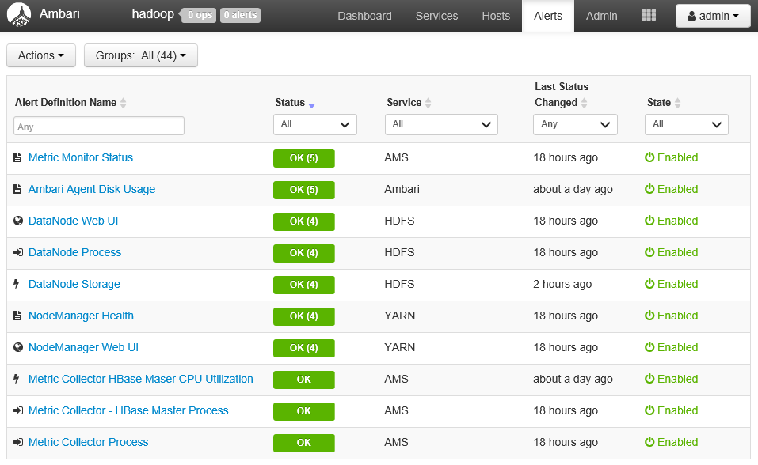
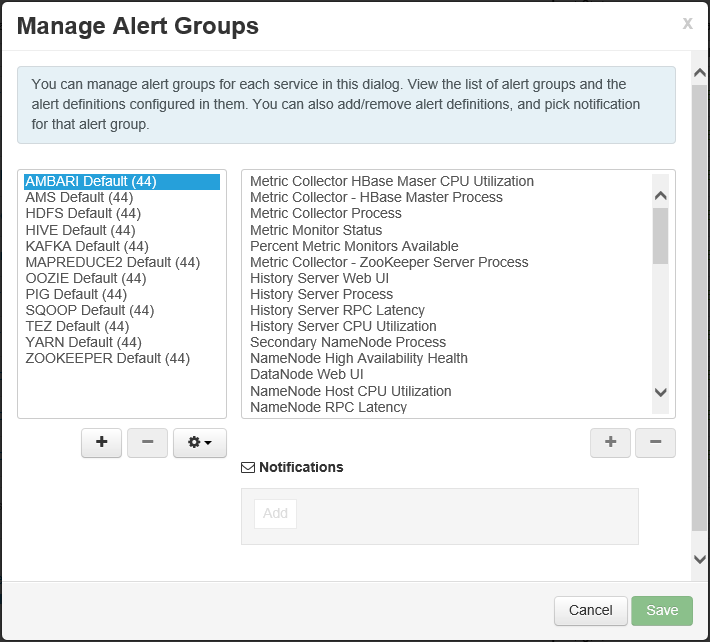
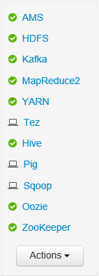

<properties
   pageTitle="Gestion des clusters HDInsight à l'aide d'Ambari | Azure"
   description="Découvrez comment utiliser Ambari pour gérer et surveiller des clusters HDInsight Linux."
   services="hdinsight"
   documentationCenter=""
   authors="Blackmist"
   manager="paulettm"
   editor="cgronlun"/>

<tags
   ms.service="hdinsight"
   ms.devlang=""
   ms.topic="article"
   ms.tgt_pltfrm="na"
   ms.workload="big-data"
   ms.date="02/18/2015"
   ms.author="larryfr"/>

#Gestion des clusters HDInsight à l'aide d'Ambari (version préliminaire)

Découvrez comment utiliser Ambari pour gérer et surveiller des clusters HDInsight Linux.

> [AZURE.NOTE] La plupart des informations mentionnées dans cet article s'appliquent uniquement aux clusters HDInsight Linux. Pour les clusters HDInsight Windows, seule la surveillance via l'API REST d'Ambari est disponible. Consultez la page [Surveillance d'Hadoop Windows sur HDInsight à l'aide de l'API Ambari](../hdinsight-monitor-use-ambari-api/).

##Présentation d'Ambari

<a href="http://ambari.apache.org" target="_blank">Apache Ambari</a> facilite la gestion d'Hadoop en fournissant une interface utilisateur web très simple qui peut être utilisée pour configurer, gérer et surveiller des clusters Hadoop. Les développeurs peuvent intégrer ces fonctionnalités dans leurs applications à l'aide des <a href="https://github.com/apache/ambari/blob/trunk/ambari-server/docs/api/v1/index.md" target="_blank">API REST Ambari</a>. 

Ambari est fourni par défaut avec les clusters HDInsight Linux. Les clusters HDInsight Windows fournissent des fonctionnalités de surveillance via l'API REST d'Ambari.

##Proxy SSH

> [AZURE.NOTE] Bien qu'Ambari pour votre cluster soit accessible directement sur Internet, certaines fonctionnalités dépendent de l'accès aux nœuds via le nom de domaine interne utilisé par le cluster. Puisqu'il s'agit d'un nom de domaine interne, et non public, des erreurs vous indiquant que le serveur est introuvable apparaîtront lorsque vous essayerez d'accéder à certaines fonctionnalités sur Internet.

Pour contourner ce problème, utilisez un tunnel SSH pour le trafic proxy Web vers le nœud principal du cluster, qui peut résoudre avec succès les noms de domaine internes. Utilisez les articles suivants pour créer un tunnel SSH d'un port de votre ordinateur local vers le cluster.

* <a href="../hdinsight-hadoop-linux-use-ssh-unix/#tunnel" target="_blank">Utiliser SSH avec Hadoop sous Linux sur HDInsight à partir de Linux, Unix ou OS X</a> - Procédure pour créer un tunnel SSH à l'aide de la commande  `ssh`

* <a href="../hdinsight-hadoop-linux-use-ssh-windows/#tunnel" target="_blank">Utiliser SSH avec Hadoop sous Linux sur HDInsight à partir de Windows</a> - Procédure pour utiliser Putty pour créer un tunnel SSH

##Interface utilisateur Web d'Ambari

L'interface utilisateur web d'Ambari est disponible, sur chaque cluster HDInsight Linux que vous créez, à l'adresse **https://&lt;clustername>.azurehdinsight.net**. Vous pouvez également accéder à cette page à l'aide du bouton **Ambari Web** situé en bas du tableau de bord de votre cluster, sur le portail Azure.

Vous serez invité à vous authentifier à la page à deux reprises ; la première fois pour vous authentifier auprès du cluster HDInsight, la seconde, pour vous authentifier auprès d'Ambari.

* **Authentification du cluster** : utilisez le nom d'utilisateur et le mot de passe de l'administrateur du cluster (le nom défini par défaut est **admin**)

* **Authentification d'Ambari** : la valeur par défaut, à la fois du nom d'utilisateur et du mot de passe, est **admin**

	> [AZURE.NOTE] Si le mot de passe de l'utilisateur **admin** a été modifié, vous devrez saisir le nouveau mot de passe.

Lorsque la page s'ouvre, vérifiez la barre située en haut de l'écran. Elle contient les informations et les commandes suivantes :

* **Logo d'Ambari** : ouvre le **tableau de bord**

* **Nom du cluster # ops** : affiche le nombre d'opérations Ambari en cours. La sélection du nom du cluster ou **# ops** fera apparaître une liste des opérations effectuées en arrière-plan

* **# alerts** : avertissements ou alertes critiques, le cas échéant, pour le cluster. Sa sélection fera apparaître une liste d'alertes

* **Tableau de bord** : affiche le tableau de bord, qui peut être utilisé pour surveiller le cluster

* **Services** : informations et paramètres de configuration des services sur le cluster

* **Hôtes** : informations et paramètres de configuration des nœuds sur votre cluster

* **Alertes** : informations complètes, avertissements et alertes critiques

* **Administrateur** : pile logicielle/services installés ou pouvant être ajoutés au cluster, informations de compte de service et sécurité Kerberos

* **Bouton Administrateur** : gestion d'Ambari, paramètres utilisateur et déconnexion

###Surveillance

####Alertes

Ambari offre de nombreuses alertes, qui auront comme attribut, l'un des états suivants :

* **OK**

* **Avertissement**

* **CRITIQUE**

* **INCONNU**

Des alertes (autres que **OK**) feront apparaître l'entrée **# alerts** en haut de la page, qui vous indiquera le nombre d'alertes. La sélection de cette entrée fera apparaître les alertes et leur état.

Les alertes sont organisées en plusieurs groupes par défaut, qui peuvent être consultés depuis la page **Alertes**. 

Vous pouvez gérer les groupes à l'aide du menu **Actions**, en sélectionnant **Gérer les groupes d'alerte**. Cela vous permet de modifier les groupes existants ou d'en créer de nouveaux.

Vous pouvez également créer des **notifications d'alerte** depuis le menu **Actions**. Cela vous permet de créer des déclencheurs qui envoient des notifications par **e-mail** ou **SNMP** lorsque des combinaisons spécifiques d'alerte/de gravité se produisent. Par exemple, vous pouvez envoyer une alerte lorsque l'une des alertes du groupe **YARN par défaut** est définie comme **Critique**.

####Cluster

L'onglet **Mesures** du **tableau de bord** contient une série de widgets qui permettent de surveiller facilement l'état de votre cluster d'un seul coup d'œil. Plusieurs widgets, tels que **Utilisation du processeur**, fournissent des informations supplémentaires lorsque vous cliquez dessus.

L'onglet **Cartes thermiques** affiche les paramètres sous forme de cartes thermiques colorées, allant du vert au rouge.

Pour obtenir des informations détaillées sur les nœuds au sein du cluster, sélectionnez **Hôtes**, puis sélectionnez le nœud spécifique qui vous intéresse.

####Service

La barre latérale du tableau de bord, intitulée **Services**, fournit un aperçu rapide de l'état des services exécutés sur le cluster. Différentes icônes sont utilisées pour indiquer l'état ou les actions qui devraient être effectuées, telles qu'un symbole jaune de recyclage qui vous indique si un service doit être recyclé.

La sélection d'un service fera apparaître des informations détaillées sur le service

#####Liens rapides

Certains services affichent un lien **Liens rapides** en haut de la page. Ils peuvent être utilisés pour accéder à l'interface Web spécifique de services, tels que :

* **Historique des travaux** : historique des travaux MapReduce

* **Gestionnaire des ressources** : interface utilisateur du gestionnaire des ressources YARN

* **NameNode** : interface utilisateur NameNode HDFS

* **Interface utilisateur Web Oozie ** : interface utilisateur Oozie

La sélection de l'un de ces liens ouvrira un nouvel onglet dans votre navigateur, qui affichera la page sélectionnée.

> [AZURE.NOTE] La sélection d'un lien **Liens rapides** de tout service entraînera l'apparition d'une erreur vous indiquant que le serveur est introuvable, à moins que vous utilisiez un tunnel SSL pour le trafic proxy Web vers le cluster. Cela est dû au fait qu'Ambari utilise le nom de domaine interne pour ces liens.
> 
> Pour en savoir plus sur l'utilisation d'un tunnel SSL avec HDInsight, consultez l'une des rubriques suivantes :
> 
> * <a href="../hdinsight-hadoop-linux-use-ssh-unix/#tunnel" target="_blank">Utiliser SSH avec Hadoop sous Linux sur HDInsight à partir de Linux, Unix ou OS X</a> - Procédure pour créer un tunnel SSH à l'aide de la commande  `ssh`
>
>* <a href="../hdinsight-hadoop-linux-use-ssh-windows/#tunnel" target="_blank">Utiliser SSH avec Hadoop sous Linux sur HDInsight à partir de Windows</a> - Procédure pour utiliser Putty pour créer un tunnel SSH

###Gestion

####Utilisateurs d'Ambari, groupes et autorisations

La gestion des utilisateurs, des groupes et des autorisations n'est pas disponible dans la version préliminaire de HDInsight Linux.

####Hôte

La page **Hôtes** répertorie tous les hôtes du cluster. Pour gérer des hôtes, procédez comme suit :

> [AZURE.NOTE] L'ajout, la désactivation ou la remise en service d'un hôte ne doivent pas être utilisés avec des clusters HDInsight

1. Sélectionnez le ou les hôtes que vous souhaitez gérer.

2. Utilisez le menu **Actions** pour sélectionner l'action que vous souhaitez effectuer :

	* **Démarrer tous les composants** : démarrez tous les composants sur l'hôte

	* **Arrêter tous les composants** : arrêtez tous les composants sur l'hôte

	* **Rédémarrer tous les composants** : arrêtez et redémarrez tous les composants sur l'hôte

	* **Activer le mode Maintenance** : supprime les alertes de l'hôte. Ceci doit être activé si vous effectuez des actions qui généreront des alertes. Tel que le redémarrage d'un service sur lequel s'appuient des services en cours d'exécution.

	* **Désactiver le mode Maintenance** : rétablit les alertes de l'hôte

	* **Arrêter** : arrête DataNode ou NodeManagers sur l'hôte

	* **Démarrer** : démarre DataNode ou NodeManagers sur l'hôte

	* **Redémarrer** : arrête et redémarre DataNode ou NodeManagers sur l'hôte

	* **Désactiver** : supprime un hôte du cluster.

		> [AZURE.NOTE] N'utilisez pas cette action sur les clusters HDInsight

	* **Réactiver** : ajoute un hôte préalablement désactivé au cluster.

		> [AZURE.NOTE] N'utilisez pas cette action sur les clusters HDInsight

####Service

Depuis la page **Tableau de bord** ou **Services**, utilisez le bouton **Actions** situé en bas de la liste des services pour **ajouter** de nouveaux services, ou **arrêter** et **redémarrer** tous les services.

Pour **ajouter un service**, procédez comme suit :

1. Depuis la page **Tableau** ou **Services**, utilisez le bouton **Actions** et sélectionnez **Ajouter un service**.

2. Depuis l'**Assistant Ajout d'un service**, sélectionnez le service que vous souhaitez ajouter, puis cliquez sur **Suivant**.

	

3. Continuez avec l'assistant, en fournissant les informations de configuration du service. Consultez la documentation du service spécifique que vous ajoutez pour obtenir plus d'informations sur les exigences de configuration.

4. Depuis la page **Révision**, vous pouvez **imprimer** les informations de configuration, ou **déployer** le service sur le cluster.

5. Une fois le service déployé, la page **Installation, démarrage et test** affichera les informations de progression à mesure que le service sera installé et testé. Lorsque l'**état** sera vert, sélectionnez **Suivant**.

	

6. La page **Résumé** affiche un résumé du processus d'installation, et vous indique toutes les actions que vous devez effectuer. Par exemple, le redémarrage d'autres services. Sélectionnez **Terminer** pour quitter l'assistant.

Bien que le bouton **Actions** permette de redémarrer tous les services, vous souhaitez souvent démarrer, arrêter ou redémarrer un service spécifique. Pour **effectuer des actions sur un service individuel**, procédez comme suit :

1. Depuis la page **Tableau de bord** ou **Services**, sélectionnez un service.

2. En haut de l'onglet **Résumé**, utilisez le bouton **Actions de service** et sélectionnez l'action que vous souhaitez effectuer. Ceci redémarrera le service sur tous les nœuds.

	

	> [AZURE.NOTE] Le redémarrage de certains services lorsque le cluster fonctionne peut générer des alertes. Pour éviter cela, vous pouvez utiliser le bouton **Actions de service** afin d'activer le **mode Maintenance** du service, avant de lancer le redémarrage.

3. Lorsqu'une action sera sélectionnée, l'entrée **# op** située en haut de la page s'incrémentera pour indiquer qu'une opération s'exécute en arrière-plan. Si leur affichage est configuré, une liste des opérations exécutées en arrière-plan apparaîtra.

	> [AZURE.NOTE] Si vous avez activé le **mode Maintenance** du service, n'oubliez pas de le désactiver à l'aide du bouton **Actions de service** une fois l'opération terminée.

Pour **configurer un service**, procédez comme suit :

1. Depuis la page **Tableau de bord** ou **Services**, sélectionnez un service.

2. Sélectionnez l'onglet **Configurations**. La configuration actuelle apparaîtra. Une liste des configurations précédentes sera également affichée.

	

3. Utilisez les champs affichés pour modifier la configuration, puis sélectionnez **Enregistrer**. Ou sélectionnez une configuration précédente, puis sélectionnez **Définir comme actuelle** pour rétablir des paramètres utilisés précédemment.

##API REST

Ambari Web utilise une API REST sous-jacente, que vous pouvez exploiter pour créer vos propres outils de gestion et de surveillance. Bien que l'API soit relativement simple d'utilisation, certaines informations concernant Azure sont bonnes à savoir.

* **Authentification** : le nom d'utilisateur (**admin**, par défaut) et le mot de passe de l'administrateur du cluster
*  doivent être utilisés pour vous authentifier au service.

* **Sécurité** : Ambari utilise l'authentification de base. De ce fait, vous devez toujours utiliser HTTPS pour communiquer avec l'API

* **Adresses IP** : les adresses renvoyées aux hôtes au sein d'un cluster ne sont pas accessibles en dehors du cluster, à moins que le cluster soit membre d'un réseau virtuel Azure. Seuls d'autres membres du réseau virtuel pourront ainsi accéder à l'adresse IP.

* **Certaines fonctionnalités ne sont pas activées** : certaines fonctionnalités d'Ambari sont désactivées, puisqu'il est géré par le service de cloud computing HDInsight. Par exemple, l'ajout ou la suppression des hôtes du cluster. D'autres fonctionnalités ne peuvent pas être pleinement mises en œuvre dans la version préliminaire de HDInsight Linux.

Pour obtenir une référence complète de l'API REST, consultez la rubrique [Référence V1 de l'API d'Ambari](https://github.com/apache/ambari/blob/trunk/ambari-server/docs/api/v1/index.md).

<!--HONumber=47-->
