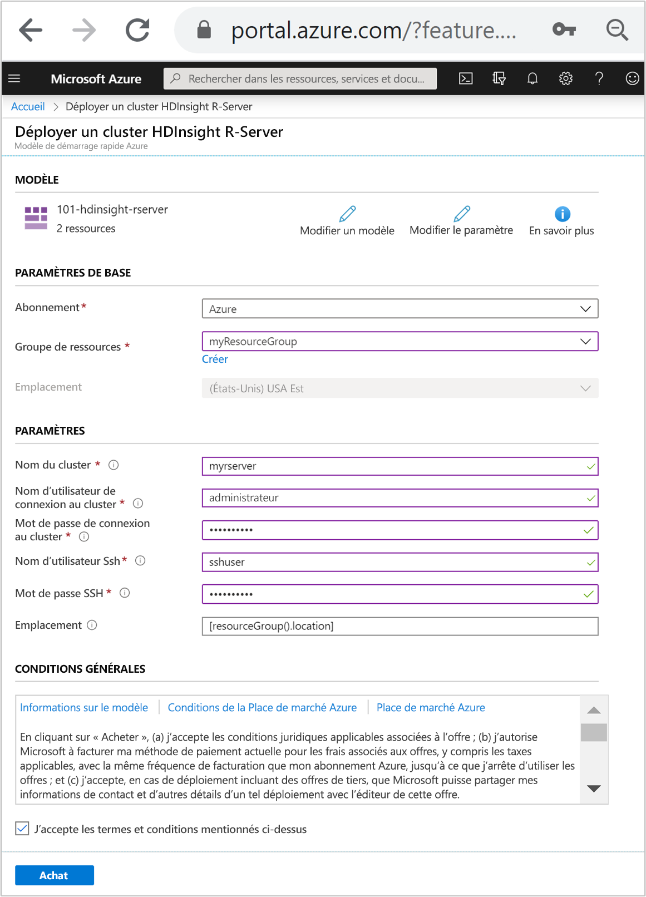
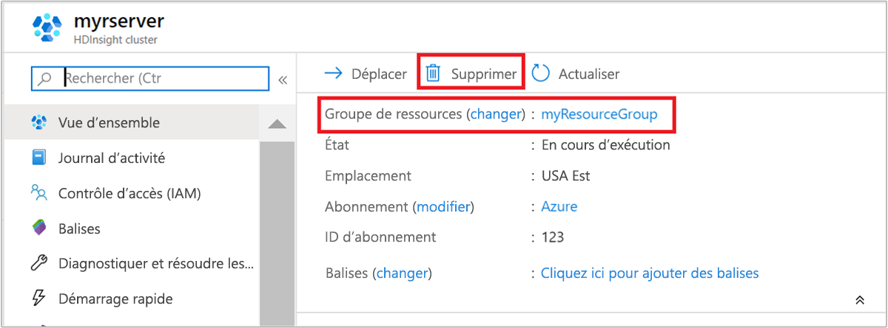

# Démarrage rapide : Créer un cluster ML Services dans Azure HDInsight à l’aide d’un modèle Resource Manager

Dans ce guide de démarrage rapide, vous utilisez un modèle Azure Resource Manager pour créer un cluster [ML Services](./r-server-overview.md) dans Azure HDInsight. Microsoft Machine Learning Server vous est proposé comme option de déploiement au moment de créer des clusters HDInsight dans Azure. Le type de cluster qui fournit cette option est appelé ML Services. Cette fonctionnalité offre aux experts en science des données, aux statisticiens et aux programmeurs R un accès à la demande à des méthodes d’analyse extensibles et distribuées sur HDInsight.

[!INCLUDE [About Azure Resource Manager](../../../includes/resource-manager-quickstart-introduction.md)]

Si vous n’avez pas d’abonnement Azure, créez un [compte gratuit](https://azure.microsoft.com/free/?WT.mc_id=A261C142F) avant de commencer.

## Créer un cluster ML Services

### Vérifier le modèle

Le modèle utilisé dans ce guide de démarrage rapide est tiré des [modèles de démarrage rapide Azure](https://github.com/Azure/azure-quickstart-templates/tree/master/101-hdinsight-rserver).

:::code language="json" source="~/quickstart-templates/101-hdinsight-rserver/azuredeploy.json" range="1-171":::

Deux ressources Azure sont définies dans le modèle :

* [Microsoft.Storage/storageAccounts](https://docs.microsoft.com/azure/templates/microsoft.storage/storageaccounts) : crée un compte de stockage Azure.
* [Microsoft.HDInsight/cluster](https://docs.microsoft.com/azure/templates/microsoft.hdinsight/clusters) : crée un cluster HDInsight.

### Déployer le modèle

1. Sélectionnez le bouton **Déployer sur Azure** ci-dessous pour vous connecter à Azure et ouvrir le modèle Resource Manager.

    

1. Entrez ou sélectionnez les valeurs suivantes :

    |Propriété |Description |
    |---|---|
    |Abonnement|Dans la liste déroulante, sélectionnez l’abonnement Azure utilisé pour le cluster.|
    |Resource group|Dans la liste déroulante, sélectionnez votre groupe de ressources existant ou **Créer**.|
    |Emplacement|La valeur est renseignée automatiquement à l’aide de l’emplacement utilisé pour le groupe de ressources.|
    |Nom du cluster|Entrez un nom globalement unique. Pour ce modèle, utilisez uniquement des lettres minuscules et des chiffres.|
    |Nom d’utilisateur de connexion au cluster|Indiquez le nom d’utilisateur, la valeur par défaut est **Administrateur**.|
    |Mot de passe de connexion au cluster|Fournissez un mot de passe. Le mot de passe doit comporter au moins 10 caractères et inclure au moins un chiffre, une lettre majuscule, une lettre minuscule et un caractère non alphanumérique (à l’exception des caractères ' " `). |
    |Nom d’utilisateur SSH|Indiquez le nom d’utilisateur. La valeur par défaut est sshuser|
    |Mot de passe SSH|Indiquez le mot de passe.|

    

1. Passez en revue les **CONDITIONS GÉNÉRALES**. Sélectionnez ensuite **J’accepte les conditions générales mentionnées ci-dessus**, puis **Acheter**. Vous recevez une notification indiquant que votre déploiement est en cours. La création d’un cluster prend environ 20 minutes.

## Vérifier les ressources déployées

Une fois le cluster créé, vous recevez une notification **Déploiement réussi** avec un lien **Accéder à la ressource**. La page Groupe de ressources liste votre nouveau cluster HDInsight ainsi que le stockage par défaut associé au cluster. Chaque cluster a une dépendance de [compte de stockage Azure](../hdinsight-hadoop-use-blob-storage.md) ou une dépendance de [compte Azure Data Lake Storage](../hdinsight-hadoop-use-data-lake-store.md). Elle est désignée comme compte de stockage par défaut. Le cluster HDInsight et son compte de stockage par défaut doivent figurer dans la même région Azure. La suppression de clusters n’a pas pour effet de supprimer le compte de stockage.

## Nettoyer les ressources

Après avoir suivi ce guide de démarrage rapide, vous souhaiterez peut-être supprimer le cluster. Avec HDInsight, vos données sont stockées dans le stockage Azure. Vous pouvez ainsi supprimer un cluster en toute sécurité s’il n’est pas en cours d’utilisation. Vous devez également payer pour un cluster HDInsight, même quand vous ne l’utilisez pas. Étant donné que les frais pour le cluster sont bien plus élevés que les frais de stockage, mieux vaut supprimer les clusters quand ils ne sont pas utilisés.

Dans le portail Azure, accédez à votre cluster, puis sélectionnez **Supprimer**.

Vous pouvez également sélectionner le nom du groupe de ressources pour ouvrir la page du groupe de ressources, puis sélectionner **Supprimer le groupe de ressources**. En supprimant le groupe de ressources, vous supprimez le cluster HDInsight et le compte de stockage par défaut.

## Étapes suivantes

Dans ce guide de démarrage rapide, vous avez appris à créer un cluster ML Services dans HDInsight à l’aide d’un modèle Resource Manager. Dans l’article suivant, vous allez apprendre à exécuter un script R avec RStudio Server afin d’illustrer l’utilisation de Spark pour les calculs R distribués.

> [!div class="nextstepaction"]
> [Exécuter un script R sur un cluster ML Services dans HDInsight Azure à l’aide de RStudio Server](./machine-learning-services-quickstart-job-rstudio.md)
