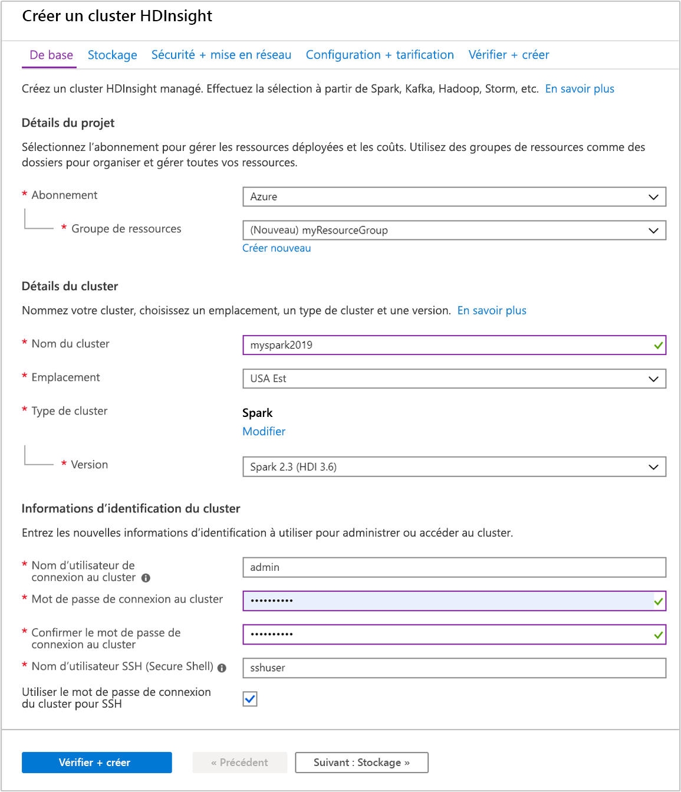
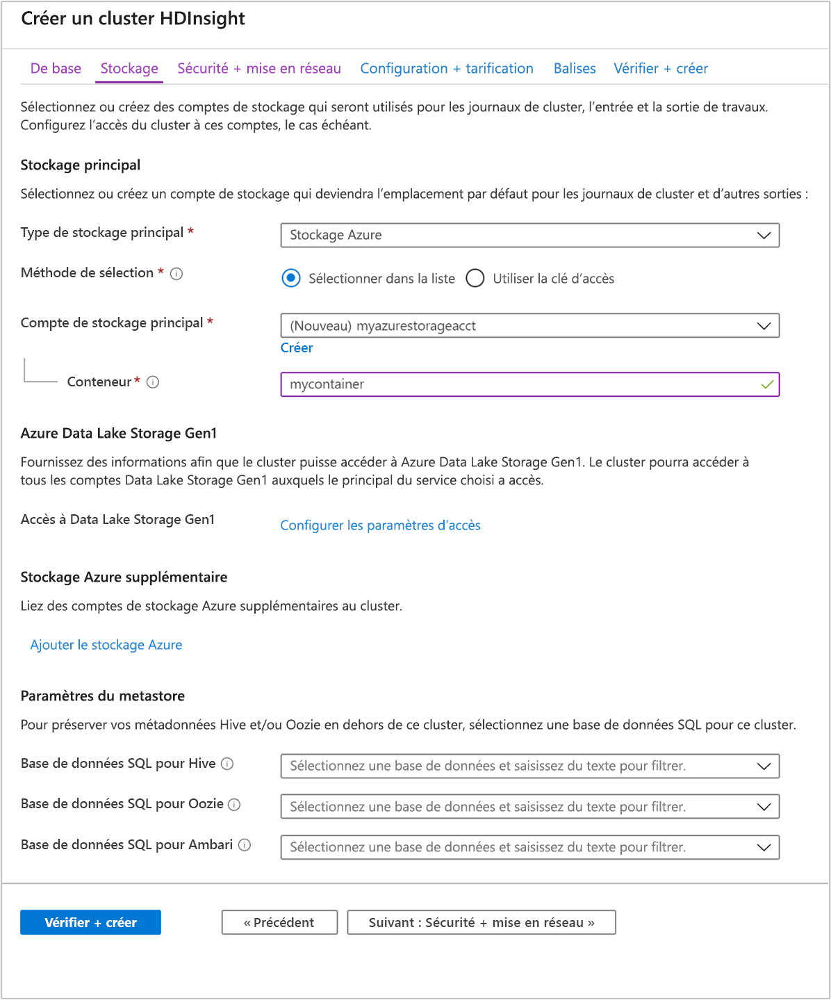

# <a name="quickstart-create-apache-spark-cluster-in-azure-hdinsight-using-azure-portal"></a>Démarrage rapide : créer un cluster Apache Spark dans Azure HDInsight à l’aide du portail Azure

Dans ce guide de démarrage rapide, vous allez utiliser le portail Azure pour créer un cluster Apache Spark dans Azure HDInsight. Vous allez ensuite créer un notebook Jupyter et l’utiliser pour exécuter des requêtes Spark SQL sur des tables Apache Hive. Azure HDInsight est un service d’analytique open source managé et complet pour les entreprises. Le framework Apache Spark pour HDInsight permet une analytique données et des calculs sur cluster rapides à l’aide du traitement en mémoire. Le notebook Jupyter vous permet d’interagir avec vos données, de combiner du code avec le texte Markdown et d’effectuer des visualisations simples.

Pour obtenir des explications détaillées sur les configurations disponibles, consultez [Configurer des clusters dans HDInsight](../hdinsight-hadoop-provision-linux-clusters.md). Pour plus d’informations sur l’utilisation du portail pour créer des clusters, consultez [Créer des clusters dans le portail](../hdinsight-hadoop-create-linux-clusters-portal.md).

> [!IMPORTANT]  
> La facturation des clusters HDInsight est calculée au prorata des minutes écoulées, que vous les utilisiez ou non. Veillez à supprimer votre cluster une fois que vous avez fini de l’utiliser. Pour plus d’informations, consultez la section [Nettoyer les ressources](#clean-up-resources) de cet article.

## <a name="prerequisites"></a>Prérequis

Compte Azure avec un abonnement actif. [Créez un compte gratuitement](https://azure.microsoft.com/free/?ref=microsoft.com&utm_source=microsoft.com&utm_medium=docs&utm_campaign=visualstudio).

## <a name="create-an-apache-spark-cluster-in-hdinsight"></a>Créer un cluster Apache Spark dans HDInsight

Vous utilisez le portail Azure pour créer un cluster HDInsight qui utilise des objets Blob Azure Storage comme stockage de cluster. Pour plus d’informations sur l’utilisation de Data Lake Storage Gen2, consultez [Démarrage rapide : Configurer des clusters dans HDInsight](../../storage/data-lake-storage/quickstart-create-connect-hdi-cluster.md).

1. Connectez-vous au [portail Azure](https://portal.azure.com/).

1. Dans le menu du haut, sélectionnez **+ Créer une ressource**.

    

1. Sélectionnez **Analytics** > **Azure HDInsight** pour accéder à la page **Créer un cluster HDInsight**.

1. Sous l’onglet **De base**, fournissez les informations suivantes :

    |Propriété  |Description  |
    |---------|---------|
    |Abonnement  | Dans la liste déroulante, sélectionnez l’abonnement Azure utilisé pour le cluster. |
    |Resource group | Dans la liste déroulante, sélectionnez votre groupe de ressources existant ou **Créer**.|
    |Nom du cluster | Entrez un nom globalement unique.|
    |Région   | Dans la liste déroulante, sélectionnez une région dans laquelle le cluster est créé. |
    |Type de cluster| Choisissez Sélectionner un type de cluster pour ouvrir une liste. Dans la liste, sélectionnez **Spark**.|
    |Version du cluster|Lorsque le type de cluster est sélectionné, ce champ est automatiquement renseigné avec la version par défaut.|
    |Nom d’utilisateur de connexion au cluster| Entrez le nom d’utilisateur de connexion au cluster.  Le nom par défaut est **admin**. Vous utiliserez ce compte pour vous connecter au notebook Jupyter plus loin dans ce démarrage rapide. |
    |Mot de passe de connexion au cluster| Entrez le mot de passe de connexion au cluster. |
    |Nom d’utilisateur SSH (Secure Shell)| Entrez le nom d’utilisateur SSH. Le nom d’utilisateur SSH utilisé pour ce démarrage rapide est **sshuser**. Par défaut, ce compte a le même mot de passe que le compte *Nom d’utilisateur de connexion au cluster*. |

    

    Sélectionnez **Suivant : Stockage >>** pour accéder à la page **Stockage**.

1. Sous **Stockage**, fournissez les valeurs suivantes :

    |Propriété  |Description  |
    |---------|---------|
    |Type de stockage principal|Utilisez la valeur par défaut : **Stockage Azure**.|
    |Méthode de sélection|Utilisez la valeur par défaut : **Sélectionner dans la liste**.|
    |Compte de stockage principal|Utilisez la valeur renseignée automatiquement.|
    |Conteneur|Utilisez la valeur renseignée automatiquement.|

    

    Sélectionnez **Vérifier + créer** pour continuer.

1. Sous **Vérifier + créer**, sélectionnez **Créer**. La création du cluster prend environ 20 minutes. Il faut que le cluster soit créé pour pouvoir passer à la prochaine session.

Si vous rencontrez un problème avec la création de clusters HDInsight, c’est que vous n’avez peut-être pas les autorisations requises pour le faire. Pour plus d’informations, consultez [Exigences de contrôle d’accès](../hdinsight-hadoop-customize-cluster-linux.md#access-control).

## <a name="create-a-jupyter-notebook"></a>Créer un bloc-notes Jupyter

Jupyter Notebook est un environnement de Notebook interactif qui prend en charge plusieurs langages de programmation. Le Notebook vous permet d’interagir avec vos données, de combiner du code avec le texte Markdown et d’effectuer des visualisations simples.

1. Dans un navigateur web, accédez à `https://CLUSTERNAME.azurehdinsight.net/jupyter`, où `CLUSTERNAME` est le nom de votre cluster. À l’invite (le cas échéant), entrez les informations d’identification du cluster.

1. Sélectionnez **Nouveau** > **PySpark** pour créer un Notebook.

   

   Un nouveau bloc-notes est créé et ouvert sous le nom Untitled(Untitled.pynb).

## <a name="run-apache-spark-sql-statements"></a>Exécuter des instructions Apache Spark SQL

SQL (Structured Query Language) est le langage le plus courant et le plus largement utilisé pour interroger et définir des données. Spark SQL fonctionne en tant qu’extension d’Apache Spark pour le traitement des données structurées, à l’aide de la syntaxe SQL classique.

1. Vérifiez que le noyau est prêt. Le noyau est prêt lorsque vous voyez un cercle vide à côté du nom du noyau dans le bloc-notes. Un cercle plein indique que le noyau est occupé.

    

    Lorsque vous démarrez le bloc-notes pour la première fois, le noyau effectue certaines tâches en arrière-plan. Attendez que le noyau soit prêt.

1. Collez l’exemple de code suivant dans une cellule vide, puis appuyez sur **MAJ + ENTRÉE** pour exécuter le code. La commande répertorie les tables Hive sur le cluster :

    ```PySpark
    %%sql
    SHOW TABLES
    ```

    Quand vous utilisez un notebook Jupyter avec votre cluster HDInsight, vous obtenez un `sqlContext` prédéfini que vous pouvez utiliser pour exécuter des requêtes Hive à l’aide de Spark SQL. `%%sql` demande à Jupyter Notebook d’utiliser la présélection `sqlContext` pour exécuter la requête Hive. La requête extrait les 10 premières lignes d’une table Hive (**hivesampletable**) qui est disponible par défaut sur tous les clusters HDInsight. Il faut environ 30 secondes pour obtenir les résultats. Le résultat se présente ainsi :

    

    À chaque exécution d’une requête dans Jupyter, le titre de la fenêtre du navigateur web affiche l’état **(Occupé)** ainsi que le titre du bloc-notes. Un cercle plein s’affiche également en regard du texte **PySpark** dans le coin supérieur droit.

1. Exécutez une autre requête pour afficher les données dans `hivesampletable`.

    ```PySpark
    %%sql
    SELECT * FROM hivesampletable LIMIT 10
    ```

    L’écran doit s’actualiser pour afficher la sortie de requête.

    

1. Dans le menu **Fichier** du Notebook, sélectionnez **Fermer et interrompre**. L’arrêt du bloc-notes libère les ressources de cluster.

## <a name="clean-up-resources"></a>Nettoyer les ressources

HDInsight enregistre vos données dans le Stockage Azure ou Azure Data Lake Storage, ce qui vous permet de supprimer un cluster sans risque s’il n’est pas en cours d’utilisation. Vous devez également payer pour un cluster HDInsight, même quand vous ne l’utilisez pas. Étant donné que les frais pour le cluster sont bien plus élevés que les frais de stockage, mieux vaut supprimer les clusters quand ils ne sont pas utilisés. Si vous prévoyez d’utiliser tout de suite le tutoriel mentionné sous [Étapes suivantes](#next-steps), il peut être intéressant de conserver le cluster.

Revenez au Portail Azure, puis sélectionnez **Supprimer**.


Vous pouvez également sélectionner le nom du groupe de ressources pour ouvrir la page du groupe de ressources, puis sélectionner **Supprimer le groupe de ressources**. En supprimant le groupe de ressources, vous supprimez le cluster HDInsight et le compte de stockage par défaut.

## <a name="next-steps"></a>Étapes suivantes

Dans ce guide de démarrage rapide, vous avez appris à créer un cluster Apache Spark dans HDInsight et à exécuter une requête Spark SQL de base. Passez au tutoriel suivant pour apprendre à utiliser un cluster HDInsight pour exécuter des requêtes interactives sur des exemples de données.

> [!div class="nextstepaction"]
> [Exécuter des requêtes interactives sur Apache Spark](./apache-spark-load-data-run-query.md)
