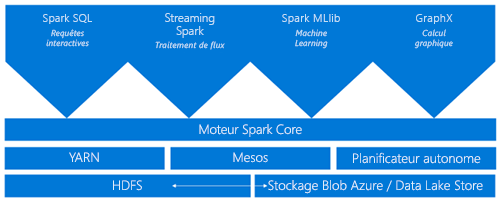
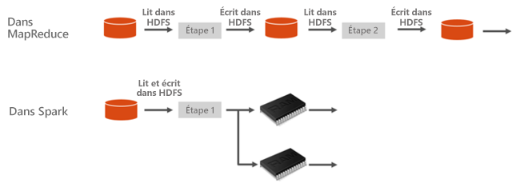
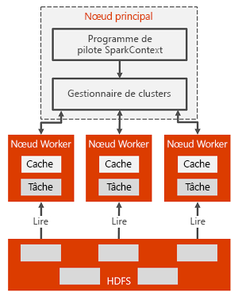

# Présentation d’Apache Spark dans Azure HDInsight

Apache Spark est un framework de traitement parallèle qui prend en charge le traitement en mémoire pour améliorer les performances des applications d’analytique du Big Data. Apache Spark dans Azure HDInsight est l’implémentation Microsoft d’Apache Spark dans le cloud. HDInsight facilite la création et la configuration de clusters Spark dans Azure. Les clusters Spark dans HDInsight sont compatibles avec le Stockage Azure et Azure Data Lake Storage. Vous pouvez donc utiliser des clusters HDInsight Spark pour traiter vos données stockées dans Azure. Pour obtenir des informations sur les composants et le contrôle de version, consultez [Composants et versions Apache Hadoop dans Azure HDInsight](../hdinsight-component-versioning.md).

## Qu’est-ce qu’Apache Spark ?

Spark fournit des primitives pour le calcul de cluster en mémoire. Un travail Spark peut charger et mettre en cache des données en mémoire et les interroger à plusieurs reprises. Le calcul en mémoire est beaucoup plus rapide que les applications sur disque, notamment Hadoop, qui partage des données par le biais du système de fichiers DFS hadoop (HDFS). Spark s’intègre également dans le langage de programmation Scala pour vous permettre de manipuler des ensembles de données distribuées tels que des collections locales. Il n’est pas nécessaire de tout structurer comme des opérations de réduction et de mappage.

Les clusters Spark dans HDInsight constituent un service Spark entièrement géré. Voici les avantages des clusters Spark dans HDInsight.

| Fonctionnalité | Description |
| --- | --- |
| Facilité de création |La création d’un cluster Spark dans HDInsight prend en quelques minutes avec le Portail Azure, Azure PowerShell ou le Kit de développement logiciel (SDK) .NET HDInsight. Consultez [Bien démarrer avec un cluster Apache Spark dans HDInsight](apache-spark-jupyter-spark-sql-use-portal.md). |
| Simplicité d'utilisation |Un cluster Spark sur HDInsight inclut des blocs-notes Jupyter et Apache Zeppelin. Vous pouvez utiliser les blocs-notes pour le traitement interactif et la visualisation des données. Consultez [Utiliser des notebooks Apache Zeppelin avec Apache Spark](apache-spark-zeppelin-notebook.md) et [Charger des données et exécuter des requêtes sur un cluster Apache Spark](apache-spark-load-data-run-query.md).|
| API REST |Les clusters Spark dans HDInsight comprennent [Apache Livy](https://github.com/cloudera/hue/tree/master/apps/spark/java#welcome-to-livy-the-rest-spark-server), un serveur de travaux Spark basé sur une API REST, qui permet de soumettre et de surveiller à distance des travaux. Consultez [Utiliser l’API REST Spark Apache pour envoyer des travaux à distance à un cluster Spark HDInsight](apache-spark-livy-rest-interface.md).|
| Prise en charge d’Azure Data Lake Storage | Les clusters Spark dans HDInsight peuvent utiliser Azure Data Lake Storage comme stockage principal ou comme stockage supplémentaire. Pour plus d’informations sur Data Lake Storage, consultez [Vue d’ensemble d’Azure Data Lake Storage](../../data-lake-store/data-lake-store-overview.md). |
| Intégration aux services Azure |Un cluster Spark dans HDInsight s’accompagne d’un connecteur à Azure Event Hubs. Vous pouvez créer des applications de diffusion en continu avec Event Hubs, en plus de [Apache Kafka](https://kafka.apache.org/), qui est déjà disponible dans Spark. |
| Prise en charge de ML Server | La prise en charge de ML Server dans HDInsight est fournie en tant que type de cluster **ML Services**. Il est possible de configurer un cluster ML Services de façon à effectuer des calculs R distribués à la vitesse d’un cluster Spark. Pour plus d’informations, consultez [Qu’est-ce que ML Services dans Azure HDInsight](../r-server/r-server-overview.md). |
| Intégration à des environnements de développement intégrés tiers | HDInsight offre différents plug-ins d’IDE permettant de créer et d’envoyer des applications sur un cluster HDInsight Spark. Pour plus d’informations, consultez [Utiliser Azure Toolkit for IntelliJ IDEA](apache-spark-intellij-tool-plugin.md), [Utiliser Spark & Hive Tools pour VSCode](../hdinsight-for-vscode.md) et [Utiliser Azure Toolkit for Eclipse](apache-spark-eclipse-tool-plugin.md).|
| Requêtes simultanées |Les clusters Spark sur HDInsight prennent en charge les requêtes simultanées. Ainsi, plusieurs requêtes d’un même utilisateur ou de différents utilisateurs et applications peuvent partager les mêmes ressources de cluster. |
| Mise en cache sur des disques SSD |Vous pouvez choisir de mettre en cache des données en mémoire ou dans les disques SSD attachés aux nœuds de cluster. Si la mise en cache en mémoire est la stratégie qui offre les meilleures performances de requête, elle peut se révéler coûteuse. La mise en cache sur des disques SSD représente une très bonne option pour améliorer les performances des requêtes sans avoir à créer un cluster de la taille requise pour que l’ensemble du jeu de données puisse être mis en mémoire. Consultez [Améliorer les performances des charges de travail Apache Spark à l’aide d’Azure HDInsight IO Cache](apache-spark-improve-performance-iocache.md). |
| Intégration aux outils décisionnels |Les clusters Spark dans HDInsight fournissent des connecteurs pour certains outils décisionnels, notamment [Power BI](https://www.powerbi.com/) pour l’analytique des données. |
| Bibliothèques Anaconda préchargées |Les clusters Spark dans HDInsight sont fournis avec des bibliothèques Anaconda préinstallées. [Anaconda](https://docs.continuum.io/anaconda/) fournit près de 200 bibliothèques pour le machine learning, l’analyse des données, la visualisation, etc. |
| Extensibilité | HDInsight vous permet de modifier le nombre de nœuds de cluster de manière dynamique à l’aide de la fonctionnalité de mise à l’échelle automatique. Consultez [Mettre à l’échelle automatiquement les clusters Azure HDInsight](../hdinsight-autoscale-clusters.md). En outre, les clusters Spark peuvent être supprimés sans perte de données puisque toutes les données sont stockées dans le Stockage Azure ou Data Lake Storage. |
| Contrat SLA |Les clusters Spark dans HDInsight s’accompagnent d’un support assuré 24 heures sur 24, 7 jours sur 7 et d’un contrat de niveau de service à 99,9 % de durée de fonctionnement. |

Les clusters Apache Spark dans HDInsight incluent les composants suivants qui sont disponibles dans les clusters par défaut.

* [Spark Core](https://spark.apache.org/docs/latest/). Comprend Spark Core, Spark SQL, les API de diffusion en continu Spark, GraphX et MLlib.
* [Anaconda](https://docs.continuum.io/anaconda/)
* [Apache Livy](https://github.com/cloudera/hue/tree/master/apps/spark/java#welcome-to-livy-the-rest-spark-server)
* [Bloc-notes Jupyter](https://jupyter.org)
* [Bloc-notes Apache Zeppelin](http://zeppelin-project.org/)

Les clusters Spark dans HDInsight fournissent également un [pilote ODBC](https://go.microsoft.com/fwlink/?LinkId=616229) pour la connectivité aux clusters Spark dans HDInsight à partir d’outils décisionnels comme Microsoft Power BI.

## Architecture d’un cluster Spark

Il est facile de comprendre les composants de Spark si vous comprenez comment fonctionne Spark sur les clusters HDInsight.

Les applications Spark s’exécutent sous la forme d’ensembles de processus indépendants sur un cluster, coordonnées par l’objet SparkContext du programme principal (appelé programme pilote).

SparkContext peut se connecter à plusieurs types de gestionnaires de cluster, qui allouent des ressources aux différentes applications. Parmi ces gestionnaires de cluster, on peut citer [Apache Mesos](https://mesos.apache.org/), [Apache Hadoop YARN](https://hadoop.apache.org/docs/current/hadoop-yarn/hadoop-yarn-site/YARN.html) et le gestionnaire de cluster Spark. Dans HDInsight, Spark s’exécute à l’aide du gestionnaire de cluster YARN. Une fois connecté, Spark acquiert des exécuteurs sur les nœuds de travail du cluster ; il s’agit de processus qui exécutent des calculs et stockent les données de l’application. Ensuite, il envoie le code de l’application (défini par les fichiers JAR ou Python transmis à SparkContext) aux exécuteurs. Enfin, SparkContext envoie les tâches aux exécuteurs, qui les exécuteront.

SparkContext exécute la fonction principale de l’utilisateur et les différentes opérations parallèles sur les nœuds de travail. Ensuite, il collecte les résultats des opérations. Les nœuds Worker lisent et écrivent des données dans le système de fichiers DFS hadoop. Les nœuds Worker mettent également en cache les données transformées en mémoire comme les jeux de données résilients distribués (RDD).

SparkContext se connecte au maître Spark ; il est chargé de convertir une application en un graphe orienté (DAG) de tâches individuelles exécutées au sein d’un processus d’exécution sur les nœuds de travail. Chaque application obtient ses propres processus d’exécution qui restent pour la durée de toute l’application et exécutent des tâches sur plusieurs threads.

## Cas d’utilisation de Spark dans HDInsight

Les clusters Spark sur HDInsight autorisent les principaux scénarios suivants :

### Analyse des données interactive et Power BI

Apache Spark sur HDInsight stocke les données dans le Stockage Azure ou Azure Data Lake Storage. Des experts et des décideurs clés peuvent analyser les données, générer les rapports correspondants et utiliser Microsoft Power BI pour créer des rapports interactifs à partir des données analysées. Les analystes peuvent démarrer à partir des données non structurées/semi-structurées dans le stockage du cluster, définir un schéma pour les données à l’aide des blocs-notes, puis générer des modèles de données à l’aide de Microsoft Power BI. Les clusters Spark dans HDInsight prennent également en charge plusieurs outils décisionnels tiers comme Tableau, qui facilitent la tâche aux analystes de données, experts et grands décideurs.

* [Tutoriel : Analyser les données d’Apache Spark à l’aide de Power BI dans HDInsight](apache-spark-use-bi-tools.md)

### Spark Machine Learning

Apache Spark est fourni avec [MLlib](https://spark.apache.org/mllib/), bibliothèque d’apprentissage automatique basée sur Spark que vous pouvez utiliser à partir d’un cluster Spark sur HDInsight. Un cluster Spark dans HDInsight inclut également Anaconda, une distribution de Python comportant différents types de packages pour le machine learning. Ajoutez à cela la prise en charge intégrée des Notebooks Jupyter et Zeppelin, et vous disposez d’un environnement de création d’applications de Machine Learning.

* [Tutoriel : Prédire les températures d’un bâtiment en utilisant des données HVAC](apache-spark-ipython-notebook-machine-learning.md)  
* [Tutoriel : Utiliser Apache Spark MLlib pour créer une application de Machine Learning et analyser un jeu de données](apache-spark-machine-learning-mllib-ipython.md)

### Analyse des données de diffusion en continu et en temps réel Spark

Les clusters Spark sur HDInsight offrent une prise en charge améliorée de la création de solutions d’analyse en temps réel. Si Spark possède déjà des connecteurs pour la réception des données provenant de nombreuses sources telles que les sockets Kafka, Flume, Twitter, ZeroMQ ou TCP, Spark dans HDInsight ajoute la prise en charge de première classe de la réception des données provenant d’Azure Event Hubs. La fonctionnalité Event Hubs est le service de file d’attente le plus largement utilisé sur Azure. Grâce à leur prise en charge immédiate d’Event Hubs, les clusters Spark dans HDInsight constituent une plateforme idéale pour créer un pipeline d’analyse en temps réel.

* [Vue d’ensemble d’Apache Spark Streaming](apache-spark-streaming-overview.md)
* [Présentation d’Apache Spark Structured Streaming](apache-spark-structured-streaming-overview.md)

## Par où commencer ?

Vous pouvez lire les articles suivants pour en savoir plus sur Apache Spark dans HDInsight :

* [Démarrage rapide : Créer un cluster Apache Spark dans HDInsight et exécuter une requête interactive avec Jupyter](./apache-spark-jupyter-spark-sql-use-portal.md)
* [Tutoriel : Exécuter un travail Apache Spark avec Jupyter](./apache-spark-load-data-run-query.md)
* [Tutoriel : Analyser des données avec des outils décisionnels](./apache-spark-use-bi-tools.md)
* [Tutoriel : Machine Learning avec Apache Spark](./apache-spark-ipython-notebook-machine-learning.md)
* [Tutoriel : Créer une application Scala Maven avec IntelliJ](./apache-spark-create-standalone-application.md)

## Étapes suivantes

Cette présentation offre une vue d’ensemble d’Apache Spark dans Azure HDInsight. Passez à l’article suivant pour apprendre à créer un cluster HDInsight Spark et à exécuter certaines requêtes Spark SQL :

* [Créer un cluster Apache Spark dans HDInsight](./apache-spark-jupyter-spark-sql-use-portal.md)
