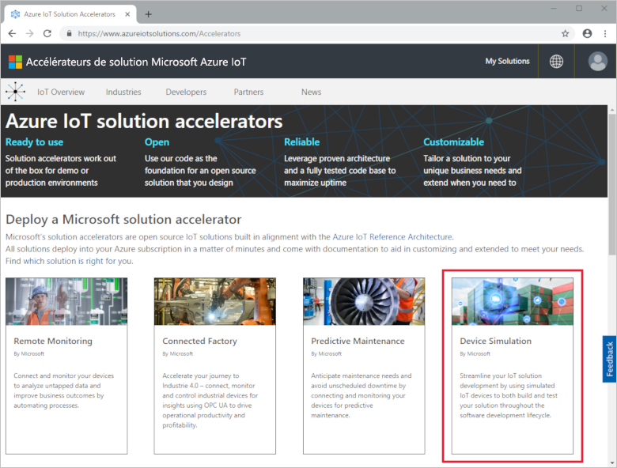
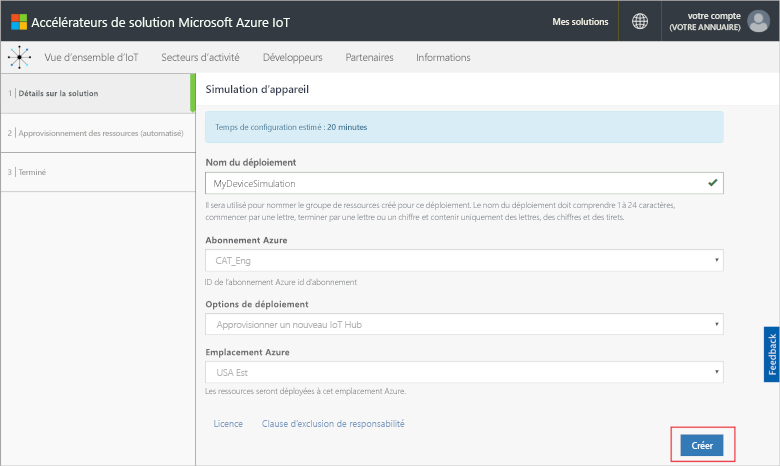
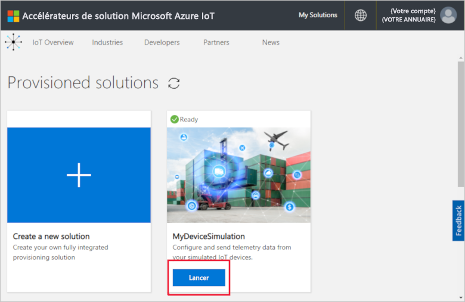
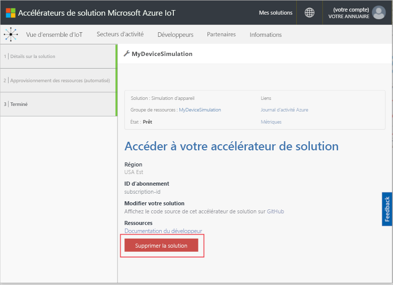

# Guide de démarrage rapide : déployer et exécuter une solution de simulation d’appareil cloud

Ce guide de démarrage rapide vous montre comment déployer l’accélérateur de solution Simulation d’appareil Azure IoT afin de tester votre solution IoT. Une fois l’accélérateur de solution déployé, vous utilisez la page **Simulation** pour créer et exécuter une simulation.

## Prérequis

Pour suivre ce guide de démarrage rapide, vous devez avoir un abonnement Azure actif.

Si vous n’avez pas d’abonnement Azure, créez un [compte gratuit](https://azure.microsoft.com/free/?WT.mc_id=A261C142F) avant de commencer.

## Déployer la solution

Quand vous déployez l’accélérateur de solution dans votre abonnement Azure, vous devez définir des options de configuration.

Connectez-vous à [azureiotsolutions.com](https://www.azureiotsolutions.com/Accelerators) avec les informations d’identification de votre compte Azure.

Cliquez sur **Essayer maintenant** sur la vignette **Simulation d’appareil**.

Sur la page **Créer une solution de simulation d’appareil**, entrez un **nom de solution** unique. Notez le nom de votre solution. Il s’agit du nom du groupe de ressources Azure qui contient toutes les ressources déployées de la solution.

Sélectionnez l’**Abonnement** et la **Région** à utiliser pour déployer l’accélérateur de solution. En général, vous choisissez la région la plus proche. Vous devez être [administrateur général ou utilisateur](iot-accelerators-permissions.md) dans l’abonnement.

Cochez la case pour déployer un hub IoT à utiliser avec votre solution de simulation d’appareil. Vous pourrez toujours modifier le hub IoT que votre simulation utilise plus tard.

Cliquez sur **Créer une solution** pour commencer l’approvisionnement de votre solution. L’exécution de ce processus prend au moins cinq minutes :

## Se connecter à la solution

Lorsque le processus d’approvisionnement est terminé, vous pouvez vous connecter au tableau de bord de votre accélérateur de solution Simulation d’appareil.

Sur la page **Solutions approvisionnées**, cliquez sur votre nouvel accélérateur de solution Simulation d’appareil :

Vous pouvez consulter les informations relatives à votre accélérateur de solution Simulation d’appareil dans le panneau qui s’affiche. Choisissez **Tableau de bord des solutions** pour afficher votre accélérateur de solution Simulation d’appareil :

Cliquez sur **Accepter** pour accepter la demande d’autorisation. Le tableau de bord de la solution Simulation d’appareil s’affiche dans votre navigateur :

## Configurer la simulation

Vous configurez et exécutez une simulation depuis le tableau de bord. Utilisez les valeurs du tableau suivant pour configurer votre simulation :

| Paramètre             | Valeur                       |
| ------------------- | --------------------------- |
| IoT Hub cible      | Utiliser IoT Hub préapprovisionné |
| Modèle de l'appareil        | Chiller (Refroidisseur)                     |
| Nombre d’appareils   | 10                          |
| Fréquence de télémétrie | 10 secondes                  |
| Durée de la simulation | 5 minutes                   |

## Exécuter la simulation

Cliquez sur **Démarrer la simulation**. La simulation s’exécute pour la durée choisie. Vous pouvez arrêter la simulation n’importe quand en cliquant sur **Arrêter la simulation.** La simulation affiche les statistiques de l’exécution actuelle. Cliquez sur **Afficher les métriques IoT Hub dans le portail Azure** pour consulter les métriques rapportées par IoT Hub :

Vous ne pouvez exécuter qu’une simulation à la fois depuis une instance approvisionnée de l’accélérateur de solution.

## Supprimer les ressources

Si vous prévoyez d’explorer davantage, laissez l’accélérateur de solution Simulation d’appareil déployé.

Si vous n’avez plus besoin de l’accélérateur de solution, supprimez-le dans la page [Solutions approvisionnées](https://www.azureiotsolutions.com/Accelerators#dashboard) :

## Étapes suivantes

Dans ce guide de démarrage rapide, vous avez déployé l’accélérateur de solution Simulation d’appareil et effectué une simulation d’appareil IoT.

Pour savoir comment utiliser un IoT Hub existant dans une simulation, consultez le guide :

> [!div class="nextstepaction"]
> [Utiliser un IoT Hub existant avec l’accélérateur de solution Simulation d’appareil](iot-accelerators-device-simulation-choose-hub.md)