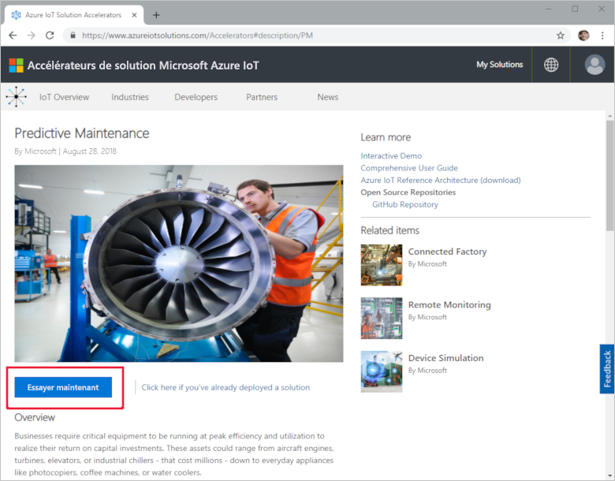
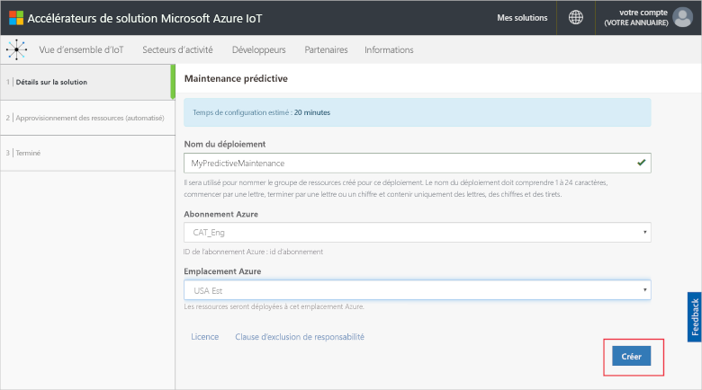
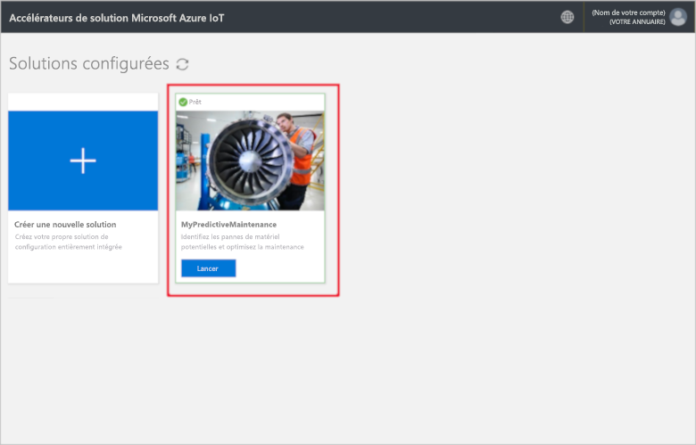
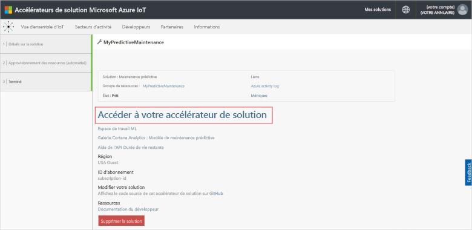
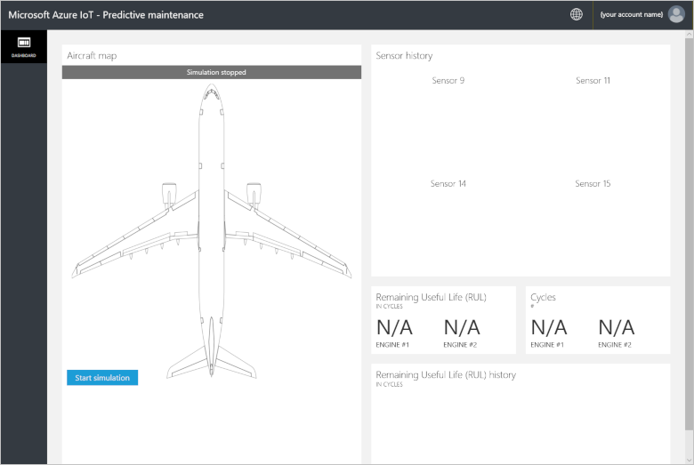
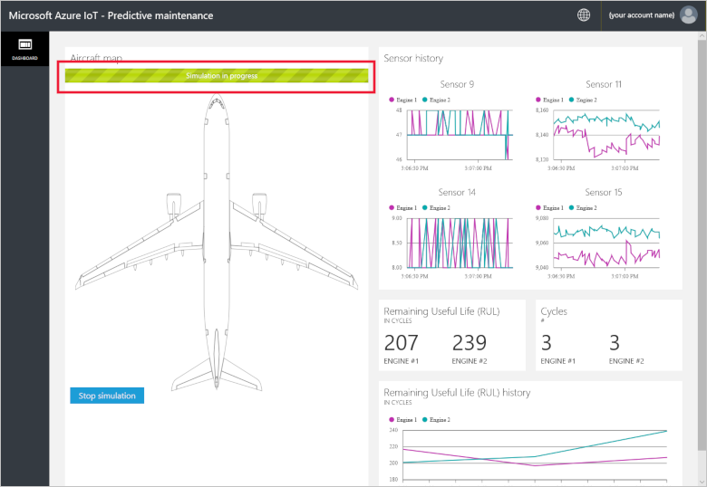
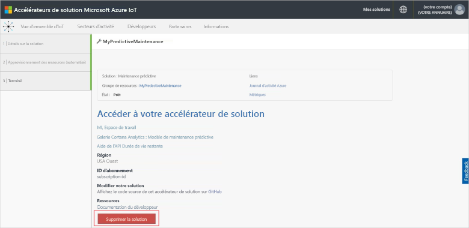

# Démarrage rapide : Essayer une solution cloud pour exécuter une analyse de maintenance prédictive sur mes appareils connectés

Ce démarrage rapide vous montre comment déployer l’accélérateur de solution Maintenance prédictive Azure IoT pour exécuter une simulation de maintenance prédictive informatique. Une fois l’accélérateur de solution déployé, vous utilisez la page **Tableau de bord** de la solution pour exécuter une analyse de maintenance prédictive sur les données d’un moteur d’avion simulé. Vous pouvez utiliser cet accélérateur de solution comme point de départ de votre propre implémentation ou comme outil d’apprentissage.

Dans cette simulation, Fabrikam est une compagnie aérienne régionale qui s’efforce d’offrir à ses clients une expérience optimale à des prix compétitifs. Une des causes de retard des vols est liée à des problèmes de gestion, et la maintenance des moteurs d'avion est particulièrement complexe. Une panne de moteur en plein vol devant être évitée à tout prix, Fabrikam inspecte ses moteurs régulièrement et suit un programme de maintenance planifiée. Mais les moteurs d’avion ne vieillissent pas tous de la même manière. Et certaines opérations de maintenance inutiles sont effectuées sur les moteurs. Plus important encore, les problèmes clouent les appareils au sol jusqu'à ce que l'opération de maintenance soit terminée. Si un appareil est immobilisé sur un site qui ne dispose pas des techniciens qualifiés ni des pièces de rechange nécessaires, ces problèmes peuvent s’avérer particulièrement coûteux.

Les appareils de Fabrikam sont équipés de capteurs qui analysent les paramètres du moteur pendant le vol. Fabrikam recueille depuis des années des données sur le fonctionnement et les pannes de ces capteurs. Les scientifiques de Fabrikam ont utilisé ces données pour développer un modèle permettant de prédire la durée de vie utile restante d’un moteur d’avion. Le modèle se sert d’une corrélation entre les données de quatre des capteurs moteur et l'usure du moteur conduisant à une panne. Tandis que Fabrikam continue à effectuer des inspections régulières pour garantir la sécurité, l’entreprise peut maintenant utiliser les modèles pour calculer la durée de vie utile restante de chaque moteur après chaque vol. Fabrikam peut désormais anticiper les futurs points de défaillance et planifier la maintenance afin de réduire le temps que l’avion doit passer au sol. Ce processus réduit les coûts d’exploitation tout en garantissant la sécurité des passagers et de l’équipage.

Pour suivre ce guide de démarrage rapide, vous devez avoir un abonnement Azure actif.

Si vous n’avez pas d’abonnement Azure, créez un [compte gratuit](https://azure.microsoft.com/free/?WT.mc_id=A261C142F) avant de commencer.

## Déployer la solution

Quand vous déployez l’accélérateur de solution dans votre abonnement Azure, vous devez définir des options de configuration.

Accédez à [Accélérateurs de solution Microsoft Azure IoT](https://www.azureiotsolutions.com), puis connectez-vous en utilisant les informations d’identification de votre compte Azure.

Cliquez sur la vignette **Maintenance prédictive**. Dans **Maintenance prédictive**, cliquez sur **Essayer maintenant** :

Sur la page **Créer une solution de maintenance prédictive**, saisissez un **Nom de solution** unique pour votre accélérateur de solution de maintenance prédictive. Pour ce démarrage rapide, nous allons utiliser **MyPredictiveMaintenance**.

Sélectionnez l’**Abonnement** et la **Région** à utiliser pour déployer l’accélérateur de solution. En général, vous choisissez la région la plus proche. Pour ce démarrage rapide, nous allons utiliser **Visual Studio Enterprise** et **USA Est**. Vous devez être [administrateur général ou utilisateur](iot-accelerators-permissions.md) dans l’abonnement.

Cliquez sur **Créer** pour commencer le déploiement. L’exécution de ce processus prend au moins cinq minutes :

## Se connecter à la solution

Lorsque le déploiement vers votre abonnement Azure est terminé, vous pouvez observer une coche verte ainsi que la mention **Ready** sur la vignette de la solution. Vous pouvez désormais vous connecter au tableau de bord de votre accélérateur de solution Maintenance prédictive.

Dans la page **Solutions approvisionnées**, cliquez sur votre nouvel accélérateur de solution Maintenance prédictive.

 Vous pouvez consulter les informations relatives à votre accélérateur de solution dans la page qui s’affiche. Choisissez **Accéder à votre accélérateur de solution** pour voir votre accélérateur de solution Maintenance prédictive :

Cliquez sur **Accepter** pour accepter la demande d’autorisation. Le tableau de bord de la solution Maintenance prédictive s’affiche dans votre navigateur :

Cliquez sur **Démarrer la simulation** pour commencer la simulation. L’historique, les cycles et la durée de vie utile restante du capteur, ainsi que l’historique de durée de vie restante sont renseignés dans le tableau de bord :

Lorsque la durée de vie utile restante est inférieure à 160 (seuil arbitraire choisi pour les besoins de la démonstration), le portail de la solution affiche un symbole d’avertissement en regard de la valeur correspondante. Le portail de la solution colore également le moteur d’avion en jaune. Vous remarquerez que les valeurs de durée de vie utile restante tendent globalement à diminuer, mais avec des rebonds à la hausse ou à la baisse. Ce phénomène provient de la variabilité de la durée des cycles et de la précision du modèle.

La simulation complète prend environ 35 minutes pour effectuer 148 cycles. Le seuil de durée de vie utile restante de 160 est atteint pour la première fois à environ 5 minutes, et les deux moteurs atteignent le seuil à environ 8 minutes.

La simulation s’exécute sur le jeu de données complet pour les 148 cycles et se règle sur les valeurs finales de durée de vie utile restante et de cycles.

Vous pouvez arrêter la simulation à tout moment. L’option **Démarrer la simulation** réexécute la simulation à partir du début du jeu de données.

## Supprimer des ressources

Si vous prévoyez d’explorer davantage, laissez l’accélérateur de solution Maintenance prédictive déployé.

Si vous n’avez plus besoin de l’accélérateur de solution, supprimez-le de la page [Solutions approvisionnées](https://www.azureiotsolutions.com/Accelerators#dashboard) en le sélectionnant et en cliquant sur **Supprimer la solution** :

## Étapes suivantes

Dans ce guide de démarrage rapide, vous avez déployé l’accélérateur de solution Maintenance prédictive et effectué une simulation.

Pour en savoir plus sur l’accélérateur de solution et les moteurs d’avions simulés, passez à l’article suivant.

> [!div class="nextstepaction"]
> [Présentation de l’accélérateur de solution de maintenance prédictive](iot-accelerators-predictive-walkthrough.md)
