# Démarrage rapide : Essayer une solution de surveillance informatique à distance

Ce guide de démarrage rapide vous montre comment déployer l’accélérateur de solution de surveillance à distance Azure IoT pour exécuter une simulation de surveillance informatique à distance. Une fois que vous avez déployé l’accélérateur de solution, vous utilisez la page **Tableau de bord** de la solution pour visualiser les appareils simulés sur une carte, et la page **Maintenance** pour répondre à une alerte concernant la pression d’un appareil de refroidissement simulé. Vous pouvez utiliser cet accélérateur de solution comme point de départ de votre propre implémentation ou comme outil d’apprentissage.

Le déploiement initial configure l’accélérateur de solution de surveillance à distance pour une société appelée Contoso. Contoso gère une sélection de types d’appareil variés, tels que des appareils de refroidissement, déployés dans différents environnements physiques. Un appareil de refroidissement envoie la télémétrie de la température, de l’humidité et de la pression à l’accélérateur de la solution Monitoring à distance.

Pour suivre ce guide de démarrage rapide, vous devez avoir un abonnement Azure actif.

Si vous n’avez pas d’abonnement Azure, créez un [compte gratuit](https://azure.microsoft.com/free/?WT.mc_id=A261C142F) avant de commencer.

## Déployer la solution

Quand vous déployez l’accélérateur de solution dans votre abonnement Azure, vous devez définir des options de configuration.

Connectez-vous à [azureiotsolutions.com](https://www.azureiotsolutions.com/Accelerators) avec les informations d’identification de votre compte Azure.

Cliquez sur **Essayer maintenant**, dans la vignette **Monitoring à distance**.

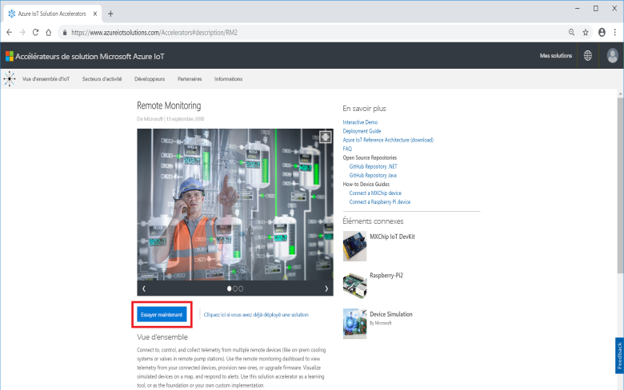

Dans la page **Créer la solution Monitoring à distance**, sélectionnez un déploiement **De base**. Si vous déployez l’accélérateur de solution pour connaître son fonctionnement ou effectuer une démonstration, choisissez l’option **De base** pour minimiser les coûts.

Choisissez **.NET** comme langage. Les implémentations Java et .NET ont des fonctionnalités identiques.

Entrez un **Nom de la solution** unique pour votre accélérateur de solution Monitoring à distance. Pour ce démarrage rapide, nous appelons le nôtre **contoso-rm2**.

Sélectionnez l’**Abonnement** et la **Région** à utiliser pour déployer l’accélérateur de solution. En général, vous choisissez la région la plus proche. Pour ce démarrage rapide, nous allons utiliser **Visual Studio Enterprise** et **Europe Ouest**. Vous devez être [administrateur général ou utilisateur](iot-accelerators-permissions.md) dans l’abonnement.

Cliquez sur **Créer une solution** pour commencer le déploiement. L’exécution de ce processus prend au moins cinq minutes :

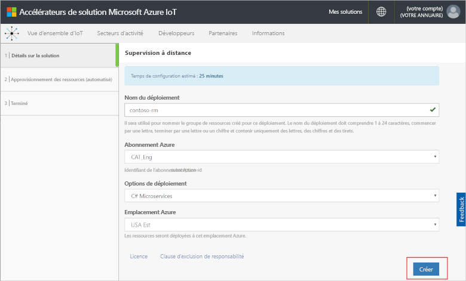

## Se connecter à la solution

Lorsque le déploiement vers votre abonnement Azure est terminé, vous pouvez observer une coche verte ainsi que la mention **Ready** sur la vignette de la solution. À présent, vous pouvez vous connecter au tableau de bord de l’accélérateur de solution Surveillance à distance.

Dans la page **Solutions approvisionnées**, cliquez sur votre nouvel accélérateur de solution Monitoring à distance :

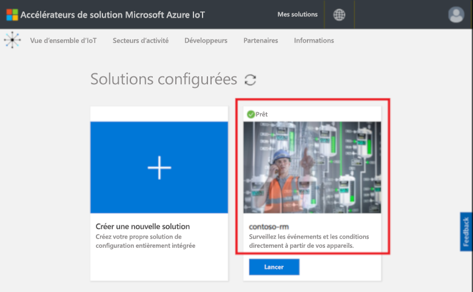

Vous pouvez consulter les informations relatives à votre accélérateur de solution Monitoring à distance dans le panneau qui s’affiche. Choisissez **Tableau de bord des solutions** pour voir votre accélérateur de solution Monitoring à distance :

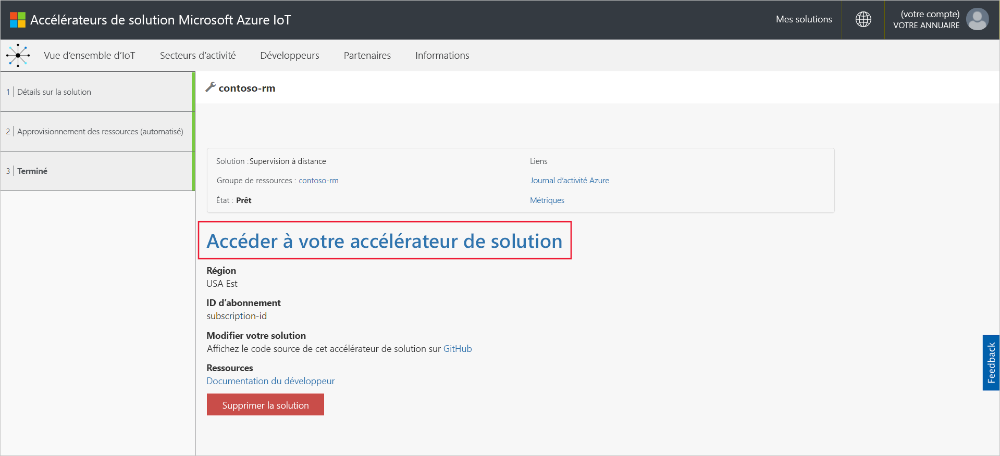

Cliquez sur **Accepter** pour accepter la demande d’autorisation. Le tableau de bord de la solution Monitoring à distance s’affiche dans votre navigateur :

[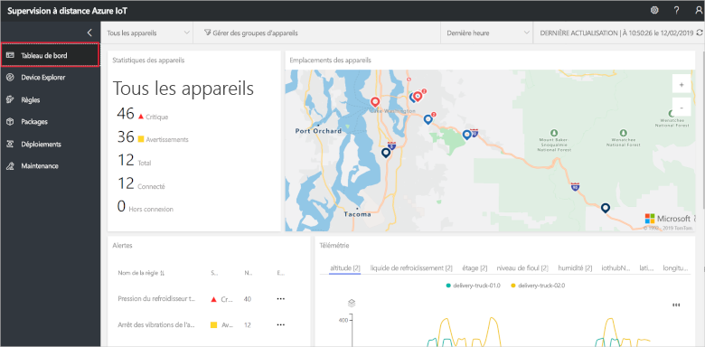](./media/quickstart-remote-monitoring-deploy/solutiondashboard-expanded.png#lightbox)

## Voir vos appareils

Le tableau de bord de la solution affiche les informations suivantes sur les appareils simulés de Contoso :

* **Statistiques de l’appareil** affiche un récapitulatif des alertes et le nombre total d’appareils. Dans le déploiement par défaut, Contoso compte 10 appareils simulés de types différents.

* **Emplacements de l’appareil** montre où se trouvent physiquement vos appareils. La couleur de l’épingle montre quand l’appareil présente des alertes.

* **Alertes** affiche les détails des alertes de vos appareils.

* **Télémétrie** affiche la télémétrie de vos appareils. Vous pouvez voir les différents flux de télémétrie en cliquant sur les types de télémétrie en haut.

* **Analytique** montre des informations combinées sur les alertes de vos appareils.

## Répondre à une alerte

En tant qu’opérateur chez Contoso, vous pouvez surveiller vos appareils à partir du tableau de bord de la solution. Le panneau **Statistiques de l’appareil** affiche un nombre d’alertes critiques, tandis que le panneau **Alertes** montre que la plupart d’entre elles proviennent d’un appareil de refroidissement. Pour les appareils de refroidissement de Contoso, une pression interne de plus de 250 PSI indique que l’appareil ne fonctionne pas correctement.

### Identifier le problème

Dans la page **Tableau de bord**, dans le panneau **Alertes**, vous pouvez voir l’alerte **Chiller pressure too high** (Pression de refroidissement trop élevée). L’appareil de refroidissement est marqué d’une épingle rouge sur la carte (vous devrez peut-être faire un panoramique et zoomer sur la carte) :

[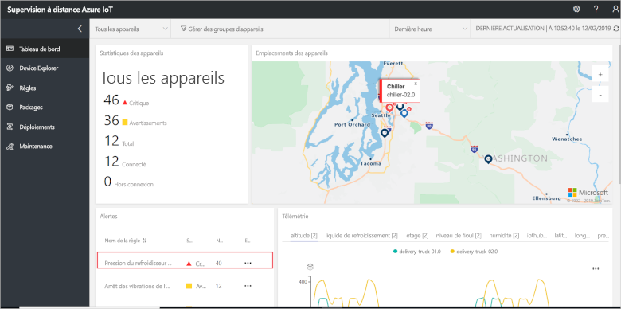](./media/quickstart-remote-monitoring-deploy/dashboardalarm-expanded.png#lightbox)

Dans le panneau **Alertes**, cliquez sur **...** dans la colonne **Explorer** à côté de la règle **Chiller pressure too high** (Pression de refroidissement trop élevée). Cette action vous conduit à la page **Maintenance**, où vous pouvez voir les détails de la règle qui a déclenché l’alerte.

La page de maintenance **Chiller pressure too high** montre les détails de la règle qui a déclenché les alertes. La page liste également l’heure des alertes et l’appareil qui les a déclenchées :

[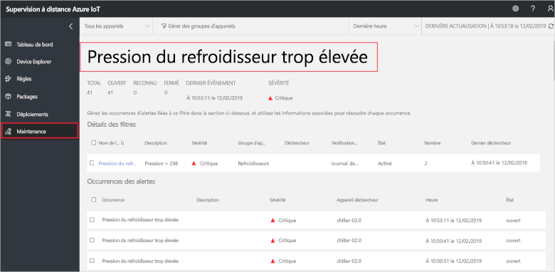](./media/quickstart-remote-monitoring-deploy/maintenancealarmlist-expanded.png#lightbox)

Vous avez maintenant identifié le problème qui a déclenché l’alerte, ainsi que l’appareil associé. En tant qu’opérateur, vous devez ensuite reconnaître l’alerte et résoudre le problème.

### Résoudre le problème

Pour indiquer aux autres opérateurs que vous travaillez à la résolution de l’alerte, sélectionnez-la et définissez **État d’alerte** sur **Reconnu** :

[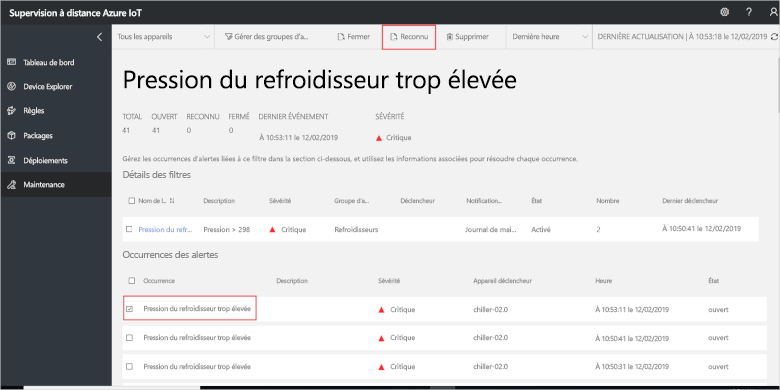](./media/quickstart-remote-monitoring-deploy/maintenanceacknowledge-expanded.png#lightbox)

La valeur dans la colonne d’état devient **Reconnu**.

Pour intervenir sur l’appareil de refroidissement, faites défiler vers le bas jusqu’à **Informations connexes**, sélectionnez l’appareil de refroidissement dans la liste **Appareils avec alerte**, puis choisissez **Travaux** :

[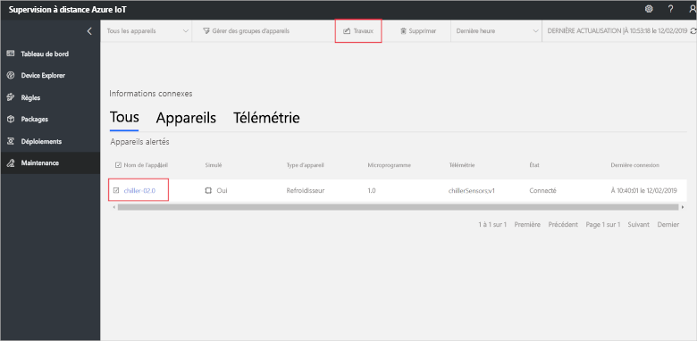](./media/quickstart-remote-monitoring-deploy/maintenanceschedule-expanded.png#lightbox)

Dans le panneau **Travaux**, sélectionnez la **méthode Run**, puis la méthode **EmergencyValveRelease**. Ajouter le nom du travail **ChillerPressureRelease**, puis cliquez sur **Appliquer**. Ces paramètres créent un travail qui s’exécute immédiatement.

Pour voir l’état du travail, revenez à la page **Maintenance** et consultez la liste des travaux dans la vue **Travaux**. Vous devrez peut-être attendre quelques secondes avant de pouvoir voir que le travail a été exécuté pour libérer la pression de la soupape de l’appareil de refroidissement :

[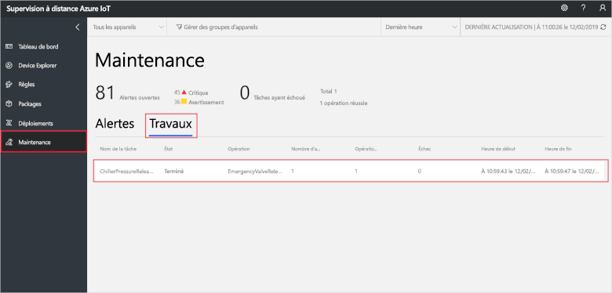](./media/quickstart-remote-monitoring-deploy/maintenancerunningjob-expanded.png#lightbox)

### Vérifier que la pression est revenue à la normale

Pour voir la télémétrie de la pression de l’appareil de refroidissement, accédez à la page **Tableau de bord**, sélectionnez **Pression** dans le panneau de la télémétrie, puis confirmez que la pression de **chiller-02.0** est revenue à la normale :

[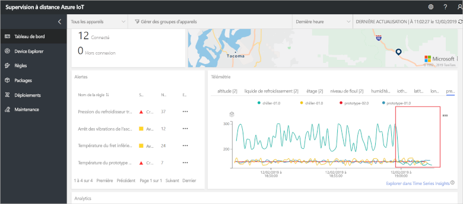](./media/quickstart-remote-monitoring-deploy/pressurenormal-expanded.png#lightbox)

Pour fermer l’incident, accédez à la page **Maintenance**, sélectionnez l’alerte et définissez l’état sur **Fermé** :

La valeur dans la colonne d’état devient **Fermé**.

## Supprimer les ressources

Si vous envisagez de passer aux tutoriels, laissez l’accélérateur de solution Monitoring à distance déployé.

Si vous n’avez plus besoin de l’accélérateur de solution, supprimez-le de la page [Solutions approvisionnées](https://www.azureiotsolutions.com/Accelerators#dashboard) en le sélectionnant et en cliquant sur **Supprimer la solution** :

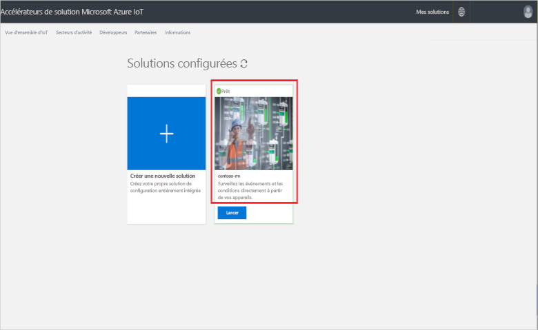

## Étapes suivantes

Dans ce guide de démarrage rapide, vous avez déployé l’accélérateur de solution Monitoring à distance et effectué une tâche de monitoring en utilisant des appareils simulés dans le déploiement de Contoso par défaut.

Pour en savoir plus sur l’accélérateur de solution à l’aide d’appareils simulés, passez au didacticiel suivant.

> [!div class="nextstepaction"]
> [Tutoriel : Surveiller vos appareils IoT](iot-accelerators-remote-monitoring-monitor.md)