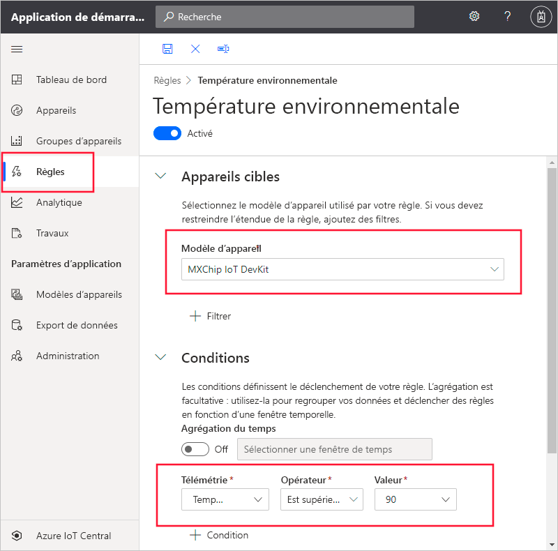
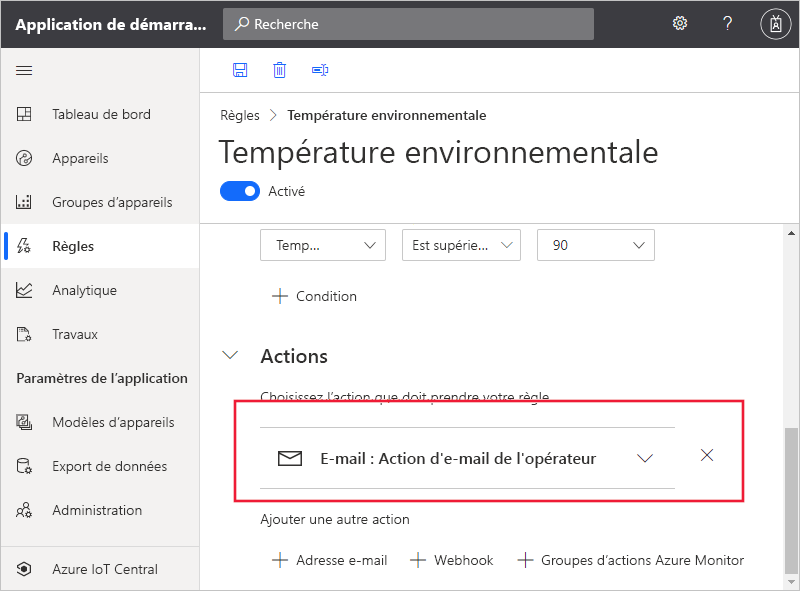

# Démarrage rapide : Configurer des règles et des actions pour votre appareil dans Azure IoT Central

*Cet article s’applique aux opérateurs, aux créateurs et aux administrateurs.*

Dans ce démarrage rapide, vous allez créer une règle qui envoie un e-mail quand la température rapportée par le capteur d’un appareil dépasse 90&deg; F.

## Prérequis

Avant de commencer, vous devez effectuer les deux démarrages rapides précédents : [Créer une application Azure IoT Central](./quick-deploy-iot-central.md) et [Ajouter un appareil simulé à votre application IoT Central](./quick-create-pnp-device.md) pour créer le modèle d’appareil **MXChip IoT DevKit** à utiliser.

## Créer une règle basée sur la télémétrie

1. Pour ajouter une nouvelle règle basée sur la télémétrie à votre application, dans le volet de gauche, sélectionnez **Règles**.

1. Pour créer une règle, sélectionnez **+** .

1. Entrez **Température ambiante** comme nom de la règle.

1. Dans la section **Appareils cibles**, sélectionnez **MXChip IoT DevKit** comme modèle d’appareil. Cette option filtre les appareils auxquels s’applique la règle par type de modèle d’appareil. Vous pouvez ajouter d’autres critères de filtre en sélectionnant **+ Filtre**.

1. Dans la section **Conditions**, vous définissez ce qui déclenche votre règle. Utilisez les informations suivantes pour définir une condition basée sur la télémétrie de température :

    | Champ        | Valeur            |
    | ------------ | ---------------- |
    | Mesure  | Température      |
    | Opérateur     | est supérieur à  |
    | Valeur        | 90               |

    Pour ajouter d’autres conditions, sélectionnez **+ Condition**.

    

1. Pour ajouter une action d'e-mail à exécuter quand la règle se déclenche, sélectionnez **+ E-mail**.

1. Utilisez les informations du tableau suivant pour définir votre action, puis sélectionnez **Terminé** :

    | Paramètre   | Valeur                                             |
    | --------- | ------------------------------------------------- |
    | Nom complet | Action d'e-mail de l'opérateur                          |
    | À        | Votre adresse e-mail                                |
    | Notes     | La température ambiante a dépassé le seuil. |

    > [!NOTE]
    > Pour recevoir une notification par courrier électronique, l’adresse e-mail doit être un [ID d’utilisateur dans l’application](howto-administer.md), et l’utilisateur doit s’être connecté au moins une fois à l’application.

    

1. Sélectionnez **Enregistrer**. Votre règle est listée dans la page **Règles**.

## Tester la règle

Peu après l’enregistrement de la règle, elle devient active. Lorsque les conditions définies dans la règle sont remplies, votre application envoie un message à l’adresse e-mail que vous avez spécifiée dans l’action.

> [!NOTE]
> Une fois le test terminé, désactivez la règle pour ne plus recevoir d’alertes dans votre boîte de réception.

## Étapes suivantes

Dans ce démarrage rapide, vous avez appris comment :

* Créer une règle basée sur la télémétrie
* Ajouter une action

Pour en savoir plus sur la surveillance des appareils connectés à votre application, passez au démarrage rapide :

> [!div class="nextstepaction"]
> [Utiliser Azure IoT Central pour surveiller vos appareils](quick-monitor-devices.md).
