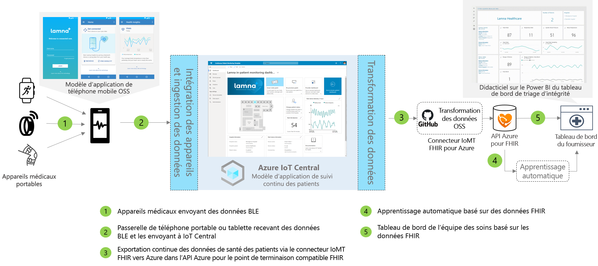

# Architecture du suivi continu des patients

Vous pouvez créer des solutions de surveillance continue des patients à l’aide du modèle d’application fourni et en utilisant l’architecture décrite ci-dessous comme guide.

>[!div class="mx-imgBorder"] 
>

1. Appareils médicaux communiquant à l’aide de Bluetooth Low Energy (BLE)
1. Passerelle de téléphone portable recevant des données BLE et les envoyant à IoT Central
1. Exportation en continu des données médicales des patients vers l’API Azure pour FHIR (Fast Healthcare Interoperability Resources)&reg;
1. Machine learning basé sur des données interopérables
1. Tableau de bord de l’équipe des soins basé sur les données FHIR

## Détails
Cette section décrit plus en détails chaque partie du diagramme de l’architecture.

### Appareils médicaux BLE
De nombreux dispositifs médicaux portables utilisés dans l’espace IoT santé sont des appareils Bluetooth Low Energy. Ils ne peuvent pas s’adresser directement au cloud et doivent passer par une passerelle. Cette architecture suggère d’utiliser une application de téléphone portable pour cette passerelle. 

### Passerelle de téléphone portable
La fonction principale de l’application de téléphone portable est d’ingérer les données BLE des appareils médicaux et de les communiquer à Azure IoT Central. De plus, l’application peut guider les patients dans un flux de configuration et de provisionnement d’appareil et les aider à créer une vue de leurs données médicales personnelles. D’autres solutions peuvent utiliser une passerelle de tablette ou une passerelle statique si elles sont mises en place dans une chambre d’hôpital pour implémenter le même circuit de communication. Nous avons créé un exemple d’application mobile open source pour Android et iOS, que vous pouvez utiliser comme point de départ pour démarrer vos efforts de développement d’applications. Pour plus d’informations sur l’exemple d’application mobile de surveillance continue des patients IoT Central, consultez [Exemples Azure](https://docs.microsoft.com/samples/iot-for-all/iotc-cpm-sample/iotc-cpm-sample/).

### Exporter vers l’API Azure pour FHIR&reg;
Azure IoT Central est certifié conforme à HIPAA et HITRUST&reg;, mais vous pouvez aussi envoyer des données relatives à la santé des patients à l’API Azure pour FHIR. L’[API Azure pour FHIR](../../healthcare-apis/overview.md) est une API conforme, entièrement managée et basée sur des standards pour les données médicales, qui vous permet de créer des systèmes participatifs avec vos données médicales. Elle permet d’échanger rapidement des données via des API FHIR en s’appuyant sur une offre PaaS dans le cloud. La fonctionnalité d’exportation continue de données d’IoT Central vous permet d’envoyer des données à l’API Azure pour FHIR via le [connecteur Azure IoT pour FHIR](https://docs.microsoft.com/azure/healthcare-apis/iot-fhir-portal-quickstart).

### Machine Learning
Une fois que vous avez agrégé vos données et que vous les avez traduites au format FHIR, vous pouvez créer des modèles Machine Learning qui peuvent enrichir des insights et permettre une prise de décision plus intelligente pour votre équipe de soins. Il existe différents types de services permettant de créer, entraîner et déployer des modèles Machine Learning. Pour plus d’informations sur l’utilisation des offres de Machine Learning d’Azure, consultez notre [documentation Machine Learning](../../machine-learning/index.yml).

### Tableau de bord de fournisseur
Les données qui se trouvent dans l’API Azure pour FHIR peuvent être utilisées pour créer un tableau de bord d’insights sur les patients ou être intégrées directement dans EMR pour aider les équipes de soins à visualiser l’état des patients. Les équipes de soins peuvent se servir de ce tableau de bord pour suivre les patients qui ont besoin d’assistance et pour identifier les premiers signes avant-coureurs d’une détérioration. Pour découvrir comment créer un tableau de bord de fournisseur en temps réel Power BI, suivez notre [guide de procédure](howto-health-data-triage.md).

## Étapes suivantes
* [Découvrir comment déployer un modèle d’application de surveillance continue des patients](tutorial-continuous-patient-monitoring.md)