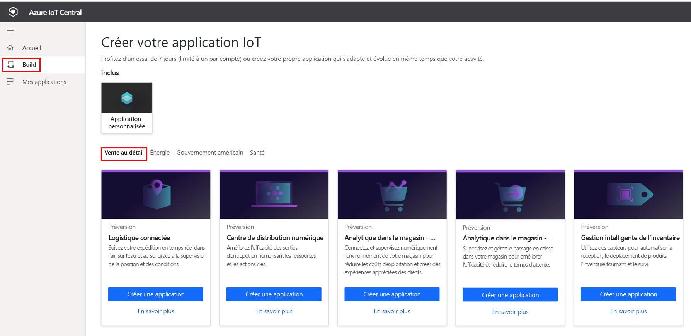
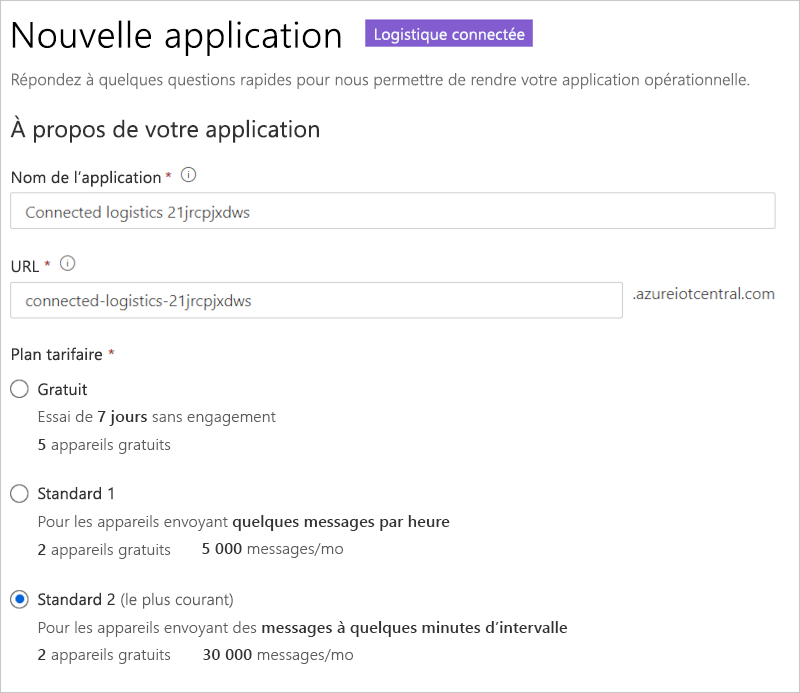
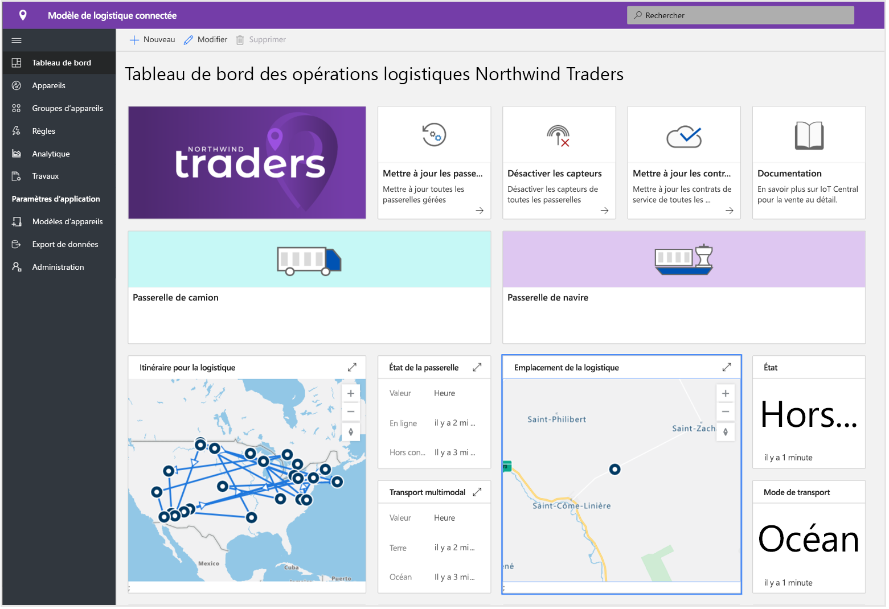
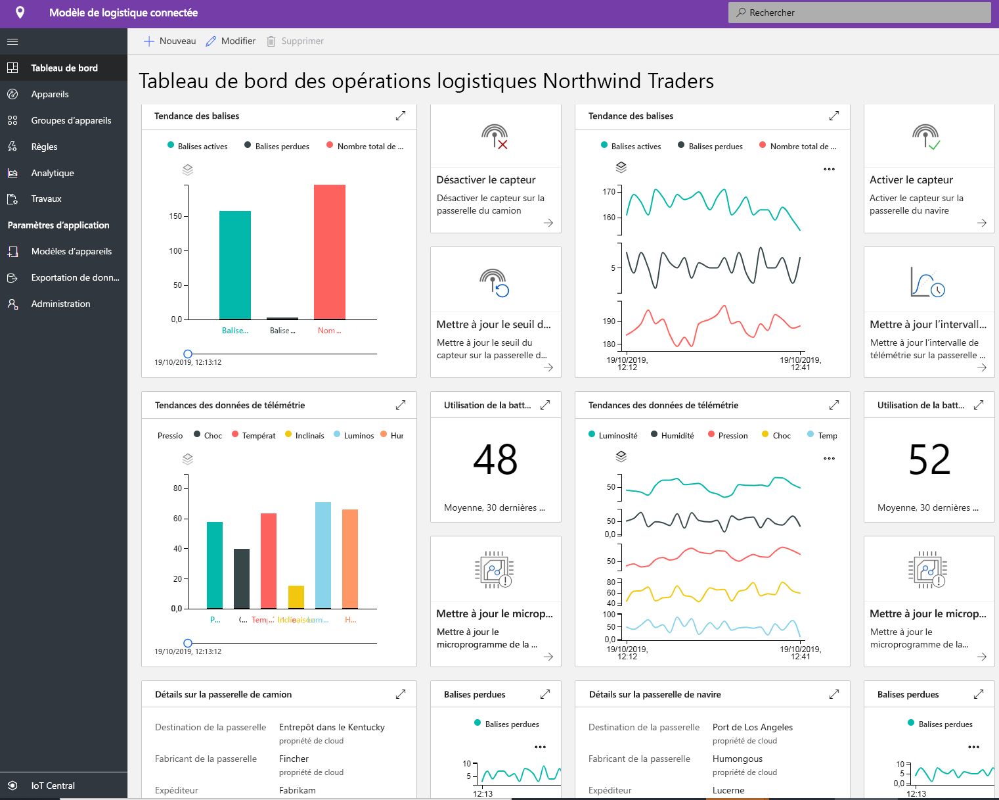
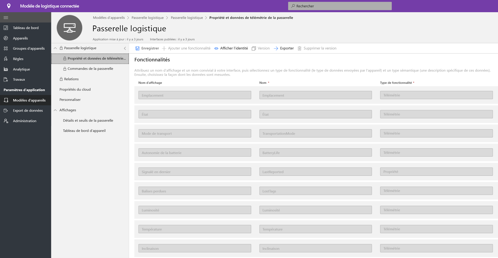
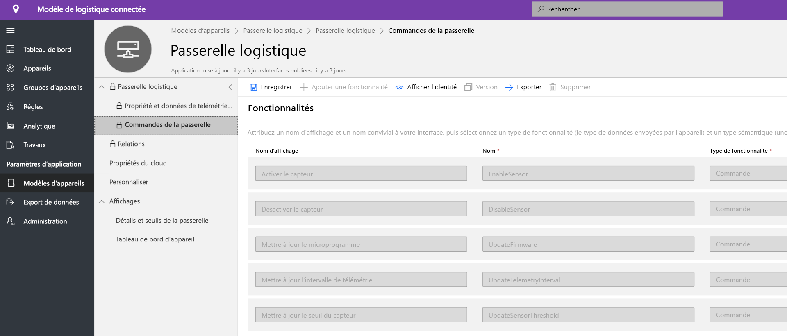
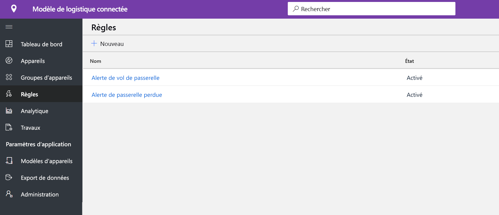
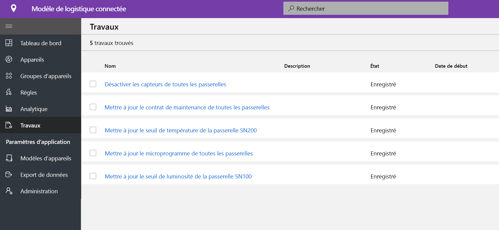
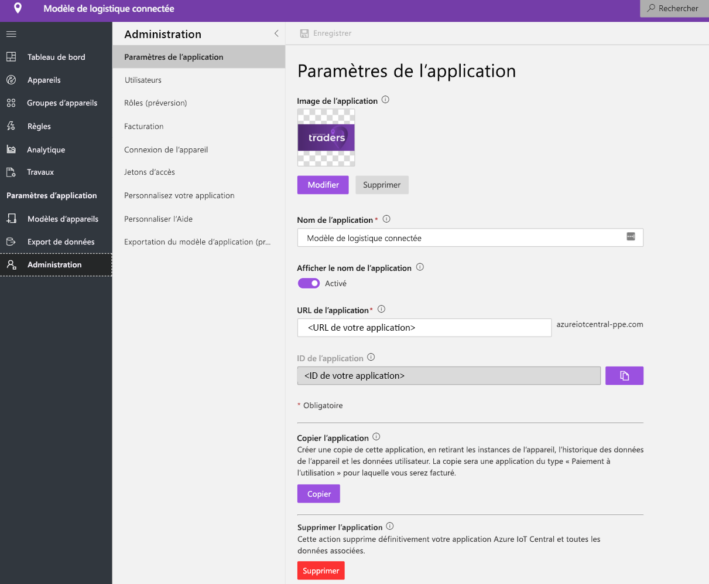

# Didacticiel : Déployer et découvrir un modèle d’application logistique connectée

[!INCLUDE [iot-central-pnp-original](../../../includes/iot-central-pnp-original-note.md)]

Ce didacticiel vous montre comment prendre en main le déploiement d’un modèle d’application **logistique connectée** IoT Central. Vous allez apprendre à déployer le modèle et découvrir les fonctionnalités prêtes à l’emploi incluses ainsi que les différentes possibilités qui s’offrent à vous.

Ce tutoriel vous montre comment effectuer les opérations suivantes : 
* créer une application de logistique connectée 
* examiner l’application 

## Prérequis
* Aucune configuration spécifique n’est requise pour déployer cette application
* Il est recommandé d’avoir un abonnement Azure, mais vous pouvez essayer sans

## Créer un modèle d’application logistique connectée
Vous pouvez créer une application à l’aide de la procédure suivante
1. Accédez au site web du gestionnaire d’applications Azure IoT Central. Sélectionnez **Générer** dans la barre de navigation de gauche, puis cliquez sur l’onglet **Distribution**.

> [!div class="mx-imgBorder"]
> 

2. Sélectionnez **Créer une application** sous **Application logistique connectée**

3. Le fait de cliquer sur **Créer une application** ouvre le formulaire Nouvelle application et remplit les détails demandés comme indiqué ci-dessous.
   * **Nom de l’application** : vous pouvez utiliser le nom suggéré par défaut ou entrer le nom convivial de l’application.
   * **URL** : vous pouvez utiliser l’URL par défaut suggérée ou entrer votre URL conviviale unique et facile à mémoriser. Nous vous recommandons de conserver ensuite le paramètre par défaut si vous possédez un abonnement Azure. Sinon, vous pouvez commencer par un essai gratuit de sept jours, puis passer à un paiement à l’utilisation à tout moment avant l’expiration de l’essai gratuit.
   * **Informations de facturation** : Les informations sur le répertoire, l’abonnement Azure et la région sont requises pour configurer les ressources.
   * **Créer** : Sélectionnez Créer en bas de la page pour déployer votre application.

> [!div class="mx-imgBorder"]
> 

## Examiner l’application 

## tableau de bord

Après le déploiement réussi du modèle d’application, votre tableau de bord par défaut est un portail dédié à l’opérateur de logistique connectée. Northwind Trader est un fournisseur logistique fictif gérant une flotte d’engins de transport de marchandises par voie maritime et terrestre. Dans ce tableau de bord, deux passerelles différentes fournissent des données de télémétrie sur les livraisons ainsi que les commandes, tâches et actions associées que vous pouvez effectuer. Ce tableau de bord est préconfiguré pour présenter l’activité des opérations de l’appareil de logistique critique.
Le tableau de bord distingue logiquement deux opérations de gestion des appareils de passerelle différentes : 
   * L’itinéraire logistique pour les livraisons par camion et les informations d’emplacement pour le transport maritime sont des éléments essentiels pour le transport multimodal
   * État de la passerelle et informations pertinentes 

> [!div class="mx-imgBorder"]
> 

   * Vous pouvez facilement effectuer le suivi du nombre total de passerelles, des balises actives et inconnues.
   * Vous pouvez effectuer des opérations de gestion des appareils telles que la mise à jour des microprogrammes, la désactivation et l’activation des capteurs, la modification du seuil des capteurs, la modification des intervalles de télémétrie ou la modification des contrats de service des appareils.
   * Consulter la consommation de la batterie des appareils

> [!div class="mx-imgBorder"]
> 

## Modèle d’appareil

Cliquez sur l’onglet Modèles d’appareils pour voir le modèle de capacité de la passerelle. Un modèle de capacité est structuré autour de deux interfaces différentes, **Propriétés et télémétrie de la passerelle** et **Commandes de la passerelle**

**Propriétés et télémétrie de la passerelle** : cette interface représente toutes les données de télémétrie liées aux capteurs, à l’emplacement et aux informations sur les appareils ainsi que la capacité de propriété de jumeau d’appareil telle que les seuils de capteur et les intervalles de mise à jour.

> [!div class="mx-imgBorder"]
> 

**Commandes de la passerelle** : cette interface organise toutes les fonctionnalités de commande de la passerelle

> [!div class="mx-imgBorder"]
> 

## Règles
Sélectionnez l’onglet Règles pour afficher deux règles différentes qui existent dans ce modèle d’application. Ces règles sont configurées pour envoyer des notifications par e-mail aux opérateurs pour des investigations supplémentaires.
 
**Alerte de vol de passerelle** : Cette règle est déclenchée lorsque les capteurs détectent une lumière inattendue pendant le trajet. Les opérateurs doivent être informés au plus vite pour enquêter sur un vol éventuel.
 
**Aucune réponse de la passerelle** : Cette règle se déclenche si la passerelle ne se signale pas au cloud pendant une longue période. L’absence de réponse de la passerelle peut être due à une batterie faible, à une perte de connectivité ou encore à l’intégrité de l’appareil.

> [!div class="mx-imgBorder"]
> 

## Tâches
Sélectionnez l’onglet Travaux pour afficher cinq travaux différents qui existent dans le cadre de ce modèle d’application :

> [!div class="mx-imgBorder"]
> 

Vous pouvez tirer parti de la fonctionnalité Travaux pour effectuer des opérations sur l’ensemble de la solution. Ici, les travaux utilisent les commandes de l’appareil et la capacité de jumeau pour effectuer des tâches telles que la désactivation de capteurs spécifiques sur l’ensemble de la passerelle ou la modification du seuil du capteur en fonction de l’itinéraire et du mode de transport. 
   * La désactivation des capteurs de chocs lors du transport maritime est une opération standard. Elle permet d’économiser la batterie ou d’abaisser le seuil de température en cas de transport frigorifique. 
 
   * L’onglet Travaux vous permet d’effectuer des opérations à l’échelle du système comme la mise à jour des microprogrammes sur les passerelles ou celle du contrat de service pour le fonctionnement normal des activités de maintenance.

## Supprimer des ressources
Si vous n’envisagez pas de continuer à utiliser cette application, supprimez le modèle d’application en accédant à **Administration** > **Paramètres de l’application**, puis cliquez sur **supprimer**.

> [!div class="mx-imgBorder"]
> 

## Étapes suivantes
* En savoir plus sur le [concept de logistique connectée](./architecture-connected-logistics-pnp.md)
* En savoir plus sur d’autres [modèles de distribution IoT Central](./overview-iot-central-retail-pnp.md)
* En savoir plus sur [Vue d’ensemble d’IoT Central](../core/overview-iot-central-pnp.md)
