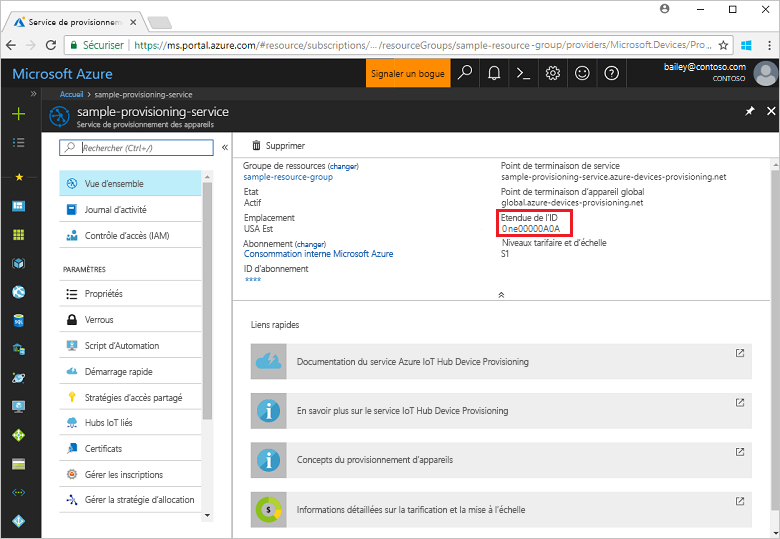
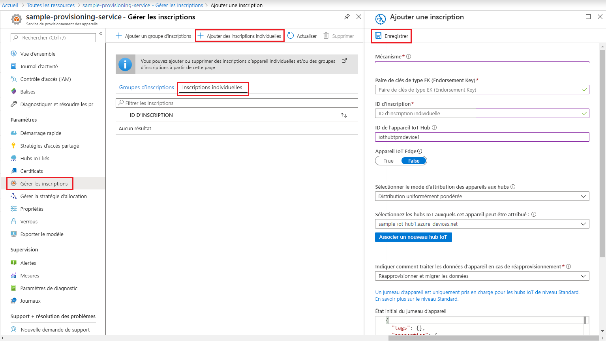
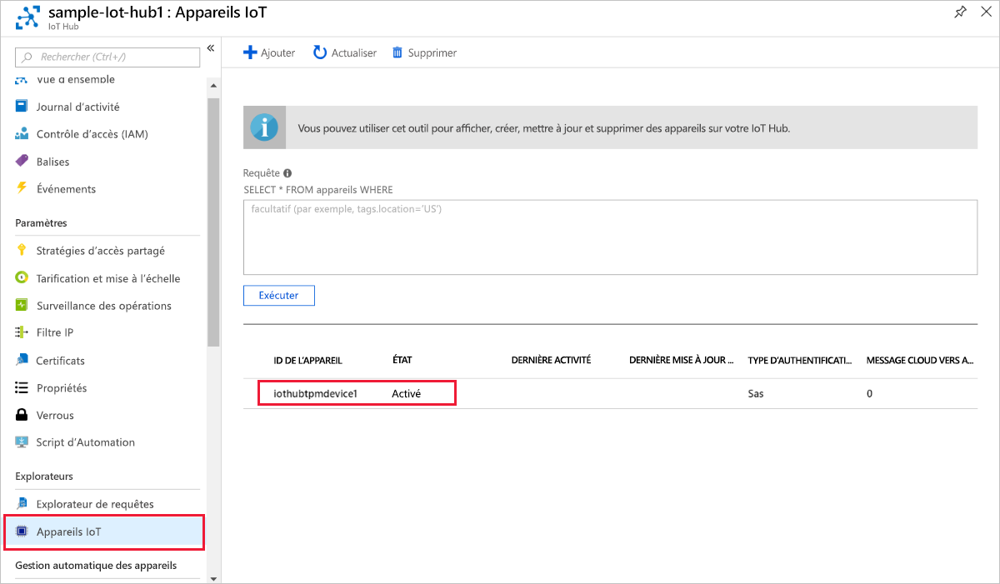

# <a name="create-and-provision-a-simulated-tpm-device-using-c-device-sdk-for-iot-hub-device-provisioning-service"></a>Créer et approvisionner un appareil TPM simulé auprès du service IoT Hub Device Provisioning à l’aide du C# Device SDK

[!INCLUDE [iot-dps-selector-quick-create-simulated-device-tpm](../../includes/iot-dps-selector-quick-create-simulated-device-tpm.md)]

Ces étapes indiquent comment générer un exemple d’appareil TPM simulé à l’aide de l’Azure IoT Hub C# SDK sur un ordinateur de développement sous Windows et comment connecter cet appareil simulé au service Device Provisioning et à votre hub IoT. Cet exemple de code utilise le simulateur de module de plateforme sécurisée Windows comme [module de sécurité matériel (HSM)](https://azure.microsoft.com/blog/azure-iot-supports-new-security-hardware-to-strengthen-iot-security/) de l’appareil. 

Si vous ne connaissez pas le processus d’approvisionnement automatique, pensez à consulter également [Concepts de provisionnement automatique](concepts-auto-provisioning.md). Vérifiez également que vous avez suivi la procédure décrite dans [Configurer le service d’approvisionnement d’appareil IoT Hub avec le portail Azure](./quick-setup-auto-provision.md) avant de continuer. 

[!INCLUDE [IoT Device Provisioning Service basic](../../includes/iot-dps-basic.md)]

<a id="setupdevbox"></a>
## <a name="prepare-the-development-environment"></a>Préparer l’environnement de développement 

1. Vérifiez que le [.Net core SDK](https://www.microsoft.com/net/download/windows) est bien installé sur votre ordinateur. 

1. Assurez-vous que l’élément `git` est installé sur votre machine et est ajouté aux variables d’environnement accessibles à la fenêtre de commande. Consultez la section relative aux [outils clients de Software Freedom Conservancy](https://git-scm.com/download/) pour accéder à la dernière version des outils `git` à installer, qui inclut **Git Bash**, l’application de ligne de commande que vous pouvez utiliser pour interagir avec votre référentiel Git local. 

4. Ouvrez une invite de commandes ou Git Bash. Clonez le référentiel GitHub Azure IoT SDK for C# :
    
    ```cmd
    git clone --recursive https://github.com/Azure/azure-iot-sdk-csharp.git
    ```

## <a name="provision-the-simulated-device"></a>Approvisionner l’appareil simulé


1. Connectez-vous au portail Azure. Cliquez sur le bouton **Toutes les ressources** dans le menu de gauche, puis ouvrez votre service Device Provisioning. Depuis le panneau **Vue d’ensemble**, notez la valeur **ID Scope _(Étendue d’ID)_**.

     


2. Dans une invite de commandes, accédez au répertoire du projet contenant l’exemple d’approvisionnement d’appareil TPM.

    ```cmd
    cd .\azure-iot-sdk-csharp\provisioning\device\samples\ProvisioningDeviceClientTpm
    ```

2. Tapez la commande suivante pour générer et exécuter l’exemple d’approvisionnement d’appareil TPM. Remplacez la valeur `<IDScope>` par l’étendue de l’ID de votre service d’approvisionnement. 

    ```cmd
    dotnet run <IDScope>
    ```

1. La fenêtre de commande affiche la **_paire de clés de type EK (Endorsement Key)_**, **_l’ID d’inscription_** et un **_ID d’appareil_** nécessaires à l’inscription de l’appareil. Notez ces valeurs. 
   > [!NOTE]
   > Ne confondez pas la fenêtre contenant la sortie de la commande avec la fenêtre contenant la sortie du simulateur TPM Vous devrez peut-être cliquer sur la fenêtre de commande pour l’amener au premier plan.

     


4. Dans le panneau de résumé du service Device Provisioning du portail Azure, sélectionnez **Gérer les inscriptions**. Sélectionnez l’onglet **Inscriptions individuelles**, puis cliquez sur le bouton **Ajouter une inscription individuelle** dans la partie supérieure. 

5. Sous **Ajouter une inscription**, entrez les informations suivantes :
    - Sélectionnez **TPM** comme *mécanisme* d’attestation d’identité.
    - Entrez l’*ID d’inscription* et la *paire de clés de type EK (Endorsement Key)* pour votre appareil de module de plateforme sécurisée. 
    - Vous pouvez aussi sélectionner un hub IoT lié à votre service d’approvisionnement.
    - Entrez un ID d’appareil unique. Vous pouvez entrer l’ID d’appareil proposé dans l’exemple de sortie ou votre propre ID. Si vous utilisez le vôtre, évitez les données sensibles au moment de le nommer. 
    - Mettez à jour l’**état du jumeau d’appareil initial** à l’aide de la configuration initiale de votre choix pour l’appareil.
    - Cela fait, cliquez sur le bouton **Enregistrer**. 

      

   Lorsque l’inscription aboutit, *l’ID d’inscription* de votre appareil s’affiche dans la liste sous l’onglet *Inscriptions individuelles*. 

6. Appuyez sur Entrée dans la fenêtre de commande (qui affichait la **_paire de clés de type EK (Endorsement Key)_**, **_l’ID d’inscription_** et un **_ID d’appareil_**) pour inscrire l’appareil simulé. Notez les messages qui simulent le démarrage et la connexion de l’appareil au service d’approvisionnement d’appareil pour obtenir des informations concernant votre IoT Hub. 

1. Vérifiez que l’appareil a bien été approvisionné. En cas de réussite de l’approvisionnement de l’appareil simulé sur le hub IoT lié à votre service d’approvisionnement, l’ID de l’appareil s’affiche dans le panneau **IoT Devices** (Appareils IoT) du hub. 

     

    Si vous avez modifié la valeur par défaut de l’*état du jumeau d’appareil initial* dans l’entrée d’inscription de votre appareil, l’état du jumeau souhaité peut être extrait du hub et agir en conséquence. Pour en savoir plus, consultez [Comprendre et utiliser les jumeaux d’appareil IoT Hub](../iot-hub/iot-hub-devguide-device-twins.md)


## <a name="clean-up-resources"></a>Supprimer des ressources

Si vous envisagez de continuer à manipuler et explorer l’exemple de client d’appareil, ne nettoyez pas les ressources créées lors de ce démarrage rapide. Sinon, procédez aux étapes suivantes pour supprimer toutes les ressources créées lors de ce démarrage rapide.

1. Fermez la fenêtre de sortie de l’exemple de client d’appareil sur votre machine.
1. Fermez la fenêtre du simulateur TPM sur votre machine.
1. Dans le menu de gauche du portail Azure, cliquez sur **Toutes les ressources**, puis sélectionnez votre service Device Provisioning. Dans la partie supérieure du panneau **Toutes les ressources**, cliquez sur **Supprimer**.  
1. À partir du menu de gauche, dans le portail Azure, cliquez sur **Toutes les ressources**, puis sélectionnez votre IoT Hub. Dans la partie supérieure du panneau **Toutes les ressources**, cliquez sur **Supprimer**.  

## <a name="next-steps"></a>Étapes suivantes

Dans ce démarrage rapide, vous avez créé un appareil simulé TPM sur votre machine et l’avez approvisionné vers votre hub IoT à l’aide du service IoT Hub Device Provisioning. Pour savoir comment inscrire un appareil TPM au moyen d’un programme, poursuivez avec le démarrage rapide correspondant. 

> [!div class="nextstepaction"]
> [Démarrage rapide : Inscrire l’appareil TPM auprès du service IoT Hub Device Provisioning](quick-enroll-device-tpm-csharp.md)
