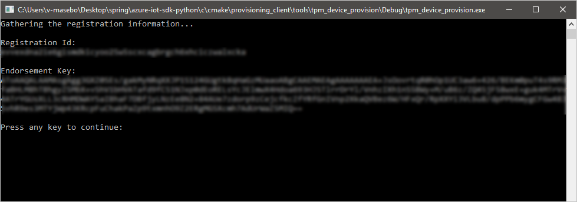
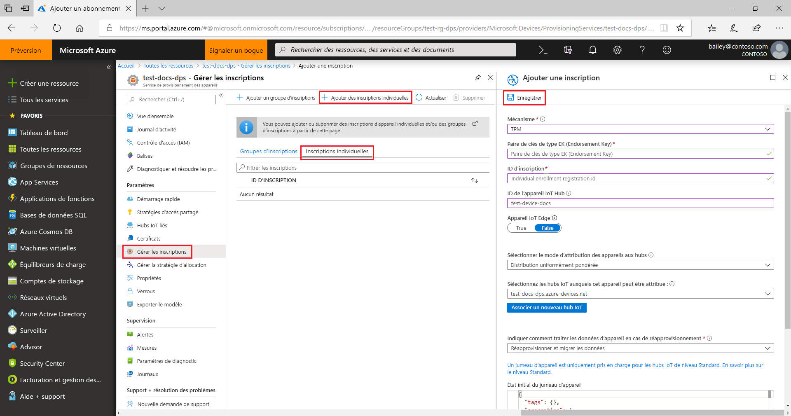
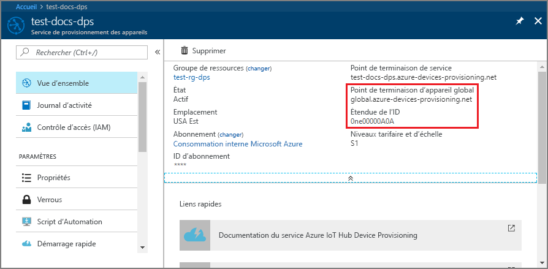
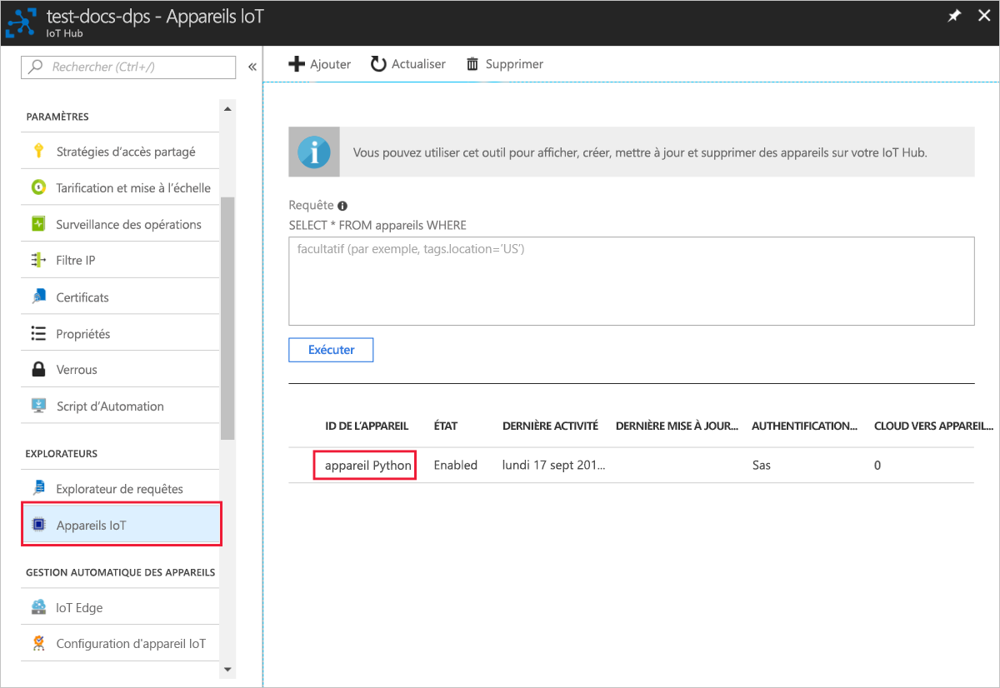

# <a name="create-and-provision-a-simulated-tpm-device-using-python-device-sdk-for-iot-hub-device-provisioning-service"></a>Créer et approvisionner un appareil TPM simulé auprès du service IoT Hub Device Provisioning à l’aide du Kit de développement logiciel (SDK) d’appareil Python

[!INCLUDE [iot-dps-selector-quick-create-simulated-device-tpm](../../includes/iot-dps-selector-quick-create-simulated-device-tpm.md)]

Ces étapes indiquent comment créer un appareil simulé sur votre ordinateur de développement exécutant le système d’exploitation Windows, comment exécuter le simulateur Windows TPM en tant que [Module de sécurité matériel (HSM)](https://azure.microsoft.com/blog/azure-iot-supports-new-security-hardware-to-strengthen-iot-security/) de l’appareil et comment utiliser l’exemple de code Python pour connecter cet appareil au service d’approvisionnement d’appareil et à votre IoT hub. 

Si vous ne connaissez pas le processus d’approvisionnement automatique, pensez à consulter également l’article [Concepts de provisionnement automatique](concepts-auto-provisioning.md). Vérifiez également que vous avez suivi la procédure décrite dans [Configurer le service d’approvisionnement d’appareil IoT Hub avec le portail Azure](./quick-setup-auto-provision.md) avant de continuer. 

Le service Azure IoT Device Provisioning prend en charge deux types d’inscriptions :
- [Groupes d’inscription](concepts-service.md#enrollment-group) : utilisés pour inscrire plusieurs appareils connexes.
- [Inscriptions individuelles](concepts-service.md#individual-enrollment) : utilisées pour inscrire un seul appareil.

Cet article présente les inscriptions individuelles.

[!INCLUDE [IoT Device Provisioning Service basic](../../includes/iot-dps-basic.md)]

## <a name="prepare-the-environment"></a>Préparer l’environnement 

1. Assurez-vous que [Visual Studio 2015](https://www.visualstudio.com/vs/older-downloads/) ou [Visual Studio 2017](https://www.visualstudio.com/vs/) sont bien installés sur votre ordinateur. La charge de travail « Développement Desktop en C++ » doit être activée pour l’installation de Visual Studio.

1. Téléchargez et installez le [système de génération de CMake](https://cmake.org/download/).

1. Assurez-vous que l’élément `git` est installé sur votre machine et est ajouté aux variables d’environnement accessibles à la fenêtre de commande. Consultez la section relative aux [outils clients de Software Freedom Conservancy](https://git-scm.com/download/) pour accéder à la dernière version des outils `git` à installer, qui inclut **Git Bash**, l’application de ligne de commande que vous pouvez utiliser pour interagir avec votre référentiel Git local. 

1. Ouvrez une invite de commandes ou Git Bash. Clonez le référentiel GitHub pour l’exemple de code de simulation d’appareil :
    
    ```cmd/sh
    git clone https://github.com/Azure/azure-iot-sdk-python.git --recursive
    ```

1. Créez un dossier dans votre copie locale de ce référentiel GitHub pour le processus de génération de CMake. 

    ```cmd/sh
    cd azure-iot-sdk-python/c
    mkdir cmake
    cd cmake
    ```

1. L’exemple de code utilise un simulateur Windows TPM. Exécutez la commande suivante pour activer l’authentification de jeton SAS. Elle génère également une solution Visual Studio pour l’appareil simulé.

    ```cmd/sh
    cmake -Duse_prov_client:BOOL=ON -Duse_tpm_simulator:BOOL=ON ..
    ```

1. Dans une invite de commandes distincte, accédez au dossier de simulateur TPM et exécutez le simulateur [TPM](https://docs.microsoft.com/windows/device-security/tpm/trusted-platform-module-overview). Cliquez sur **Autoriser l’accès**. Il écoute un socket sur les ports 2321 et 2322. Ne fermez pas cette fenêtre de commande ; vous devez laisser ce simulateur s’exécuter jusqu’à la fin de ce guide de démarrage rapide. 

    ```cmd/sh
    .\azure-iot-sdk-python\c\provisioning_client\deps\utpm\tools\tpm_simulator\Simulator.exe
    ```

    


## <a name="create-a-device-enrollment-entry"></a>Créer une entrée d’inscription d’appareil

1. Ouvrez la solution générée dans le dossier *cmake* nommé `azure_iot_sdks.sln` générez-la dans Visual Studio.

1. Cliquez avec le bouton droit sur le projet **tpm_device_provision** et sélectionnez **Définir comme projet de démarrage**. Exécutez la solution. La fenêtre Sortie affiche la **_paire de clés de type EK (Endorsement Key)_** et **_l’ID d’inscription_** nécessaires à l’inscription de l’appareil. Notez ces valeurs. 

    

1. Connectez-vous au portail Azure, cliquez sur le bouton **Toutes les ressources** dans le menu de gauche et ouvrez votre instance Device Provisioning Service.

1. Dans le panneau de résumé du service Device Provisioning, sélectionnez **Gérer les inscriptions**. Sélectionnez l’onglet **Inscriptions individuelles**, puis cliquez sur le bouton **Ajouter une inscription individuelle** dans la partie supérieure. 

1. Sous **Ajouter une inscription**, entrez les informations suivantes :
   - Sélectionnez **TPM** comme *mécanisme* d’attestation d’identité.
   - Entrez l’*ID d’inscription* et la *paire de clés de type EK (Endorsement Key)* pour votre appareil de module de plateforme sécurisée. 
   - Sélectionnez un hub IoT lié à votre service d’approvisionnement.
   - Entrez un ID d’appareil unique. Veillez à éviter les données sensibles lorsque vous affectez un nom à votre appareil.
   - Mettez à jour l’**état du jumeau d’appareil initial** à l’aide de la configuration initiale de votre choix pour l’appareil.
   - Cela fait, cliquez sur le bouton **Enregistrer**. 

       

   Lorsque l’inscription aboutit, *l’ID d’inscription* de votre appareil s’affiche dans la liste sous l’onglet *Inscriptions individuelles*. 


## <a name="simulate-the-device"></a>Simuler l’appareil

1. Téléchargez et installez [Python 2.x ou 3.x](https://www.python.org/downloads/). Veillez à utiliser l’installation 32 bits ou 64 bits comme requis par votre programme d’installation. Lorsque vous y êtes invité pendant l’installation, veillez à ajouter Python à votre variable d’environnement propre à la plateforme.
    - Si vous utilisez le système d’exploitation Windows, utilisez le [package redistribuable Visual C++](https://www.microsoft.com/download/confirmation.aspx?id=48145) pour autoriser l’utilisation de DLL natives de Python.

1. Suivez [ces instructions](https://github.com/Azure/azure-iot-sdk-python/blob/master/doc/python-devbox-setup.md) pour générer des packages Python.

   > [!NOTE]
   > Si `build_client.cmd` est exécuté, assurez-vous d’utiliser l’indicateur `--use-tpm-simulator`.
   > 
   > [!NOTE]
   > Si vous utilisez `pip`, assurez-vous d’installer également le package `azure-iot-provisioning-device-client`. Notez que les packages PIP publiés utilisent le module de plateforme sécurisée réel, pas le simulateur. Pour utiliser le simulateur, vous devez compiler à partir de la source à l’aide de l’indicateur `--use-tpm-simulator`.

1. Accédez au dossier des exemples.

    ```cmd/sh
    cd azure-iot-sdk-python/provisioning_device_client/samples
    ```

1. À l’aide de votre environnement IDE Python, modifiez le script python nommé **provisioning\_device\_client\_sample.py**. Modifiez les variables *GLOBAL\_PROV\_URI* et *ID\_SCOPE* d’après les valeurs notées précédemment. Vérifiez également que *SECURITY\_DEVICE\_TYPE* est défini sur `ProvisioningSecurityDeviceType.TPM`.

    ```python
    GLOBAL_PROV_URI = "{globalServiceEndpoint}"
    ID_SCOPE = "{idScope}"
    SECURITY_DEVICE_TYPE = ProvisioningSecurityDeviceType.TPM
    PROTOCOL = ProvisioningTransportProvider.HTTP
    ```

    

1. Exécutez l’exemple. 

    ```cmd/sh
    python provisioning_device_client_sample.py
    ```

1. Notez les messages qui simulent le démarrage et la connexion de l’appareil au service d’approvisionnement d’appareil pour obtenir des informations concernant votre IoT Hub. 

    

1. En cas de réussite de l’approvisionnement de votre appareil simulé au IoT Hub lié à votre service d’approvisionnement, l’ID d’appareil s’affiche sur le panneau **Explorateur d’appareils** du concentrateur.

     

    Si vous avez modifié la valeur par défaut de l’*état du jumeau d’appareil initial* dans l’entrée d’inscription de votre appareil, l’état du jumeau souhaité peut être extrait du hub et agir en conséquence. Pour en savoir plus, consultez [Comprendre et utiliser les jumeaux d’appareil IoT Hub](../iot-hub/iot-hub-devguide-device-twins.md)


## <a name="clean-up-resources"></a>Supprimer des ressources

Si vous envisagez de continuer à manipuler et explorer l’exemple de client d’appareil, ne nettoyez pas les ressources créées lors de ce démarrage rapide. Sinon, procédez aux étapes suivantes pour supprimer toutes les ressources créées lors de ce démarrage rapide.

1. Fermez la fenêtre de sortie de l’exemple de client d’appareil sur votre machine.
1. Fermez la fenêtre du simulateur TPM sur votre machine.
1. Dans le menu de gauche du portail Azure, cliquez sur **Toutes les ressources**, puis sélectionnez votre service Device Provisioning. Ouvrez le panneau **Gérer les inscriptions** pour votre service, puis cliquez sur l’onglet **Inscriptions individuelles**. Sélectionnez l’*ID D’INSCRIPTION* de l’appareil inscrit dans ce démarrage rapide, puis cliquez sur le bouton **Supprimer** dans la partie supérieure. 
1. À partir du menu de gauche, dans le portail Azure, cliquez sur **Toutes les ressources**, puis sélectionnez votre IoT Hub. Ouvrez le panneau **IoT Devices** (Appareils IoT) pour votre hub, sélectionnez *l’ID D’APPAREIL* de l’appareil inscrit dans ce démarrage rapide, puis cliquez sur le bouton **Supprimer** dans la partie supérieure.

## <a name="next-steps"></a>Étapes suivantes

Dans ce démarrage rapide, vous avez créé un appareil simulé TPM sur votre machine et l’avez approvisionné vers votre hub IoT à l’aide du service IoT Hub Device Provisioning. Pour savoir comment inscrire un appareil TPM au moyen d’un programme, poursuivez avec le démarrage rapide correspondant. 

> [!div class="nextstepaction"]
> [Démarrage rapide : Inscrire l’appareil TPM auprès du service IoT Hub Device Provisioning](quick-enroll-device-tpm-python.md)
