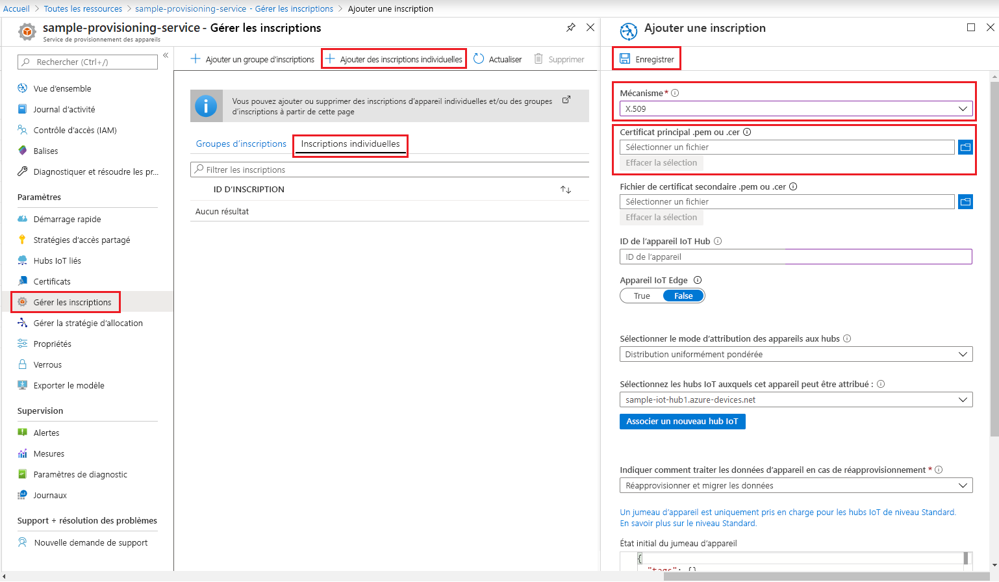
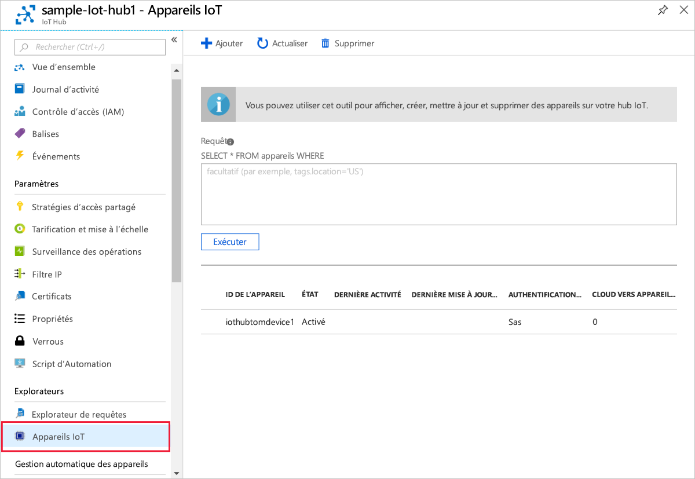

# <a name="create-and-provision-a-simulated-x509-device-using-c-device-sdk-for-iot-hub-device-provisioning-service"></a>Créer et approvisionner un appareil X.509 simulé auprès du service IoT Hub Device Provisioning à l’aide du C# Device SDK
[!INCLUDE [iot-dps-selector-quick-create-simulated-device-x509](../../includes/iot-dps-selector-quick-create-simulated-device-x509.md)]

Ces étapes indiquent comment générer un exemple d’appareil X.509 simulé à l’aide du [Azure IoT Hub C# SDK](https://github.com/Azure/azure-iot-sdk-csharp) sur un ordinateur de développement sous Windows, mais aussi comment connecter cet appareil simulé au service Device Provisioning et à votre hub IoT.

Si vous ne connaissez pas le processus d’approvisionnement automatique, pensez à consulter également [Concepts de provisionnement automatique](concepts-auto-provisioning.md). Vérifiez également que vous avez suivi la procédure décrite dans [Configurer le service d’approvisionnement d’appareil IoT Hub avec le portail Azure](./quick-setup-auto-provision.md) avant de continuer. 

Le service Azure IoT Device Provisioning prend en charge deux types d’inscription :
- [Groupes d’inscription](concepts-service.md#enrollment-group) : utilisés pour inscrire plusieurs appareils connexes.
- [Inscriptions individuelles](concepts-service.md#individual-enrollment) : utilisées pour inscrire un seul appareil.

Cet article présente les inscriptions individuelles.

[!INCLUDE [IoT Device Provisioning Service basic](../../includes/iot-dps-basic.md)]

<a id="setupdevbox"></a>
## <a name="prepare-the-development-environment"></a>Préparer l’environnement de développement 

1. Vérifiez que le [.NET core SDK](https://www.microsoft.com/net/download/windows) est bien installé sur votre ordinateur. 

1. Assurez-vous que l’élément `git` est installé sur votre machine et est ajouté aux variables d’environnement accessibles à la fenêtre de commande. Consultez la section relative aux [outils clients de Software Freedom Conservancy](https://git-scm.com/download/) pour accéder à la dernière version des outils `git` à installer, qui inclut **Git Bash**, l’application de ligne de commande que vous pouvez utiliser pour interagir avec votre référentiel Git local. 

4. Ouvrez une invite de commandes ou Git Bash. Clonez le référentiel GitHub [Azure IoT SDK for C#](https://github.com/Azure/azure-iot-sdk-csharp) :
    
    ```cmd
    git clone --recursive https://github.com/Azure/azure-iot-sdk-csharp.git
    ```

## <a name="create-a-self-signed-x509-device-certificate-and-individual-enrollment-entry"></a>Créer un certificat d’appareil X.509 auto-signé et une entrée d’inscription individuelle

Dans cette section, vous allez utiliser un certificat X.509 auto-signé pour lequel il est important de garder à l’esprit les éléments suivants :

* Les certificats auto-signés sont destinés aux tests uniquement et ne doivent pas être utilisés en production.
* La date d’expiration par défaut d’un certificat auto-signé est d’un an.

Vous allez utiliser l’exemple de code du [Kit de développement logiciel (SDK) Azure IoT pour .NET](https://github.com/Azure/azure-iot-sdk-csharp.git) pour créer le certificat à utiliser avec l’entrée d’inscription individuelle de l’appareil simulé.


1. Dans une invite de commandes, accédez au répertoire du projet contenant l’exemple d’approvisionnement d’appareil X.509.

    ```cmd
    cd .\azure-iot-sdk-csharp\provisioning\device\samples\ProvisioningDeviceClientX509
    ```

2. Cet exemple de code est configuré pour utiliser des certificats X.509 stockés dans un fichier PKCS12 protégé par mot de passe (certificate.pfx). En outre, vous avez besoin d’un fichier de certificat de clé publique (certificate.cer) pour créer par la suite, dans ce démarrage rapide, une inscription individuelle. Pour générer un certificat auto-signé et ses fichiers .cer et .pfx associés, exécutez la commande suivante :

    ```cmd
    powershell .\GenerateTestCertificate.ps1
    ```

3. Le script vous invite à saisir un mot de passe PFX. N’oubliez pas ce mot de passe. Il est indispensable lorsque vous exécutez l’exemple.

      


4. Connectez-vous au portail Azure, cliquez sur le bouton **Toutes les ressources** dans le menu de gauche et ouvrez votre service de provisionnement.

5. Dans le panneau de résumé du service Device Provisioning, sélectionnez **Gérer les inscriptions**. Sélectionnez l’onglet **Inscriptions individuelles**, puis cliquez sur le bouton **Ajouter une inscription individuelle** dans la partie supérieure. 

6. Dans le volet **Ajouter une inscription**, entrez les informations suivantes :
    - Sélectionnez **X.509** comme *mécanisme* d’attestation d’identité.
    - Sous le *fichier .pem ou .cer du certificat principal*, cliquez sur *Sélectionner un fichier* pour sélectionner le fichier de certificat **certificate.pem** créé au cours des étapes précédentes.
    - Ne renseignez pas le champ **ID de l’appareil**. Votre appareil va être approvisionné. Son ID est défini sur le nom commun (CN) dans le certificat X.509, soit **iothubx509device1**. Ce nom sera également utilisé pour l’ID d’inscription de l’entrée d’inscription individuelle. 
    - Si vous le souhaitez, vous pouvez fournir les informations suivantes :
        - Sélectionnez un hub IoT lié à votre service d’approvisionnement.
        - Mettez à jour l’**état du jumeau d’appareil initial** à l’aide de la configuration initiale de votre choix pour l’appareil.
    - Cela fait, cliquez sur le bouton **Enregistrer**. 

    [](./media/quick-create-simulated-device-x509-csharp/device-enrollment.png#lightbox)
    
   Lorsque l’opération aboutit, l’entrée d’inscription de votre appareil X.509 apparaît en tant que **iothubx509device1** sous la colonne *ID d’inscription* de l’onglet *Inscriptions individuelles*. 

## <a name="provision-the-simulated-device"></a>Approvisionner l’appareil simulé

1. Dans le panneau **Vue d’ensemble** de votre service d’approvisionnement, notez les valeurs **_ID Scope_** (Étendue de l’ID).

     


2. Tapez la commande suivante pour générer et exécuter l’exemple d’approvisionnement d’appareil X.509. Remplacez la valeur `<IDScope>` par l’étendue de l’ID de votre service d’approvisionnement. 

    ```cmd
    dotnet run <IDScope>
    ```

3. Lorsque vous y êtes invité, entrez le mot de passe du fichier PFX que vous avez créé précédemment. Notez les messages qui simulent le démarrage et la connexion de l’appareil au service d’approvisionnement d’appareil pour obtenir des informations concernant votre IoT Hub. 

     

4. Vérifiez que l’appareil a bien été approvisionné. En cas de réussite de l’approvisionnement de l’appareil simulé sur le hub IoT lié à votre service d’approvisionnement, l’ID de l’appareil s’affiche dans le panneau **IoT Devices** (Appareils IoT) du hub. 

     

    Si vous avez modifié la valeur par défaut de l’*état du jumeau d’appareil initial* dans l’entrée d’inscription de votre appareil, l’état du jumeau souhaité peut être extrait du hub et agir en conséquence. Pour en savoir plus, consultez [Comprendre et utiliser les jumeaux d’appareil IoT Hub](../iot-hub/iot-hub-devguide-device-twins.md)


## <a name="clean-up-resources"></a>Supprimer des ressources

Si vous envisagez de continuer à manipuler et explorer l’exemple de client d’appareil, ne nettoyez pas les ressources créées lors de ce démarrage rapide. Sinon, procédez aux étapes suivantes pour supprimer toutes les ressources créées lors de ce démarrage rapide.

1. Fermez la fenêtre de sortie de l’exemple de client d’appareil sur votre machine.
1. Fermez la fenêtre du simulateur TPM sur votre machine.
1. Dans le menu de gauche du portail Azure, cliquez sur **Toutes les ressources**, puis sélectionnez votre service Device Provisioning. Dans la partie supérieure du panneau **Toutes les ressources**, cliquez sur **Supprimer**.  
1. À partir du menu de gauche, dans le portail Azure, cliquez sur **Toutes les ressources**, puis sélectionnez votre IoT Hub. Dans la partie supérieure du panneau **Toutes les ressources**, cliquez sur **Supprimer**.  

## <a name="next-steps"></a>Étapes suivantes

Dans ce démarrage rapide, vous avez créé un appareil X.509 simulé sur un ordinateur Windows. Vous l’avez également approvisionné vers votre hub IoT à l’aide du service Azure IoT Hub Device Provisioning figurant sur le portail. Pour savoir comment inscrire un appareil X.509 au moyen d’un programme, poursuivez avec le démarrage rapide correspondant. 

> [!div class="nextstepaction"]
> [Démarrage rapide d’Azure : Inscrire des appareils X.509 auprès du service Azure IoT Hub Device Provisioning](quick-enroll-device-x509-csharp.md)
