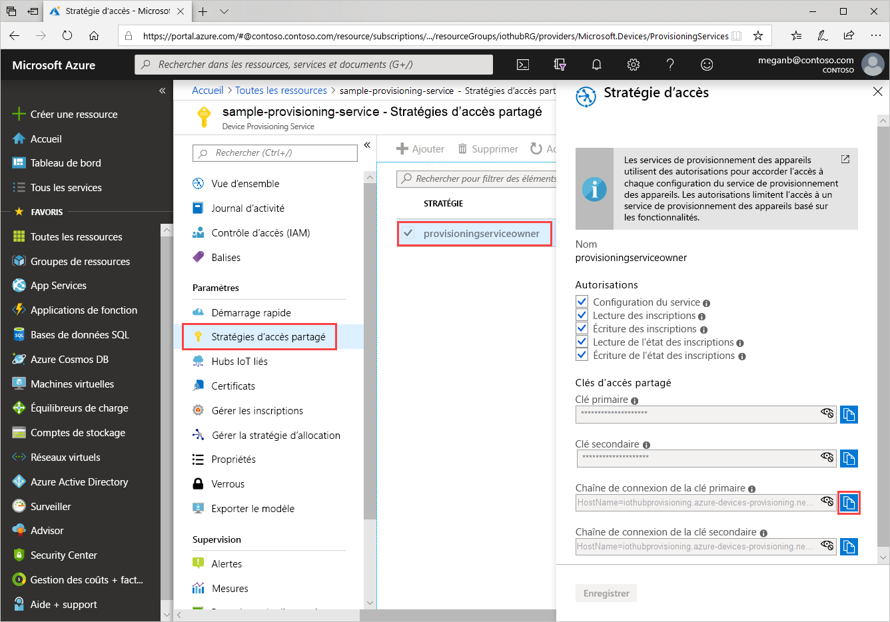
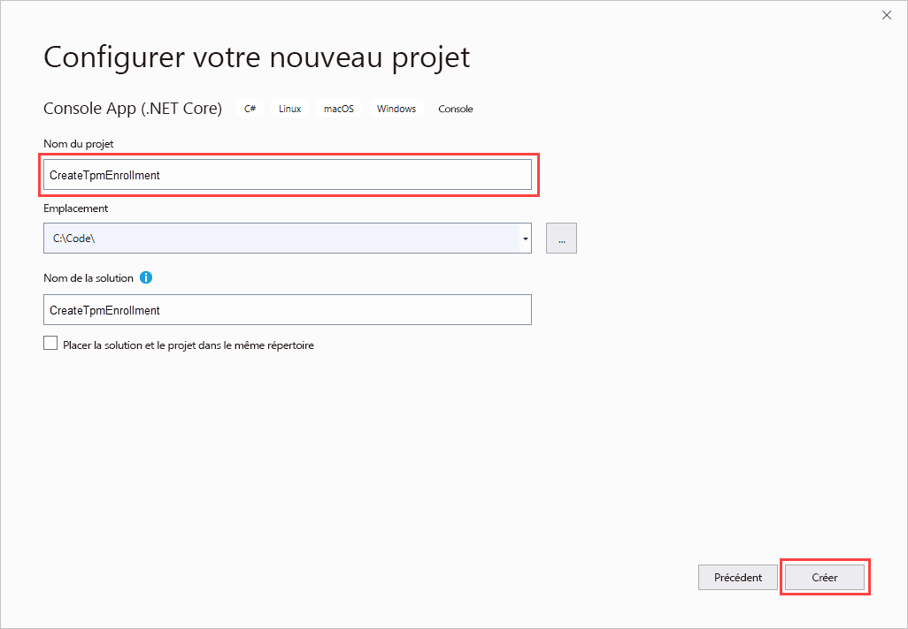
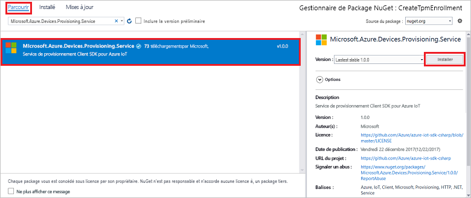
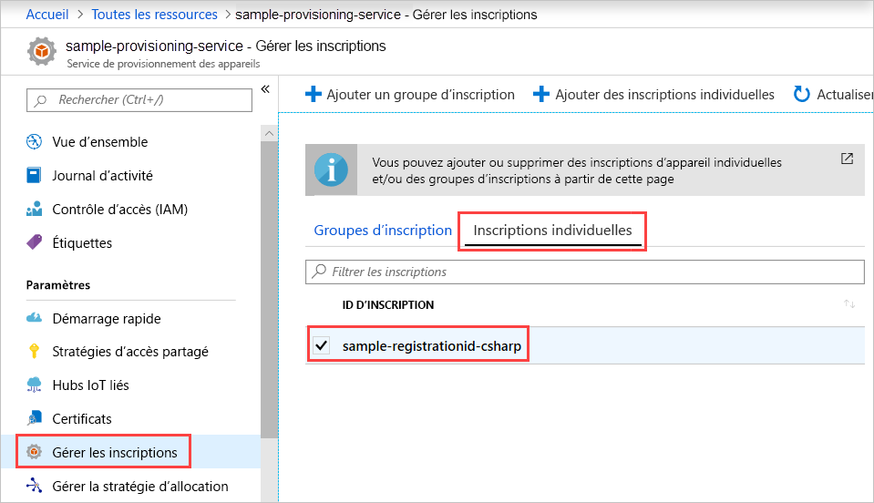

# <a name="quickstart-enroll-tpm-device-to-iot-hub-device-provisioning-service-using-c-service-sdk"></a>Démarrage rapide : Inscrire un appareil TPM auprès du service IoT Hub Device Provisioning à l’aide du C# Service SDK

[!INCLUDE [iot-dps-selector-quick-enroll-device-tpm](../../includes/iot-dps-selector-quick-enroll-device-tpm.md)]

Cet article montre comment créer programmatiquement une inscription individuelle pour un appareil TPM auprès du service Azure IoT Hub Device Provisioning en utilisant le [C# Service SDK](https://github.com/Azure/azure-iot-sdk-csharp) et un exemple d’application C# .NET Core. Vous pouvez aussi inscrire un appareil TPM simulé auprès du service de provisionnement en utilisant cette entrée d’inscription individuelle. Bien que ces étapes fonctionnent sur les ordinateurs Windows et Linux, cet article utilise un ordinateur de développement Windows.

## <a name="prepare-the-development-environment"></a>Préparer l’environnement de développement

1. Vérifiez que [Visual Studio 2019](https://www.visualstudio.com/vs/) est installé sur votre ordinateur.

1. Vérifiez que le [SDK .NET Core](https://www.microsoft.com/net/download/windows) est installé sur votre ordinateur.

1. Effectuez les étapes de [Configurer le service IoT Hub Device Provisioning avec le portail Azure](./quick-setup-auto-provision.md) avant de continuer.

1. (Facultatif) Si vous voulez inscrire un appareil simulé à la fin de ce guide de démarrage rapide, suivez la procédure de [Créer et provisionner un appareil TPM simulé avec le C# Device SDK](quick-create-simulated-device-tpm-csharp.md) jusqu’à l’étape où vous obtenez une paire de clés de type EK (Endorsement Key) pour l’appareil. Notez la paire de clés de type EK, l’ID d’inscription et éventuellement l’ID d’appareil, car vous devez les utiliser plus tard dans ce guide de démarrage rapide.

   > [!NOTE]
   > Ne suivez pas les étapes de création d’une inscription individuelle avec le portail Azure.

## <a name="get-the-connection-string-for-your-provisioning-service"></a>Obtenir la chaîne de connexion de votre service d’approvisionnement

Pour l’exemple de ce démarrage rapide, vous avez besoin de la chaîne de connexion de votre service d’approvisionnement.

1. Connectez-vous au portail Azure, sélectionnez **Toutes les ressources**, puis ouvrez votre service Device Provisioning.

1. Choisissez **Stratégies d’accès partagé**, puis sélectionnez la stratégie d’accès que vous voulez utiliser pour ouvrir ses propriétés. Dans **Stratégie d’accès**, copiez et enregistrez la chaîne de connexion de la clé principale.

    

## <a name="create-the-individual-enrollment-sample"></a>Créer l’exemple d’inscription individuelle

Cette section montre comment créer une application console .NET Core qui ajoute une inscription individuelle pour un appareil TPM à votre service de provisionnement. Avec quelques modifications, vous pouvez également suivre ces étapes pour créer une application console [Windows IoT Core](https://developer.microsoft.com/en-us/windows/iot) pour ajouter l’inscription individuelle. Pour en savoir plus sur le développement avec IoT Core, consultez la [Documentation Windows IoT Core pour les développeurs](https://docs.microsoft.com/windows/iot-core/).

1. Ouvrez Visual Studio et sélectionnez **Créer un projet**. Dans **Créer un projet**, choisissez le modèle de projet **Application console (.NET Core)** pour C#, puis sélectionnez **Suivant**.

1. Nommez le projet *CreateTpmEnrollment*, puis appuyez sur **Créer**.

    

1. Quand la solution s’ouvre dans Visual Studio, dans le volet **Explorateur de solutions**, cliquez avec le bouton droit sur le projet **CreateTpmEnrollment**. Sélectionnez **Gérer les packages NuGet**.

1. Dans le **Gestionnaire de package NuGet**, sélectionnez **Parcourir**, recherchez et choisissez **Microsoft.Azure.Devices.Provisioning.Service**, puis appuyez sur **Installer**.

   

   Cette étape télécharge, installe et ajoute une référence au package NuGet [Azure IoT Provisioning Service Client SDK](https://www.nuget.org/packages/Microsoft.Azure.Devices.Provisioning.Service/) et à ses dépendances.

1. Ajoutez les instructions `using` suivantes après les autres instructions `using` en haut de `Program.cs` :
  
   ```csharp
   using System.Threading.Tasks;
   using Microsoft.Azure.Devices.Provisioning.Service;
   ```

1. Ajoutez les champs suivants à la classe `Program` et effectuez les changements listés ci-dessous.

   ```csharp
   private static string ProvisioningConnectionString = "{ProvisioningServiceConnectionString}";
   private const string RegistrationId = "sample-registrationid-csharp";
   private const string TpmEndorsementKey =
       "AToAAQALAAMAsgAgg3GXZ0SEs/gakMyNRqXXJP1S124GUgtk8qHaGzMUaaoABgCAAEMAEAgAAAAAAAEAxsj2gUS" +
       "cTk1UjuioeTlfGYZrrimExB+bScH75adUMRIi2UOMxG1kw4y+9RW/IVoMl4e620VxZad0ARX2gUqVjYO7KPVt3d" +
       "yKhZS3dkcvfBisBhP1XH9B33VqHG9SHnbnQXdBUaCgKAfxome8UmBKfe+naTsE5fkvjb/do3/dD6l4sGBwFCnKR" +
       "dln4XpM03zLpoHFao8zOwt8l/uP3qUIxmCYv9A7m69Ms+5/pCkTu/rK4mRDsfhZ0QLfbzVI6zQFOKF/rwsfBtFe" +
       "WlWtcuJMKlXdD8TXWElTzgh7JS4qhFzreL0c1mI0GCj+Aws0usZh7dLIVPnlgZcBhgy1SSDQMQ==";
       
   // Optional parameters
   private const string OptionalDeviceId = "myCSharpDevice";
   private const ProvisioningStatus OptionalProvisioningStatus = ProvisioningStatus.Enabled;
   ```

   * Remplacez la valeur de l’espace réservé `ProvisioningServiceConnectionString` par la chaîne de connexion du service de provisionnement pour lequel vous voulez créer l’inscription.

   * Vous pouvez éventuellement modifier l’ID d’inscription, la paire de clés de type EK, l’ID d’appareil et l’état de la configuration.

   * Si vous utilisez ce guide de démarrage rapide avec le guide de démarrage rapide [Créer et provisionner un appareil TPM simulé à l’aide du kit C# device SDK](quick-create-simulated-device-tpm-csharp.md) pour provisionner un appareil simulé, remplacez la paire de clés de type EK et l’ID d’inscription par les valeurs dont vous avez pris note dans ce guide de démarrage rapide. Vous pouvez remplacer l’ID d’appareil par la valeur suggérée dans ce guide de démarrage rapide, utiliser votre propre valeur ou utiliser la valeur par défaut dans cet exemple.

1. Ajoutez la méthode suivante à la classe `Program`.  Ce code crée une entrée d’inscription individuelle, puis appelle la méthode `CreateOrUpdateIndividualEnrollmentAsync` sur `ProvisioningServiceClient` pour ajouter l’inscription individuelle au service de provisionnement.

   ```csharp
   public static async Task RunSample()
   {
       Console.WriteLine("Starting sample...");

       using (ProvisioningServiceClient provisioningServiceClient =
               ProvisioningServiceClient.CreateFromConnectionString(ProvisioningConnectionString))
       {
           #region Create a new individualEnrollment config
           Console.WriteLine("\nCreating a new individualEnrollment...");
           Attestation attestation = new TpmAttestation(TpmEndorsementKey);
           IndividualEnrollment individualEnrollment =
                   new IndividualEnrollment(
                           RegistrationId,
                           attestation);

           // The following parameters are optional. Remove them if you don't need them.
           individualEnrollment.DeviceId = OptionalDeviceId;
           individualEnrollment.ProvisioningStatus = OptionalProvisioningStatus;
           #endregion

           #region Create the individualEnrollment
           Console.WriteLine("\nAdding new individualEnrollment...");
           IndividualEnrollment individualEnrollmentResult =
               await provisioningServiceClient.CreateOrUpdateIndividualEnrollmentAsync(individualEnrollment).ConfigureAwait(false);
           Console.WriteLine("\nIndividualEnrollment created with success.");
           Console.WriteLine(individualEnrollmentResult);
           #endregion
        
       }
   }
   ```

1. Enfin, remplacez le corps de la méthode `Main` par les lignes suivantes :

   ```csharp
   RunSample().GetAwaiter().GetResult();
   Console.WriteLine("\nHit <Enter> to exit ...");
   Console.ReadLine();
   ```

1. Générez la solution.

## <a name="run-the-individual-enrollment-sample"></a>Exécuter l’exemple d’inscription individuelle
  
Exécutez l’exemple dans Visual Studio pour créer l’inscription individuelle pour votre appareil TPM.

Une fenêtre d’invite de commandes s’affiche et commence à afficher des messages de confirmation. Une fois la création terminée, la fenêtre d’invite de commande affiche les propriétés de la nouvelle inscription individuelle.

Vous pouvez vérifier que l’inscription individuelle a été créée. Accédez au récapitulatif du service Device Provisioning et sélectionnez **Gérer les inscriptions**, puis sélectionnez **Inscriptions individuelles**. Vous devez voir une nouvelle entrée d’inscription qui correspond à l’ID d’inscription que vous avez utilisé dans l’exemple.



Sélectionnez l’entrée pour vérifier la paire de clés de type EK et d’autres propriétés.

(Facultatif) Si vous avez effectué les étapes décrites dans le guide de démarrage rapide [Créer et provisionner un appareil TPM simulé avec le C# Device SDK](quick-create-simulated-device-tpm-csharp.md), vous pouvez continuer avec les étapes restantes de ce guide de démarrage rapide pour inscrire votre appareil simulé. Ne suivez pas les étapes de création d’une inscription individuelle à l’aide du portail Azure.

## <a name="clean-up-resources"></a>Supprimer des ressources

Si vous prévoyez d’explorer l’exemple de service C#, ne supprimez pas les ressources créées dans ce guide de démarrage rapide. Sinon, utilisez les étapes suivantes pour supprimer toutes les ressources créées par ce guide de démarrage rapide.

1. Fermez la fenêtre de sortie de l’exemple C# sur votre ordinateur.

1. Accédez au service Device Provisioning dans le portail Azure, sélectionnez **Gérer les inscriptions**, puis sélectionnez l’onglet **Inscriptions individuelles**. Cochez la case à côté de l’*ID d’inscription* correspondant à l’entrée d’inscription que vous avez créée à l’aide de ce guide de démarrage rapide, puis appuyez sur le bouton **Supprimer** dans la partie supérieure du volet.

1. Si vous avez suivi les étapes de [Créer et provisionner un appareil TPM simulé avec le C# Device SDK](quick-create-simulated-device-tpm-csharp.md) pour créer un appareil TPM simulé, effectuez les étapes suivantes :

    1. Fermez la fenêtre du simulateur TPM et la fenêtre d’exemple de sortie pour l’appareil simulé.

    1. Dans le portail Azure, accédez au IoT Hub au sein duquel votre appareil était approvisionné. Dans le menu sous **Explorateurs**, sélectionnez **Appareils IoT**, cochez la case en regard de l’*ID D’APPAREIL* de l’appareil que vous avez inscrit dans ce guide de démarrage rapide, puis appuyez sur le bouton **Supprimer** dans la partie supérieure du volet.

## <a name="next-steps"></a>Étapes suivantes

Dans ce guide de démarrage rapide, vous avez créé programmatiquement une entrée d’inscription individuelle pour un appareil TPM. Si vous avez choisi de le faire, vous avez créé un appareil simulé TPM sur votre ordinateur et vous l’avez provisionné sur votre hub IoT avec le service Azure IoT Hub Device Provisioning. Pour en savoir plus sur l’approvisionnement de l’appareil en profondeur, référez-vous au didacticiel relatif à l’installation du service d’approvisionnement d’appareil dans le portail Azure.

> [!div class="nextstepaction"]
> [Didacticiels relatifs au service d’approvisionnement d’appareil Azure IoT Hub](./tutorial-set-up-cloud.md)
