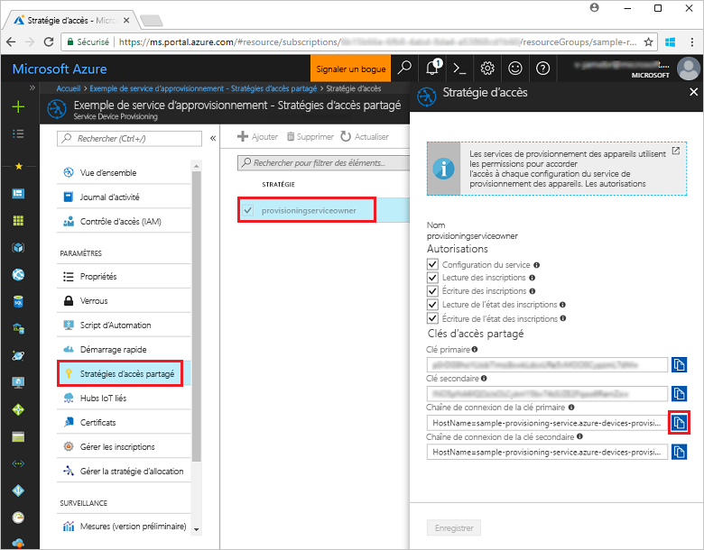
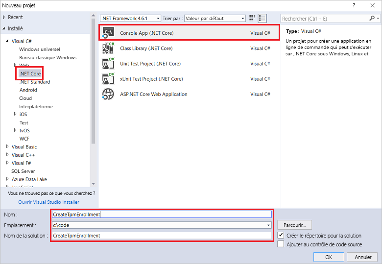
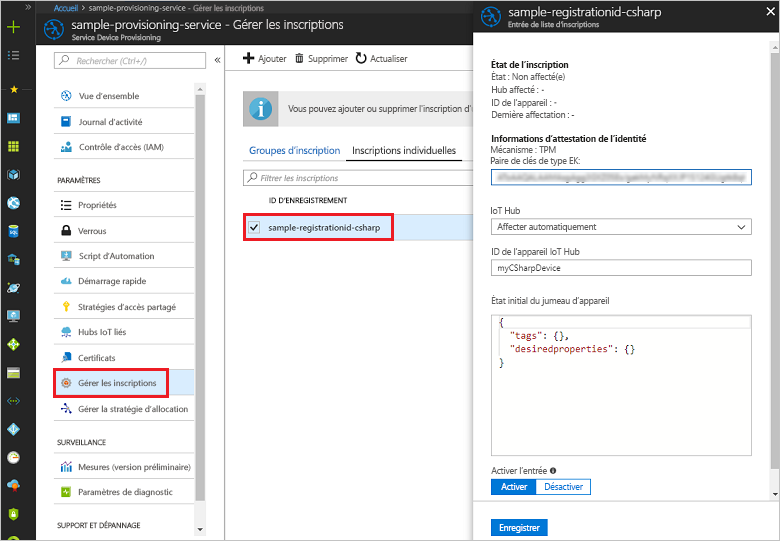

# <a name="enroll-tpm-device-to-iot-hub-device-provisioning-service-using-c-service-sdk"></a>Inscrire un appareil TPM auprès du service IoT Hub Device Provisioning à l’aide du C# Service SDK

[!INCLUDE [iot-dps-selector-quick-enroll-device-tpm](../../includes/iot-dps-selector-quick-enroll-device-tpm.md)]


Ces étapes montrent comment créer par programmation une inscription individuelle pour un appareil TPM auprès du service Azure IoT Hub Device Provisioning à l’aide du [C# Service SDK](https://github.com/Azure/azure-iot-sdk-csharp) et un exemple d’application C# .NET Core. Vous pouvez éventuellement inscrire un appareil TPM simulé auprès du service d’approvisionnement à l’aide de cette entrée d’inscription individuelle. Bien que ces étapes fonctionnent à la fois sous Windows et Linux, cet article utilise un ordinateur de développement sous Windows.

## <a name="prepare-the-development-environment"></a>Préparer l’environnement de développement

1. Assurez-vous que votre machine est équipée de [Visual Studio 2017](https://www.visualstudio.com/vs/). 
2. Vérifiez que le [.Net core SDK](https://www.microsoft.com/net/download/windows) est bien installé sur votre ordinateur. 
3. Veillez à compléter les étapes décrites dans la section [Configuration du service d’approvisionnement d’appareil Azure IoT Hub avec le portail Azure](./quick-setup-auto-provision.md) avant de continuer.
4. (Facultatif) Si vous souhaitez inscrire un appareil simulé à la fin de ce démarrage rapide, suivez les étapes dans [Créer et configurer un appareil TPM simulé à l’aide du C# Device SDK](quick-create-simulated-device-tpm-csharp.md) jusqu’à l’étape où vous obtenez une paire de clés de type EK (Endorsement Key) pour l’appareil. Notez la paire de clés de type EK, l’ID d’inscription et, éventuellement, l’ID d’appareil. Vous devrez les utiliser ultérieurement dans ce démarrage rapide. **Ne suivez pas les étapes de création d’une inscription individuelle à l’aide du portail Azure.**

## <a name="get-the-connection-string-for-your-provisioning-service"></a>Obtenir la chaîne de connexion de votre service d’approvisionnement

Pour l’exemple de ce démarrage rapide, vous avez besoin de la chaîne de connexion de votre service d’approvisionnement.
1. Connectez-vous au portail Azure, cliquez sur le bouton **Toutes les ressources** dans le menu de gauche et ouvrez votre service Device Provisioning. 
2. Cliquez sur **Stratégies d’accès partagé**, puis sur la stratégie d’accès que vous voulez utiliser pour ouvrir ses propriétés. Dans la fenêtre **Stratégie d’accès**, copiez et notez la chaîne de connexion de la clé primaire. 

    

## <a name="create-the-individual-enrollment-sample"></a>Créer l’exemple d’inscription individuelle 

Les étapes décrites dans cette section montrent comment créer une application console .NET Core qui ajoute une inscription individuelle à votre service d’approvisionnement. Avec quelques modifications, vous pouvez également suivre ces étapes pour créer une application console [Windows IoT Core](https://developer.microsoft.com/en-us/windows/iot) pour ajouter l’inscription individuelle. Pour en savoir plus sur le développement avec IoT Core, consultez la [Documentation pour développeurs Windows IoT Core](https://docs.microsoft.com/en-us/windows/iot-core/).
1. Dans Visual Studio, ajoutez un projet Visual Application console .NET Core C# à une nouvelle solution en utilisant le modèle de projet **Application console (.NET Core)**. Assurez-vous que la version du .NET Framework est définie sur 4.5.1 ou supérieur. Nommez ce projet **CreateTpmEnrollment**.

    

2. Dans l’Explorateur de solutions, cliquez avec le bouton droit sur le projet **CreateTpmEnrollment**, puis cliquez sur **Gérer les packages NuGet**.
3. Dans la fenêtre **Gestionnaire de package Nuget**, cliquez sur **Parcourir**, puis recherchez **Microsoft.Azure.Devices.Provisioning.Service**. Cliquez ensuite sur **Installer** pour installer le package **Microsoft.Azure.Devices.Provisioning.Service**, puis acceptez les conditions d’utilisation. Cette procédure télécharge, installe et ajoute une référence au package NuGet [Azure IoT Provisioning Service Client SDK](https://www.nuget.org/packages/Microsoft.Azure.Devices.Provisioning.Service/) à et ses dépendances.

    

4. Ajoutez les instructions `using` suivantes après les autres instructions `using`en haut du fichier **Program.cs** :
   
   ```csharp
   using System.Threading.Tasks;
   using Microsoft.Azure.Devices.Provisioning.Service;
   ```
    
5. Ajoutez les champs suivants à la classe **Program** .  
   - Remplacez la valeur d’espace réservé **ProvisioningConnectionString** avec la chaîne de connexion du service d’approvisionnement pour lequel vous souhaitez créer l’inscription.
   - Vous pouvez éventuellement modifier l’ID d’inscription, la paire de clés de type EK, l’ID d’appareil et l’état de la configuration. 
   - Si vous utilisez ce démarrage rapide avec le démarrage rapide [Créer et configurer un appareil TPM simulé à l’aide du C# device SDK](quick-create-simulated-device-tpm-csharp.md) pour approvisionner un appareil simulé, remplacez la paire de clés de type EK et l’ID d’inscription par les valeurs notées lors de ce guide de démarrage rapide. Vous pouvez remplacer l’ID d’appareil par la valeur suggérée dans ce démarrage rapide, utiliser votre propre valeur ou utiliser la valeur par défaut dans cet exemple.
        
   ```csharp
   private static string ProvisioningConnectionString = "{Your provisioning service connection string}";
   private const string RegistrationId = "sample-registrationid-csharp";
   private const string TpmEndorsementKey =
       "AToAAQALAAMAsgAgg3GXZ0SEs/gakMyNRqXXJP1S124GUgtk8qHaGzMUaaoABgCAAEMAEAgAAAAAAAEAxsj2gUS" +
       "cTk1UjuioeTlfGYZrrimExB+bScH75adUMRIi2UOMxG1kw4y+9RW/IVoMl4e620VxZad0ARX2gUqVjYO7KPVt3d" +
       "yKhZS3dkcvfBisBhP1XH9B33VqHG9SHnbnQXdBUaCgKAfxome8UmBKfe+naTsE5fkvjb/do3/dD6l4sGBwFCnKR" +
       "dln4XpM03zLpoHFao8zOwt8l/uP3qUIxmCYv9A7m69Ms+5/pCkTu/rK4mRDsfhZ0QLfbzVI6zQFOKF/rwsfBtFe" +
       "WlWtcuJMKlXdD8TXWElTzgh7JS4qhFzreL0c1mI0GCj+Aws0usZh7dLIVPnlgZcBhgy1SSDQMQ==";
       
   // Optional parameters
   private const string OptionalDeviceId = "myCSharpDevice";
   private const ProvisioningStatus OptionalProvisioningStatus = ProvisioningStatus.Enabled;
   ```
    
6. Ajoutez la méthode suivante à la classe **Program**.  Ce code crée une entrée d’inscription individuelle, puis appelle la méthode **CreateOrUpdateEnrollmentGroupAsync** sur le **ProvisioningServiceClient** pour ajouter l’inscription individuelle au service d’approvisionnement.
   
   ```csharp
   public static async Task RunSample()
   {
       Console.WriteLine("Starting sample...");

       using (ProvisioningServiceClient provisioningServiceClient =
               ProvisioningServiceClient.CreateFromConnectionString(ProvisioningConnectionString))
       {
           #region Create a new individualEnrollment config
           Console.WriteLine("\nCreating a new individualEnrollment...");
           Attestation attestation = new TpmAttestation(TpmEndorsementKey);
           IndividualEnrollment individualEnrollment =
                   new IndividualEnrollment(
                           RegistrationId,
                           attestation);

           // The following parameters are optional. Remove them if you don't need them.
           individualEnrollment.DeviceId = OptionalDeviceId;
           individualEnrollment.ProvisioningStatus = OptionalProvisioningStatus;
           #endregion

           #region Create the individualEnrollment
           Console.WriteLine("\nAdding new individualEnrollment...");
           IndividualEnrollment individualEnrollmentResult =
               await provisioningServiceClient.CreateOrUpdateIndividualEnrollmentAsync(individualEnrollment).ConfigureAwait(false);
           Console.WriteLine("\nIndividualEnrollment created with success.");
           Console.WriteLine(individualEnrollmentResult);
           #endregion
        
       }
   }
   ```
       
7. Enfin, remplacez le corps de la méthode **Main** par les lignes suivantes :
   
   ```csharp
   RunSample().GetAwaiter().GetResult();
   Console.WriteLine("\nHit <Enter> to exit ...");
   Console.ReadLine();
   ```
        
8. Générez la solution.

## <a name="run-the-individual-enrollment-sample"></a>Exécuter l’exemple d’inscription individuelle
  
1. Exécutez l’exemple dans Visual Studio pour créer l’inscription individuelle pour votre appareil TPM.
 
2. Une fois la création terminée, la fenêtre de commande affiche les propriétés de la nouvelle inscription individuelle.

    

3. Pour vérifier l’inscription individuelle, dans le panneau de résumé du service Device Provisioning au sein du portail Azure, sélectionnez **Gérer les inscriptions**, puis sélectionnez l’onglet **Inscription individuelle**. Vous devez voir une nouvelle entrée d’inscription qui correspond à l’ID d’inscription que vous avez utilisé dans l’exemple. Cliquez sur l’entrée pour vérifier la paire de clés de type EK et d’autres propriétés.

    
 
4. (Facultatif) Si vous avez effectué les étapes décrites dans le démarrage rapide [Créer et configurer un appareil TPM simulé à l’aide du C# Device SDK](quick-create-simulated-device-tpm-csharp.md), vous pouvez continuer avec les étapes restantes de ce démarrage rapide pour inscrire votre appareil simulé. Ne suivez pas les étapes de création d’une inscription individuelle à l’aide du portail Azure.

## <a name="clean-up-resources"></a>Supprimer des ressources
Si vous prévoyez d’aller plus loin dans l’étude de l’exemple de service C#, ne supprimez pas les ressources créées dans ce démarrage rapide. Sinon, procédez aux étapes suivantes pour supprimer toutes les ressources créées lors de ce démarrage rapide.

1. Fermez la fenêtre de sortie de l’exemple C# sur votre ordinateur.
2. Accédez au service Device Provisioning dans le portail Azure, cliquez sur **Gérer les inscriptions**, puis sélectionnez l’onglet **Inscriptions individuelles**. Sélectionnez *l’ID d’inscription* correspondant à l’entrée d’inscription créée à l’aide de ce démarrage rapide, puis cliquez sur le bouton **Supprimer** dans la partie supérieure du panneau. 
3. Si vous avez suivi les étapes du démarrage rapide [Créer et configurer un appareil TPM simulé à l’aide du C# Device SDK](quick-create-simulated-device-tpm-csharp.md) pour créer un appareil TPM simulé : 

    1. Fermez la fenêtre du simulateur TPM et la fenêtre d’exemple de sortie pour l’appareil simulé.
    2. Dans le portail Azure, accédez au IoT Hub au sein duquel votre appareil était approvisionné. Dans le menu de gauche sous **Explorateurs**, cliquez sur **Appareils IoT**, sélectionnez la case à cocher à côté de votre appareil, puis cliquez sur **Supprimer** en haut de la fenêtre.
 
## <a name="next-steps"></a>Étapes suivantes
Dans ce démarrage rapide, vous avez créé par programmation une entrée d’inscription individuelle pour un appareil TPM et vous avez éventuellement créé un appareil simulé TPM sur votre machine et l’avez approvisionné vers votre IoT Hub à l’aide du service d’approvisionnement d’appareil Azure IoT Hub. Pour en savoir plus sur l’approvisionnement de l’appareil en profondeur, référez-vous au didacticiel relatif à l’installation du service d’approvisionnement d’appareil dans le portail Azure. 
 
> [!div class="nextstepaction"]
> [Didacticiels relatifs au service d’approvisionnement d’appareil Azure IoT Hub](./tutorial-set-up-cloud.md)

