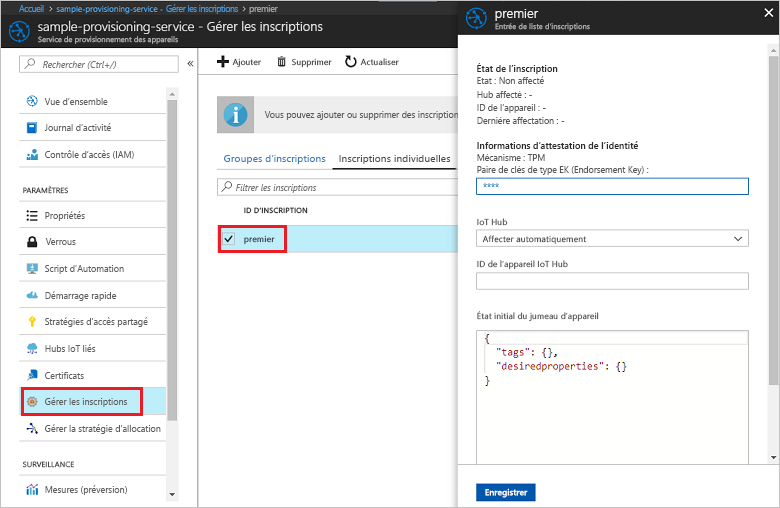

# <a name="enroll-tpm-device-to-iot-hub-device-provisioning-service-using-nodejs-service-sdk"></a>Inscrire un appareil TPM auprès du service IoT Hub Device Provisioning à l’aide du Node.js Service SDK

[!INCLUDE [iot-dps-selector-quick-enroll-device-tpm](../../includes/iot-dps-selector-quick-enroll-device-tpm.md)]


Ces étapes montrent comment créer par programmation une inscription individuelle pour un appareil TPM auprès du service Azure IoT Hub Device Provisioning à l’aide du [Node.js Service SDK](https://github.com/Azure/azure-iot-sdk-node) et un exemple d’application Node.js. Vous pouvez éventuellement inscrire un appareil TPM simulé auprès du service d’approvisionnement à l’aide de cette entrée d’inscription individuelle. Bien que ces étapes fonctionnent à la fois sous Windows et Linux, nous utiliserons un ordinateur de développement sous Windows dans cet article.

## <a name="prerequisites"></a>Prérequis


- Veillez à compléter les étapes décrites dans la section [Configuration du service d’approvisionnement d’appareil Azure IoT Hub avec le portail Azure](./quick-setup-auto-provision.md) avant de continuer. 
-  Vérifiez que la [version 4.0 ou supérieure de Node.js](https://nodejs.org) est installée sur votre machine.
- Si vous souhaitez inscrire un appareil simulé à la fin de ce démarrage rapide, suivez les étapes dans [Créer et configurer un appareil simulé](quick-create-simulated-device.md) jusqu’à l’étape où vous obtenez une paire de clés de type EK (Endorsement Key) pour l’appareil. Notez la paire de clés de type EK (Endorsement Key), vous l’utiliserez ultérieurement dans ce démarrage rapide. **Ne suivez pas les étapes de création d’une inscription individuelle à l’aide du portail Azure.**
 
## <a name="create-the-individual-enrollment-sample"></a>Créer l’exemple d’inscription individuelle 

 
1. À partir d’une fenêtre de commande dans votre dossier de travail, exécutez :
  
    ```cmd\sh
    npm install azure-iot-provisioning-service
    ```  

2. À l’aide d’un éditeur de texte, créez un fichier**create_individual_enrollment.js** dans votre dossier de travail. Ajoutez le code suivant au fichier et enregistrez-le :

    ```
    'use strict';

    var provisioningServiceClient = require('azure-iot-provisioning-service').ProvisioningServiceClient;

    var serviceClient = provisioningServiceClient.fromConnectionString(process.argv[2]);
    var endorsementKey = process.argv[3];

    var enrollment = {
      registrationId: 'first',
      attestation: {
        type: 'tpm',
        tpm: {
          endorsementKey: endorsementKey
        }
      }
    };

    serviceClient.createOrUpdateIndividualEnrollment(enrollment, function(err, enrollmentResponse) {
      if (err) {
        console.log('error creating the individual enrollment: ' + err);
      } else {
        console.log("enrollment record returned: " + JSON.stringify(enrollmentResponse, null, 2));
      }
    });
    ````

## <a name="run-the-individual-enrollment-sample"></a>Exécuter l’exemple d’inscription individuelle
  
1. Pour exécuter cet exemple, vous avez besoin de la chaîne de connexion de votre service d’approvisionnement. 
    1. Connectez-vous au portail Azure, cliquez sur le bouton **Toutes les ressources** dans le menu de gauche et ouvrez votre service Device Provisioning. 
    2. Cliquez sur **Stratégies d’accès partagé**, puis sur la stratégie d’accès que vous voulez utiliser pour ouvrir ses propriétés. Dans la fenêtre **Stratégie d’accès**, copiez et notez la chaîne de connexion de la clé primaire. 

     


2. Vous avez également besoin de la paire de clés de type EK (Endorsement Key) pour votre appareil. Si vous avez suivi le démarrage rapide [Créer et configurer un appareil simulé](quick-create-simulated-device.md) pour créer un appareil TPM simulé, utilisez la clé créée pour cet appareil. Sinon, pour créer un exemple d’inscription individuelle, vous pouvez utiliser la paire de clés de type EK (Endorsement Key) suivante fournie avec le Kit de développement logiciel (SDK) :

    ```
    AToAAQALAAMAsgAgg3GXZ0SEs/gakMyNRqXXJP1S124GUgtk8qHaGzMUaaoABgCAAEMAEAgAAAAAAAEAxsj2gUScTk1UjuioeTlfGYZrrimExB+bScH75adUMRIi2UOMxG1kw4y+9RW/IVoMl4e620VxZad0ARX2gUqVjYO7KPVt3dyKhZS3dkcvfBisBhP1XH9B33VqHG9SHnbnQXdBUaCgKAfxome8UmBKfe+naTsE5fkvjb/do3/dD6l4sGBwFCnKRdln4XpM03zLpoHFao8zOwt8l/uP3qUIxmCYv9A7m69Ms+5/pCkTu/rK4mRDsfhZ0QLfbzVI6zQFOKF/rwsfBtFeWlWtcuJMKlXdD8TXWElTzgh7JS4qhFzreL0c1mI0GCj+Aws0usZh7dLIVPnlgZcBhgy1SSDQMQ==
    ```

3. Afin de créer une inscription individuelle pour votre appareil TPM, exécutez la commande suivante (sans oublier les guillemets autour des arguments de commande) :
 
     ```cmd\sh
     node create_individual_enrollment.js "<the connection string for your provisioning service>" "<endorsement key>"
     ```
 
3. Une fois la création terminée, la fenêtre de commande affiche les propriétés de la nouvelle inscription individuelle.

     

4. Vérifiez qu’une inscription individuelle a été créée. Dans le panneau de résumé du service Device Provisioning du portail Azure, sélectionnez **Gérer les inscriptions**. Sélectionnez l’onglet **Inscriptions individuelles** et cliquez sur la nouvelle entrée d’inscription (*premier*) pour vérifier la paire de clés de type EK (Endorsement Key) et d’autres propriétés de l’entrée.

     
 
Maintenant que vous avez créé une inscription individuelle pour un appareil TPM, si vous souhaitez inscrire un appareil simulé, vous pouvez effectuer les étapes restantes dans [Créer et configurer un appareil simulé](quick-create-simulated-device.md). Veillez à ignorer les étapes de création d’une inscription individuelle à l’aide du portail Azure de ce démarrage rapide.

## <a name="clean-up-resources"></a>Supprimer des ressources
Si vous prévoyez d’aller plus loin dans l’étude des exemples de service Node.js, ne supprimez pas les ressources créées dans ce démarrage rapide. Sinon, procédez aux étapes suivantes pour supprimer toutes les ressources créées lors de ce démarrage rapide.

1. Fermez la fenêtre de sortie de l’exemple Node.js sur votre machine.
1. Si vous avez créé un appareil TPM simulé, fermez la fenêtre du simulateur TPM.
2. Accédez au service Device Provisioning dans le portail Azure, cliquez sur **Gérer les inscriptions**, puis sélectionnez l’onglet **Inscriptions individuelles**. Sélectionnez *l’ID d’inscription* correspondant à l’entrée d’inscription créée à l’aide de ce démarrage rapide, puis cliquez sur le bouton **Supprimer** dans la partie supérieure du panneau. 
 
## <a name="next-steps"></a>Étapes suivantes
Dans ce démarrage rapide, vous avez créé par programmation une entrée d’inscription individuelle pour un appareil TPM et vous avez éventuellement créé un appareil simulé TPM sur votre machine et l’avez approvisionné vers votre IoT Hub à l’aide du service d’approvisionnement d’appareil Azure IoT Hub. Pour en savoir plus sur l’approvisionnement de l’appareil en profondeur, référez-vous au didacticiel relatif à l’installation du service d’approvisionnement d’appareil dans le portail Azure. 
 
> [!div class="nextstepaction"]
> [Didacticiels relatifs au service d’approvisionnement d’appareil Azure IoT Hub](./tutorial-set-up-cloud.md)